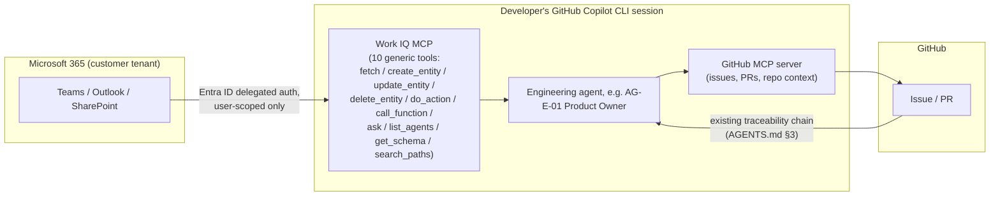

# Frontier Operating Model — Contoso Insurance CRM Showcase

> Adapted from Microsoft's Work Trend Index "Frontier Firm" research and the real Work IQ capability (see `docs/MICROSOFT-FRAMEWORKS.md#frontier-firm-operating-model`), scoped to this repo's Contoso Insurance Advisory Cockpit use case.

## Solution context

Two target-architecture pictures ground everything that follows: where Contoso Insurance's experience, agent, and data layers are heading, and how the ten concrete integration patterns between them connect the CRM to the wider system landscape. Every ADR and design-pattern doc in this repo is a zoomed-in view of one piece of these two pictures.

### The target state, layer by layer

```mermaid
flowchart TB
    classDef msft fill:#ffffff,stroke:#333333,stroke-width:1px,color:#111111
    classDef contoso fill:#fde8e8,stroke:#b91c1c,stroke-width:1px,color:#111111
    classDef shared fill:#e5e5e5,stroke:#666666,stroke-width:1px,color:#111111

    subgraph L1["1. Experience and productivity"]
        direction LR
        A1["M365 Teams and Outlook (Work IQ)"]:::msft
        A2["B2E Portal (Angular)"]:::contoso
        A3["D365 side by side: Advisory Cockpit and agency network"]:::msft
        A4["Mobile: online and offline"]:::msft
    end

    subgraph L2["2. Agents and orchestration"]
        direction LR
        B1["Copilot Studio agents"]:::msft
        B2["Azure AI Foundry: own models"]:::msft
        B3["MCP tools and context"]:::msft
        B4["Human in the loop: delegation and approval"]:::shared
    end

    subgraph L3["3. CRM modules: model driven apps"]
        direction LR
        C1["Sales"]:::msft
        C2["Service and Contact Center"]:::msft
        C3["Customer Insights: Journeys and Data"]:::msft
        C4["Contoso Insurance specific apps"]:::shared
    end

    subgraph L4["4. Lean system of record (CRM)"]
        direction LR
        D1["Dataverse: data model plus Contoso Insurance extension (lean)"]:::shared
        D2["Entra ID RBAC: row and field level security by territory"]:::msft
        D3["Virtual Tables and events: Web API (OData v4)"]:::msft
        D4["ALM: versioned solutions"]:::msft
    end

    subgraph L5["5. Analytics and integration (zero copy)"]
        direction LR
        E1["OneLake and Fabric: zero copy mirroring"]:::msft
        E2["Power BI: Direct Lake"]:::msft
        E3["Databricks Unity Catalog: leading lake"]:::contoso
        E4["Confluent Cloud: Kafka backbone"]:::contoso
    end

    subgraph L6["6. Platform layer: Azure and OpenShift"]
        direction LR
        F1["SAP, JAP, HALO"]:::contoso
        F2["Siebel: to be retired"]:::contoso
        F3["PDV and ARO: PDV leads the customer master"]:::contoso
        F4["Claims, contract, and policy systems"]:::contoso
    end

    L1 --> L2 --> L3 --> L4 --> L5 --> L6
```

*Legend: white = Microsoft platform capability, red = a Contoso Insurance-owned system, grey = shared/jointly-owned. A governance overlay — Entra ID, Purview, DLP, and regional data-residency controls — applies across every layer above, not just one.*

Three threads run through this picture, each already reflected in this repo's ADRs:

1. **The collaboration world.** People already work in Teams and Outlook, including across the agency network. Agent and CRM capability integrates natively there, under Entra ID and existing tenant policies — the B2E integration is flexible, not all-or-nothing (see [ADR-0033](./adr/ADR-0033-crm-ux-placement-in-b2e-landscape.md)).
2. **The data.** Databricks remains the leading lake: core-system data stays there and is consumed via OneLake (mirrored Unity Catalog) at runtime without copying it — zero-copy — inside Contoso Insurance's own tenant (see [ADR-0030](./adr/ADR-0030-dataverse-to-databricks-integration-pattern.md)).
3. **The user experience.** Both a headless mode (for internal, B2E-orchestrated processes) and a native CRM surface (for direct customer-engagement UX) are supported — the choice is made per team, not fixed once for the whole organization (see [ADR-0033](./adr/ADR-0033-crm-ux-placement-in-b2e-landscape.md)).

An intelligence layer that sits above every system is possible in a later phase — this repo does not build it (see §8 below on Work IQ), but nothing here forecloses it.

### One picture, ten integration patterns

```mermaid
flowchart LR
    classDef msft fill:#ffffff,stroke:#333333,stroke-width:1px,color:#111111
    classDef contoso fill:#fde8e8,stroke:#b91c1c,stroke-width:1px,color:#111111
    classDef shared fill:#e5e5e5,stroke:#666666,stroke-width:1px,color:#111111
    classDef gov fill:#333333,stroke:#333333,color:#ffffff

    subgraph AW["Agent workplace: side by side"]
        direction TB
        B2E["B2E Portal (Angular): micro frontend, MSAL, Entra ID - advisory and quoting"]:::contoso
        CRM["CRM Dynamics 365: agent UI beside B2E, deep links not web components"]:::msft
    end

    subgraph M365G["M365, agentic, Power Platform"]
        direction TB
        AGENTIC["Agentic solutions: M365 Copilot, Copilot Studio, advisory agents"]:::msft
        PP["M365 Power Apps: Outlook, Teams, SharePoint, low code"]:::msft
    end

    DV["Microsoft Dataverse: system of record for the customer relationship - Web API OData v4, event framework, virtual tables, MCP, security and audit"]:::shared

    subgraph BACKBONE["Integration backbone"]
        direction TB
        FUNC["Azure Functions: webhook target, Kafka trigger and output, Confluent ready"]:::msft
        CONF["Confluent Cloud: Kafka backbone, Azure native ISV, schema registry"]:::msft
    end

    subgraph CORE["Core systems: Azure target state"]
        direction TB
        PDV["PDV: partner master, dedicated DB on Azure"]:::contoso
        JAP["JAP Quarkus: cloud native microservices"]:::contoso
        HALO["HALO platform: third party on Azure"]:::contoso
    end

    subgraph ONPREM["On premises legacy"]
        direction TB
        ARO["ARO: task and case management, retirement planned later"]:::contoso
        CONTRACT["Contract system: legacy, retirement planned"]:::contoso
        CLAIMS["Claims system: legacy, retirement planned"]:::contoso
    end

    subgraph DATA["Data and AI platform"]
        direction TB
        DBX["Azure Databricks: Unity Catalog, medallion Delta, streaming from Confluent, ML - leading lake"]:::contoso
        FABRIC["Microsoft Fabric and OneLake: mirrored Unity Catalog, zero copy, downstream replica lake"]:::msft
        PBI["Power BI: Direct Lake, reads directly from Fabric OneLake, semantic models"]:::msft
        FABRICIQ["Fabric IQ, part of Microsoft IQ: semantic models and ontology preview - entities, relationships, rules, grounds Copilot and agents"]:::msft
    end

    GOV["Governance, security, compliance: Microsoft Purview, Defender, Entra ID, DLP, audit - applies across every layer"]:::gov

    B2E -->|"1 REST API"| DV
    CRM -->|"1 REST API"| DV
    DV -->|"2"| FUNC
    FUNC -->|"3"| DV
    FUNC <-->|"Kafka"| CONF
    DV -.->|"4 virtual tables, live read, no copy"| CORE
    DV -->|"5 link to Fabric, zero ETL"| DBX
    DBX -->|"6 zero copy"| FABRIC
    FABRIC -.->|"7 eventstream, not planned, Fabric is Direct Lake replica only"| CONF
    FABRIC --> PBI
    FABRIC --> FABRICIQ
    FABRICIQ -->|"8 grounding Copilot and agents"| AGENTIC
    B2E -->|"9 native in the Microsoft ecosystem: sync, Teams, docs, Copilot"| PP
    PP -->|"10 more than 1000 connectors"| CORE
    CONF -->|"events"| PDV
    CONF -.->|"PDV replication to contact, PDV remains master"| DV
```

*Patterns 1-10 map directly onto this repo's ADRs: 1/2/3 → [ADR-0008](./adr/ADR-0008-thin-crm-over-systems-of-record.md) (thin CRM over systems of record); 4/5/6 → [ADR-0030](./adr/ADR-0030-dataverse-to-databricks-integration-pattern.md) (Dataverse↔Databricks↔Fabric, zero-copy); 7 is explicitly out of scope (Fabric is a Direct-Lake replica only, not an event source); 8 is the Work IQ/Fabric IQ grounding pattern, documented-only in this repo (see §8 below); 9/10 → [ADR-0033](./adr/ADR-0033-crm-ux-placement-in-b2e-landscape.md) and the Kafka/Confluent backbone → [ADR-0031](./adr/ADR-0031-crm-core-systems-kafka-confluent-integration-pattern.md); the PDV replication note → [ADR-0035](./adr/ADR-0035-pdv-partner-master-data-integration-pattern.md); ARO → [ADR-0034](./adr/ADR-0034-aro-case-task-management-integration-pattern.md).*

## 1. Purpose and scope

This document refines the CRM Frontier Firm Showcase's mental model so it explicitly answers
"how would a Frontier Company build and operate this with Microsoft's current
agentic stack?" — grounded in Microsoft's real **Frontier Firm** concept (Work
Trend Index 2025/2026) and the real **Work IQ** capability (Ignite 2025), not
an invented one.

Scope, per the seven numbered asks that opened this work:

1. Contoso Insurance Advisory Cockpit remains the validation use case.
2. Establish the mental "Frontier Operating Model" — adapted from a
   generic idea-doc template (written for an unrelated illustrative business)
   into this repo's own Contoso Insurance Sales Advisory context.
3. Ground the model in Microsoft's real Work IQ capability (confirmed
   terminology, not a typo — see §2).
4. Scope the model tightly around the Advisory Cockpit use case; do not
   attempt a general-purpose CRM operating model.
5. **Explicitly exclude** any real Work IQ ↔ GitHub wiring from this
   showcase's build — that integration is **documented only** (§8), as a
   reference for how a real customer engagement would establish it.
6. Update `AGENTS.md` and `.github/agents/frontier.agent.md` with
   cross-references — **no agent renaming or restructuring** (explicit user
   decision).
7. Produce a `docs/design/` library — one document per design pattern with
   open EA/IT options, plus an index — usable to walk a customer through the
   options live during a demo.

## 2. Grounding — official Microsoft references

Every claim about Frontier Firm / Work IQ in the new documentation cites one
of these:

| Topic | Source |
| --- | --- |
| Frontier Firm concept, origin | [2025 Work Trend Index: "The Frontier Firm is born"](https://blogs.microsoft.com/blog/2025/04/23/the-2025-annual-work-trend-index-the-frontier-firm-is-born/) |
| Frontier Firm, 2026 update | [2026 Work Trend Index: "Agents, human agency, and the opportunity for every organization"](https://www.microsoft.com/en-us/worklab/work-trend-index/agents-human-agency-and-the-opportunity-for-every-organization) |
| WorkLab resource hub | [Microsoft WorkLab — Frontier Firm resources](https://www.microsoft.com/en-us/worklab/frontier-firm-resources) |
| Work IQ overview | [Work IQ overview — Microsoft Learn](https://learn.microsoft.com/en-us/microsoft-365/copilot/extensibility/work-iq/) |
| Work IQ MCP server, 10 tools | [Work IQ MCP overview — Microsoft Learn](https://learn.microsoft.com/en-us/microsoft-365/copilot/extensibility/work-iq/mcp/overview) |
| Work IQ protocols (A2A/MCP/REST), auth, licensing | [Work IQ API overview — Microsoft Learn](https://learn.microsoft.com/en-us/microsoft-365/copilot/extensibility/work-iq/api-overview) |
| Work IQ CLI, GitHub Copilot CLI plugin install | [Microsoft Work IQ CLI — Microsoft Learn](https://learn.microsoft.com/en-us/microsoft-365/copilot/extensibility/work-iq/cli) |
| Broader Copilot API family | [Microsoft 365 Copilot APIs overview — Microsoft Learn](https://learn.microsoft.com/en-us/microsoft-365/copilot/extensibility/copilot-apis-overview) |
| GitHub MCP server | [Using the GitHub MCP Server — GitHub Docs](https://docs.github.com/en/copilot/how-tos/provide-context/use-mcp-in-your-ide/use-the-github-mcp-server) |

## 3. Terminology adaptation

The idea-doc template (`docs/ideas/frontier-operating-system/`, main checkout,
written for an unrelated nutrition/coaching business) uses German terms that
must be translated into this repo's insurance vocabulary, not left generic:

| Idea-doc term | Contoso Insurance mapping |
| --- | --- |
| *Mitglieder* (members) | **Customer** — a Dataverse `Account` (Household / Business / Broker, per ADR-0037) or `Contact` |
| *Mitarbeitende* (staff) | **Employees** — the advisors/agents/service staff who work through the B2E UX layer (ADR-0033) to serve Customers |

Dynamics 365 Customer Engagement (on Power Platform/Dataverse) is the
Operational control plane (§5). Its three apps and their key process entities
map onto this showcase's insurance vocabulary as follows, cross-checked
against already-Accepted ADRs so nothing here contradicts a standing decision:

| D365 CE app | Key entity | Contoso Insurance mapping | System of record |
| --- | --- | --- | --- |
| **Sales** | Opportunity | Insurance sales opportunity / offer-in-progress — the Advisory Cockpit's core object | CRM-native per [ADR-0008](./adr/ADR-0008-thin-crm-over-systems-of-record.md); target ownership vs. ARO's legacy Opportunity is [ADR-0034](./adr/ADR-0034-aro-case-task-management-integration-pattern.md)'s open decision |
| **Service** | Case | General advisory/service case (customer inquiries, service requests) | CRM-native per ADR-0008 — **distinct from Claim** (Schadenfall), which stays a read-only projection of the Schaden Prozesse engine, never a Service-app Case |
| **Marketing** | Lead | Insurance prospect — an expression of interest tied to an existing Contact ([ADR-0009](./adr/ADR-0009-lead-as-interest-on-existing-person.md)), sourced from Comparis or migrated from Salesforce campaigns ([ADR-0036](./adr/ADR-0036-crm-lead-campaign-external-landscape.md)) | CRM-native |

## 4. North-star loop and existing traceability

The idea doc's loop — **Insight → Decision → Delivery → Outcome → Learning**
— is not a new mechanism to build; it is a re-description, at business
altitude, of the delivery-chain this repo already runs
(`AGENTS.md` §3):

| Idea-doc stage | Existing repo mechanism |
| --- | --- |
| Insight | Requirement (topic area A#) surfaced from a Customer/Employee signal |
| Decision | Use case (`docs/ideas/UC-…`) and ADR (`docs/adr/ADR-####-*.md`) |
| Delivery | Solution change (`solution/`) |
| Outcome | Test evidence (`docs/TEST.md`, automated checks) + green pipeline run in the PR |
| Learning | Deployed to sandbox; the customer sees it running and the next Insight starts |

The two are the same loop described twice. The new documentation states this
explicitly rather than introducing a second, parallel taxonomy.

## 5. Five control planes, adapted

| Control plane | Idea-doc framing | Contoso Insurance adaptation | Status in this showcase |
| --- | --- | --- | --- |
| Business / Teams | Members ↔ staff coordination | Customers ↔ Employees (advisors), coordinated via the B2E UX layer (ADR-0033) | **Built** |
| Interaction / Work IQ | Human↔agent interaction surface | Work IQ MCP/CLI + M365 Copilot Chat as the interaction layer a real customer would add on top of Teams/Outlook | **Documented only** — no Work IQ connection exists in this repo (§8) |
| Agent / Copilot Agent Mesh | Roster of task agents | The runtime `AG-F-01…06` agents already defined in `AGENTS.md` §1 | **Built** (design-stage for several; see AGENTS.md maturity column) |
| Engineering / GitHub | Delivery tooling for the agent mesh itself | The engineering `AG-E-01…12` agents, GitHub Copilot CLI/Coding Agent, GitHub MCP server, the ADR/PR/CI pipeline | **Built** — this is the one actually exercised turn-by-turn in this repo |
| Operational / Dataverse + Power Platform | System of record | Dynamics 365 Customer Engagement (Sales/Service/Marketing) on Dataverse, per the entity mapping in §3 | **Built** |

## 6. Role mapping — idea-doc roster to existing named agents

Per your explicit direction: customers want to see **their own employee
roles** (Enterprise Architect, UX Designer, Insurance Domain Expert…) mapped
into the model, not generic Frontier-role labels. No agent is renamed; this
is a reference table only, added to the new model doc.

| Idea-doc role | Existing agent(s) | Notes |
| --- | --- | --- |
| Voice of Customer | `AG-E-01` Product Owner (accountable intake), informed by `AG-F-04` Conversation Intelligence & Transcript Agent | Runtime signal feeds engineering backlog framing |
| Product Discovery | `AG-E-01` Product Owner | — |
| Architecture | `AG-E-03` Enterprise Architect, with `AG-E-08` Dataverse Modeler and `AG-E-09` Integration Engineer as specialists | Matches AGENTS.md's existing non-delegable "Architecture approval" authority |
| Delivery | `AG-E-02` Developer, with `AG-E-08` Dataverse Modeler and `AG-E-11` UX Designer | — |
| Release | `AG-E-04` SecDevOps | Owns pipelines/environments per ADR-0039 |
| Outcome | `AG-E-07` Data Engineer & Scientist (Frontier Firm loop is explicit in their charter), fed by `AG-F-##` runtime telemetry | — |
| Governance | `AG-E-06` Responsible-AI & Compliance Officer | Matches AGENTS.md's existing non-delegable "RAI/compliance review" authority; ties to Purview (ADR-0038) |
| Quality | Distributed — `AG-E-02` (tests), `AG-E-04` (pipeline gates), `AG-E-06` (RAI evals) | Documented as shared, not force-fit to one owner — consistent with this repo's "say it plainly" principle |
| *(cross-cutting)* | `AG-E-12` Frontier Firm Guide | Owns/maintains the new Frontier Operating Model doc itself |

## 7. HITL and governance

The idea doc's data-sensitivity classes and redaction patterns map onto
mechanisms this repo already has, rather than introducing new ones:

- **Non-negotiable HITL principle** — already stated in `AGENTS.md`: agents
  recommend, a named human decides ([ADR-0014](./adr/ADR-0014-agents-advisory-by-design.md)).
- **Compliance/regulatory governance** — [ADR-0038](./adr/ADR-0038-purview-power-platform-dynamics365-compliance.md)
  (Microsoft Purview) is the sensitivity-classification and DLP mechanism.
- **Review authority** — `AG-E-06` Responsible-AI Officer is the enforced
  CODEOWNERS reviewer for any change touching models, prompts, evals, consent,
  or personal data.

## 8. Work IQ ↔ GitHub integration pattern (documented only)

This section is **reference documentation for a real customer engagement**.
No code, MCP configuration, or agent wiring in this showcase implements it.

**Concrete architecture** (grounded in §2's sources, not hypothetical):

**Why this is realistic, not speculative:**

- The Work IQ CLI installs directly as a **GitHub Copilot CLI plugin**
  (`/plugin install workiq@copilot-plugins`) and runs as a local MCP stdio
  server — the same session class used to write this documentation.
- Work IQ's MCP surface is fixed at **10 generic tools**; new Microsoft 365
  workloads add resource *paths*, never new tools.
- **Authentication is delegated-only.** Work IQ uses Microsoft Entra ID
  on-behalf-of a signed-in user; **application-only/service-principal auth is
  not supported.** This is a load-bearing governance fact: no unattended
  background service can post into Work IQ on a customer's behalf. Human-in-
  the-loop is enforced by the protocol itself, not only by policy choice —
  directly reinforcing this repo's ADR-0014 principle at the tooling layer.
- Licensing is **usage-based via Copilot Credits**, independent of per-seat
  Microsoft 365 Copilot licensing — a real cost variable for a customer's
  business case, separate from the GitHub Copilot Business/Enterprise seats
  already covered by ADR-0039.

**Illustrative flow for a real engagement:** an advisor raises a data need in
a Teams conversation → Work IQ MCP exposes that context to an engineering
agent working in GitHub Copilot CLI → the agent uses the GitHub MCP server to
open a scoped issue/PR, continuing through this repo's existing traceability
chain (§4) unchanged from there.

## 9. Six-phase roadmap, adapted and scope-tagged

Each phase is tagged **[Built]**, **[Demoed via docs]**, or
**[Documented-only]** so nobody mistakes narrative for delivered capability.

1. **Foundation** — repo scaffolding, ADR discipline, agent registry. **[Built]**
2. **Teams ↔ GitHub transparency** — customer-visible progress from GitHub
   into Teams-style status. **[Demoed via docs]** — this repo already
   surfaces PR/sprint status in Markdown; a live Teams channel post is not
   wired up.
3. **Work IQ agent intake** — §8's pattern. **[Documented-only]**.
4. **Sprint review → GitHub** — decisions from a sprint review become GitHub
   issues/ADRs. **[Built]** — this is exactly the existing traceability chain.
5. **Release → outcome loop** — deployed change produces measurable outcome
   telemetry feeding the next Insight. **[Demoed via docs]** — the loop is
   designed (§4, §6 Outcome role) but production telemetry is out of scope
   for a demo tenant.
6. **Agent mesh scaling** — expanding the `AG-F-##` roster as new journeys are
   added. **[Demoed via docs]** — the extension pattern is documented; new
   agents are added only when a use case needs them.

## 10. Deliverables

| # | Action | Path |
| --- | --- | --- |
| 1 | Rename to resolve numbering collision | `ADR-0023-delegated-sprint-operating-model.md` → `ADR-0040-delegated-sprint-operating-model.md`; add to `docs/adr/README.md` index; bump "next ADR" to 0041 |
| 2 | New framework section | `docs/MICROSOFT-FRAMEWORKS.md` — "Frontier Firm operating model" section, citing §2 sources |
| 3 | New model doc | `docs/FRONTIER-OPERATING-MODEL.md` — full content of §3–§9 above |
| 4 | New design library index | `docs/design/README.md` |
| 5 | **Design Pattern #1** — new playbook doc | `docs/design/00-frontier-firm-operating-model-for-insurance.md` (see below) |
| 6–16 | New per-pattern design docs (11) | `docs/design/ADR-0019-insurance-data-model-options.md`, `ADR-0030-dataverse-databricks-integration-options.md`, `ADR-0031-kafka-confluent-integration-options.md`, `ADR-0032-iam-entra-power-platform-options.md`, `ADR-0033-crm-ux-placement-options.md`, `ADR-0034-aro-case-task-integration-options.md`, `ADR-0035-pdv-partner-master-data-options.md`, `ADR-0036-crm-lead-campaign-landscape-options.md`, `ADR-0037-environment-strategy-options.md`, `ADR-0038-purview-compliance-options.md`, `ADR-0039-devsecops-cicd-options.md` |
| 17 | Cross-reference update | `.github/agents/frontier.agent.md` — point at the new model doc |
| 18 | Cross-reference update | `AGENTS.md` — §3 traceability note pointing at the new model doc |
| 19 | **Fix stale internal ADR links** | `ADR-0031`–`ADR-0039` (9 files) — mechanical +6 renumbering pass on in-body links that still point to the pre-collision numbers/filenames (e.g. `ADR-0025-crm-core-systems-kafka-confluent-integration-pattern.md` → `ADR-0031-crm-core-systems-kafka-confluent-integration-pattern.md`); found during spec self-review, ~79 occurrences, consistent offset, no content/decision changes |

See `docs/superpowers/plans/2026-08-16-frontier-operating-model.md` for the task-by-task execution of this table.

## 11. Out of scope

- No real Work IQ MCP connection, plugin install, or agent wiring in this
  repo (§8 is reference documentation only).
- No renaming or restructuring of any `AG-F-##`/`AG-E-##` agent.
- No change to the decision recorded in any already-Accepted ADR.

## 12. Open validation triggers

These carry forward from the affected ADRs' own "Validation and review
triggers" sections and apply at the operating-model level too: confirm with
customer EA/IT which control-plane elements (especially Work IQ) are in
scope for a real engagement, and confirm the agent-role mapping (§6) against
the customer's actual org chart before reuse outside this showcase.

## References

- Design spec: `docs/superpowers/specs/2026-08-16-frontier-operating-model-design.md`
- Frontier Firm research: https://www.microsoft.com/en-us/worklab/frontier-firm-resources
- Microsoft Work Trend Index (2025 "Frontier Firm is born"): https://blogs.microsoft.com/blog/2025/04/23/the-2025-annual-work-trend-index-the-frontier-firm-is-born/
- Microsoft Work Trend Index (2026 update): https://www.microsoft.com/en-us/worklab/work-trend-index/agents-human-agency-and-the-opportunity-for-every-organization
- Work IQ overview: https://learn.microsoft.com/en-us/microsoft-365/copilot/extensibility/work-iq/
- Work IQ MCP overview: https://learn.microsoft.com/en-us/microsoft-365/copilot/extensibility/work-iq/mcp/overview
- Work IQ API overview: https://learn.microsoft.com/en-us/microsoft-365/copilot/extensibility/work-iq/api-overview
- Work IQ CLI: https://learn.microsoft.com/en-us/microsoft-365/copilot/extensibility/work-iq/cli
- Microsoft 365 Copilot APIs overview: https://learn.microsoft.com/en-us/microsoft-365/copilot/extensibility/copilot-apis-overview
- GitHub MCP server: https://docs.github.com/en/copilot/how-tos/provide-context/use-mcp-in-your-ide/use-the-github-mcp-server
- Design pattern walkthrough: `docs/design/00-frontier-firm-operating-model-for-insurance.md`
- Idea source: `docs/ideas/frontier-operating-system/` (local reference in the main checkout, not committed content)
