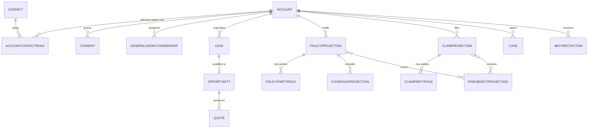
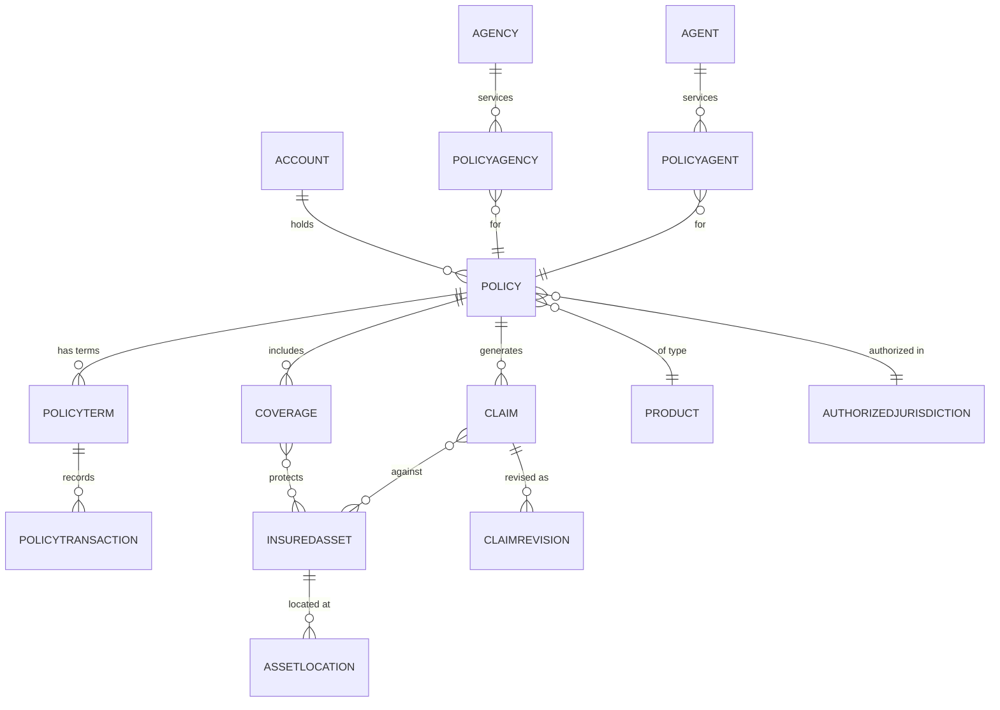
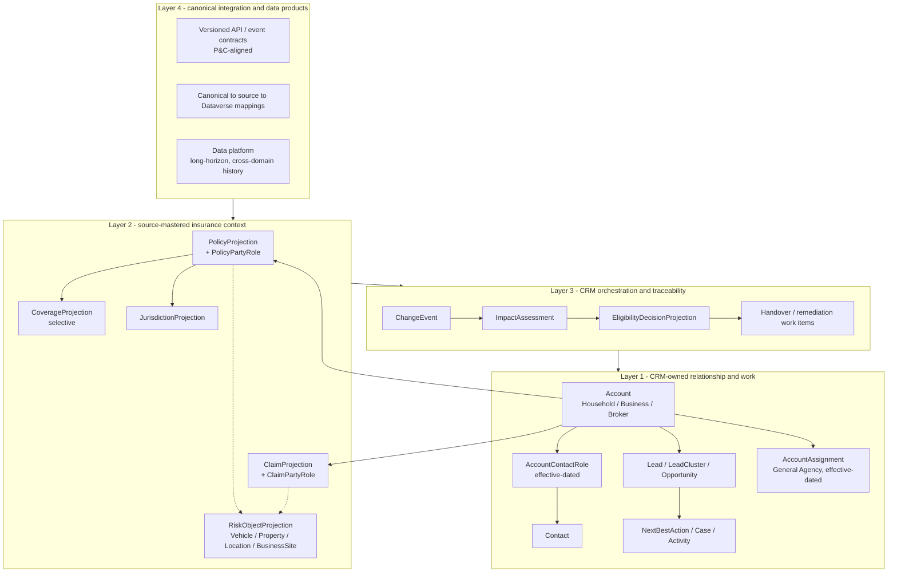
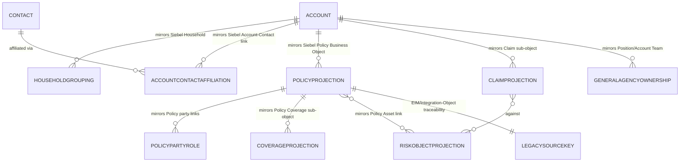

# ADR-0019 — Provisional insurance data-model shape

| Field | Value |
| --- | --- |
| **Status** | Proposed — Option C is the working hypothesis pending Mobiliar integration and data-platform discovery; Option D is documented as a migration-fidelity alternative for the same stakeholder discussion |
| **Date** | 2026-08-08 |
| **Deciders** | Enterprise Architect, Dataverse Modeler, Integration Engineer, Data Engineer & Scientist; customer architecture confirmation required |
| **Topic area** | A1 — Architecture vision · A2 — Data model · A3 — Integration · A7 — Analytics |
| **Use case** | [GitHub issue #6](https://github.com/urruegg/CRMShowcase/issues/6) · UC-01 relocation across jurisdictions |
| **Licence** | 🧩 configuration / own build. CDM alignment is conceptual; no industry-accelerator licence or deployable table set is assumed. |
| **Upgrade impact** | Medium — the logical boundaries are stable, but the physical projection mechanism and table set may change after integration discovery |
| **CAF methodology** | Plan · Ready · Adopt · Govern |
| **WAF pillar(s)** | Primary: Operational Excellence and Reliability. Trade-off: Cost Optimization versus richer local context. |
| **Zero Trust** | Verify explicitly and use least privilege for every projected data set; do not copy insurance data into CRM without a named purpose and persona. |
| **Responsible AI** | Transparency and accountability — recommendations must identify the governed CRM context and source projections used. This ADR does not authorize a model, prompt, or autonomous action. |

## Context

The Mobiliar rapid prototype and the BizApp Solution Engineer's follow-on
design agree on the strategic direction:

- one `Account` model for Household, Business, and Broker;
- portfolio context at Account, with people participating through roles;
- thin Policy, Claim, and Quote records over external systems of record;
- a closed demand loop through Contact, Lead, LeadCluster, Opportunity, and
  Quote;
- per-contact, per-channel consent;
- service, assistance, broker, and next-best-action records shaped around CRM
  work rather than insurance processing.

That direction is consistent with
[ADR-0006](./ADR-0006-account-centre-of-gravity.md),
[ADR-0007](./ADR-0007-portfolio-at-account.md), and
[ADR-0008](./ADR-0008-thin-crm-over-systems-of-record.md).

The same intake material exposes gaps in the current physical proposal. Its
curveballs require effective-dated household membership, policy-specific party
roles, governed location and jurisdiction, coverage-existence decisions,
reusable risk objects, and dated General Agency and broker assignments. The
current ERD either omits these concepts or represents them too narrowly:

- `ContactRole` is account-scoped but is also described as carrying
  policyholder, insured-person, payer, owner, and driver roles;
- assistance location is free text even though relocation requires one shared,
  governed location;
- Policy has no lightweight Coverage relationship even though a move can make
  building coverage unavailable;
- Vehicle exists only in assistance even though the same risk object
  participates in policy, claim, assistance, and rating contexts;
- General Agency ownership is a direct lookup rather than an effective-dated
  assignment and handover;
- Claim has no party-role or risk-object relationship.

Microsoft's Common Data Model provides useful Property and Casualty vocabulary:
Policy, Coverage, PolicyTransaction, Claim, ClaimRevision, Agency, Agent,
PolicyAgency, PolicyAgent, InsuredAsset, InsuredAssetLocation, Payment, and
AuthorizedJurisdiction. These definitions are a semantic reference. Their
presence in CDM does not by itself require one persisted Dataverse table per
canonical entity.

The physical answer depends on evidence not yet available: the core-system
landscape, authoritative identifiers, API and event capabilities, latency and
availability requirements, the role of Mobiliar's data platform, and which
canonical data products already exist. This ADR therefore records the three
candidate shapes and establishes a reversible working hypothesis.

### Evidence reviewed

- `intake/mobiliar/ideas/00. ERD Visualizer.html`
- `intake/mobiliar/ideas/Mobiliar - CRM Architecture Decisions.html`
- `intake/mobiliar/ideas/Mobiliar - Demo Curveballs & Architecture.html`
- [Mobiliar prototype data-model design](../design/mobiliar-data-model-extension.md)
- [CRM Showcase data architecture](../DATA.md)
- [Microsoft Property and Casualty Data Model](https://learn.microsoft.com/common-data-model/schema/core/industrycommon/financialservices/propertyandcasualtydatamodel/overview)
- [Microsoft Financial Services Common Data Model](https://learn.microsoft.com/common-data-model/schema/core/industrycommon/financialservices/financialservicescommondatamodel/overview)
- [Data migration approaches, Power Platform](https://learn.microsoft.com/power-platform/architecture/key-concepts/data-migration/data-migration-approaches)
- [Suggested workflow for a complex data migration, Power Platform](https://learn.microsoft.com/power-platform/architecture/key-concepts/data-migration/workflow-complex-data-migration)
- General, publicly documented Siebel CRM / Siebel Financial Services
  concepts (Account, Contact, Household, Asset, Policy, Business
  Object/Business Component, Integration Object, EIM staging tables) used
  as background for Option D below. **Mobiliar's actual Siebel
  customizations are not documented in this repository and remain
  unconfirmed pending source-system discovery** — nothing below should be
  read as a claim about Mobiliar's specific implementation.

The local intake HTML is discovery evidence, not a deployable schema or
normative architecture source.

**Update (2026-08-14, chat-captured, not yet a written intake artefact):** the
owner named the actual core-system landscape this hypothesis has been waiting
on. **ARO** (Arbeits-Organisations-System) masters insurance offers, contracts
and claims, including general "Anliegen" case work. **PDV** (Partner Daten
Verwaltung), hosted on the system referred to as "Host", masters
party/customer identity — new Accounts/Contacts are born CRM-owned and
mastership switches to PDV once a contract exists, syncing back to CRM (see
[2026-08-14-advisor-cockpit-datamodel-scope-reduction-design.md](../superpowers/specs/2026-08-14-advisor-cockpit-datamodel-scope-reduction-design.md)).
**Kafka on Confluent Cloud** is the event backbone across these systems. This
only supplies names for the evidence-area questions below — mechanism
(virtual table vs. event-fed projection), freshness, and volume remain
**not yet decided**.

## Decision drivers

The target shape must:

1. preserve one authoritative master for policy, claim, quote, rating, and
   underwriting data;
2. support responsive and resilient CRM journeys without making every screen
   depend on a synchronous core-system call;
3. model the relocation golden thread, including effective dating, coverage
   eligibility, risk-object impact, and General Agency handover;
4. support private, business, broker, service, and assistance journeys without
   creating separate party models;
5. use canonical insurance semantics at integration boundaries;
6. minimize replicated personal and insurance data by purpose and persona;
7. remain adaptable to API-led, event-led, virtualized, or data-platform-led
   integration;
8. avoid premature physical-schema commitments before source-system discovery;
9. minimize data-migration and cutover risk from the incumbent, highly
   customized Siebel CRM environment, without that risk-reduction goal
   silently overriding drivers 1–8.

## Options

### Option A — Harden the BizApp Solution Engineer ERD

Use the engineer's proposed ERD as the target physical Dataverse model. Retain
its CRM-owned party, demand, service, assistance, broker, and AI entities, plus
thin Product, Policy, Claim, and Quote records. Add only the relationships
required to make its stated curveballs internally consistent.

#### Logical shape

- **Party and organization:** Account, Contact, effective-dated
  AccountContactRole, Consent, GeneralAgency/AccountOwnership.
- **Demand:** Lead, LeadCluster, Opportunity, Quote.
- **Insurance context:** Product, PolicyProjection, ClaimProjection,
  PolicyPartyRole, ClaimPartyRole.
- **Risk context:** governed Location, CoverageProjection, and a reusable
  RiskObjectProjection replacing the assistance-only Vehicle boundary.
- **Operations:** Case, Activity, NextBestAction, AssistanceCase,
  AssistancePartner, Dispatch, ServiceLineItem, BrokerScorecard, BrokerReview,
  Measure.

#### Advantages

- Fastest route from the validated prototype screens to a coherent target
  schema.
- Lowest initial modelling and synchronization cost.
- Preserves terminology already used by the demo journeys and workspaces.
- Keeps insurance-core processing outside CRM.
- Easy for the showcase team to understand and implement incrementally.

#### Disadvantages

- Remains a Mobiliar-specific physical vocabulary with weaker portability to
  other insurers and data products.
- A flat projection can accumulate unrelated summary fields as new journeys
  arrive.
- Private, commercial, broker, and assistance use cases can force repeated
  table redesign when they share risk objects differently.
- Canonical mappings may become an integration-document concern rather than a
  property of the model.
- The smallest local model may still duplicate data that the data platform or
  virtual tables could expose more effectively.

#### Conditions that favour Option A

- Core APIs already provide screen-ready policy, claim, coverage, and risk
  summaries.
- Dataverse needs only a small resilient cache for a limited set of journeys.
- The data platform does not expose reusable low-latency operational data
  products.
- Near-term delivery speed is more valuable than broad canonical reuse.

### Option B — Persist a broad P&C canonical model in Dataverse

Shape the operational Dataverse schema closely around the Microsoft Property
and Casualty CDM. Persist most canonical entities and relationships needed for
Policy, Coverage, PolicyTransaction, Claim, ClaimRevision, typed insured assets,
Location, Agency, Agent, Payment, Line of Business, Product, and
AuthorizedJurisdiction.

Accepted party decisions would either be mapped onto this model or revisited
where CDM uses concepts such as Group and GroupMember.

#### Logical shape

- **Canonical party:** Account, Contact, Group/GroupMember or equivalent party
  relationships.
- **Distribution:** Agency, Agent, PolicyAgency, PolicyAgent, producer and
  broker relationships.
- **Policy:** Product, LineOfBusiness, Policy, PolicyTerm, PolicyTransaction,
  Coverage, exclusions, and inclusions.
- **Risk:** base and typed insured assets, asset locations, and exposure
  details.
- **Claims:** Claim, ClaimRevision, loss cause, asset-claim relationships,
  reserves, and payments where required.
- **Jurisdiction:** authorized jurisdictions and product/coverage eligibility.

#### Advantages

- Richest canonical insurance semantics in the CRM platform.
- Strongest fit for future insurance workflows that need detailed local state.
- Reduces translation for consumers already aligned to the same canonical
  definitions.
- Makes relationships such as coverage-to-risk-object and
  claim-to-revision explicit.
- Supports broad cross-line queries without repeated API composition.

#### Disadvantages

- Conflicts with the current thin-CRM decision unless the core systems cannot
  fulfil required operational responsibilities.
- Creates duplicate operational state and a permanent synchronization,
  reconciliation, retention, and deletion burden.
- Increases Dataverse storage, security, integration, testing, and upgrade
  scope.
- Encourages business logic to migrate into CRM because detailed entities are
  locally available.
- Canonical completeness can exceed what any approved CRM journey needs.
- Requires a separate licensing and maturity assessment; this ADR does not
  assume that the conceptual CDM entities are supplied as a supported,
  deployable Dataverse package.

#### Conditions that favour Option B

- Mobiliar intentionally assigns material policy or claims processing
  responsibility to CRM.
- Core systems cannot provide the required availability, latency, or event
  contracts and no governed operational data product can bridge the gap.
- The programme accepts Dataverse as an operational insurance platform with
  explicit mastership and reconciliation responsibilities.
- ADR-0008 is formally superseded rather than eroded through incremental
  exceptions.

### Option C — Layered hybrid: CRM operating model plus canonical insurance context

Retain the engineer's CRM-owned operating model and add a deliberately small,
use-case-driven insurance-context layer. Use the P&C CDM as the canonical
vocabulary for contracts and mappings, but do not treat it as a mandate to
persist the entire canonical model in Dataverse.

#### Logical shape

**Layer 1 — CRM-owned relationship and work**

- Account with Household, Business, and Broker types.
- Contact and effective-dated AccountContactRole.
- Consent, Lead, LeadCluster, Opportunity, Case, Activity, NextBestAction.
- Effective-dated AccountAssignment for General Agency, broker management,
  territory, and handover responsibility.

**Layer 2 — source-mastered insurance context**

- PolicyProjection and PolicyPartyRole.
- CoverageProjection only where coverage existence, status, or scope changes a
  CRM decision.
- ClaimProjection and ClaimPartyRole.
- RiskObjectProjection with sparse typed facets:
  - Vehicle;
  - Property/Building;
  - Governed Location;
  - BusinessSite/BusinessExposure.
- JurisdictionProjection for eligibility and routing context.
- Product/LineOfBusiness reference data needed to interpret the projections.

Every projection carries `externalSystem`, `externalId`, source currency, and
contract-version metadata. CRM does not calculate rating, underwriting,
reserves, settlement, payment, commission, or policy transactions.

**Layer 3 — CRM orchestration and traceability**

- ChangeEvent or correlation reference for a governed source change.
- ImpactAssessment listing affected policies, coverages, risk objects, and
  responsibilities.
- EligibilityDecisionProjection recording the engine outcome and rationale
  reference, not reimplementing the rule.
- Handover and remediation work items for advisors, General Agencies, service,
  and data stewards.

**Layer 4 — canonical integration and data products**

- Versioned API and event contracts use P&C-aligned names and role codes.
- Canonical-to-source and canonical-to-Dataverse mappings are explicit.
- The data platform may hold long-horizon, cross-domain, and analytical
  history; Dataverse holds only operational context needed by named journeys.
- A projection may be persisted, virtualized, event-fed, or composed from a
  governed data product after non-functional requirements are known.

#### Advantages

- Preserves the proven CRM operating model and thin-CRM boundary.
- Adds exactly the insurance semantics required by the relocation, B2B,
  broker, claims, and assistance journeys.
- Supports canonical integration without copying the full insurance core.
- Allows the physical mechanism to follow Mobiliar's actual API, event, and
  data-platform capabilities.
- Limits personal-data replication and keeps persona-based security tractable.
- Creates a controlled path to expand or shrink projections without changing
  the canonical contract.
- Aligns configuration-first Dataverse delivery with a stable enterprise
  vocabulary.

#### Disadvantages

- Requires disciplined governance to stop "one more projection field" from
  becoming an unbounded local insurance model.
- Introduces mapping work between canonical contracts, source schemas, data
  products, and physical Dataverse tables.
- Some journeys may combine persisted and virtualized data, increasing
  observability and failure-mode complexity.
- Teams must distinguish source state, projection state, orchestration state,
  and analytical history.
- The precise Layer 2 table set cannot be finalized before integration
  discovery.

#### Conditions that favour Option C

- Insurance systems remain authoritative, as required by ADR-0008.
- CRM needs reliable operational context richer than a pure live-service UI.
- Mobiliar's integration and data platform can expose identifiers, events, or
  governed data products that support controlled projections.
- Multiple channels and business domains need shared semantics without shared
  ownership of insurance processing.

### Option D — Migration-mirrored: shape the extension close to Mobiliar's Siebel CRM object model

Keep the same CRM-owned foundation as Options A/C (Account, Contact,
effective-dated AccountContactRole, Consent, Lead/Opportunity, Case,
NextBestAction), but shape Layer 2's insurance-context projections and their
field-level mapping as close as possible to the actual, highly customized
Siebel CRM object model Mobiliar operates today — not to the BizApp
Solution Engineer's ERD (Option A), the P&C CDM (Option B), or a
use-case-pruned hybrid (Option C). The explicit goal is to minimize
transformation logic and cutover risk during the migration itself, using
Siebel's own well-documented data-model concepts and extraction mechanism as
the bridge.

**A caveat that governs everything below:** Mobiliar's actual Siebel
customizations are not documented anywhere in this repository. The shapes
described here are generic, publicly known Siebel CRM / Siebel Financial
Services concepts — Account, Contact, Household, Asset, Policy, Business
Object/Business Component, Integration Object, and EIM (Enterprise
Integration Manager) staging tables — used only as an illustrative pattern.
A source-schema discovery pass against Mobiliar's real Siebel instance is
mandatory before this option can be estimated or committed to.

#### Logical shape

- **Party and organization:** Account mirrors Siebel's Account entity
  (organizations/institutions); Contact mirrors Siebel's Contact entity.
  Household grouping mirrors Siebel's own Household construct — used in
  Siebel's Financial Services/Insurance verticals for shared or bundled
  policy management — which is structurally close to this repo's existing
  Household Account type ([ADR-0006](./ADR-0006-account-centre-of-gravity.md)),
  a genuine low-risk point of alignment. AccountContactRole mirrors Siebel's
  Account-Contact affiliation, but still adds explicit effective dating,
  since Siebel's native affiliation model is not inherently effective-dated
  — this is a curveball gap (see Context) that even a Siebel-mirrored option
  does not get to skip.
- **Distribution:** GeneralAgency/broker assignment mirrors Siebel's
  Position and Account Team constructs.
- **Insurance context:** PolicyProjection mirrors Siebel's Policy Business
  Object, which in the Insurance vertical links its own Policy Product,
  Policy Coverage, Policy Asset, and Claim sub-objects; PolicyPartyRole
  mirrors the Policy's own party links (policyholder, beneficiary, insured);
  RiskObjectProjection mirrors Siebel's separate Asset entity (the insured
  vehicle or property, linked to but distinct from Policy); ClaimProjection
  mirrors the Claims sub-object under the Policy Business Object.
- **Integration and migration layer:** every mirrored entity carries an
  explicit legacy-source key, mirroring the row identifiers Siebel's own EIM
  staging tables (for example `EIM_ACCNT`, `EIM_CONTACT`, `EIM_ASSET`)
  already use for bulk data movement, so the same Integration
  Object/EIM extraction mechanism Mobiliar's team already operates can drive
  both the initial load and every later reconciliation pass, rather than
  requiring a bespoke source connector built from scratch.

#### Advantages

- Fastest, most traceable source-to-target mapping of the four options —
  every legacy field/table has a near 1:1 counterpart, minimizing custom
  transformation logic during the highest-risk phase of a highly customized
  migration.
- Simplest reconciliation: staged, mirrored records can be diffed directly
  against Siebel's own EIM extracts using preserved legacy identifiers,
  matching Microsoft's own complex-migration guidance on staging, success/
  error tables, and record-count reconciliation
  ([Suggested workflow for a complex data migration](https://learn.microsoft.com/power-platform/architecture/key-concepts/data-migration/workflow-complex-data-migration)).
- De-risks cutover by enabling a phased, side-by-side validation window
  rather than a single irreversible transform — consistent with Microsoft's
  own guidance that phased migration with pilots is the recommended
  approach for complex, highly customized sources
  ([Data migration approaches](https://learn.microsoft.com/power-platform/architecture/key-concepts/data-migration/data-migration-approaches)).
- Business questions during migration ("why does this differ from what I
  see in Siebel today?") are the easiest of any option to answer, because
  the shapes stay recognizable to Mobiliar's own business and support teams.

#### Disadvantages

- Carries Siebel's own historical technical debt and highly customized
  quirks directly into Dataverse, unless the programme explicitly funds and
  schedules a second canonicalization wave — a common risk when a
  "temporary" bridge is never revisited.
- Weakest canonical/semantic alignment of the four options — no better than
  Option A, and materially behind Option C, on external reuse and cross-line
  query capability; the data platform and any future accelerator get the
  least reusable vocabulary.
- Runs against Microsoft's own complex-migration guidance that literal
  1:1 mirroring is usually unnecessary and costly: table/column relevance
  analysis on long-running CRM systems "commonly eliminates 30–40% of
  columns and up to 20% of tables"
  ([Suggested workflow for a complex data migration](https://learn.microsoft.com/power-platform/architecture/key-concepts/data-migration/workflow-complex-data-migration))
  — a disciplined Option D must still prune, not mirror everything.
  Because it targets the full Siebel object surface rather than a
  use-case-driven subset, Layer 2 risks being the largest of any option
  except Option B if scope is not actively bounded.
- Mobiliar's actual customizations are not documented anywhere in this
  repository (see the caveat above); a source-schema discovery pass is
  mandatory before this option can be estimated with any confidence.

#### Conditions that favour Option D

- Migration timeline and cutover risk dominate the decision more than
  long-term canonical elegance.
- Deep, multi-decade Siebel customization makes a clean-room redesign
  (Options A, B, or C) judged too risky to reconstruct correctly without
  first anchoring to the legacy structure.
- Mobiliar's Integration Object/EIM extraction tooling is mature and
  reusable, lowering the cost of building the mirrored bridge.
- The programme explicitly funds and schedules a second canonicalization
  wave that converges the mirrored Layer 2 toward Option C, rather than
  treating Option D as a permanent end state.

## Comparison

| Criterion | Option A — hardened ERD | Option B — broad P&C in Dataverse | Option C — layered hybrid | Option D — Siebel-mirrored |
| --- | --- | --- | --- | --- |
| Thin-CRM alignment | Strong | Weak unless ADR-0008 is superseded | Strong | Strong (Policy/Claim/Asset remain projections, not masters) |
| Delivery speed | Highest | Lowest | Medium | Highest for the initial migration wave; lower once a canonicalization wave is counted |
| Canonical semantic depth | Low to medium | Highest | High at contracts; selective in storage | Lowest — mirrors legacy vocabulary, not canonical semantics |
| Dataverse footprint | Small | Large | Small to medium | Medium to large unless actively pruned |
| Core-system duplication | Low | High | Low | Low (still projections, sourced from Siebel or its successor) |
| B2C and B2B extensibility | Medium | High | High | Low to medium — legacy shape was not designed for it |
| Integration mapping effort | Medium | Medium | Highest initially, reusable later | Lowest initially (reuses Siebel's own EIM/Integration Objects), highest later if canonicalized |
| Data-platform adaptability | Medium | Low to medium | Highest | Medium |
| Operational resilience | Medium to high | High locally | High when projections are selected by SLA | Medium — inherits legacy resilience characteristics |
| Reversibility | High | Low | High | Medium — reversible only if a canonicalization wave is actually funded |
| Governance burden | Medium | High | High but bounded by explicit projection rules | High — must actively prevent legacy technical debt from calcifying |
| Migration risk (cutover from Siebel) | Medium | Medium to high | Medium | Lowest — this is Option D's defining strength |

## Decision

Adopt **Option C as the provisional target hypothesis**.

This decision approves the logical layering and canonical vocabulary. It does
not approve a final Dataverse table list or a specific integration mechanism.
[ADR-0020](./ADR-0020-domain-ownership-within-six-solution-architecture.md)
defines the provisional domain-to-solution packaging and component-ownership
rules for implementing this hypothesis.
No insurance-context entity is persisted merely because it exists in CDM.
Every Layer 2 projection must name:

1. the CRM journey and persona that require it;
2. the authoritative source;
3. the required freshness, availability, and offline behaviour;
4. the minimum fields and retention period;
5. the access policy and sensitivity;
6. why live API composition, a virtual table, or a governed data-platform
   product is insufficient;
7. the versioned contract and reconciliation behaviour.

Option A remains a valid physical realization when discovery shows that only a
small persisted projection is required. Option B remains a documented
alternative only if Mobiliar assigns insurance-processing responsibility to
CRM and formally revisits ADR-0008. **Option D is documented as a fourth
alternative specifically for the migration-wave discussion with EA/IT
stakeholders — it is not selected.** If Option D is adopted for an initial
migration wave, the programme must explicitly commit to a funded, scheduled
canonicalization wave that converges the mirrored Layer 2 onto Option C;
without that commitment, Option D's technical debt and weak canonical
alignment (see its Disadvantages) become a permanent, not transitional,
cost.

## Integration and data-platform validation

The customer architecture review must establish:

| Evidence area | Questions that affect the decision |
| --- | --- |
| Core-system ownership | Which systems master party, household/grouping, product, policy, coverage, claim, risk object, location, broker, agency, and territory? |
| Identifiers | Are stable external IDs and cross-system correlation keys available at every boundary? |
| APIs | Which read and mutation APIs exist, what are their latency and availability objectives, and can they provide screen-ready summaries? |
| Events | Which systems emit effective-dated changes, with what delivery, ordering, replay, and schema-version guarantees? |
| Data platform | Which canonical operational or analytical data products already exist, at what freshness, and for which permitted consumers? |
| Dataverse integration | Are virtual tables, event-fed projections, or synchronous composition supportable for the required model-driven experiences? |
| Volume and history | What current-state and historical volumes are needed in CRM versus the data platform? |
| Security and privacy | Which attributes may be projected by persona, tenant, geography, purpose, and retention policy? |
| Reconciliation | How are stale, missing, duplicate, or contradictory projections detected and remediated? |
| B2B exposure | Which business sites, fleets, employees, property, liability, cyber, and sector-specific exposures must be visible in CRM? |

## Review triggers

Re-open this ADR when any of the following becomes true:

- the core-system and data-platform discovery produces an authoritative
  integration map;
- a CRM journey requires a new insurance-context projection;
- the target data platform offers a governed operational data product that can
  replace a Dataverse copy;
- a required experience cannot meet its latency or availability objective with
  the selected integration mechanism;
- CRM is proposed as the master or calculation engine for an insurance domain;
- a proposal materially changes Account, household, policy-party,
  risk-object, coverage, or jurisdiction boundaries;
- Microsoft releases a supported industry data model or integration capability
  that materially changes build, licence, or upgrade trade-offs;
- Option D is adopted for an initial migration wave but no canonicalization
  wave is funded or scheduled to converge it onto Option C;
- source-system discovery reveals Mobiliar's actual Siebel customizations
  differ materially from the generic patterns illustrated in Option D.

The review records evidence against the comparison criteria rather than
selecting an option by preference.

## Consequences

- **At the next release:** only Layer 1 foundations and explicitly justified
  Layer 2 projections may enter the Dataverse solution. Full P&C entity
  expansion is not the default.
- **Operationally:** source, projection, orchestration, and analytical states
  must be visibly distinguishable and traceable.
- **For the customer's teams (shared responsibility):** core-system owners
  remain accountable for mastered insurance state; the integration team owns
  contract quality; the data-platform team owns governed cross-domain data
  products; the CRM team owns relationship, demand, work, and approved
  projections.
- **Reliability:** projection freshness, reconciliation, and graceful
  degradation become explicit non-functional requirements.
- **Security:** data minimization and least-privilege access are enforced per
  projection rather than inherited from a broad replicated model.
- **Cost:** Option C adds mapping and governance effort but avoids the larger
  recurring storage and reconciliation cost of Option B.
- **Reversibility:** high. Layer 2 projections can move between persisted,
  virtualized, event-fed, and data-product-backed implementations while the
  canonical contract remains stable.
- **Upgrade impact:** each physical extension declares its mapping, ownership,
  and removal path; the logical layers are not tied to a specific Dataverse
  release.

## Competitive note

The decision avoids both extremes: a proprietary insurance suite schema that
pulls core processing into CRM, and a shallow customer shell with no governed
insurance context. It positions Dataverse as the operational relationship and
work layer, uses canonical insurance semantics at enterprise boundaries, and
lets Mobiliar's actual core systems and data platform determine the most
appropriate physical projection mechanism.
