# ADR-0024 — Dataverse-to-Databricks integration pattern via Microsoft Fabric / OneLake

| Field | Value |
| --- | --- |
| **Status** | Proposed hypothesis |
| **Date** | 2026-08-12 |
| **Decision mode** | Working hypothesis — **no option selected**; pending Enterprise Architect + customer IT/architecture stakeholder review |
| **Confidence** | Low — research-grounded (Microsoft Learn + Databricks/Fabric release notes), not yet validated against the customer's actual Databricks/Fabric estate |
| **Deciders** | `AG-E-03` Enterprise Architect (accountable) · `AG-E-07` Data Engineer & Scientist · `AG-E-09` Integration Engineer · customer IT/Architect (`P-06`) |
| **Topic area** | A7 — Analytics · A3 — Integration · A8 — Operations, ALM · A9 — Shared responsibility |
| **Use case** | Illustrated with **AG-F-01 Next-Best-Action Agent** (Advisory Cockpit) walk-throughs below each option; no golden-thread use case is finalised yet — this closes the open item left in [ANALYTICS.md](../ANALYTICS.md) and [INTEGRATION.md](../INTEGRATION.md) |
| **Licence** | `[TBD]` — varies by option; see below |
| **Upgrade impact** | Medium — new external system boundary. Options B/C touch no Dataverse schema; Option A adds pipelines that must be maintained across releases |
| **CAF methodology** | Plan · Ready — evaluating before committing capacity or tooling |
| **WAF pillar(s)** | Primary: Cost Optimization + Operational Excellence. Trade-off against: Performance Efficiency, Reliability |
| **Zero Trust** | Verify explicitly · least privilege — cross-platform service-principal / Unity Catalog external-location permissions differ materially by option |
| **Responsible AI** | Illustrated via `AG-F-01` Next-Best-Action walk-throughs below: every option's write-back to Dataverse goes through a schema-validated Action Layer, never a direct/free-text model write, and the advisor's accept/edit/dismiss remains the human decision ([ADR-0014](./ADR-0014-agents-advisory-by-design.md)) |

## Context

[ADR-0018](./ADR-0018-analytics-split-crm-vs-databricks.md) already decided
**what** stays in CRM vs. what goes to the analytics platform (illustrated as
Databricks), but explicitly left open: *"the provisioning mechanism and
latency expectation toward the analytics platform"*. [ANALYTICS.md](../ANALYTICS.md)
and [INTEGRATION.md](../INTEGRATION.md) both carry the same open item — the
"Analytics platform" row in INTEGRATION.md's standard-vs-custom table is
still `[TBD]`.

The customer runs Databricks as their data platform. This ADR evaluates **how**
Dataverse data reaches it, so the "Bulk / scheduled" pattern already named in
INTEGRATION.md (*CRM → analytics platform*) has a concrete shape instead of an
assumed one. Per [ADR-0008](./ADR-0008-thin-crm-over-systems-of-record.md),
whichever option is chosen, **Dataverse remains the system of record** —
Databricks is a downstream analytics consumer, never a write-back path into
CRM. This ADR does **not** pick an option; it documents the credible patterns
for discussion with the Enterprise Architect and the customer's IT
stakeholders.

## Options

The three options below share the same source (Dataverse) and the same
consuming platform (Databricks), but differ in which endpoints sit between
them and which service does the copying — or whether anything is copied at
all. The overview places them side by side before the per-option detail.

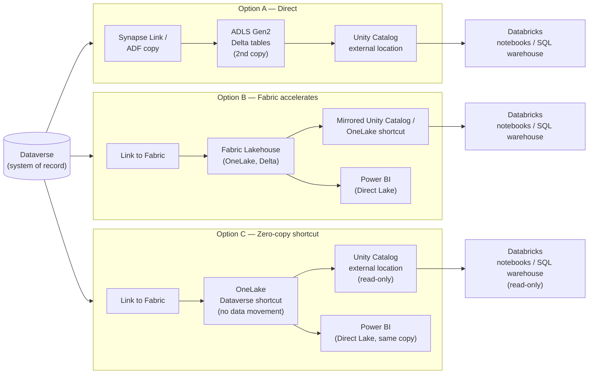

### Option A — Direct Dataverse → Databricks (bypass Fabric)

Export Dataverse via **Azure Synapse Link for Dataverse** (Delta Lake on ADLS
Gen2) or a scheduled **Dataverse Web API / Azure Data Factory copy** into
Databricks-managed storage; Databricks reads through **Lakehouse Federation**
or an external location pointed at the export.

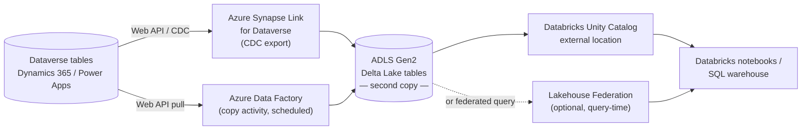

| Endpoint | Capability / service | Role |
| --- | --- | --- |
| Dataverse | Web API / change-tracking (CDC) | Source of record, extraction point |
| Azure Synapse Link for Dataverse | Managed CDC export to Delta Lake | Continuous export, no custom code |
| Azure Data Factory | Copy activity / pipeline | Alternative scheduled bulk copy |
| ADLS Gen2 | Delta Lake tables | Landing storage — **this is the second copy** |
| Databricks Unity Catalog | External location, or Lakehouse Federation | Catalogs and governs the copied data |
| Databricks notebooks / SQL warehouse | Compute | Analytics / data-science consumption |

- **Pros.** Mature, GA for years. No new platform dependency — no Fabric
  capacity to licence or justify. The Databricks team keeps full control of
  its own storage and compute. Simplest story if the customer has no Fabric
  estate today.
- **Cons.** Creates a **second copy** of Dataverse data — directly against
  OneLake's "one copy of data" principle and ADR-0018's analytics-split
  intent. ETL/copy latency and schema-drift risk. Duplicate governance
  (Dataverse RBAC vs. Databricks Unity Catalog, no shared lineage). Ongoing
  pipeline maintenance cost. Swims against Microsoft's current Fabric/OneLake
  interoperability investment — a strategic risk if that becomes the
  supported path forward industry-wide.
- **Design pattern.** Classic ETL/ELT "bulk export + copy" — matches
  INTEGRATION.md's *Bulk / scheduled* pattern in its plainest form.
- **Licence.** 🧩 configuration / own build (ADF pipelines, or Synapse Link —
  which Microsoft is de-emphasising in favour of Fabric mirroring; current
  support posture `[TBD]`).

#### Advisory Cockpit walk-through (Option A)

Concrete use case: **AG-F-01 Next-Best-Action Agent** scores the whole book
on a schedule and surfaces explainable NBA cards in the advisor cockpit
([docs/AI.md](../AI.md), [ADR-0014](./ADR-0014-agents-advisory-by-design.md)).
Under Option A, the read side and the write-back side both run through
custom-built pipelines — there is no native accelerator.

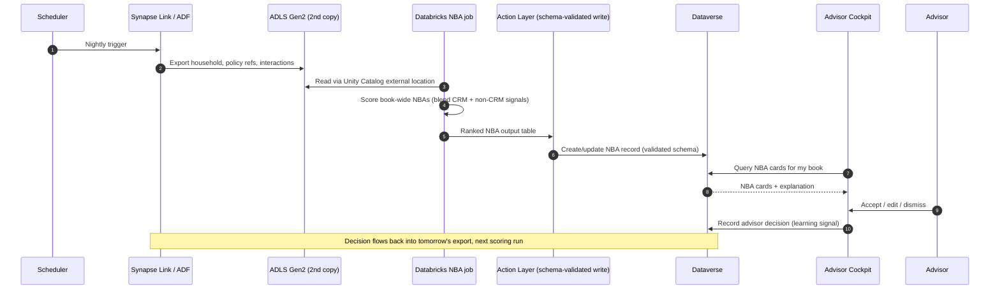

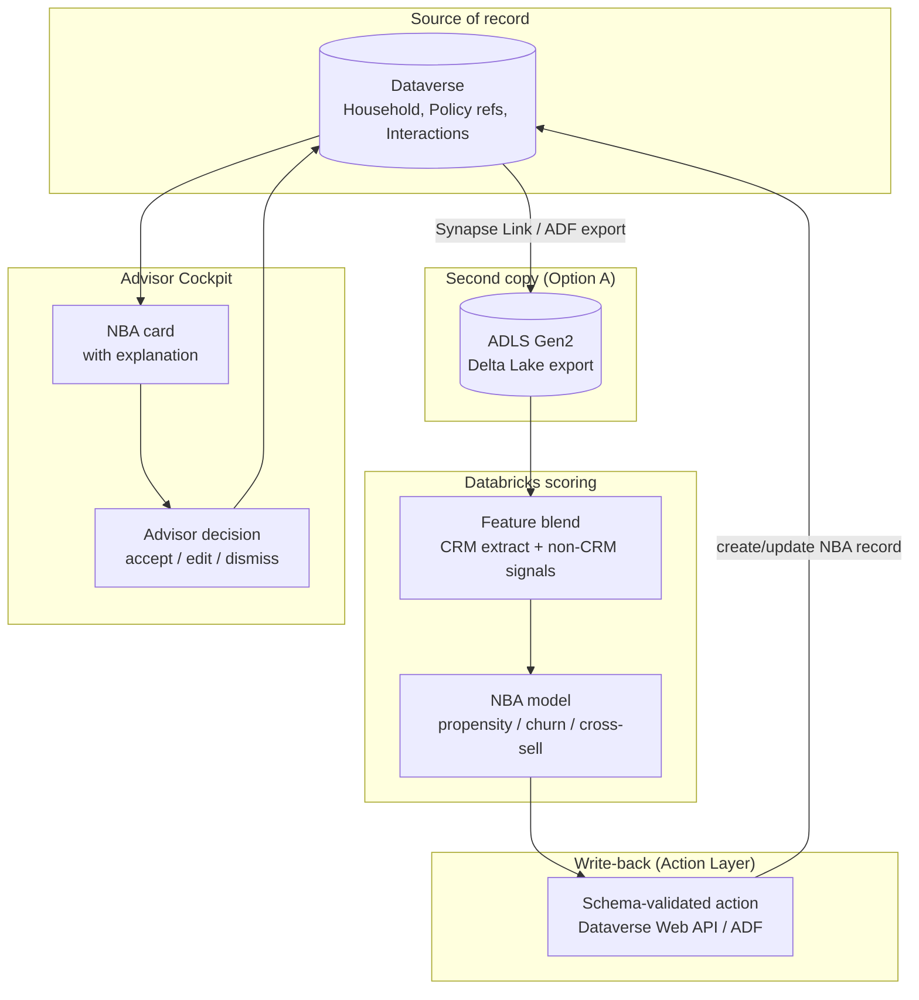

**Note.** Even here, the NBA score never reaches Dataverse as free-text model
output — it always passes through the schema-validated Action Layer per
[docs/AI.md](../AI.md)'s deterministic boundary between model proposal and
CRM mutation, and the advisor's accept/edit/dismiss is the recorded decision
([ADR-0014](./ADR-0014-agents-advisory-by-design.md)).

### Option B — Microsoft Fabric / OneLake as the acceleration & orchestration layer

Use **Link to Microsoft Fabric** (the native Dataverse → Fabric Lakehouse
feature) to land Dataverse tables, then use Fabric notebooks, Data Factory
pipelines, and Direct Lake semantic models to transform and serve — natively
to Power BI, and to Databricks either via a further OneLake shortcut or a
mirrored Unity Catalog relationship.

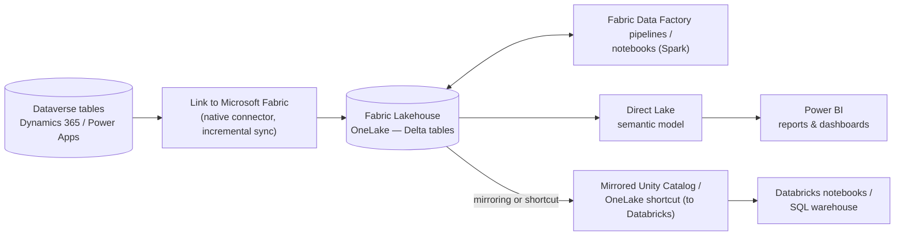

| Endpoint | Capability / service | Role |
| --- | --- | --- |
| Dataverse | Link to Microsoft Fabric (native, incremental) | Source extraction — no custom pipeline to build |
| Fabric Lakehouse (OneLake) | Delta tables | Landing + transform zone (medallion bronze/silver/gold) |
| Fabric Data Factory / notebooks | Pipelines, Spark notebooks | Transform, blend with non-CRM domains |
| Fabric Direct Lake semantic model | Direct Lake (no import/no copy) | Serve to Power BI |
| Databricks Unity Catalog | Mirrored catalog or OneLake shortcut | Serve the same Delta tables to Databricks compute |
| Databricks notebooks / SQL warehouse | Compute | Data science, cross-domain modelling |

- **Pros.** Reuses the native, low-code Dataverse→Fabric connector Microsoft
  already documents and supports. One ingestion path serves Power BI, data
  science, and Databricks at once. Databricks Unity Catalog ↔ Fabric mirroring
  is **GA (July 2025)** — the tooling exists today. Capacity may already be
  paid for if the customer holds Power BI Premium/Fabric capacity.
- **Cons.** Requires **Fabric capacity** — a licence and cost line that may
  not exist yet; flag honestly rather than assume it. Adds a platform hop:
  more surface to secure, govern, and operate (Zero Trust posture must now
  cover three platforms, not two). Needs Fabric skills alongside existing
  Databricks skills. Risk of being read as Microsoft-platform lock-in by a
  customer that has standardised on Databricks.
- **Design pattern.** Medallion architecture inside a Fabric Lakehouse, with
  OneLake as the shared storage layer and Databricks treated as an additional
  compute engine over the same Delta tables.
- **Licence.** ➕ additional licence required (Fabric capacity SKU) — exact
  tier `[TBD]`.

#### Advisory Cockpit walk-through (Option B)

Same use case — **AG-F-01 Next-Best-Action Agent** scoring the book for the
advisor cockpit. Under Option B, Fabric's native incremental sync replaces
the custom export/copy job from Option A, and Databricks blends in
Fabric-native non-CRM data (e.g., marketing engagement already landed in the
same Lakehouse) before scoring. The write-back path still needs an explicit,
governed hop into Dataverse.

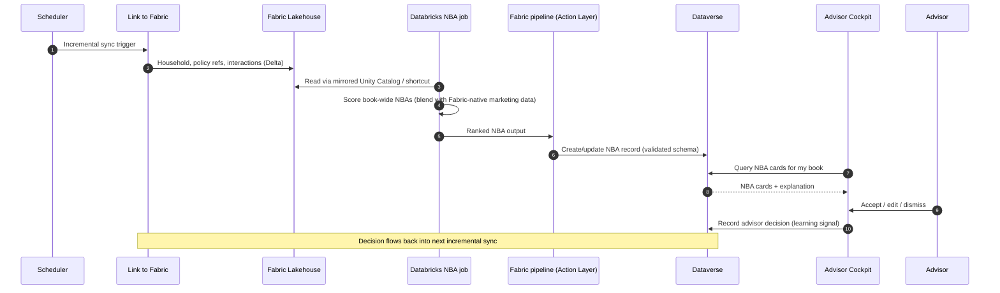

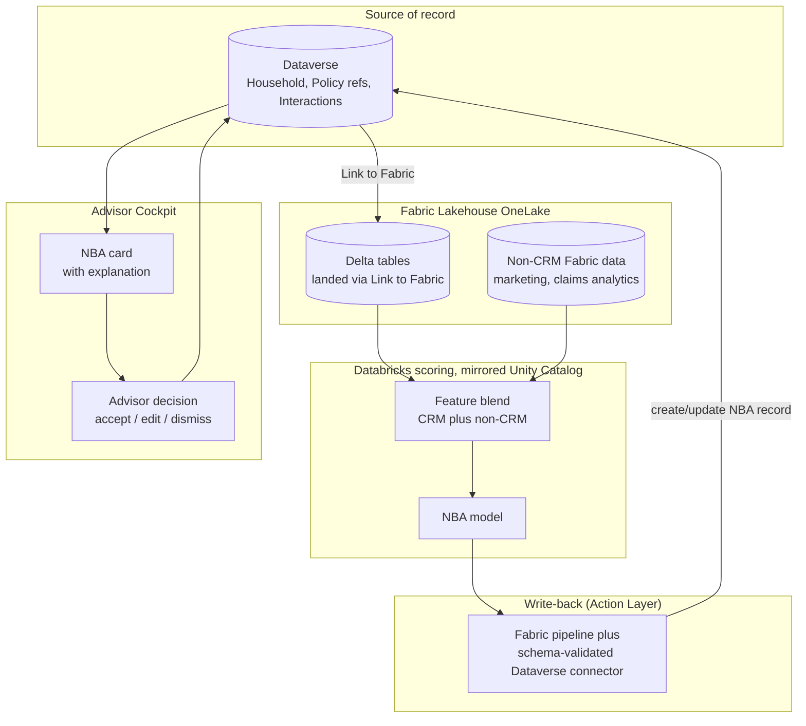

**Note.** The extra platform hop buys richer feature blending (Fabric-native
non-CRM signals join the same Lakehouse the NBA model reads), but it does not
remove the need for a schema-validated write-back — the Fabric pipeline still
calls a governed Dataverse connector, not a direct Databricks-to-CRM write.

### Option C — Zero-copy: Dataverse → OneLake shortcut ← Databricks reads directly

Use **Link to Microsoft Fabric**'s OneLake **Dataverse shortcut** (Delta
Parquet, no data movement) as the landing surface, and have Databricks read
that same OneLake location directly via **Unity Catalog external location /
native OneLake integration** — no ETL, no Fabric compute beyond the shortcut
itself.

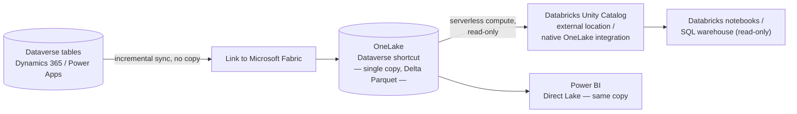

| Endpoint | Capability / service | Role |
| --- | --- | --- |
| Dataverse | Link to Microsoft Fabric | Source, still the sole system of record |
| OneLake | Dataverse shortcut (Delta Parquet, zero-copy) | Single shared storage location — no Fabric compute required |
| Databricks Unity Catalog | External location / native OneLake integration (serverless) | Read-only catalog over the same shortcut |
| Databricks notebooks / SQL warehouse | Compute | Analytics, read-only |
| Power BI (optional) | Direct Lake over the same shortcut | Cross-domain BI without a second copy |

- **Pros.** True **"one copy of data"** — no duplication, no drift, lowest
  storage cost. Dataverse stays the sole system of record, cleanly compliant
  with ADR-0008 and ADR-0018 by construction, not by policy enforcement.
  Near-real-time reflection of Dataverse changes through Fabric's incremental
  Link sync. Databricks consumes read-only, which fits
  [ADR-0014](./ADR-0014-agents-advisory-by-design.md) (agents advisory, humans
  decide) — there is no write path back into CRM to govern.
- **Cons.** The newest option: Unity Catalog↔Fabric mirroring and native
  OneLake reads from Databricks are 2025-era capabilities; feature limits
  (large tables, complex Dataverse relationships, throttling) are `[TBD]` and
  need validation against the customer's actual data volumes. Cross-tenant /
  service-principal permissions must be verified explicitly on both sides
  (Zero Trust). Still requires a minimum Fabric capacity for the
  shortcut/Link-to-Fabric feature even though no data is copied. Databricks
  **writing** into OneLake natively is roadmap, not GA — this option is
  read-only by current platform limits, not just by design.
- **Design pattern.** Shared bronze layer via OneLake shortcut — zero-ETL,
  single-copy interoperability across two compute engines on the same open
  Delta table.
- **Licence.** 🧩 configuration (native features) + a Fabric capacity floor —
  exact minimum SKU `[TBD]`.

#### Advisory Cockpit walk-through (Option C)

Same use case again — **AG-F-01 Next-Best-Action Agent** scoring the book
for the advisor cockpit. Option C makes the *read* side zero-copy and
near-real-time: Databricks always sees the current Dataverse state through
the OneLake shortcut, no batch wait. But the *write-back* of the NBA score
cannot be zero-copy — Databricks cannot natively write into OneLake today
(roadmap, not GA), so the scored output first lands in a Databricks-managed
table before the governed Action Layer pushes it into Dataverse. This is the
one deliberate exception to "one copy of data" in this option, and it is
worth stating explicitly to EA/IT stakeholders.

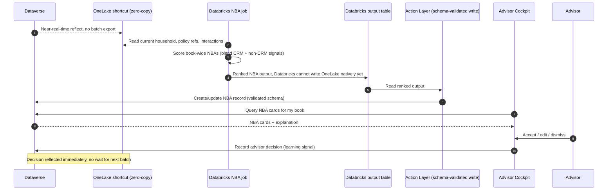

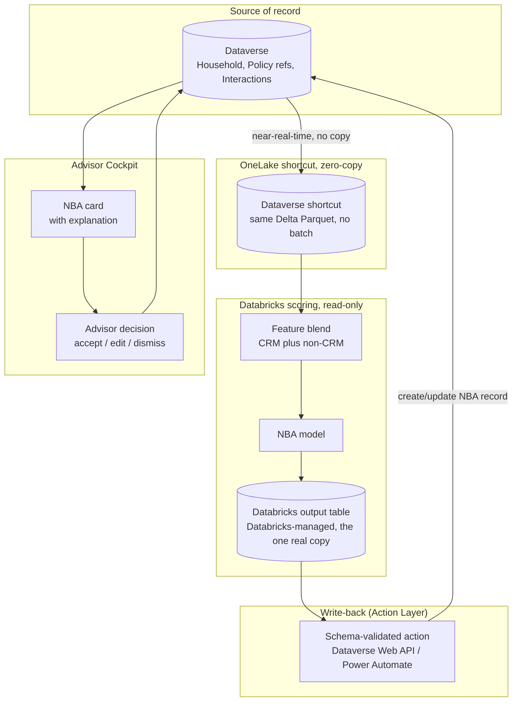

**Cross-option insight.** In all three options the NBA **read** side follows
that option's pattern (bulk copy / Fabric-mediated / zero-copy shortcut), but
the NBA **write-back** always requires the same kind of thing: a
schema-validated Action Layer creating/updating a Dataverse record, never a
direct or free-text write from the model. Option C's zero-copy advantage
applies only to the analytical read — it does not remove the write-back
governance step, and stakeholders should not expect it to.

## Agentic acceleration — Copilot agent-delegated, on-demand NBA preparation

Options A/B/C above answer *how book-wide NBA scoring data reaches
Databricks*. This section answers a second, **orthogonal** question raised
separately: *how does the advisor's Copilot experience delegate a
single-household, on-demand ask to the data platform* — e.g. "why this NBA?"
or "refresh this household's recommendation now" — as a lighter-weight
complement to the nightly batch scoring already covered in each option's
Advisory Cockpit walk-through. Either data-path option (A, B or C) can sit
underneath either pattern below; this is a hosting/delegation choice, not a
replacement for the batch pipeline.

**Scope decision.** On-demand only, by explicit choice — not a redesign of
the nightly batch scorer. No option is selected here either; all four are
credible and go to the same EA/IT stakeholder review as Options A–C.

### Data-gathering delegation mechanism (shared by all four hosting patterns)

| Pattern | Mechanism | Pairs best with | Licence |
| --- | --- | --- | --- |
| Custom connector / Power Automate → Databricks SQL Statement Execution API or Model Serving endpoint | Agent calls a fixed, parameterised REST endpoint | Option A (direct) | 🧩 own build |
| Fabric Data Agent as a Copilot Studio knowledge source | Native, GA conversational Q&A over OneLake Lakehouse/Warehouse/Power BI semantic models — no SQL/DAX/KQL required ([Fabric data agent concepts](https://learn.microsoft.com/fabric/data-science/concept-data-agent)) | Option B/C (Fabric-mediated / zero-copy) | ➕ Fabric capacity |
| **Databricks Genie MCP server as a Copilot Studio MCP tool** | Databricks-native managed endpoint `/api/2.0/mcp/genie` (OAuth, Unity Catalog permissions always enforced); Copilot Studio adds it directly via **Tools → Add a tool → Model Context Protocol** — no custom MCP server to build ([Genie MCP server, Azure Databricks](https://learn.microsoft.com/azure/databricks/agents/mcp-tools/genie-mcp); [Connect an agent to an MCP server, Copilot Studio](https://learn.microsoft.com/microsoft-copilot-studio/mcp-add-existing-server-to-agent)) | Any option — bypasses Fabric entirely for the on-demand ask | 🧩 own build (agent config) + Databricks **preview** feature — support posture `[TBD]` |

The four walk-throughs below illustrate the **Genie MCP** mechanism, since it
is Microsoft/Databricks-native, current, and reuses the MCP pattern this
repo already adopted in
[ADR-0022](./ADR-0022-curated-external-copilot-capability-packs.md). The
Fabric Data Agent row is the safer, GA-only alternative if the customer
prefers to stay entirely inside the Fabric estate defined in Options B/C, and
should be substituted in without changing the surrounding hosting pattern.

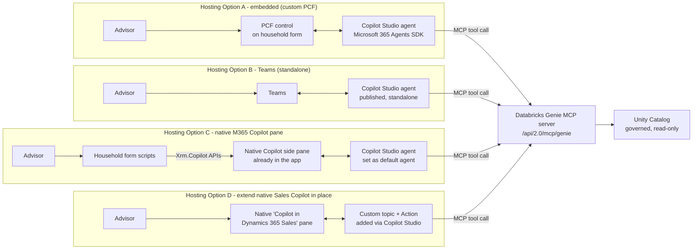

### Hosting Option A — Copilot agent embedded in the Advisor Cockpit

A custom Copilot Studio agent hosted directly on the household/account form
via a **PCF control + Microsoft 365 Agents SDK**, following Microsoft's own
reference architecture for extending Dynamics 365 model-driven apps with a
custom agent
([Extend Dynamics 365 model-driven apps with a custom Copilot Studio agent through a PCF control](https://learn.microsoft.com/dynamics365/guidance/reference-architectures/custom-copilot-agent-dynamics-365-power-apps)).
PCF controls in this repo are already governed by
[`pcf-alm.instructions.md`](../../.github/instructions/pcf-alm.instructions.md)
and
[`pcf-best-practices.instructions.md`](../../.github/instructions/pcf-best-practices.instructions.md).

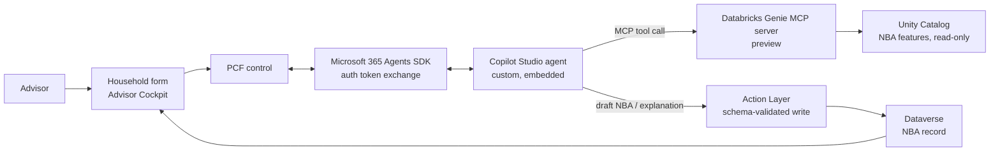

| Endpoint | Capability / service | Role |
| --- | --- | --- |
| PCF control | Power Apps component framework, on the household/account form | Hosts the embedded chat surface, already has record context |
| Microsoft 365 Agents SDK | Auth token exchange, agent runtime bridge | Connects the PCF control to the Copilot Studio agent securely |
| Copilot Studio agent (custom) | Orchestrator, topics/tools | Interprets advisor intent, calls the Genie MCP tool, drafts the response |
| Databricks Genie MCP server | `/api/2.0/mcp/genie`, OAuth, Unity Catalog-governed | On-demand natural-language query over Databricks data (preview) |
| Action Layer | Dataverse Web API / Power Automate, schema-validated | Writes the refreshed NBA record — never a direct/free-text write |

- **Pros.** The advisor never leaves the record — household context is
  already known, no resolution step needed. Matches the existing "cockpit"
  mental model. An official Microsoft reference architecture exists to build
  against. Reuses the same deterministic Action Layer already defined for
  Options A/B/C.
- **Cons.** Genuinely new build effort: a PCF control, a custom Copilot
  Studio agent, and Microsoft 365 Agents SDK auth wiring — no
  out-of-the-box "embed" toggle. Ties the cockpit's AI experience to a
  specific extensibility investment with its own upgrade-impact surface
  (PCF ALM rules apply). The Genie MCP endpoint is a 2026 **preview**
  feature — support/SLA posture `[TBD]`.
- **Design pattern.** *Agent-as-embedded-copilot* — a per-record,
  context-aware assistant surfaced through the app shell itself, delegating
  heavy analytical lifting to an external tool via MCP.
- **Licence.** 🧩 own build (PCF control + Copilot Studio agent
  configuration) + Databricks preview feature; Copilot Studio licensing
  tier (standard harness) `[TBD]`.

#### Advisory Cockpit walk-through (Hosting Option A)

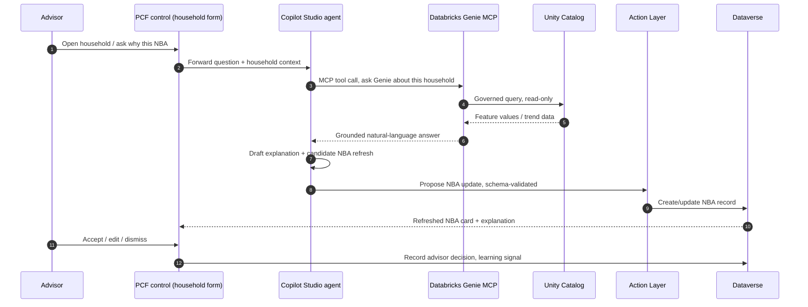

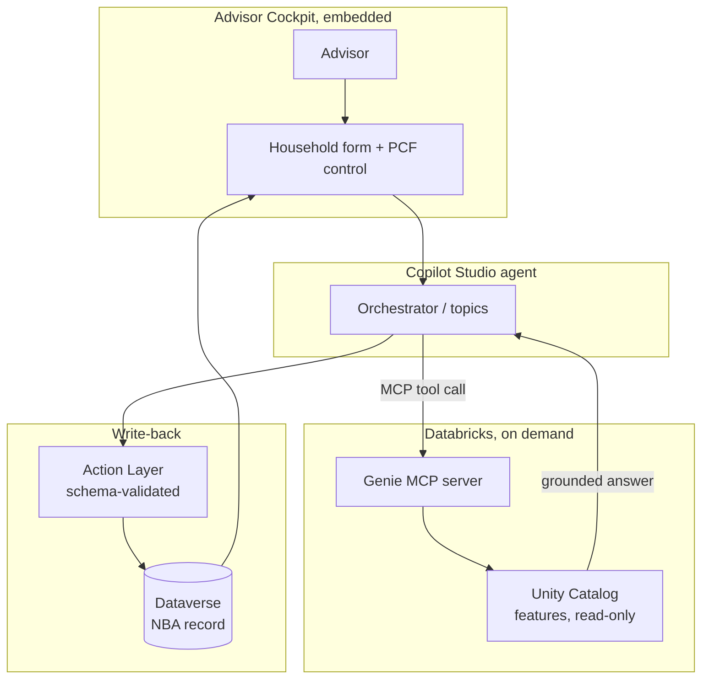

### Hosting Option B — Separate Copilot Studio agent in Teams

The same orchestration logic, published standalone rather than embedded —
the advisor consults it outside the model-driven app entirely, via a
Copilot Studio agent connected to Microsoft Teams and Microsoft 365
([Connect and set up an agent for Teams and Microsoft 365](https://learn.microsoft.com/microsoft-copilot-studio/publication-add-bot-to-microsoft-teams)).
Because there is no implicit record context, the agent must first resolve
which household is meant, and any recommendation still has to be reviewed in
the actual Advisor Cockpit — ADR-0014 requires the decision surface to
remain the cockpit, not a chat transcript.

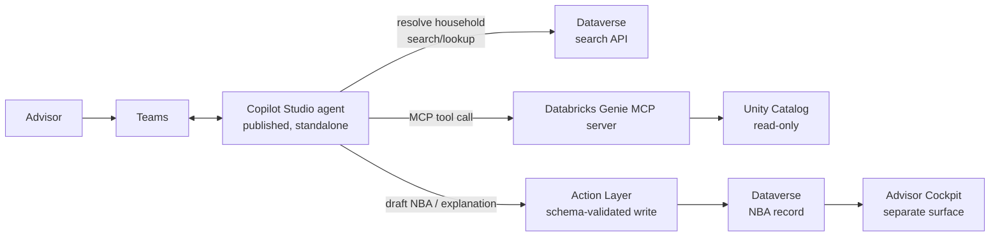

| Endpoint | Capability / service | Role |
| --- | --- | --- |
| Teams | Publish channel | Advisor's chat surface, outside the cockpit |
| Copilot Studio agent (standalone) | Orchestrator, topics/tools | Same orchestration logic as Hosting Option A, different host |
| Dataverse search API | Contact/Account/Household lookup | Resolves which record the advisor means — no implicit context |
| Databricks Genie MCP server | Same as Hosting Option A | On-demand query |
| Action Layer | Same as Hosting Option A | Writes the NBA record |
| Advisor Cockpit | Model-driven app | Where the advisor must still go to accept/edit/dismiss |

- **Pros.** Fastest to stand up — no PCF control to build. Reachable from
  mobile/Teams when the advisor isn't in the app. Shares the same Genie MCP
  tool and Action Layer as Hosting Option A, so most of the build is
  reusable. Good for piloting the delegation mechanism before committing to
  embedding.
- **Cons.** Loses implicit record context — needs an extra
  household-resolution step, adding latency and a disambiguation failure
  mode (the same person-matching risk `AG-F-05` already flags). Creates a
  second surface the advisor context-switches to; the decision
  (accept/edit/dismiss) still must happen back in the cockpit per
  [ADR-0014](./ADR-0014-agents-advisory-by-design.md) — this option
  relocates *where the advisor asks*, not *where the advisor decides*. Risks
  becoming a weaker "shadow cockpit" if adoption skews toward Teams instead
  of the governed decision surface.
- **Design pattern.** *Agent-as-companion-channel* — identical orchestration
  and Action Layer, a decoupled front door with an added identity-resolution
  step.
- **Licence.** 🧩 own build (Copilot Studio agent, mostly shared
  configuration with Hosting Option A) + Databricks preview feature; Teams /
  Microsoft 365 Copilot publishing licence `[TBD]`.

#### Advisory Cockpit walk-through (Hosting Option B)

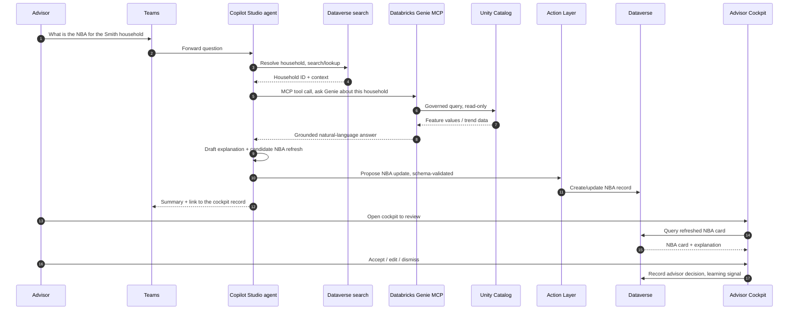

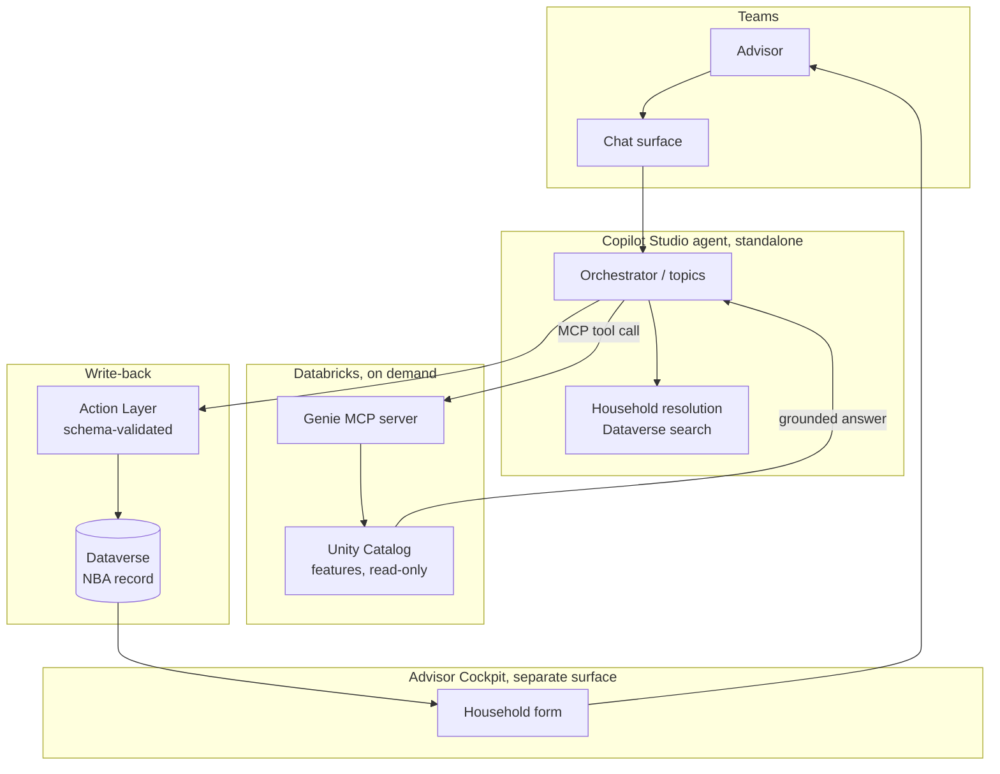

### Hosting Option C — Extend the out-of-the-box Microsoft 365 Copilot pane already in the model-driven app

Rather than build a new UI surface (Option A) or leave the app entirely
(Option B), extend the **native Microsoft 365 Copilot side pane that already
ships with the model-driven app** — the exact pane already docked in the
Advisor Cockpit today (the "Copilot" icon in the app's top nav). Two native
mechanisms combine to do this, both first-party and already documented:

1. **Set a default agent** — bind the same custom Copilot Studio agent used
   in Options A/B as the pane's default agent, so it loads automatically
   instead of the generic Microsoft 365 Copilot chat when the app opens
   ([Customize Microsoft 365 Copilot with an agent](https://learn.microsoft.com/power-apps/maker/model-driven-apps/customize-microsoft-365-copilot-chat)).
2. **`Xrm.Copilot.*` client APIs**, scripted from the existing household
   form (no new PCF control) — `openM365CopilotPanel` to surface the pane
   on demand (e.g. from an "Explain this NBA" ribbon button),
   `updateContext` *(preview)* to push the open record's context in as
   grounding, and `addActionHandler` to let the agent's response drive
   real form behaviour back (e.g. refresh the NBA card) via Adaptive Card
   or MCP-app actions.

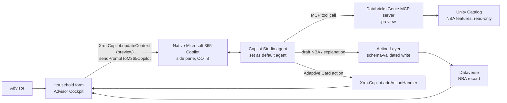

| Endpoint | Capability / service | Role |
| --- | --- | --- |
| Native Microsoft 365 Copilot side pane | Out-of-the-box Power Apps model-driven app feature | Already-deployed chat surface — nothing new to build |
| Default agent setting | Power Apps app setting | Binds the custom Copilot Studio agent as the pane's starting experience |
| `Xrm.Copilot.*` client APIs | `updateContext` *(preview)*, `sendPromptToM365Copilot`, `openM365CopilotPanel`, `addActionHandler` | Scripted bridge between the form and the pane — context in, actions back |
| Copilot Studio agent (default) | Orchestrator, topics/tools | Same orchestration logic as Hosting Options A/B, hosted in the native pane |
| Databricks Genie MCP server | Same as Hosting Options A/B | On-demand query |
| Action Layer | Same as Hosting Options A/B | Writes the NBA record |

- **Pros.** Reuses UI advisors already know — no new PCF control, no
  separate Teams app; lowest incremental build effort of the three.
  Bidirectional by design: `addActionHandler` lets the agent's response
  trigger real form behaviour, not just chat text. Likely the lowest
  incremental licence cost if Microsoft 365 Copilot is already licensed
  org-wide for the app.
- **Cons.** `updateContext` — the piece that would auto-pass the open
  household's record context into the agent — is explicitly **preview**,
  and Microsoft states plainly that "agents you author can't yet use in-app
  user context to tailor their responses"; today the context likely has to
  be restated explicitly in the prompt rather than inferred. Setting a
  default agent **replaces** the generic Microsoft 365 Copilot experience
  for that app (its native starter prompts also stop rendering) — a
  trade-off, not a pure addition. Still requires model-driven app
  form-script customisation with its own ALM/testing surface, even though
  it is lighter than a PCF control.
- **Design pattern.** *Agent-as-default-pane* — reuse the platform's own
  Copilot chrome and extend it via configuration + scripted client APIs,
  rather than building new UI or leaving the app.
- **Licence.** 🧩 own build (Copilot Studio agent configuration + form
  scripts) + Databricks preview feature; relies on Microsoft 365 Copilot
  licensing already covering the app — exact tier/eligibility `[TBD]`.

#### Advisory Cockpit walk-through (Hosting Option C)

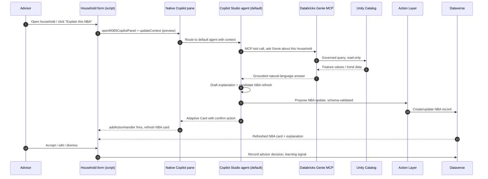

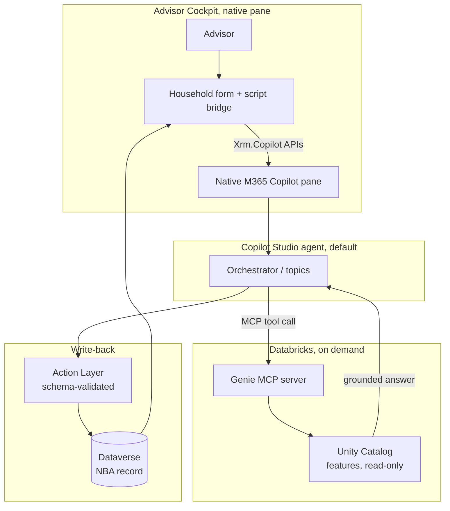

**Cross-cutting insight.** All four hosting options share the same Action
Layer and the same ADR-0014 constraint: an on-demand Copilot agent may
*draft* a recommendation from live Databricks data, but it never *decides*
and never writes directly into Dataverse. Hosting Option A keeps the ask and
the decision in one place with full custom UI control; Hosting Option B
splits them across two surfaces entirely outside the app; Hosting Option C
sits between the two — native chrome, in-app, but currently limited by
`updateContext` still being preview; Hosting Option D keeps the native
chrome *and* the native pre-built agent, extending it in place rather than
swapping it out, at the cost of being scoped to whichever Dynamics 365 app
(here, Sales) already ships that agent. This spread of trade-offs — build
effort vs. context-awareness vs. change-management cost vs. how much of the
native experience is kept intact — is exactly what the EA/IT discussion
needs to weigh.

### Hosting Option D — Extend the native "Copilot in Dynamics 365 Sales" agent in place

Rather than swap in a custom default agent (Option C), keep the **pre-built,
native Sales Copilot agent** that already ships with Dynamics 365 Sales and
extend it in place, using the app-specific customization surface built for
it — distinct from the generic model-driven-app "Configure in Copilot
Studio" flow, which explicitly does **not** support apps with both lead and
opportunity tables
([Customize Copilot chat using Copilot Studio (preview)](https://learn.microsoft.com/power-apps/maker/model-driven-apps/customize-copilot-chat))
and is itself slated for deprecation from January 2026 in favour of
Microsoft 365 Copilot. Dynamics 365 Sales instead exposes its own agent —
**"Copilot in Dynamics 365 Sales"** — directly in Copilot Studio
([Customize Copilot in Dynamics 365 Sales](https://learn.microsoft.com/dynamics365/sales/extend-copilot-chat)),
where an author (Copilot Studio Author role) can, without replacing the
agent or building a new one:

1. **Add or edit topics** to graft in new knowledge sources and **actions**
   — this is where the same Genie MCP tool call used in Options A–C is
   added, as an action on a new or existing topic.
2. **Customize the prompt guide** (the built-in `SalesSparks` topic), so an
   "Explain this NBA" / "Refresh this household's recommendation" prompt
   sits alongside the native sales prompts advisors already use.
3. **Add glossary terms and synonyms** so the existing native agent
   understands CRM/insurance-vertical business terms (e.g. "household",
   "NBA") without any UI or form-script work.

This is a preview capability, explicitly documented as such by Microsoft,
and only applies as described if the Advisor Cockpit is itself built on (or
extends) Dynamics 365 Sales — a fact to validate, not assume, given this
showcase's household-centric data model.

```mermaid
flowchart LR
    ADV["Advisor"] --> PANE["Native 'Copilot in\nDynamics 365 Sales' pane"]
    PANE <--> SPARKS["SalesSparks\nnative prompt guide"]
    PANE <--> TOPIC["Custom topic\nadded via Copilot Studio"]
    TOPIC -- "MCP tool call, added as an Action" --> GENIE["Databricks Genie MCP server\npreview"]
    GENIE --> UC["Unity Catalog\nNBA features, read-only"]
    TOPIC -- "draft NBA / explanation" --> ACT["Action Layer\nschema-validated write"]
    ACT --> DV["Dataverse\nNBA record"]
    DV --> COCKPIT["Advisor Cockpit"]
    GLOSS["Glossary & synonyms\nhousehold, NBA, ..."] -.-> PANE
```

| Endpoint | Capability / service | Role |
| --- | --- | --- |
| "Copilot in Dynamics 365 Sales" (native agent) | Prebuilt Copilot Studio agent shipped with Dynamics 365 Sales | Already-deployed chat surface — extended, not replaced |
| Copilot Studio Author role | Permission | Required to edit topics, knowledge sources, prompt guide, glossary |
| Custom topic + Action | Copilot Studio topic authoring | Where the Genie MCP tool call is added |
| `SalesSparks` prompt guide | Native prompt customization | Surfaces the NBA-refresh prompt alongside native sales prompts |
| Glossary & synonyms | Copilot Studio knowledge configuration | Maps household/NBA business terms to Dataverse columns |
| Databricks Genie MCP server | Same as Hosting Options A–C | On-demand query |
| Action Layer | Same as Hosting Options A–C | Writes the NBA record |

- **Pros.** Keeps the native, already-familiar Sales Copilot experience
  intact — additive customization, not a wholesale swap like Option C, so
  the built-in `SalesSparks` prompts and skills are never lost. Likely the
  lowest change-management cost of all four: advisors keep the interface
  they already use. Glossary/synonyms let the existing native agent
  understand insurance-vertical terms with zero UI or form-script work.
- **Cons.** Explicitly a **preview** capability per Microsoft's own
  documentation. Only applies if the Advisor Cockpit is genuinely built on
  Dynamics 365 Sales (an app with both lead and opportunity tables) —
  `[TBD]` for this showcase, not yet confirmed. Custom topics are billed via
  Copilot Studio consumption credits, so cost scales with usage rather than
  being a one-time build. Image/Video message types from agent to user
  aren't supported (Adaptive Cards only — consistent with the pattern
  already used elsewhere in this ADR, so not a new constraint). Less
  control than a fully custom agent (Hosting Option A) — bound by the
  native agent's existing topic/skill structure.
- **Design pattern.** *Agent-as-extended-native-copilot* — keep the
  platform's own pre-built domain agent and graft new topics/tools/glossary
  onto it in place, rather than replacing it (Option C) or building a new
  one (Options A/B).
- **Licence.** Requires Dynamics 365 Sales licensing (assumed already in
  place) + Copilot Studio Author role + custom-topic consumption credits +
  Databricks preview feature; exact incremental cost `[TBD]`.

#### Advisory Cockpit walk-through (Hosting Option D)

```mermaid
sequenceDiagram
    autonumber
    participant ADV as Advisor
    participant PANE as Native Sales Copilot pane
    participant TOPIC as Custom topic (Copilot Studio)
    participant GENIE as Databricks Genie MCP
    participant UC as Unity Catalog
    participant ACT as Action Layer
    participant DV as Dataverse
    participant COC as Advisor Cockpit

    ADV->>PANE: "Refresh this household's recommendation"
    PANE->>TOPIC: Route to custom topic (glossary-matched terms)
    TOPIC->>GENIE: MCP tool call, ask Genie about this household
    GENIE->>UC: Governed query, read-only
    UC-->>GENIE: Feature values / trend data
    GENIE-->>TOPIC: Grounded natural-language answer
    TOPIC->>TOPIC: Draft explanation + candidate NBA refresh
    TOPIC->>ACT: Propose NBA update, schema-validated
    ACT->>DV: Create/update NBA record
    TOPIC-->>PANE: Adaptive Card summary
    ADV->>COC: Open cockpit to review
    COC->>DV: Query refreshed NBA card
    DV-->>COC: NBA card + explanation
    ADV->>COC: Accept / edit / dismiss
    COC->>DV: Record advisor decision, learning signal
```

```mermaid
flowchart TD
    subgraph Cockpit["Advisor Cockpit"]
        ADV["Advisor"]
        PANE["Native 'Copilot in\nDynamics 365 Sales' pane"]
    end
    subgraph Agent["Native agent, extended in place"]
        SPARKS["SalesSparks\nnative prompt guide"]
        TOPIC["Custom topic + Action\nadded via Copilot Studio"]
        GLOSS["Glossary & synonyms"]
    end
    subgraph Platform["Databricks, on demand"]
        GENIE["Genie MCP server"]
        UC["Unity Catalog\nfeatures, read-only"]
    end
    subgraph Write["Write-back"]
        ACT["Action Layer\nschema-validated"]
        DV[("Dataverse\nNBA record")]
    end

    ADV --> PANE
    PANE --> SPARKS
    PANE --> TOPIC
    GLOSS -.-> TOPIC
    TOPIC -- "MCP tool call" --> GENIE --> UC
    UC -- "grounded answer" --> TOPIC
    TOPIC --> ACT --> DV --> PANE
```

## Decision or working hypothesis

**No option is selected.** This ADR documents the three credible patterns so
the Enterprise Architect and the customer's IT/architecture stakeholders can
choose with the trade-offs in front of them. The working lean — **not a
decision** — is that Option C (zero-copy shortcut) best matches the position
already taken in ADR-0008/ADR-0018, provided its feature maturity and scale
limits validate against the customer's actual Databricks/Fabric estate.

## Evidence and assumptions

- **Known.** Dataverse "Link to Microsoft Fabric" and OneLake Dataverse
  shortcuts are GA native features. Mirroring Azure Databricks Unity Catalog
  into Fabric is GA (July 2025). Databricks-native writes into OneLake are
  roadmap, not GA, as of this ADR's date.
- **Inferred.** The customer's existing Databricks footprint (workspace
  region, Unity Catalog metastore, network posture) is assumed compatible
  with either the mirroring or the shortcut pattern — **not yet confirmed**.
- **Evidence still required.** Does the customer already hold Fabric/Power BI
  Premium capacity? What are the actual Dataverse table volumes and
  relationship complexity in the analytics scope? What is the customer's
  tolerance for a second data copy (Option A) vs. a new platform dependency
  (Options B/C)? Who owns Fabric capacity cost if a new SKU is required?

## Validation and review triggers

Reopen this ADR when: the customer's Fabric/Databricks estate is confirmed;
a pilot shortcut/mirror is attempted against real Dataverse volumes and either
succeeds or hits a documented limit; pricing/licence for any required Fabric
capacity is confirmed; or Databricks ships native OneLake write support
(which would change how Option C's read-only guarantee is checked against
ADR-0008). Decision owner: `AG-E-03` Enterprise Architect (accountable), with
`AG-E-07` Data Engineer & Scientist and the customer's IT/Architect
stakeholder as required reviewers.

## Consequences

- **At the next release.** No implementation ships from this ADR alone — it
  is evaluation only, pending stakeholder discussion.
- **Operationally.** Whichever option is chosen, record it in
  [INTEGRATION.md](../INTEGRATION.md)'s "Analytics platform" row (currently
  `[TBD]`) and close the open item in [ANALYTICS.md](../ANALYTICS.md).
- **For the customer's teams (shared responsibility).** Fabric capacity
  ownership (Options B/C) and Databricks Unity Catalog governance become new
  RACI lines in [SHARED-RESPONSIBILITY.md](../SHARED-RESPONSIBILITY.md) — A9.
- **Reversibility.** High for Options B/C — shortcuts and mirroring are
  additive and can be removed without touching Dataverse. Option A is harder
  to reverse once pipelines and a second copy exist downstream.

## Competitive note

Most competing CRM stacks either lock analytics into their own BI tool or
require a bespoke ETL pipeline to any external lakehouse. Native, zero-copy
interoperability between the CRM data plane and a customer's already-chosen
data platform via an open Delta Lake format (Option C) is a structural
difference, not adjectival "better analytics" — it is a different integration
topology that a comparable stack cannot offer without building the same
ETL pipeline described in Option A.
