# ADR-0025 — CRM-to-core-systems event integration via Kafka on Confluent Cloud

| Field | Value |
| --- | --- |
| **Status** | Proposed hypothesis |
| **Date** | 2026-08-13 |
| **Decision mode** | Working hypothesis — **no option selected, no lean stated**; fully open for Enterprise Architect + customer IT/architecture stakeholder review |
| **Confidence** | Low — research-grounded (Microsoft Learn + Confluent Cloud docs), not yet validated against the customer's actual Confluent Cloud tenant, topics or schemas |
| **Deciders** | `AG-E-03` Enterprise Architect (accountable) · `AG-E-09` Integration Engineer · `AG-E-04` SecDevOps · customer IT/Architect (`P-06`) |
| **Topic area** | A3 — Integration, interfaces, system orchestration · A5 — Business-case steering across systems · A9 — Shared responsibility |
| **Use case** | Illustrated with **AG-F-01 Next-Best-Action Agent** (Advisory Cockpit) walk-throughs below each option — both the **inbound** leg (claim/policy state changes refreshing CRM projections) and the **outbound** leg (governed-attribute cascade per [ADR-0011](./ADR-0011-event-driven-cascade.md)) |
| **Licence** | `[TBD]` — varies by option; see below |
| **Upgrade impact** | Medium — new external integration boundary. No option touches the Dataverse schema itself, but every option adds event-shaping/relay compute that must be maintained across releases |
| **CAF methodology** | Plan · Ready — evaluating before committing capacity or tooling |
| **WAF pillar(s)** | Primary: Reliability + Operational Excellence. Trade-off against: Cost Optimization, Performance Efficiency |
| **Zero Trust** | Verify explicitly · least privilege — Confluent Cloud authentication is **secret/connection-string only** (Managed Identity is not supported), a constraint that applies across all four options and must be weighed explicitly |
| **Responsible AI** | Illustrated via the `AG-F-01` walk-throughs below: inbound events only ever refresh CRM-side **projections** (read models) and never bypass the schema-validated Action Layer; outbound events never leave CRM without mandatory effective dating, and the advisor's accept/edit/dismiss remains the recorded decision ([ADR-0014](./ADR-0014-agents-advisory-by-design.md)) |

> **Naming note.** "Versicherungsprozesse system" and "Schadenprozesse system" are the
> names as provided by the customer. As with the Siebel specifics in
> [ADR-0019 Option D](./ADR-0019-provisional-insurance-data-model-shape.md), these are
> treated as **illustrative unless confirmed otherwise** and are used alongside the
> generic English roles already established in
> [ADR-0008](./ADR-0008-thin-crm-over-systems-of-record.md) /
> [DATA.md](../DATA.md): **policy administration engine** and **claims engine**
> respectively.

## Context

[ADR-0011](./ADR-0011-event-driven-cascade.md) established the **typed domain
event with mandatory effective dating** pattern for CRM-outbound cascades (a
governed attribute change, e.g. `AddressChanged`, fans out to rating,
eligibility, territory and discount) — but explicitly left one question open:
*"which bus/middleware carries the events in the target landscape."*

New system-landscape information closes part of that question: the customer
uses **Kafka on Confluent Cloud** as the event backbone for integration to the
core systems — the **Versicherungsprozesse system** (policy administration
engine) and the **Schadenprozesse system** (claims engine). This ADR evaluates
the credible integration patterns for **both directions** over that same
Kafka backbone:

- **Inbound** — the core systems publish state-change events (e.g.
  `PolicyUpdated`, `ClaimStatusChanged`) that must refresh CRM's Policy/Claim
  **projections**. Per [ADR-0008](./ADR-0008-thin-crm-over-systems-of-record.md),
  Dataverse never re-implements rating or claims adjudication — it only keeps
  its reference-keyed projections current.
- **Outbound** — CRM-originated governed-attribute events (the ADR-0011
  cascade, e.g. `AddressChanged`) must reach the core systems and any other
  Kafka subscriber, carrying the same mandatory effective date and
  correlation identifier required by [api/README.md](../../api/README.md).

This ADR does **not** pick an option. It documents the credible patterns —
verified against Microsoft Learn and Confluent Cloud documentation, not
invented — so the Enterprise Architect and the customer's IT stakeholders can
choose with the trade-offs in front of them, exactly as
[ADR-0024](./ADR-0024-dataverse-to-databricks-integration-pattern.md) did for
the Databricks integration.

## Options

All four options share the same event backbone (Kafka on Confluent Cloud)
and the same two CRM-side anchors — Dataverse's Policy/Claim projections
(inbound target) and its governed-attribute change pipeline (outbound
source) — but differ in **which component does the consuming/producing** and
how much of that component is custom-built versus managed configuration.

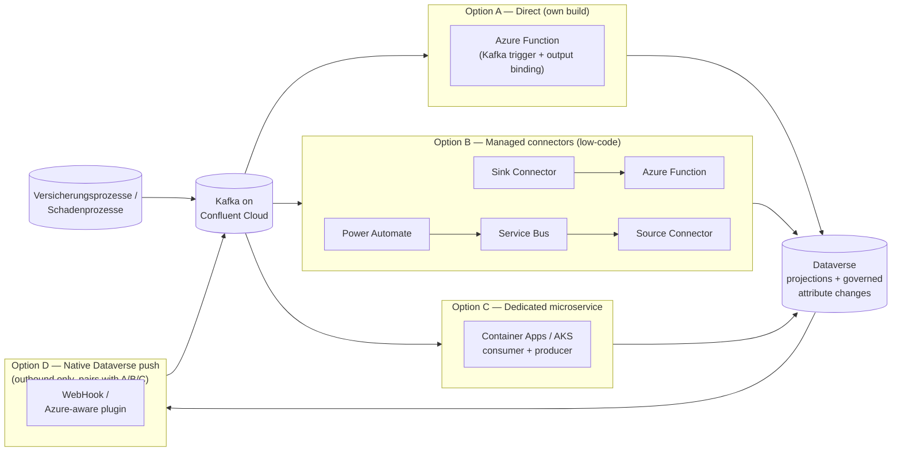

### Option A — Direct Kafka client via Azure Functions (own build, serverless)

Azure Functions has a native **Kafka trigger** (consume) and **Kafka output
binding** (produce), both documented as Confluent Cloud–compatible over
SASL_SSL bootstrap servers. One Function app handles both legs: a
Kafka-triggered function consumes core-system topics and upserts CRM
projections; a second function, invoked from Dataverse, produces outbound
events onto Confluent Cloud.

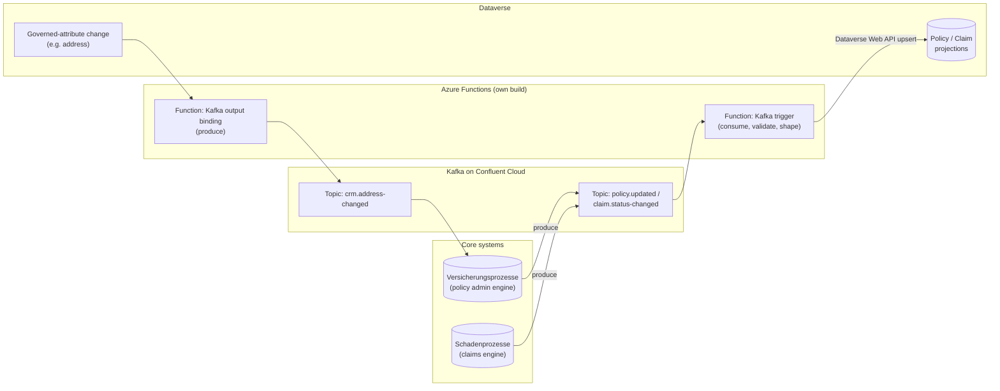

| Endpoint | Capability / service | Role |
| --- | --- | --- |
| Confluent Cloud Kafka topics | `policy.updated`, `claim.status-changed` (inbound); `crm.address-changed` (outbound) | Event backbone |
| Azure Functions — Kafka trigger | `Microsoft.Azure.WebJobs.Extensions.Kafka` | Inbound consumer, own consumer group |
| Azure Functions — Kafka output binding | Same extension | Outbound producer |
| Dataverse Web API | Create/Update (upsert) | Writes the CRM-side projection |
| Azure Key Vault | Secret store | Confluent Cloud SASL API key/secret |

- **Pros.** Lowest latency in both directions. Single technology/skillset
  (Azure Functions) covers both legs. No Confluent connector licensing cost.
  Full control over schema validation and dead-letter handling in code.
- **Cons.** Azure Functions consumption-plan limits (cold start, execution
  timeout, batch-size ceilings) can throttle under bursty claim/policy
  volumes. Offset management, retries and dead-lettering are hand-rolled —
  the reliability-engineering cost sits entirely with the team. Confluent
  Cloud authentication is **secret/connection-string only** — Managed
  Identity is not supported (confirmed via Azure Service Connector
  documentation) — so Key Vault-backed secret rotation is the best available
  Zero Trust posture here, not a passwordless one.
- **Design pattern.** [INTEGRATION.md](../INTEGRATION.md)'s *Typed domain
  event* pattern in its most literal form — this is where the event contract
  in [api/README.md](../../api/README.md) is enforced in code.
- **Licence.** 🧩 configuration / own build (Azure Functions code, Kafka
  client libraries).

#### Advisory Cockpit walk-through (Option A)

Concrete use case: the Schadenprozesse system emits a claim status change
that must refresh the household's Claim projection so **AG-F-01
Next-Best-Action Agent** re-scores explainable NBA cards
([docs/AI.md](../AI.md)); the advisor then acts on one, changing the
household address, which must fan out per ADR-0011.

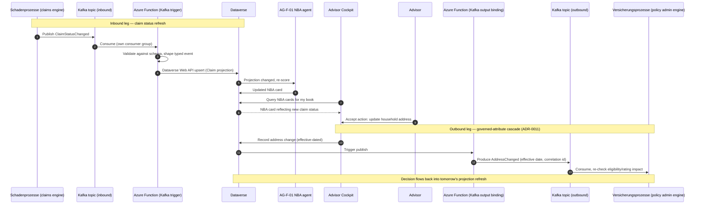

```mermaid
flowchart TD
    subgraph In["Inbound: core systems -> CRM"]
        SRC1[("Versicherungsprozesse /\nSchadenprozesse")]
        T1["Kafka topic\n(policy.updated / claim.status-changed)"]
        C1["Azure Function\nKafka trigger, own build"]
        P1[("Dataverse\nPolicy / Claim projection")]
    end
    subgraph Out["Outbound: CRM -> core systems"]
        E2["Governed-attribute change\n(e.g. address, effective-dated)"]
        C2["Azure Function\nKafka output binding, own build"]
        T2["Kafka topic\n(crm.address-changed)"]
        SRC2[("Versicherungsprozesse\nand other subscribers")]
    end

    SRC1 -- "produce" --> T1 --> C1 -- "validate + upsert" --> P1
    E2 -- "trigger" --> C2 -- "produce" --> T2 --> SRC2
```

**Note.** Even here, the inbound event never writes to Dataverse as free-text
model output — it always passes through a schema-validated upsert, and the
advisor's accept/edit/dismiss is the recorded decision
([ADR-0014](./ADR-0014-agents-advisory-by-design.md)).

### Option B — Confluent-managed connectors at the edge (low-code, asymmetric)

Use Confluent Cloud's **fully-managed connectors** to minimise custom Kafka
client code. The inbound and outbound legs necessarily use *different*
mechanisms, because no managed sink connector exists in the Kafka→Azure
direction (confirmed below) — this asymmetry is a fact of the current
connector catalogue, not a design choice.

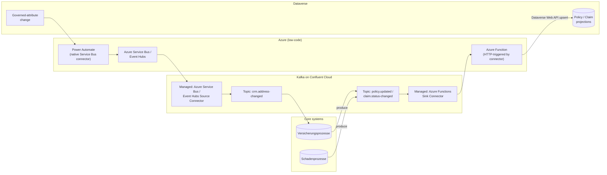

| Endpoint | Capability / service | Role |
| --- | --- | --- |
| Confluent Cloud — Azure Functions Sink Connector | Fully-managed connector | Inbound: batches Kafka records, HTTP-posts to a Function |
| Azure Function (HTTP-triggered) | Thin adapter | Validates + upserts the Dataverse projection |
| Power Automate | Native Dataverse + Service Bus connectors | Outbound: relay flow, no code |
| Azure Service Bus / Event Hubs | Native Azure messaging | Outbound relay target |
| Confluent Cloud — Azure Service Bus/Event Hubs Source Connector | Fully-managed connector | Outbound: relays Service Bus/Event Hub into Kafka |

- **Pros.** Least custom code on either leg. Confluent operates scaling,
  offsets and dead-lettering for the inbound leg (dedicated
  `success-<connector-id>` / `error-<connector-id>` topics). The outbound leg
  is pure low-code — Power Automate plus native connectors — matching
  [DESIGN-PRINCIPLES.md](../DESIGN-PRINCIPLES.md)'s config → low-code →
  pro-code preference.
- **Cons.** Genuinely two different mechanisms for the two directions, so
  there are two things to operate and monitor instead of one. **Confirmed:
  no Kafka→Azure Service Bus/Event Hubs sink connector exists** in Confluent
  Cloud's managed catalogue — the "no Kafka client code" property does not
  extend symmetrically to a hypothetical inbound-via-Service-Bus path.
  Confluent managed-connector task-hours are an additional cost on top of
  Azure compute. Function and Confluent cluster should be co-located by
  region to control latency and egress cost, per Confluent's own guidance.
- **Design pattern.** *Typed domain event* for the inbound leg; a
  relay-mediated variant for the outbound leg — Power Automate must stay a
  pure relay with **no business logic**, per
  [INTEGRATION.md](../INTEGRATION.md)'s non-negotiable, and that must be
  enforced in review.
- **Licence.** Native/low-code (Power Automate, Service Bus) + 🧩
  configuration (Confluent connectors, thin Function adapter).

#### Advisory Cockpit walk-through (Option B)

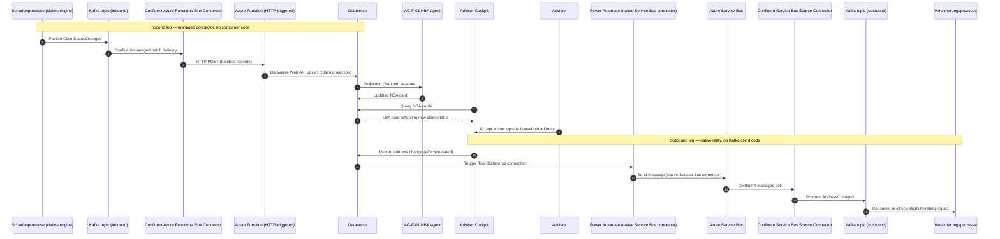

```mermaid
flowchart TD
    subgraph InB["Inbound: managed sink connector"]
        SRC1B[("Versicherungsprozesse /\nSchadenprozesse")]
        T1B["Kafka topic"]
        SINKB2["Confluent Azure Functions\nSink Connector, managed"]
        FB["Azure Function\nHTTP-triggered"]
        PB[("Dataverse projection")]
    end
    subgraph OutB["Outbound: native relay, no Kafka client code"]
        EB["Governed-attribute change"]
        PAB2["Power Automate\nnative Service Bus connector"]
        SBB["Azure Service Bus"]
        SRCB2["Confluent Service Bus\nSource Connector, managed"]
        TB["Kafka topic"]
        DESTB[("Versicherungsprozesse")]
    end

    SRC1B --> T1B --> SINKB2 --> FB --> PB
    EB --> PAB2 --> SBB --> SRCB2 --> TB --> DESTB
```

### Option C — Dedicated integration microservice (own build, containerized)

A dedicated Kafka-native service (e.g. a .NET or Java client using
Confluent's client libraries) running on **Azure Container Apps or AKS**,
fronting both directions with full Confluent **Schema Registry**
(Avro/Protobuf) enforcement and a transactional outbox for outbound delivery
guarantees. This escapes Azure Functions' consumption-plan constraints
entirely, at the cost of owning a running service.

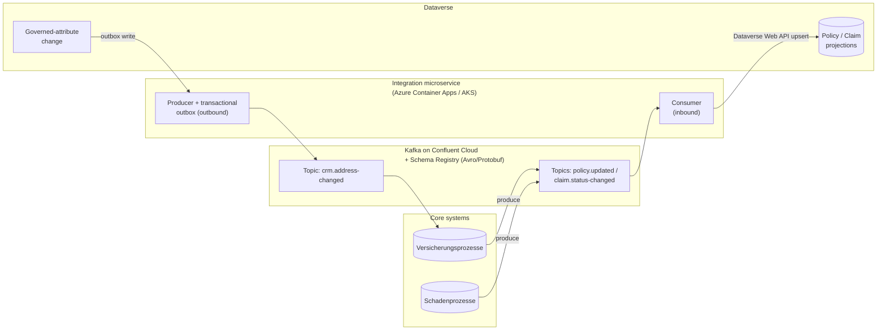

| Endpoint | Capability / service | Role |
| --- | --- | --- |
| Confluent Cloud Kafka topics + Schema Registry | Avro/Protobuf-governed topics | Event backbone with enforced schema evolution |
| Integration microservice (Container Apps / AKS) | Custom Kafka client | Consumer (inbound) + producer with transactional outbox (outbound) |
| Dataverse Web API | Create/Update | Writes the CRM-side projection |
| Azure Key Vault / Managed Identity | Secret store / Azure-side auth | Confluent auth still secret-based; Azure-side calls (e.g. Dataverse app registration) can use Managed Identity |

- **Pros.** Most control of the four options — handles high volume and
  complex/nested schemas via Schema Registry, custom batching, and
  exactly-once-ish semantics via the outbox pattern. Escapes Azure
  Functions' consumption-plan limits. A single, consistent technology stack
  for both directions (unlike Option B's two mechanisms).
- **Cons.** Highest operational burden of the four options — a service to
  build, scale, patch and monitor. Requires Kafka/Confluent expertise on the
  team, a genuine skills investment. Most infrastructure to own (compute
  environment, networking, observability) — the heaviest Operational
  Excellence cost among the options.
- **Design pattern.** *Typed domain event*, implemented with
  Schema-Registry-enforced contracts and an explicit outbox pattern for
  outbound delivery guarantees.
- **Licence.** 🧩 configuration / own build (heaviest custom-build option of
  the four).

#### Advisory Cockpit walk-through (Option C)

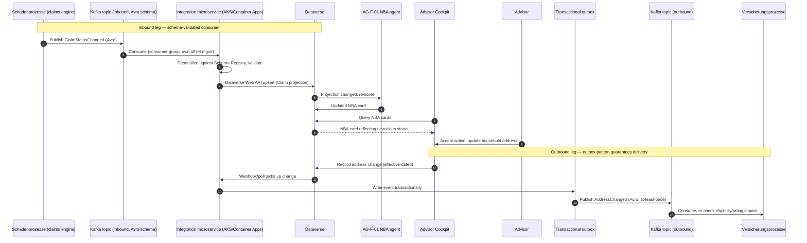

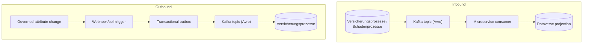

### Option D — Native Dataverse push, no Power Automate hop (outbound-focused)

Two real, no-custom-code or low-code mechanisms exist **at the Dataverse
platform level itself**, verified against Microsoft Learn:

- **D1 — WebHook registration.** Register a WebHook endpoint plus a plugin
  step on the governed message (Plug-in Registration tool). Dataverse
  automatically POSTs the serialized execution context (JSON) directly to an
  HTTPS endpoint — e.g. a thin Azure Function that reshapes it into the
  typed `AddressChanged` contract and produces to Kafka. No Power Automate,
  no custom plugin assembly.
- **D2 — Azure-aware Service Bus/Event Hub integration.** A long-standing
  OOB Dataverse feature: register a Service Endpoint (Queue, Topic, One-way,
  Two-way, REST or Event Hub, SAS-based) and the out-of-box Azure-aware
  plugin step. Dataverse posts the execution context straight to Service
  Bus/Event Hub with **zero custom code**. Confluent's managed Service
  Bus/Event Hubs Source Connector then relays it into Kafka — the same relay
  technology as Option B's outbound leg, minus the Power Automate hop.

**This option only solves the outbound direction.** Dataverse has no
symmetric "subscribe to an external Kafka topic" capability, so the inbound
leg (core systems → CRM) always still needs Option A, B or C. Option D is a
complement, never a full answer on its own.

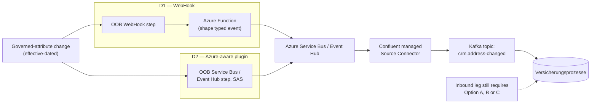

| Endpoint | Capability / service | Role |
| --- | --- | --- |
| Dataverse — WebHook registration (D1) | OOB platform feature, Plug-in Registration tool | Outbound: pushes execution context to an HTTPS endpoint, no custom plugin code |
| Dataverse — Azure-aware plugin (D2) | OOB platform feature, Service Bus/Event Hub Service Endpoint (SAS) | Outbound: pushes execution context straight to Service Bus/Event Hub, zero custom code |
| Azure Function (D1 only) | Thin shaping adapter | Reshapes raw execution context into the typed `AddressChanged` contract |
| Confluent Cloud — Service Bus/Event Hubs Source Connector | Fully-managed connector | Relays into Kafka, same as Option B's outbound relay |

- **Pros.** Removes Power Automate as an operational hop/cost for the
  outbound leg. D2 needs **zero custom code** at all — pure configuration.
  Dataverse's own asynchronous service handles retry/backoff natively
  (documented exponential-backoff retry until the system job is marked
  Failed), with **System Jobs** visibility for operational monitoring.
- **Cons.** **Outbound-only** — always a complement to Option A, B or C, never
  a full answer by itself. The raw execution context is not yet the typed,
  versioned event contract in [api/README.md](../../api/README.md); D1 still
  needs a shaping Function, so it removes Power Automate specifically, not
  all custom compute. SAS-key (D2) and WebHook (D1) authentication are both
  legacy, pre-Entra-ID patterns — a Zero Trust trade-off to flag explicitly.
  **Documented 192 KB payload truncation ceiling** on the Service Bus/Event
  Hub path silently drops `PreEntityImages`/`PostEntityImages` beyond that
  size — a correctness risk for large household/portfolio payloads that
  must be tested against the golden thread's actual record size.
- **Design pattern.** *Typed domain event* — but the "typed" shaping happens
  downstream of the native Dataverse push (D1) or must be enforced by the
  receiving side (D2), not inside Dataverse itself.
- **Licence.** Native/configuration (Dataverse OOB features) + 🧩
  configuration (Confluent connector, optional shaping Function for D1).

#### Advisory Cockpit walk-through (Option D)

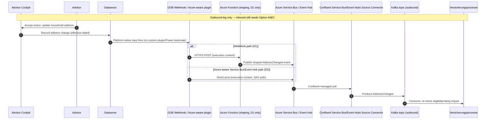

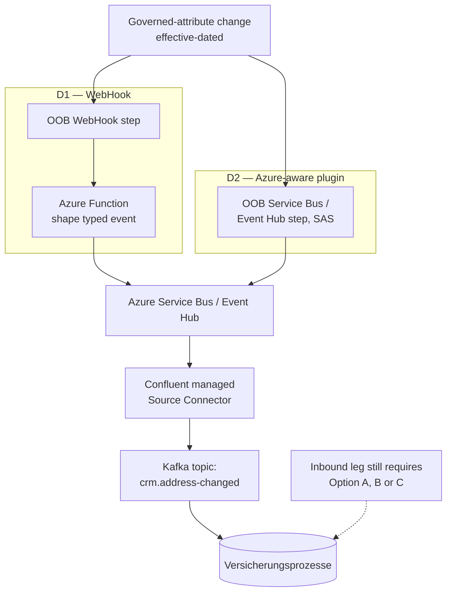

## Comparison

| Criterion | Option A — Direct (Functions) | Option B — Managed connectors | Option C — Dedicated microservice | Option D — Native Dataverse push |
| --- | --- | --- | --- | --- |
| Direction(s) covered | Both, symmetric | Both, asymmetric mechanisms | Both, symmetric | Outbound only — pairs with A/B/C |
| Custom code burden | Medium — Function code both legs | Low — thin adapter + low-code flow | High — full service to build/run | Low–Medium — D2 zero code, D1 needs shaping Function |
| Operational ownership | Team owns Function + Kafka client reliability | Confluent + Power Platform share ownership; team owns thin adapter | Team owns full service lifecycle | Dataverse platform + team (Function for D1 only) |
| Latency | Lowest | Low–Medium — extra connector/relay hop | Low, tunable | Medium — extra Service Bus/Event Hub hop |
| Zero Trust / auth model | Secret-based to Confluent, no MI; Key Vault rotation | Secret-based to Confluent; native connectors for Azure legs | Secret-based to Confluent; MI usable for Azure-side calls | SAS/WebHook key — legacy, pre-Entra ID |
| Schema/contract enforcement | In Function code, against `api/events/*.schema.json` | In thin Function (inbound); Power Automate is a dumb relay (outbound) | Enforced via Confluent Schema Registry (Avro/Protobuf) | Downstream of the native push — must be enforced elsewhere |
| Cost driver | Azure Functions compute | Confluent managed-connector task-hours + Azure compute | Container Apps/AKS compute + ops headcount | Azure Service Bus/Event Hub + Confluent connector |
| Reversibility | High — stateless Functions, easy to replace | High — connectors can be swapped/removed | Medium — more infra to unwind | High — OOB features, easy to disable |
| Design pattern fit (INTEGRATION.md) | Typed domain event, literal | Typed domain event + relay variant | Typed domain event + outbox | Typed domain event, shaping deferred |
| Licence | 🧩 own build | Native/low-code + 🧩 configuration | 🧩 own build, heaviest | Native (D2) / 🧩 configuration (D1) |

## Decision or working hypothesis

**No option is selected, and no lean is stated.** All four are credible,
verified patterns; the trade-offs above are presented for the Enterprise
Architect and the customer's IT/architecture stakeholders to weigh together —
including whether Option D should be **combined** with one of Options A, B
or C, since Option D alone only ever covers the outbound leg.

## Evidence and assumptions

- **Known (verified).** Azure Functions' Kafka trigger/output binding is
  documented as Confluent Cloud-compatible. Confluent Cloud offers a
  fully-managed Azure Functions Sink Connector (inbound) and Azure Event
  Hubs/Service Bus Source Connectors (outbound relay only — **no symmetric
  sink connector exists**, confirmed against the current connector
  catalogue). Confluent Cloud authentication is secret/connection-string
  only; Managed Identity is not supported (Azure Service Connector
  documentation). Dataverse's WebHook registration and Azure-aware Service
  Bus/Event Hub plugin integration are long-standing OOB features requiring
  no custom plugin code, with a documented 192 KB payload truncation limit
  and exponential-backoff retry via the asynchronous service.
- **Inferred, not yet confirmed.** The customer's actual Confluent Cloud
  topic/schema design (naming, Schema Registry usage, partitioning
  strategy). Whether "Versicherungsprozesse system" and "Schadenprozesse
  system" are the customer's literal system names or illustrative
  placeholders — treated the same way ADR-0019's Siebel specifics were
  flagged. Actual event volume/burst profile, needed to size Option A's
  Functions plan against Option C's dedicated compute.
- **Evidence still required.** The customer's actual Confluent Cloud region
  and network posture (VNet peering, Private Link) and whether Azure
  Functions/Container Apps can reach it without public egress. Whether the
  customer already operates Azure Container Apps/AKS (relevant to Option C's
  cost case). The topic/ACL/schema governance model — who administers
  Confluent Cloud topics today, and whether that is the same team as
  `AG-E-09` Integration Engineer's scope.

## Validation and review triggers

Reopen this ADR when: the customer's actual Confluent Cloud topic/schema
design and network posture are confirmed; a pilot of any option is run
against real Versicherungsprozesse/Schadenprozesse event volumes; Confluent
ships a native Kafka→Event Hubs/Service Bus sink connector (would change
Option B's and Option D's outbound-relay trade-off); Confluent Cloud adds
Managed Identity/Entra ID authentication support (would materially improve
the Zero Trust posture of all four options); or the customer confirms
whether "Versicherungsprozesse"/"Schadenprozesse" are literal system names.
Decision owner: `AG-E-03` Enterprise Architect (accountable), with
`AG-E-09` Integration Engineer, `AG-E-04` SecDevOps, and the customer's
IT/Architect stakeholder as required reviewers.

## Consequences

- **At the next release.** No implementation ships from this ADR alone — it
  is evaluation only, pending stakeholder discussion.
- **Operationally.** Once an option (or combination — e.g. Option D for the
  outbound leg plus Option A, B or C for the inbound leg) is chosen, record
  it in [INTEGRATION.md](../INTEGRATION.md)'s "Policy administration engine"
  and "Claims engine" rows (currently `[TBD]`) and close
  [ADR-0011](./ADR-0011-event-driven-cascade.md)'s open item on which
  bus/middleware carries the events.
- **Contract governance.** New event contracts (`PolicyUpdated`,
  `ClaimStatusChanged`) join `AddressChanged` in
  [api/README.md](../../api/README.md)'s planned-contracts table, subject to
  the same contract-first, versioned, ADR-gated breaking-change rule as
  every other domain event.
- **For the customer's teams (shared responsibility).** Confluent Cloud
  topic/ACL/schema ownership becomes a new RACI line in
  [SHARED-RESPONSIBILITY.md](../SHARED-RESPONSIBILITY.md) — A9 — alongside
  the Fabric capacity question already raised in
  [ADR-0024](./ADR-0024-dataverse-to-databricks-integration-pattern.md).
- **Reversibility.** High for Options A, B and D — stateless or additive,
  no Dataverse schema change. Medium for Option C — more infrastructure to
  unwind once operational.

## Competitive note

Most competing CRM stacks either bundle a proprietary integration bus or
require a bespoke point-to-point connector to reach a Kafka-based landscape.
Demonstrating four credible, Microsoft- (or Microsoft+Confluent-) native
patterns — including two that need zero or near-zero custom Kafka client
code (Options B and D) — shows that the CRM's event-driven cascade
([ADR-0011](./ADR-0011-event-driven-cascade.md)) can plug into an
already-owned Kafka estate without asking the customer to re-architect their
event backbone around the CRM vendor's preferred bus.
