# ADR-0026 — Identity and Access Management: Entra ID to Power Platform & Dynamics 365 Security Roles

| Field | Value |
| --- | --- |
| **Status** | Proposed hypothesis |
| **Date** | 2026-08-14 |
| **Decision mode** | Working hypothesis — **no option selected, no lean stated**; fully open for Enterprise Architect + customer IT/architecture stakeholder review |
| **Confidence** | Low–Medium — research-grounded (Microsoft Learn), not yet validated against the customer's actual Entra ID tenant, group taxonomy, or Entra ID Governance licence tier |
| **Deciders** | `AG-E-04` SecDevOps (accountable) · `AG-E-03` Enterprise Architect · `AG-E-06` Responsible-AI & Compliance Officer (Conditional Access / PIM policy sign-off) · customer IT/Architect (`P-06`) |
| **Topic area** | A2 — Data model, 360° view (row-level security over Account/Household) · A8 — Operations, ALM (ongoing provisioning/deprovisioning) · A9 — Shared responsibility (who administers Entra groups vs. Dataverse Security Roles) |
| **Use case** | Illustrated with **AG-F-01 Next-Best-Action Agent** (Advisory Cockpit) walk-throughs below each option — who can see and act on an NBA card, and how that visibility follows GA territory ([ADR-0013](./ADR-0013-ga-ownership-and-territory.md)) |
| **Licence** | `[TBD]` — varies by option; see below. Option C additionally depends on **Microsoft Entra ID Governance (P2)** licensing for PIM for Groups — customer's actual Entra licence tier is unconfirmed |
| **Upgrade impact** | Medium — no Dataverse schema change, but every option adds identity-plane automation or configuration that must be maintained and re-validated whenever a new persona, GA, or environment is added |
| **CAF methodology** | Secure · Govern — establishing the identity/access control plane before it is operationalised |
| **WAF pillar(s)** | Primary: Security. Trade-off against: Operational Excellence (automation to build/run) and Cost Optimization (Entra ID Governance licensing) |
| **Zero Trust** | This ADR *is* the "verify explicitly, least privilege" chapter for human users, complementing [ADR-0002](./ADR-0002-oidc-federation-for-github-actions-to-entra.md)'s service-identity pattern — every option is compared against verify-explicitly (Conditional Access), least-privilege (Business Unit + Security Role scoping) and assume-breach (time-bound elevation, access reviews) |
| **Responsible AI** | The identity/access model determines **who can see and act on** an AG-F-01 NBA card — but never who is accountable for the customer-facing decision. That remains the named advisor regardless of which option is chosen ([ADR-0014](./ADR-0014-agents-advisory-by-design.md)) |

> **Illustrative naming note.** Entra ID group names (`GA-Bern-Advisors`,
> `GA-Zurich-Advisors`, …) and the assumption of **one Entra Security Group per
> GA** are illustrative, following the same convention as ADR-0013's GA
> territory model. The customer's actual Entra ID group taxonomy, naming
> convention, and whether groups are already organised by GA are unconfirmed —
> flagged the same way ADR-0019's Siebel specifics and ADR-0025's
> Versicherungsprozesse/Schadenprozesse names were flagged.

## Context

[SECURITY.md](../SECURITY.md) lists **"Identity & access model (incl. GA
scoping)"** as an open `[TBD]` in its "To complete" table. The showcase
already has a working **service identity** pattern — [ADR-0002](./ADR-0002-oidc-federation-for-github-actions-to-entra.md)
(OIDC federation for CI), [ADR-0004](./ADR-0004-ci-plane-app-registrations-and-github-environments.md)
(app registrations + GitHub Environments), and [ADR-0005](./ADR-0005-power-platform-application-users-for-ci.md)
(Dataverse application users for CI service principals) — but none of these
cover **human** identity: how an advisor's, assistance agent's, marketer's,
broker manager's, IT architect's, or business owner's/data steward's Entra ID
account (`P-01`, `P-03`, `P-04`, `P-05`, `P-06`, `P-07`) becomes a Dataverse
Security Role with the right Business Unit scoping.

This matters concretely because of [ADR-0013](./ADR-0013-ga-ownership-and-territory.md):
Contoso Insurance runs roughly **80 independent General Agents (GAs)**, each
owning a local book of households. ADR-0013 decided that GA ownership is a
governed, dated relationship on the Account — but left **"the authoritative
source of territory assignment"** as `[TBD]`. This ADR does not answer *who
decides* a GA reassignment (that stays ADR-0013's open item), but it does
answer the adjacent, previously unaddressed question: **once territory is
decided, how does an Entra ID identity's access follow it** — technically,
auditably, and without manual per-user administration for 80 GAs' worth of
advisors.

Scope, as agreed with the user:

- **In scope.** Internal-facing identities only — the six personas
  (`P-01`, `P-03`, `P-04`, `P-05`, `P-06`, `P-07`), all authenticated as Entra
  ID **members** of the demo tenant.
- **Out of scope, deliberately.** External-facing identities — a future
  customer or broker self-service portal (Power Pages, Entra External ID, or
  Entra B2B guest access) would need a genuinely different design (different
  trust boundary, different licensing, likely a public-facing Conditional
  Access posture). That is left for a **separate, future ADR**.
- **Validating use case.** **AG-F-01 Next-Best-Action Agent** (Advisory
  Cockpit) — illustrated below for each option: which advisor sees which
  household's NBA cards, and what happens when GA territory changes or when
  an elevated (System Administrator/Customizer) role is needed.

This ADR does **not** pick an option. It documents four credible,
Microsoft-documented patterns — verified against Microsoft Learn, not
invented — so the Enterprise Architect and the customer's IT stakeholders can
choose with the trade-offs in front of them, exactly as
[ADR-0024](./ADR-0024-dataverse-to-databricks-integration-pattern.md) and
[ADR-0025](./ADR-0025-crm-core-systems-kafka-confluent-integration-pattern.md)
did before it.

## Options

All four options resolve the same underlying question — **how does an Entra
ID identity end up with a Dataverse Security Role scoped to the right
Business Unit** — but differ in how much is native configuration versus
custom automation, and in how they handle the two access patterns the
personas actually need: **stable, GA-scoped access** (most advisors) and
**cross-GA or time-bound elevated access** (broker managers, IT/architects).

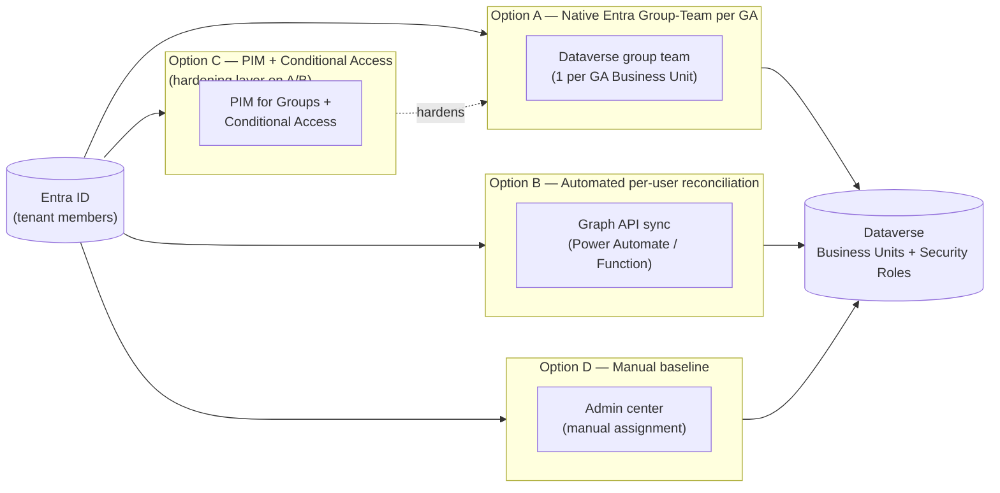

### Option A — Native Entra Group-Team per GA Business Unit (config-only)

One **Entra Security Group per GA** (e.g. `GA-Bern-Advisors`) backs one
Dataverse **group team**, scoped to that GA's Business Unit, with a Security
Role (e.g. "Advisor") assigned to the team. This is a documented, native
Dataverse feature (Power Platform admin center → Environment → **Teams** →
**Create team** → Team type "Microsoft Entra Security group"). Group
membership is evaluated **dynamically at sign-in** — no import, no
provisioning step for the user beyond adding them to the Entra group.

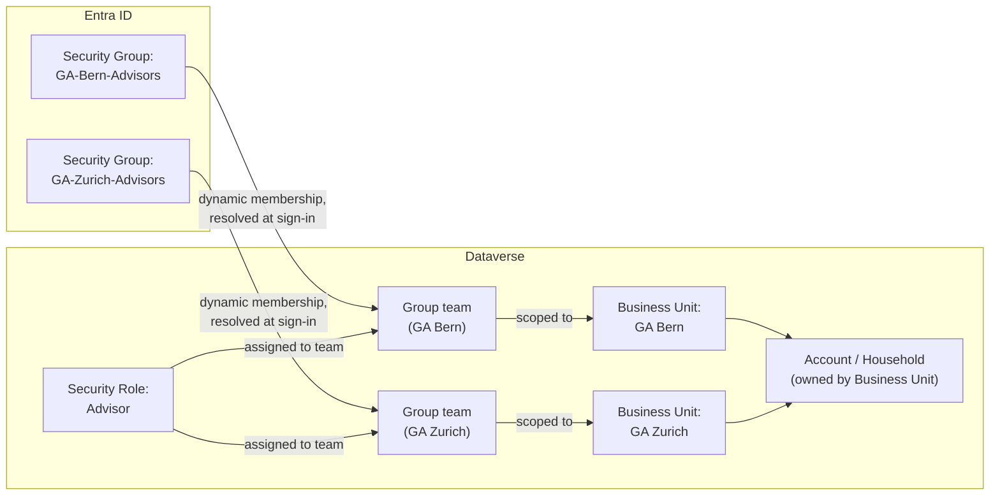

| Endpoint | Capability / service | Role |
| --- | --- | --- |
| Entra ID Security Groups | One per GA (Assigned or Dynamic User membership type; Dynamic Device unsupported) | Source of GA-scoped membership |
| Dataverse group team | Team type "Microsoft Entra Security group", one per GA Business Unit | Row-level scoping anchor |
| Dataverse Business Unit | One per GA, aligned to [ADR-0013](./ADR-0013-ga-ownership-and-territory.md)'s territory model | Owns the Account/Household records |
| Dataverse Security Role | Assigned to the group team (e.g. "Advisor"), optionally with **member's privilege inheritance** so members don't also need an individual role | Functional privilege grant |
| Power Platform admin center | Teams settings UI (or scripted bootstrap, see Cons) | Provisioning surface |

- **Pros.** Zero custom code — this is a documented, native Dataverse
  feature. Provisioning/deprovisioning is **dynamic**: adding or removing a
  user from the Entra group is the entire lifecycle action; Dataverse never
  needs a separate onboarding step. Directly gives ADR-0013's open territory
  question a technical mechanism — Entra group membership becomes the
  system of record for "which GA can this advisor see," fully auditable via
  the group team's membership and the `systemuserroles_association` table.
- **Cons.** The model is **one team per Business Unit**: a user who
  legitimately needs access across more than one GA (a Broker Manager
  covering three GAs, or an advisor temporarily covering for a colleague)
  must be added to multiple Entra groups — workable, but requires disciplined
  naming and does not compose cleanly for centrally-scoped personas
  (Marketer, Business owner/Data steward) who need cross-BU access by
  design, not by exception. Group-membership changes are **cached for up to
  8 hours** of continuous sign-in — access changes are not instantaneous.
  Bootstrapping ~80 GA teams by hand does not scale; this needs the same
  kind of committed, idempotent script [ADR-0005](./ADR-0005-power-platform-application-users-for-ci.md)
  used for CI application users. Does not by itself provide time-bound
  elevation for privileged roles (System Administrator/Customizer) — a
  group team's role applies uniformly and permanently to every member.
- **Design pattern.** Declarative, group-driven access — the
  configuration-over-code end of [DESIGN-PRINCIPLES.md](../DESIGN-PRINCIPLES.md)'s
  config → low-code → pro-code preference.
- **Licence.** Native / 🧩 configuration (Power Platform admin center); the
  80-team bootstrap should be scripted/IaC-managed, not clicked by hand.

#### Advisory Cockpit walk-through (Option A)

Concrete use case: an advisor at GA Bern signs in and expects to see only
their own book's **AG-F-01** NBA cards; a household then moves to GA Zurich's
territory (an ADR-0013 governed reassignment), and visibility must follow.

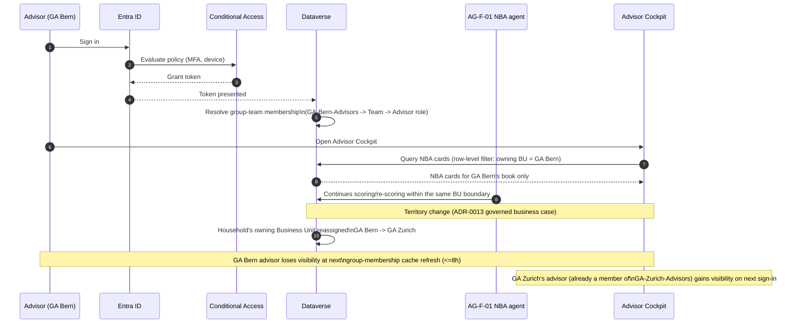

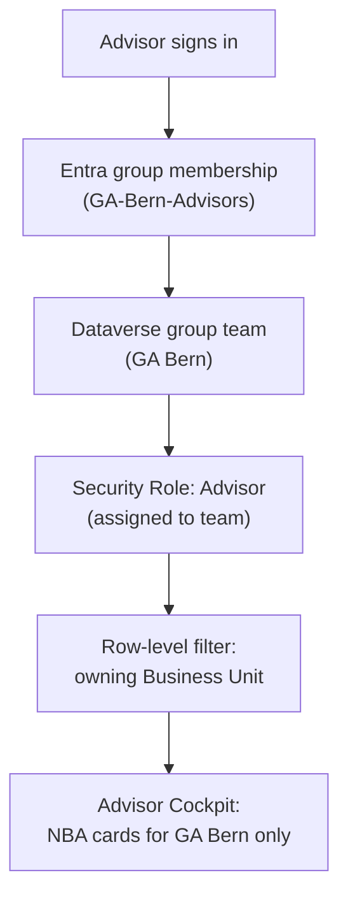

**Note.** The advisor's accept/edit/dismiss on any NBA card remains the
recorded decision regardless of how access was granted
([ADR-0014](./ADR-0014-agents-advisory-by-design.md)) — this option only
changes **who can reach the cockpit for which households**, not the
advisory-by-design guardrail itself.

### Option B — Automated per-user reconciliation (custom sync)

A Graph API-driven reconciliation job (Power Automate or an Azure Function,
triggered on Entra group/attribute change notifications) computes each
user's target Business Unit(s) and Security Role(s), then calls the
Dataverse Web API to set `systemuser.businessunitid` and manage
`systemuserroles_association` directly. Unlike Option A's one-team-per-BU
model, this supports **many-to-many** combinations — a single user with
roles/access spanning multiple GAs or a mix of functional roles.

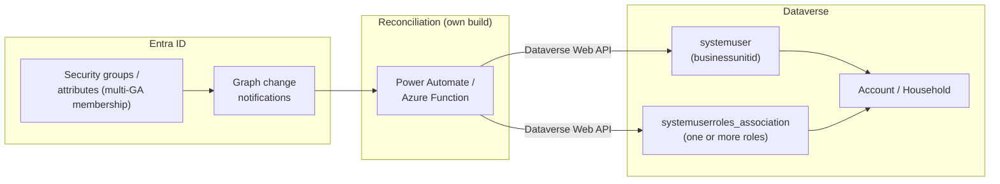

| Endpoint | Capability / service | Role |
| --- | --- | --- |
| Microsoft Graph — `changeNotifications` | Subscribes to group membership changes | Trigger for reconciliation |
| Power Automate / Azure Function | Own-build reconciliation logic | Computes target BU(s) + role(s), calls Dataverse |
| Dataverse Web API — `systemusers` | `businessunitid` field | Sets the user's primary Business Unit |
| Dataverse Web API — `systemuserroles_association` | `$ref`/`$deref` associations | Assigns one or more Security Roles |
| Azure Key Vault | Secret store | Service credential for the reconciliation job |

- **Pros.** The only option that cleanly handles a persona whose access
  doesn't fit one Business Unit — a Broker Manager (`P-05`) covering several
  GAs, a Marketer (`P-04`) or Business owner/Data steward (`P-07`) needing
  central, cross-BU access by design (per [ADR-0013](./ADR-0013-ga-ownership-and-territory.md)'s
  "central templates, local content" split). Change notifications can react
  faster than Option A's up-to-8-hour cache. Generalises the pattern ADR-0005
  already used for CI service principals to human users.
- **Cons.** Real custom code to build, run, and monitor — retries,
  idempotency, and drift detection (if the job fails silently, a leaver's
  access is not revoked) are the team's responsibility, the same caveat
  ADR-0005 flagged for its narrower CI-only case. A second identity-plane
  moving part alongside Option A/D's native mechanisms. Requires its own
  reliability engineering and alerting to avoid privilege drift.
- **Design pattern.** Reconciliation/sync — the same shape as
  [ADR-0005](./ADR-0005-power-platform-application-users-for-ci.md)'s
  `add-ci-app-users.ps1`, generalised from CI service principals to human
  users and made continuously/event-driven rather than run-once.
- **Licence.** 🧩 own build (reconciliation service/flow + monitoring).

#### Advisory Cockpit walk-through (Option B)

Concrete use case: a Broker Manager (`P-05`) oversees broker-mediated
households across GA Bern, GA Zurich, and GA Basel — a shape Option A's
one-team-per-BU model can only approximate by joining three separate group
teams by hand.

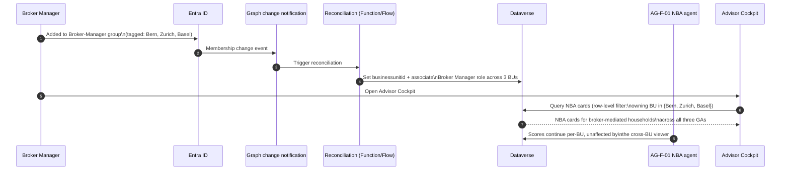

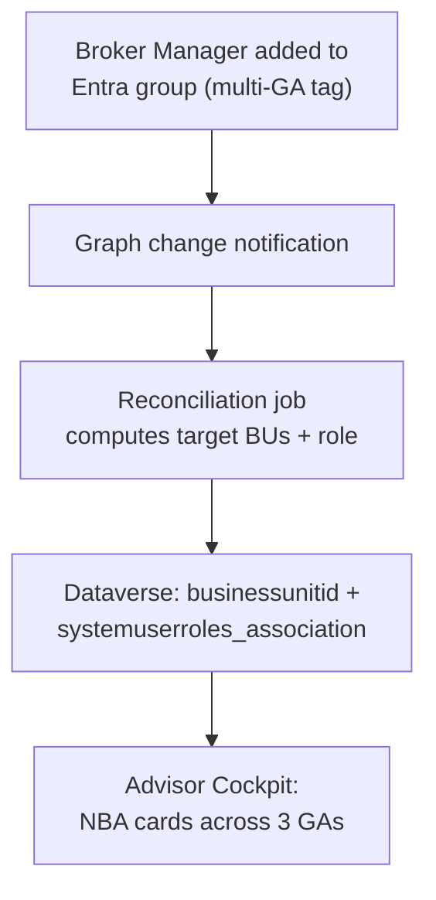

### Option C — PIM for Groups + Conditional Access (Zero-Trust hardening layer)

Not a replacement for A or B, but a layer on top of either: **Entra PIM for
Groups** makes membership of privileged groups (e.g. the group backing a
"System Administrator" Dataverse team) **eligible** rather than standing —
activation requires justification, optional approval, and is time-bound.
**Conditional Access** policies scoped to the Dynamics 365/Power Platform
cloud app enforce MFA, device compliance, and (optionally) named-location
restrictions on every sign-in, with a stricter policy for privileged-group
activation.

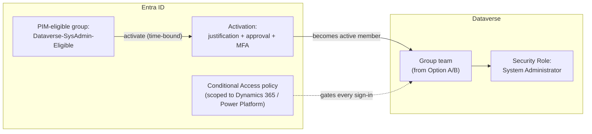

| Endpoint | Capability / service | Role |
| --- | --- | --- |
| Entra PIM for Groups | Eligible/active membership + activation policy (approval, MFA, justification, max duration) | Just-in-time elevation |
| Entra Conditional Access | Cloud app condition scoped to Dynamics 365 CE / Power Platform | Verify-explicitly gate on every sign-in |
| Entra ID Governance — Access reviews | Recurring (e.g. quarterly) attestation | Periodic re-certification of standing access |
| Dataverse group team (from Option A/B) | Receives the now-active PIM membership | Row-level + role scoping, unchanged |

- **Pros.** Standing privilege is minimised — System Administrator/Customizer
  access exists only when actively needed and is fully audited (who
  activated, when, why, approved by whom). "Verify explicitly" is enforced
  at every sign-in, not only for privileged roles. Recurring access reviews
  give a concrete, demonstrable answer to the compliance/regulatory
  attestation question the next ADR (Purview) will need. Directly matches
  [SECURITY.md](../SECURITY.md)'s Zero Trust framing and closes its
  "Identity & access model" `[TBD]`.
- **Cons.** **Licence-gated** — PIM for Groups requires **Microsoft Entra ID
  Governance (P2)**; the customer's actual Entra licence tier is
  unconfirmed, flagged `[TBD]`, not assumed. Approval workflows add latency
  for legitimate access — a break-glass exception must be defined for
  incidents. Conditional Access misconfiguration is a real lockout risk;
  needs a report-only rollout phase before enforcement. This option does
  **not** solve the multi-BU access problem on its own — it must be paired
  with Option A or B for the underlying territory model.
- **Design pattern.** Defense-in-depth / verify-explicitly, layered onto
  whichever base access model (A or B) is chosen — not a standalone
  provisioning mechanism.
- **Licence.** Native / configuration (Entra admin center) but **licence
  cost-gated**: Entra ID Governance P2 required for PIM for Groups.

#### Advisory Cockpit walk-through (Option C)

Concrete use case: an anomaly in **AG-F-01**'s NBA scoring needs an
IT/Architect (`P-06`) to get temporary System Administrator access to
investigate the Advisory Cockpit's underlying configuration.

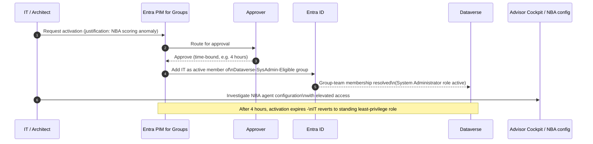

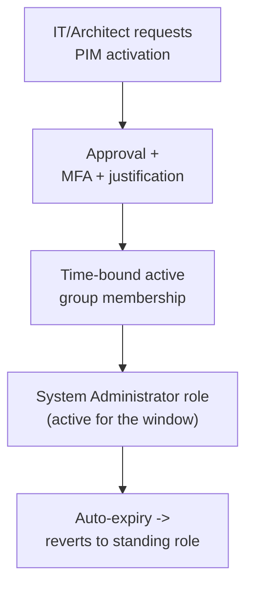

### Option D — Manual baseline (individual assignment, no automation)

The admin manually sets each `systemuser`'s Business Unit and Security Role
via the Power Platform admin center or Dataverse UI. New Entra ID users are
created under the **root Business Unit** on first sign-in by default and
must be moved and role-assigned by hand. No Entra group linkage exists at
all.

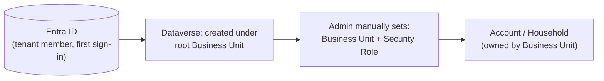

| Endpoint | Capability / service | Role |
| --- | --- | --- |
| Power Platform admin center — Users + permissions | Manual UI | Business Unit reassignment |
| Dataverse `systemuser` / `systemuserroles_association` | Manual edits | Security Role assignment |

- **Pros.** Zero build effort, zero new infrastructure, zero Entra group
  hygiene prerequisite — works today, for a small pilot or demo scale, with
  nothing to design or maintain beyond the UI itself.
- **Cons.** Does not scale to ~80 GAs / hundreds of advisors — every
  onboarding, offboarding, and GA reassignment is a manual step, slow and
  error-prone. A leaver's access is revoked only if someone remembers to do
  it — the weakest audit trail of the four options and no automatic drift
  detection. An ADR-0013 territory reassignment requires a manual Security
  Role/BU edit each time, with no technical link back to the governed
  business-case record. This is precisely the gap
  [SECURITY.md](../SECURITY.md)'s "To complete" table flags as `[TBD]`.
- **Design pattern.** None — an explicit non-pattern, included as the
  honest baseline for comparison, the same way ADR-0006 documented a
  rejected baseline option.
- **Licence.** Native (Power Platform admin center, no build) — but
  operationally the most expensive option over time.

#### Advisory Cockpit walk-through (Option D)

Concrete use case: a new advisor joins GA Bern; contrast their onboarding
lag against Option A's near-real-time group-membership model.

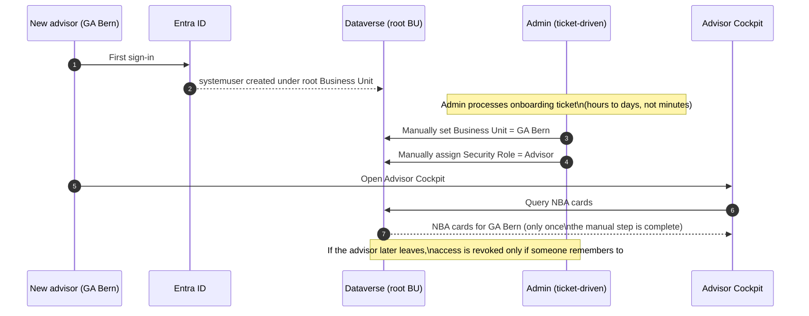

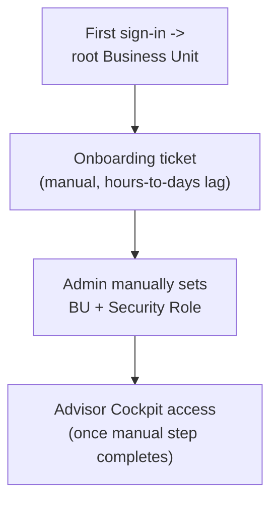

## Comparison

| Criterion | Option A — Native Group-Team | Option B — Automated reconciliation | Option C — PIM + Conditional Access | Option D — Manual baseline |
| --- | --- | --- | --- | --- |
| Handles single-GA advisors | Yes, cleanly | Yes, but more machinery than needed | Adds hardening on top of A/B | Yes, but manual per user |
| Handles cross-BU / multi-GA personas | Only via multiple group memberships | Yes, cleanly — its core strength | N/A — inherits from A/B | Yes, but manual per user |
| Handles privileged/time-bound access | No | No | Yes — its core strength | No, standing access only |
| Custom code burden | None | Medium–High — reconciliation service | Low — Entra configuration | None |
| Latency of access change | Up to 8h (group-membership cache) | Faster — event-driven, but adds a hop | Minutes (activation) once base model resolves | Hours–days (ticket-driven) |
| Audit trail | Group + team membership, native | Custom job's own logging | PIM activation log + access reviews | Weakest — manual, easy to miss |
| Licence cost driver | None beyond existing Entra/Dataverse | Azure Function/Power Automate compute | Entra ID Governance P2 (`[TBD]` confirm tier) | None, but heaviest ops cost |
| Scales to ~80 GAs | Yes, with a scripted bootstrap | Yes | N/A — layer, not a base model | No |
| Resolves ADR-0013's access-follows-territory need | Yes, directly | Yes, more flexibly | N/A — layer, not a base model | No |
| Reversibility | High — native feature, easy to unwind | Medium — custom service to decommission | High — Entra policy, easy to disable | High — nothing to unwind |
| Design pattern fit | Declarative, group-driven | Reconciliation/sync (ADR-0005 shape) | Defense-in-depth, layered | None — explicit baseline |

## Decision or working hypothesis

**No option is selected, and no lean is stated.** All four are credible,
documented patterns; the trade-offs above are presented for the Enterprise
Architect and the customer's IT/architecture stakeholders to weigh together
— including whether Option C should be **combined** with Option A, B, or
both (Option A for the ~80 stable GA teams, Option B for the personas whose
access genuinely spans Business Units, Option C layered over both for
privileged roles), since Option C alone is not a complete access model.

## Evidence and assumptions

- **Known (verified).** Dataverse "group teams" backed by an Entra Security
  or Microsoft 365 group are a documented, native feature (Power Platform
  admin center → Environment → Teams), including the **8-hour continuous
  sign-in cache** on group-membership resolution and the **"member's
  privilege inheritance"** security-role property (Microsoft Learn, "Manage
  group teams"). Microsoft Entra **PIM for Groups** genuinely supports
  just-in-time, approval-gated, time-bound activation of group
  membership/ownership for any group-gated resource, including
  third-party/custom applications (Microsoft Entra ID Governance
  documentation) — applying it to the Entra group backing a Dataverse group
  team is an application of this general mechanism, not a
  Dataverse-specific documented feature, and is presented as such. Microsoft
  Entra **Conditional Access** supports scoping a policy's cloud-app
  condition to Dynamics 365/customer engagement apps (Microsoft Learn,
  "Block access by location with Microsoft Entra Conditional Access").
- **Inferred, not yet confirmed.** Whether the customer's Entra ID tenant
  already organises groups by GA, or whether that taxonomy would need to be
  built from scratch. The customer's actual Entra ID Governance licence
  tier (P1 vs. P2) — PIM for Groups requires P2, and this is not assumed.
  Whether the ~80 GAs map 1:1 to Business Units today or whether a
  different hierarchy (e.g. regional groupings) already exists.
- **Evidence still required.** The customer's current identity-governance
  maturity (do they already run PIM for Microsoft Entra roles or Azure
  resources today, which would lower the adoption cost of Option C's PIM
  for Groups). Who administers Entra ID groups today versus who
  administers Dataverse Security Roles — this is the exact RACI question
  [SHARED-RESPONSIBILITY.md](../SHARED-RESPONSIBILITY.md) leaves open for
  "Pipelines & environments" and should be extended to identity
  administration.

## Validation and review triggers

Reopen this ADR when: the customer's actual Entra ID group taxonomy and
Entra ID Governance licence tier are confirmed; ADR-0013's "authoritative
source of territory assignment" question is resolved (it determines which
system triggers the Business Unit reassignment this ADR's options react
to); a pilot of Option A's scripted bootstrap is run against a realistic
subset of the ~80 GAs; or the external-facing (broker/customer portal)
identity ADR is scoped, since its design may reveal shared infrastructure
with this ADR's internal-facing options. Decision owner: `AG-E-04` SecDevOps
(accountable), with `AG-E-03` Enterprise Architect, `AG-E-06`
Responsible-AI & Compliance Officer, and the customer's IT/Architect
stakeholder as required reviewers.

## Consequences

- **At the next release.** No implementation ships from this ADR alone — it
  is evaluation only, pending stakeholder discussion.
- **Operationally.** Once an option (or combination) is chosen, update
  [SECURITY.md](../SECURITY.md)'s "Identity & access model (incl. GA
  scoping)" row (currently `[TBD]`) to reference the selected option, and
  add the Entra group/Business Unit provisioning step to whichever
  onboarding runbook the customer's IT team already uses.
- **Contract with ADR-0013.** This ADR provides the **technical mechanism**
  by which access follows a GA territory change; it does not decide *who*
  authorises that change. ADR-0013's open item stays open and should be
  resolved alongside this one.
- **For the customer's teams (shared responsibility).** Entra group
  administration versus Dataverse Security Role administration becomes a
  new RACI line in [SHARED-RESPONSIBILITY.md](../SHARED-RESPONSIBILITY.md)
  — A9 — alongside the Confluent Cloud topic ownership question raised in
  [ADR-0025](./ADR-0025-crm-core-systems-kafka-confluent-integration-pattern.md).
- **Reversibility.** High for Options A, C, and D — native configuration,
  easy to unwind or disable. Medium for Option B — a custom service to
  decommission if replaced later.

## Competitive note

Most competing CRM stacks either bootstrap their own identity/role model
disconnected from the tenant's Entra ID groups, or require every user to be
individually provisioned inside the CRM. Demonstrating that Dataverse's
native group-team feature lets an insurer's existing ~80-GA Entra group
structure **drive** CRM access directly — with an optional, licence-gated
Zero-Trust hardening layer (PIM for Groups + Conditional Access) — shows
that the identity model does not require the customer to maintain a second,
CRM-specific access-control system alongside the one they already run in
Entra ID.
