# ADR-0029 — PDV Partner Master Data Integration Pattern (Initial Load & Ongoing Sync)

| Field | Value |
| --- | --- |
| **Status** | Proposed hypothesis |
| **Date** | 2026-08-15 |
| **Decision mode** | Working hypothesis — **no option selected, no lean stated**; fully open for Enterprise Architect + customer IT/architecture stakeholder review |
| **Confidence** | Low — two foundational technical facts are explicitly unconfirmed: whether PDV can publish real-time events at all, and whether CRM is ever allowed to originate a party before PDV knows about it. Both are treated as open questions below, not assumptions |
| **Deciders** | `AG-E-07` Data Engineer & Scientist (accountable — master-data quality, matching, sync design) · `AG-E-09` Integration Engineer (event/batch contracts) · `AG-E-03` Enterprise Architect · `AG-E-08` Dataverse Modeler (Account/Contact schema impact) · customer IT/Architect (`P-06`) |
| **Topic area** | A2 — Data model, data architecture, 360° customer view · A3 — Integration, interfaces, system orchestration |
| **Use case** | Illustrated with **AG-F-01 Next-Best-Action Agent** (Advisory Cockpit) walk-throughs below each option |
| **Licence** | `[TBD]` — Option A needs a batch/ETL tool licence (e.g. Azure Data Factory or Power Platform Dataflows consumption); Option B reuses whichever Confluent Cloud/connector licensing model [ADR-0025](./ADR-0025-crm-core-systems-kafka-confluent-integration-pattern.md) settles on; Option C needs both |
| **Upgrade impact** | Low for Option A (a standard batch/ETL job) · Medium for Option B (new Kafka topics + consumer, reuses ADR-0025's mechanism) · Medium–High for Option C (both pipelines plus reconciliation logic to maintain and eventually simplify) |
| **CAF methodology** | Plan · Ready — this is a data-foundation decision that other capabilities (AG-F-01 scoring, AG-F-05 matching, the ADR-0011 event cascade) depend on being in place first |
| **WAF pillar(s)** | Primary: Reliability (identity data freshness and consistency) and Security (PII handling in a party master-data flow). Trade-off against: Performance Efficiency / Cost Optimization (real-time infrastructure vs. batch tooling cost) |
| **Zero Trust** | The PDV↔CRM flow, whichever mechanism is chosen, reuses the same verified-service-identity, least-privilege posture already established for core-system integration in [ADR-0025](./ADR-0025-crm-core-systems-kafka-confluent-integration-pattern.md) and [ADR-0026](./ADR-0026-entra-power-platform-dynamics365-identity-access-management.md) — no new identity pattern is introduced here |
| **Responsible AI** | `AG-F-01`'s Next-Best-Action scoring and `AG-F-05`'s identity-resolution matching are only as trustworthy as the party data feeding them; a stale, duplicated, or wrongly-matched party record risks a recommendation being surfaced against the wrong household. `AG-F-05`'s existing guardrail — it never silently merges a golden record; a merge is always a human-approved act — is directly load-bearing here (see the origination/identity-resolution policy section below), and must stay visible in whichever sync mechanism is chosen |

> **Illustrative naming note.** "PDV" (Partner-Daten-Verwaltung) and its role
> as the customer's ongoing authoritative master for Party/Partner identity
> data are as described by the customer, including that it is hosted on
> what the customer calls the "Host" system. Whether PDV can publish
> real-time change events (e.g. via Kafka, alongside Versicherungsprozesse,
> Schadenprozesse, and ARO) or is limited to periodic batch/file extracts is
> **explicitly not confirmed** — this ADR was written after asking the
> customer directly, and the answer was "present both, don't assume either
> way." The same applies to whether CRM may ever originate a party record
> before PDV does. Both axes are treated as genuinely open design questions
> in the options below, not as settled facts. Topic and file names are
> illustrative, following the same convention as ADR-0025's.

## Context

The customer's system landscape includes **PDV (Partner-Daten-Verwaltung)**,
described as the ongoing authoritative master ("Host ist Master") for
Party/Partner identity data — the person- and organization-level identity
record that sits underneath every household, policyholder, claimant, and
counterparty relationship the customer has. This is directly relevant to
CRM's data model for three reasons already established elsewhere in this
repository:

1. [ADR-0006](./ADR-0006-account-centre-of-gravity.md) makes `Account` —
   discriminated by `accountType` (`Household` · `Business` · `Broker`) —
   the party container CRM organises everything around. **This ADR is about
   where the underlying identity data for that container comes from.**
2. [ADR-0008](./ADR-0008-thin-crm-over-systems-of-record.md) already
   establishes the general shape: CRM owns demand and relationship objects
   natively, while data that has an external master is held as a
   reference-keyed projection, not duplicated as a second master. PDV is
   exactly this kind of external master for identity.
3. [ADR-0009](./ADR-0009-lead-as-interest-on-existing-person.md) already
   assumes, in its own words, that "the person almost always already
   exists — in CRM or **in the partner master**." This ADR is what makes
   that assumption concrete: PDV is that partner master, and this ADR
   defines how CRM's Account/Contact records stay sourced from and
   reconciled against it.

Two things are explicitly **not** known and must not be assumed one way or
the other:

- **PDV's technical sync capability.** "Host" often implies a legacy,
  batch-oriented mainframe system with no real-time event-publishing
  capability, but this has not been confirmed for PDV specifically. The
  options below present both a batch/file pattern and an event-driven
  pattern, deliberately, rather than assuming either.
- **Party origination direction.** Whether every CRM Account/Contact must
  always trace back to a party that already exists in PDV first (strict
  "PDV first"), or whether CRM may originate a new party (e.g. a
  not-yet-qualified prospect) and reconcile it into PDV later, has not been
  decided. This is presented as its own cross-cutting decision, orthogonal
  to the sync-mechanism options.

Scope, as agreed with the user:

- **In scope.** (1) The one-time **initial data load** of PDV's existing
  partner population into Dataverse at CRM go-live, (2) three credible
  **steady-state synchronisation** patterns for keeping CRM's Account/
  Contact records current against PDV afterwards, and (3) the **party
  origination and identity-resolution policy** question, presented as a
  cross-cutting decision applicable under any of the three sync options.
- **Out of scope, deliberately.** The internal matching/deduplication
  *algorithm* itself (fuzzy name/address matching, scoring thresholds) —
  that is `AG-F-05`'s implementation concern, referenced here but not
  designed here. Comparis lead intake and the Salesforce → Dynamics 365
  Marketing campaign migration, both deferred to the still-to-be-written
  CRM lead/opportunity/campaign external-landscape ADR. ARO's case/claim/
  quote integration and Opportunity migration, already fully covered in
  [ADR-0028](./ADR-0028-aro-case-task-management-integration-pattern.md).
- **Validating use case.** **AG-F-01 Next-Best-Action Agent** (Advisory
  Cockpit) — illustrated below: an NBA card is only as trustworthy as the
  household's underlying identity and contact-detail accuracy, ultimately
  sourced from PDV.

This ADR does **not** pick an option. It documents three credible
synchronisation patterns, plus the orthogonal origination-policy question,
so the Enterprise Architect and the customer's IT stakeholders can choose
with the trade-offs in front of them, exactly as
[ADR-0024](./ADR-0024-dataverse-to-databricks-integration-pattern.md),
[ADR-0025](./ADR-0025-crm-core-systems-kafka-confluent-integration-pattern.md),
[ADR-0026](./ADR-0026-entra-power-platform-dynamics365-identity-access-management.md),
[ADR-0027](./ADR-0027-crm-ux-placement-in-b2e-landscape.md), and
[ADR-0028](./ADR-0028-aro-case-task-management-integration-pattern.md) did
before it.

## Shared foundation — initial data load (applies regardless of the steady-state option)

Whichever steady-state synchronisation pattern is eventually chosen, CRM
needs a **one-time bulk migration** of PDV's existing partner population
into Dataverse Account/Contact at go-live — this part is common ground, not
itself in dispute. Two illustrative mechanisms are available and the choice
naturally pairs with whichever steady-state option follows it:

- A **batch extract-and-load** (e.g. a full CSV/fixed-width extract from
  PDV, landed in Azure Blob/SFTP, transformed and upserted via Azure Data
  Factory or Power Platform Dataflows) — the natural initial-load mechanism
  if Option A (batch steady state) is chosen, and available regardless.
- A **point-in-time Kafka topic replay** (consuming the same
  `pdv.partner.created`/`pdv.partner.updated` topics used in Option B/C,
  from the earliest retained offset) — only viable if PDV turns out to be
  Kafka-capable, and the natural initial-load mechanism if Option B or C is
  chosen.

Either way, every incoming record passes through **`AG-F-05` (Data-Quality
& Identity-Resolution Agent)** before it lands as an Account/Contact, so
that any pre-existing CRM records (e.g. from an earlier, smaller pilot) are
matched rather than duplicated.

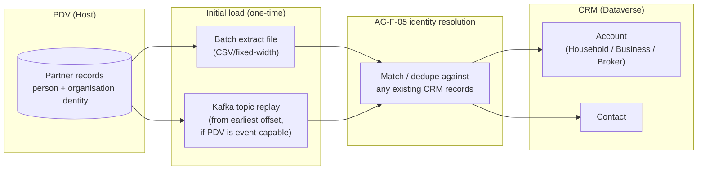

| Endpoint | Capability / service | Role |
| --- | --- | --- |
| PDV batch extract (SFTP/Blob landing zone) | Full or delta file export | Initial-load source if PDV is batch-oriented |
| `pdv.partner.created` / `pdv.partner.updated` (Kafka, illustrative) | Point-in-time replay from earliest offset | Initial-load source if PDV is event-capable |
| ETL pipeline (Azure Data Factory / Power Platform Dataflows) | Transform, validate, stage | Shape PDV's export into Dataverse's Account/Contact schema |
| `AG-F-05` Data-Quality & Identity-Resolution Agent | Match/dedupe against existing records | Never silently merges — ambiguous matches route to a steward |
| Dataverse Account/Contact | Target entities ([ADR-0006](./ADR-0006-account-centre-of-gravity.md)) | Household/Business/Broker container plus Contact/ContactRole |

## Options — steady-state synchronisation

The three options below differ in **how CRM stays current against PDV
after the initial load** — not in the shared foundation above.

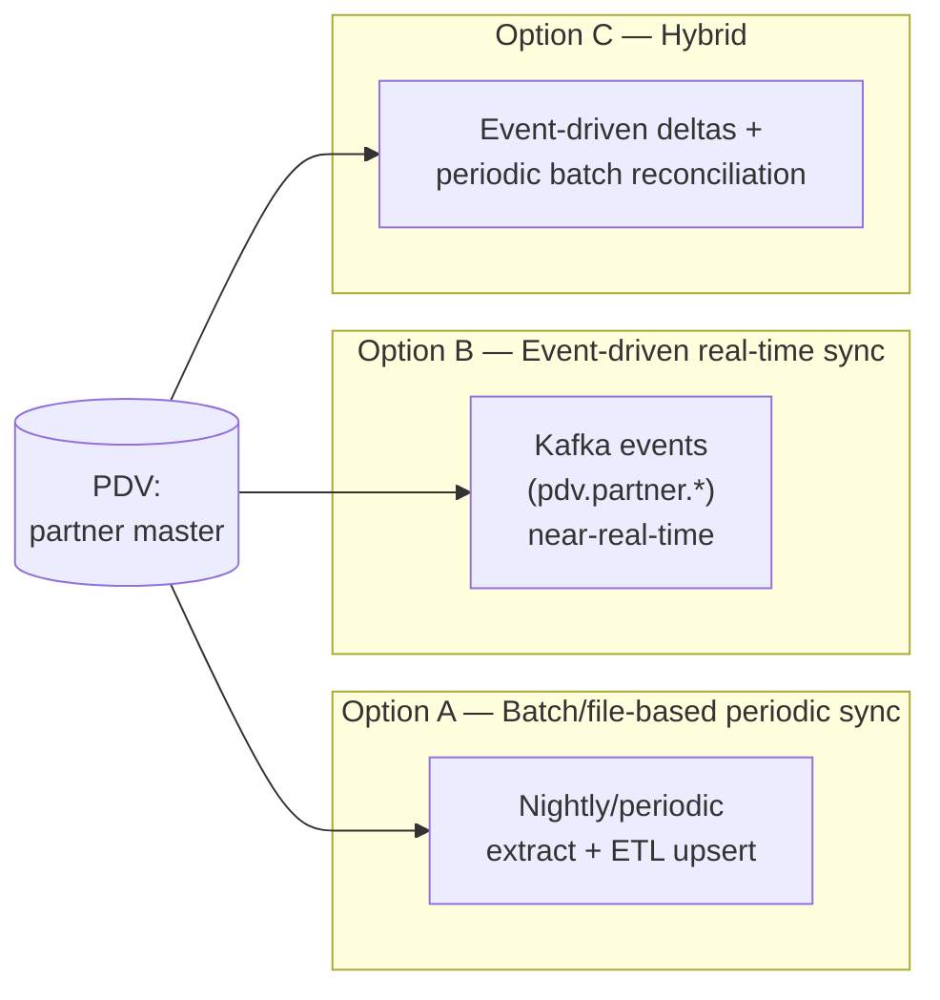

### Option A — Batch/file-based periodic sync

PDV exports a periodic (e.g. nightly) full or delta extract to a landing
zone; an ETL pipeline transforms and upserts it into Dataverse Account/
Contact, passing every record through `AG-F-05` for matching. This is the
option most consistent with the plausible reading of PDV as a legacy
"Host" system with no real-time interface, but is not assumed to be the
right answer — only the most conservative one.

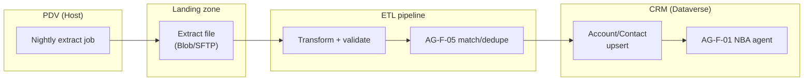

| Endpoint | Capability / service | Role |
| --- | --- | --- |
| PDV batch export | Nightly/periodic full or delta extract | Source of truth snapshot |
| Landing zone (Blob/SFTP) | File staging | Decouples PDV's export cadence from CRM's ingestion window |
| ETL pipeline (ADF/Dataflow) | Transform, validate, upsert | Maps PDV's schema to Account/Contact |
| `AG-F-05` agent | Match/dedupe on every batch | Human-reviewed merge for ambiguous matches |
| Dataverse Account/Contact | Target | Refreshed once per batch cycle |

- **Pros.** Matches the plausible technical reality of a legacy Host
  system with no real-time interface — if that turns out to be true, this
  is the only mechanism that will actually work without a costly bolt-on
  change-data-capture layer added to PDV itself. Simple, well-understood
  ETL pattern; the batch window makes full-refresh reconciliation and
  auditability straightforward; lowest engineering complexity of the
  three options.
- **Cons.** Data can be stale between batch windows — an address change
  captured on PDV today may not reach CRM's Advisory Cockpit until the
  next nightly run. This directly affects how quickly the household-
  relocation golden thread (see the ADR-0011 event cascade and
  [UC-01](../ideas/UC-01-relocation-across-jurisdictions/)) can actually
  trigger, if PDV — not an in-CRM edit — is where the change is first
  captured. If PDV turns out to be perfectly capable of real-time events,
  this option leaves that capability unused.
- **Design pattern.** Batch ETL with full or delta extract-and-upsert;
  reconciliation is inherent to every run (a fresh full extract naturally
  self-heals any prior sync gap).
- **Licence.** Azure Data Factory / Power Platform Dataflows consumption
  cost; no Kafka topic cost.

#### Advisory Cockpit walk-through (Option A)

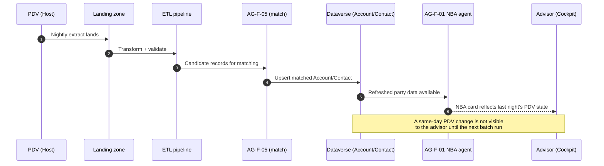

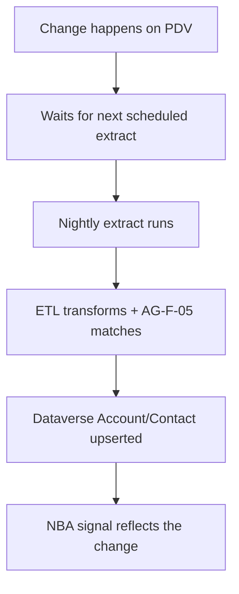

**Note.** The freshness gap here is the direct cost of this option —
worth weighing explicitly against how time-sensitive the customer expects
the relocation/jurisdiction-eligibility cascade
([ADR-0011](./ADR-0011-event-driven-cascade.md),
[ADR-0012](./ADR-0012-jurisdiction-driven-eligibility.md)) to be in
practice.

### Option B — Event-driven real-time sync

If PDV can publish change events, it emits `pdv.partner.created` and
`pdv.partner.updated` (illustrative names, mirroring
[ADR-0025](./ADR-0025-crm-core-systems-kafka-confluent-integration-pattern.md)'s
topic-naming convention) to Confluent Cloud. CRM consumes via whichever of
ADR-0025's four connectivity mechanisms is selected, matching every event
through `AG-F-05` before upserting near-real-time.

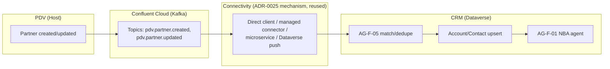

| Endpoint | Capability / service | Role |
| --- | --- | --- |
| `pdv.partner.created` / `pdv.partner.updated` (Kafka, illustrative) | Change events | Near-real-time signal of PDV changes |
| Connectivity mechanism | Reuses whichever of ADR-0025's four options is selected | Not re-decided here |
| `AG-F-05` agent | Match/dedupe per event | Same guardrail as Option A, applied per-event instead of per-batch |
| Dataverse Account/Contact | Target | Refreshed within the event-processing latency window |

- **Pros.** Near-real-time freshness feeding both `AG-F-01`'s scoring and
  the [ADR-0011](./ADR-0011-event-driven-cascade.md) event cascade almost
  immediately — the closest fit to a "same-day" relocation golden thread.
  Reuses the same Confluent Cloud backbone and connectivity mechanism
  already used for Versicherungsprozesse, Schadenprozesse, and ARO
  ([ADR-0025](./ADR-0025-crm-core-systems-kafka-confluent-integration-pattern.md),
  [ADR-0028](./ADR-0028-aro-case-task-management-integration-pattern.md)) —
  one integration paradigm across the landscape instead of a second,
  separate one just for PDV.
- **Cons.** Assumes a technical capability that is **not confirmed** — if
  PDV is genuinely a batch-only Host system, this option is simply not
  buildable without a bridging change-data-capture layer bolted onto PDV,
  which is itself a non-trivial and possibly customer-unwanted change to a
  legacy system outside CRM's control. Event-driven sync alone has no
  inherent "catch-up" safety net if an individual event is lost or a
  consumer has downtime, unlike batch's built-in full-refresh
  reconciliation.
- **Design pattern.** Event-carried state transfer via Kafka — identical
  shape to ADR-0025's CRM-core-systems pattern, applied to party/identity
  data instead of policy/claim data.
- **Licence.** Reuses ADR-0025's Confluent Cloud/connector licensing
  model; no separate ETL tool cost.

#### Advisory Cockpit walk-through (Option B)

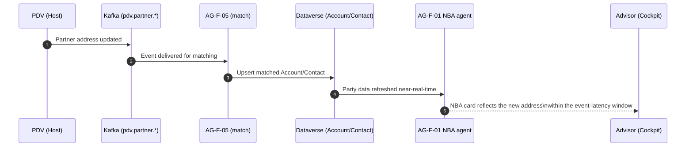

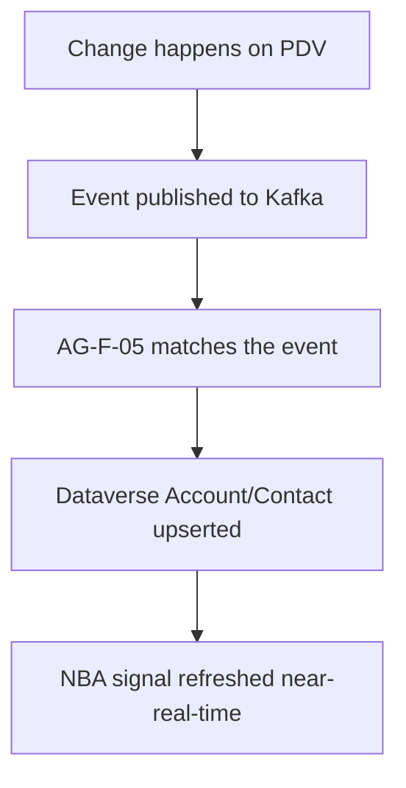

**Note.** This option's viability is entirely conditional on PDV's actual
event-publishing capability — see Evidence and assumptions below.

### Option C — Hybrid (event-driven deltas + periodic batch reconciliation)

Steady state runs on event-driven deltas (Option B) for freshness, but a
periodic (e.g. weekly) full-batch reconciliation pass (Option A's
mechanism) runs alongside it as a self-healing safety net — catching
missed events, schema drift, or manual corrections made directly on PDV
outside its normal event-publishing path. Any mismatch the reconciliation
pass finds is surfaced to `AG-F-05` for review rather than auto-resolved.

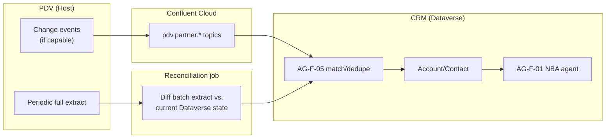

| Endpoint | Capability / service | Role |
| --- | --- | --- |
| `pdv.partner.*` (Kafka) | Same as Option B | Real-time freshness |
| Periodic full extract | Same as Option A | Reconciliation safety net |
| Reconciliation job | Diff batch state vs. current Dataverse | Surfaces drift instead of silently overwriting |
| `AG-F-05` agent | Match/dedupe for both paths, and mismatch review | Human-approved merge on any conflict |
| Dataverse Account/Contact | Target | Kept current by events, corrected by periodic reconciliation |

- **Pros.** Combines near-real-time freshness for time-sensitive scenarios
  (the relocation/jurisdiction cascade) with an inherent self-healing
  safety net if PDV is only partially event-capable, an event is
  occasionally dropped, or PDV's operational team makes an out-of-band
  correction. Matches the caution this repository applies elsewhere to
  legacy-landscape integration (the same posture as
  [ADR-0028](./ADR-0028-aro-case-task-management-integration-pattern.md)'s
  Option C) — a coexistence pattern rather than betting the entire
  identity-data pipeline on one mechanism.
- **Cons.** Highest engineering and operational complexity of the three —
  two pipelines to build, monitor, and keep consistent; the
  reconciliation-diff logic itself needs its own design (what counts as a
  conflict, who resolves it — directly tied to `AG-F-05`'s human-approved
  merge guardrail). Still assumes PDV can support at least partial
  real-time events; if PDV turns out to be 100% batch-only, this option
  collapses to Option A with unnecessary added complexity.
- **Design pattern.** Event-carried state transfer plus a periodic
  reconciliation/anti-entropy pass — the same lineage as the
  distributed-systems "read-repair" pattern.
- **Licence.** Sum of Option A's and Option B's licence drivers, plus
  reconciliation-job compute.

#### Advisory Cockpit walk-through (Option C)

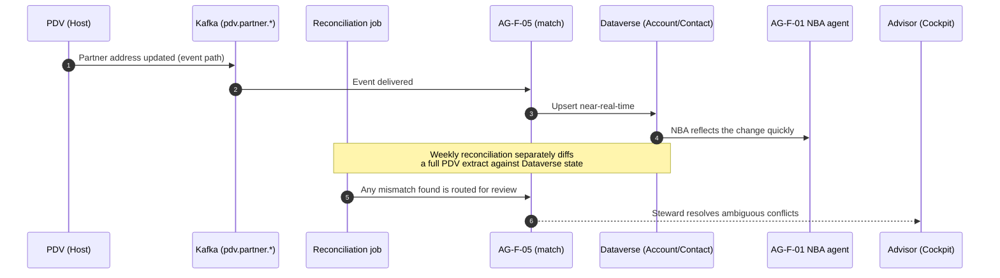

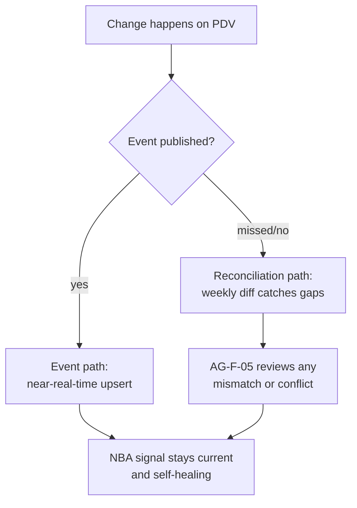

**Note.** The reconciliation pass is deliberately conservative — it
surfaces mismatches to a steward rather than silently overwriting either
side, consistent with `AG-F-05`'s never-silently-merge guardrail.

## Cross-cutting: party origination & identity-resolution policy

Orthogonal to the three sync options above is a second, equally open
question: **may CRM ever create a party before PDV does?** This applies
under any of the three options, since it is about *who is allowed to be
the first mover*, not about the sync mechanism.

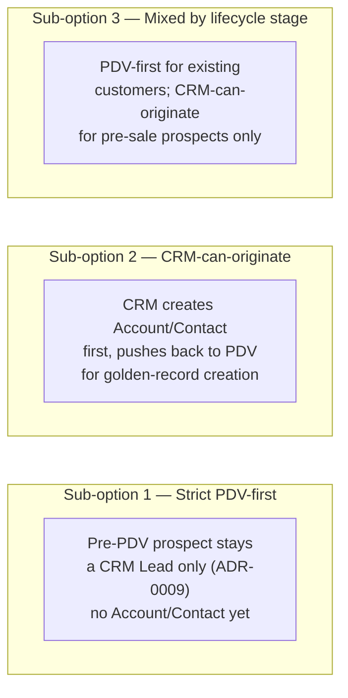

- **Sub-option 1 — Strict PDV-first gating.** A CRM Account/Contact may
  only be created for a party that already exists in PDV. A prospect who
  is not yet in PDV is represented purely as a CRM **Lead** — per
  [ADR-0009](./ADR-0009-lead-as-interest-on-existing-person.md), which
  already keeps Lead's `parentcontactid`/`parentaccountid` unset until a
  real person record exists — with no Account/Contact created until PDV
  creates the party and the chosen sync mechanism brings it across.
  **Pros:** one unambiguous master, no reconciliation-direction complexity
  ever. **Cons:** a qualifying prospect may have to wait on a PDV
  round-trip before Opportunity conversion can proceed, a process delay
  [ADR-0009](./ADR-0009-lead-as-interest-on-existing-person.md) did not
  originally anticipate.
- **Sub-option 2 — CRM-can-originate (bidirectional).** CRM may create the
  Account/Contact first — e.g. a prospect qualifying and converting to an
  Opportunity before PDV has any record of them — and a later step (a
  batch export back to PDV, or a "party creation requested" event
  published by CRM) informs PDV so the golden record eventually exists on
  both sides. Requires an explicit precedence rule for the moment PDV's
  own copy is created (which fields, if any, PDV's version overrides on
  CRM's). **Pros:** no artificial delay in the sales process. **Cons:**
  a genuine dual-origination window exists, and `AG-F-05` must handle the
  eventual match between the CRM-originated record and the PDV-sourced one
  — exactly the ambiguous-match case its human-approved-merge guardrail
  exists for.
- **Sub-option 3 — Mixed by party type/lifecycle stage.** Strict PDV-first
  for parties with an existing contractual relationship (policyholders,
  claimants — where PDV is unambiguously authoritative already), but
  CRM-can-originate for pre-sale prospects who by definition have no
  contractual relationship yet and may not even be modelled in PDV at all.
  Converting a Lead to an Opportunity/Contact would be the trigger that
  requests PDV create the canonical party record. **Pros:** matches the
  reality that PDV is likely built around contractual relationships, not
  pure prospects. **Cons:** the most nuanced rule to implement and explain
  — CRM's behaviour differs by a record's lifecycle stage.

Regardless of which sub-option is chosen, **`AG-F-05` (Data-Quality &
Identity-Resolution Agent)** is the mechanism that runs the matching during
both initial load and steady-state sync — and its existing guardrail
("never silently merges a golden record; a merge is a human-approved act")
is directly load-bearing for sub-options 2 and 3, where a genuine
CRM-originated-vs-PDV-sourced duplicate is the expected case, not an edge
case.

| Criterion | Sub-option 1 — PDV-first | Sub-option 2 — CRM-can-originate | Sub-option 3 — Mixed |
| --- | --- | --- | --- |
| Sales-process delay risk | Highest (waits on PDV round-trip) | Lowest | Low for prospects, none for existing customers |
| Dual-origination/conflict risk | None | Highest | Medium — confined to the pre-sale stage |
| Implementation complexity | Lowest | Medium | Highest (stage-dependent logic) |
| Matches likely PDV scope (contractual parties) | Naturally, if PDV doesn't model prospects | N/A | Naturally |

## Comparison — steady-state sync options

| Criterion | Option A — Batch/file | Option B — Event-driven | Option C — Hybrid |
| --- | --- | --- | --- |
| Matches a batch-only "Host" system, if that's confirmed | Yes, directly | No — needs a bridging capability | Degrades gracefully to Option A |
| Freshness for the relocation/cascade scenario ([ADR-0011](./ADR-0011-event-driven-cascade.md)) | Up to one batch cycle of latency | Near-real-time | Near-real-time, plus a safety net |
| Built-in catch-up if a change is missed | Yes — inherent to full-refresh batch | No — needs manual/ad-hoc recovery | Yes — the reconciliation pass |
| Reuses the ADR-0025 Kafka substrate | No | Yes | Yes |
| Engineering/operational complexity | Lowest | Medium | Highest |
| Licence drivers | ETL tool consumption | Confluent Cloud/connector (shared with ADR-0025) | Both |
| Design pattern fit | Batch ETL / extract-and-upsert | Event-carried state transfer | Event-carried state transfer + reconciliation (read-repair) |

## Decision or working hypothesis

**No option is selected, and no lean is stated**, for either the
steady-state sync question or the party-origination question. Both are
presented for the Enterprise Architect and the customer's IT/architecture
stakeholders to weigh together, and the honest starting point is that the
single most consequential unknown — PDV's actual technical
capability — has not yet been confirmed with the customer's Host/mainframe
technical team. Until it is, Option A remains the only guaranteed-workable
answer; Options B and C are credible but conditional on that confirmation.

## Evidence and assumptions

- **Known (verified).** [ADR-0006](./ADR-0006-account-centre-of-gravity.md)
  already establishes the Account/`accountType` container this data lands
  in. [ADR-0008](./ADR-0008-thin-crm-over-systems-of-record.md) already
  establishes the general external-master/reference-key pattern this ADR
  applies to identity data specifically. [ADR-0009](./ADR-0009-lead-as-interest-on-existing-person.md)
  already assumes the person "almost always already exists ... in the
  partner master" — this ADR is what makes that assumption concrete.
  `AG-F-05` (Data-Quality & Identity-Resolution Agent) is already defined
  in [AGENTS.md](../../AGENTS.md) at Design maturity, with its
  human-approved-merge guardrail already stated — reused here, not
  redesigned. [ADR-0025](./ADR-0025-crm-core-systems-kafka-confluent-integration-pattern.md)
  already evaluated four credible Kafka connectivity mechanisms, reused by
  Option B/C without re-derivation.
- **Inferred, not yet confirmed.** Whether PDV can publish real-time change
  events or is limited to periodic batch extracts (asked directly of the
  user; answer was to present both, not assume). Whether PDV masters
  organisation-level (Business/Broker) partner data as well as person-level
  data, or only individuals — PDV's German name does not specify this, and
  [ADR-0006](./ADR-0006-account-centre-of-gravity.md)'s `accountType`
  spans all three. Whether CRM may ever originate a party record before
  PDV does (also asked directly; answer was to present as open). The
  volume and data quality of PDV's existing partner population available
  for the initial load.
- **Evidence still required.** Confirmation from PDV's owning
  Host/mainframe technical team of its actual interface options (batch
  export only, or event-publishing capability). Confirmation of whether
  PDV's scope includes Business/Broker parties. A technical spike against
  a PDV sandbox/test extract or topic to confirm schema, cadence, and
  volume. Agreement with the customer's data-governance function on the
  golden-record precedence rule for sub-options 2 and 3 of the origination
  policy.

## Validation and review triggers

Reopen this ADR when: PDV's owning Host/mainframe technical team confirms
its actual interface capability (batch vs. event vs. both);
[ADR-0025](./ADR-0025-crm-core-systems-kafka-confluent-integration-pattern.md)'s
connectivity mechanism is selected (Options B/C depend on it); the
customer's data-governance function confirms the party-origination policy
and any precedence rule; or a pilot initial-load dry run against a PDV
test/sandbox extract or topic is completed. Decision owner: `AG-E-07` Data
Engineer & Scientist (accountable), with `AG-E-09` Integration Engineer,
`AG-E-03` Enterprise Architect, `AG-E-08` Dataverse Modeler, and the
customer's IT/Architect stakeholder as required reviewers.

## Consequences

- **At the next release.** No implementation ships from this ADR alone —
  it is evaluation only, pending stakeholder discussion and the PDV
  technical-capability confirmation above.
- **Operationally.** Whichever option is chosen, PDV becomes the disclosed
  source of truth for Account/Contact identity fields, feeding both
  `AG-F-01`'s NBA scoring and `AG-F-05`'s ongoing matching runs —
  cross-reference [AGENTS.md](../../AGENTS.md) once decided.
- **Contract with ADR-0025.** Options B and C depend on whichever Kafka
  connectivity mechanism ADR-0025 settles on, the same dependency already
  flagged in [ADR-0028](./ADR-0028-aro-case-task-management-integration-pattern.md).
- **Contract with ADR-0009.** Whichever party-origination sub-option is
  chosen changes exactly when a Lead's underlying Contact record is
  considered "real" versus provisional — sub-option 1 (strict PDV-first)
  could introduce a process delay between Lead qualification and
  Opportunity conversion that [ADR-0009](./ADR-0009-lead-as-interest-on-existing-person.md)
  did not originally anticipate; flagged here, not resolved.
- **Contract with ADR-0011.** The freshness of PDV-sourced address data is
  a direct input to how quickly the household-relocation event cascade
  ([ADR-0011](./ADR-0011-event-driven-cascade.md),
  [UC-01](../ideas/UC-01-relocation-across-jurisdictions/)) can trigger, if
  PDV — not an in-CRM edit — is where the address change is first
  captured in practice. Option A's batch latency vs. Option B/C's
  near-real-time propagation is therefore not a purely technical trade-off;
  it directly shapes how "same-day" the golden thread can actually be.
- **Reversibility.** Highest for Option A (a batch cadence is easy to
  adjust or unwind); lowest for Option B once core systems depend on the
  event contract; medium for Option C (the reconciliation pass can be
  dialled up or down independently of the event path).

## Competitive note

Many CRM implementations treat master-data/identity integration as an
afterthought bolted on after go-live, which is exactly what produces
duplicate or conflicting golden records down the line. Documenting the
sync-mechanism trade-offs and the origination-policy question together,
before either is decided, together with `AG-F-05`'s disciplined,
human-approved merge guardrail, shows the customer a transparent, explainable
identity-resolution pattern rather than a silent auto-merge black box — a
named human stays accountable for every merge decision, consistent with
this repository's human-in-the-loop stance elsewhere.
