# ADR-0030 — CRM Lead & Campaign External Landscape: Comparis Intake and Salesforce → D365 Marketing Migration

| Field | Value |
| --- | --- |
| **Status** | Proposed hypothesis |
| **Date** | 2026-08-15 |
| **Decision mode** | Working hypothesis — **no option selected, no lean stated** on either axis below; fully open for Enterprise Architect + customer IT/architecture stakeholder review |
| **Confidence** | Low–Medium — ARO's actual triage/enrichment logic on inbound Comparis leads is not confirmed, and Salesforce's current campaign data volume/complexity for a potential migration is not confirmed |
| **Deciders** | `AG-E-05` CRM Domain Expert (accountable — lead/campaign business semantics) · `AG-E-09` Integration Engineer (event/API contracts) · `AG-E-03` Enterprise Architect · `AG-E-10` Insurance Domain Expert · customer IT/Architect (`P-06`) |
| **Topic area** | A2 — Data model (Lead) · A3 — Integration, interfaces, system orchestration · A5 — Workflow/business cases (sales and marketing process) |
| **Use case** | Illustrated with **AG-F-01 Next-Best-Action Agent** (Advisory Cockpit) and **AG-F-06 Campaign & Content Assist Agent** walk-throughs below |
| **Licence** | `[TBD]` — Dynamics 365 Marketing licensing itself is a native product decision outside this ADR's scope; connector/migration tooling cost depends on which options are chosen below |
| **Upgrade impact** | Low for the thin-integration options (Comparis Option A/B, Campaign Option A) · Medium–High for the migration/cutover options (Campaign Option B/C) which require historical data handling |
| **CAF methodology** | Plan · Adopt — deciding and rolling out the target lead-intake and campaign-platform model |
| **WAF pillar(s)** | Primary: Reliability (lead/campaign data consistency during any transition) and Operational Excellence. Trade-off against: Cost Optimization (running two campaign platforms during a phased migration) |
| **Zero Trust** | Reuses the same verified-service-identity, least-privilege posture already established in [ADR-0025](./ADR-0025-crm-core-systems-kafka-confluent-integration-pattern.md) and [ADR-0026](./ADR-0026-entra-power-platform-dynamics365-identity-access-management.md) — no new identity pattern is introduced here |
| **Responsible AI** | `AG-F-06`'s segment-building and content generation are only as good as the consent and deduplication state of the contacts feeding it — the Comparis intake option chosen must capture per-channel consent at the point of intake ([ADR-0010](./ADR-0010-consent-per-contact-per-channel.md)), not retrofit it later; `AG-F-01`'s NBA scoring for a newly-arrived lead depends on how quickly and accurately that lead is matched to an existing party via `AG-F-05` |

> **Illustrative naming note.** Comparis (a Swiss insurance comparison
> portal) and Salesforce (the customer's current campaign-management
> platform, with Dynamics 365 Marketing as the stated target state) are as
> described by the customer. Whether ARO performs any triage, deduplication,
> or enrichment on inbound Comparis leads today is **not confirmed** — this
> ADR treats it as an open question (see Part 1) rather than asserting it
> either way. Topic and endpoint names below are illustrative, following the
> same convention as ADR-0025/ADR-0028's.

## Context

Two external-facing facts from the customer's system landscape are in
scope here, plus one point of explicit non-scope:

1. **"Lead aus Comparis ins ARO"** — leads from the Comparis comparison
   portal flow into ARO today. Whether that routing should continue, be
   replaced by direct CRM intake, or become a hybrid of both is this ADR's
   first open question (Part 1).
2. **"Sales Force Kampagnen Management"** — Salesforce is the customer's
   current campaign-management platform; the stated target state is
   migration to Dynamics 365 Marketing, which is already native to the
   Power Platform stack and is the platform `AG-F-06` (Campaign & Content
   Assist Agent, [AGENTS.md](../../AGENTS.md)) is built on. How that
   migration should happen is this ADR's second open question (Part 2).
3. **"Prospect Management"** is explicitly **not** a new decision here — it
   is the existing Contact lifecycle stage (`Prospect` / `Interested Party`
   / `Customer`) already fully specified by
   [ADR-0009](./ADR-0009-lead-as-interest-on-existing-person.md). This ADR
   only confirms that both new entry points below (Comparis leads,
   Salesforce-migrated contacts) land on that same existing stage — see the
   cross-cutting section near the end.

Scope, as agreed with the user:

- **In scope.** (1) The Comparis lead-intake routing pattern, and (2) the
  Salesforce → Dynamics 365 Marketing campaign-platform migration pattern.
- **Out of scope, deliberately.** Opportunity ownership and the ARO
  migration path — both fully covered by
  [ADR-0028](./ADR-0028-aro-case-task-management-integration-pattern.md)
  already; this ADR's Comparis-routing options reuse ADR-0028's `aro.*`
  Kafka topic convention where relevant but do not revisit Opportunity.
  Re-deciding the Prospect/Interested-Party/Customer lifecycle model,
  already settled by
  [ADR-0009](./ADR-0009-lead-as-interest-on-existing-person.md).
- **Validating use case.** **`AG-F-01`** — a newly-arrived Comparis lead
  needs to surface promptly and correctly matched in the Advisory Cockpit.
  **`AG-F-06`** — campaign segment membership and consent state need to be
  accurate and current, regardless of which platform currently owns a
  given campaign during any migration window.

This ADR does **not** pick an option on either axis. It documents credible
patterns for each so the Enterprise Architect and the customer's IT
stakeholders can choose with the trade-offs in front of them, exactly as
[ADR-0024](./ADR-0024-dataverse-to-databricks-integration-pattern.md)
through
[ADR-0029](./ADR-0029-pdv-partner-master-data-integration-pattern.md) did
before it.

## Part 1 — Comparis lead intake pattern

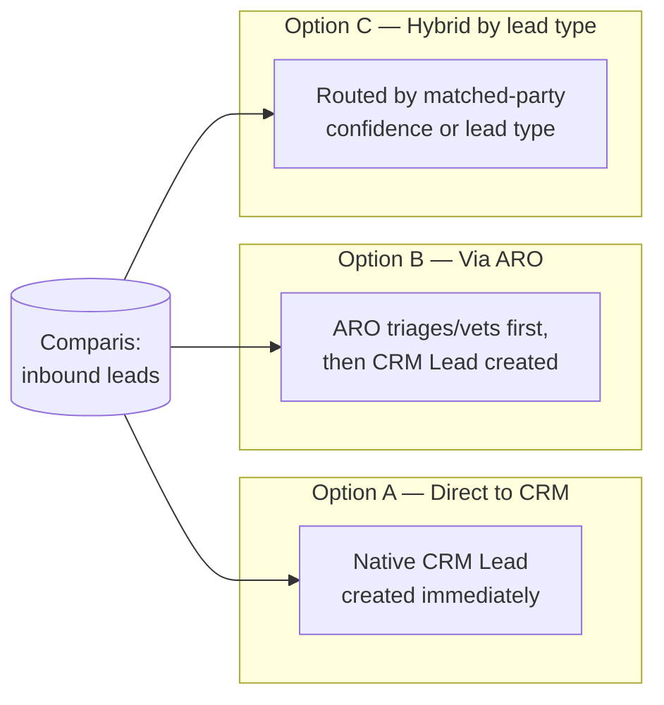

### Option A — Direct-to-CRM Lead (bypasses ARO)

Comparis pushes a lead via API/webhook straight into an integration layer
that creates a native Dataverse `Lead` record immediately, with
`leadSource = "Comparis"` (a new typed value alongside the Claim-to-Lead /
Service-to-Lead / Campaign / Inbound sources already established in
[ADR-0009](./ADR-0009-lead-as-interest-on-existing-person.md)). `AG-F-05`
attempts to match the lead to an existing Contact/PDV party at intake,
consistent with ADR-0009's assumption that the person almost always
already exists.

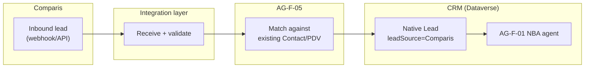

| Endpoint | Capability / service | Role |
| --- | --- | --- |
| Comparis lead webhook/API | Inbound lead payload | External, not Kafka-based (Comparis is outside the core landscape) |
| Integration layer | Lightweight receive/validate service | Normalises the payload into CRM's Lead shape |
| `AG-F-05` agent | Match against existing Contact/PDV | Sets `parentcontactid`/`parentaccountid` when matched, per ADR-0009 |
| Dataverse `Lead` | Native lead table, `leadSource = Comparis` | Full native scoring/BPF/routing immediately available |

- **Pros.** Fastest advisor visibility — native lead scoring, routing, and
  the Advisory Cockpit see the lead the moment it arrives, with no
  dependency on ARO's throughput. Cleanest fit with the thin-CRM boundary
  ([ADR-0008](./ADR-0008-thin-crm-over-systems-of-record.md)): Lead is
  already a CRM-native demand-side object, so this keeps its origin story
  simple.
- **Cons.** Bypasses whatever triage, spam/junk filtering, or enrichment
  logic ARO may already apply to Comparis leads today — if that logic is
  meaningful, this option would need to rebuild it in CRM or risk
  lower-quality leads reaching advisors directly. Represents the largest
  process change from today's flow.
- **Design pattern.** Direct API/webhook ingestion with identity-resolution
  matching at intake.
- **Licence.** No new licence driver beyond the intake API/webhook
  endpoint itself.

#### Advisory Cockpit walk-through (Option A)

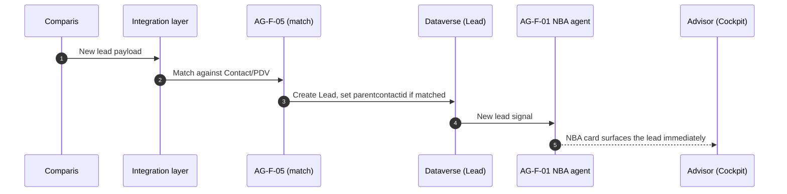

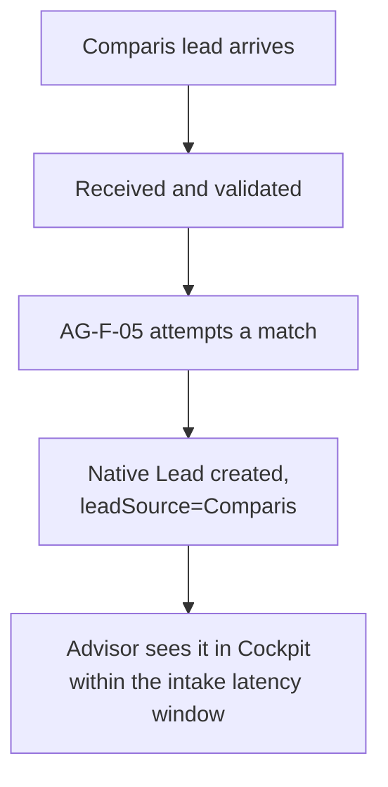

### Option B — Via ARO (ARO triages first)

Comparis leads continue flowing into ARO as they do today. ARO performs
whatever triage/vetting it already applies, then publishes a "lead
qualified" event (e.g. `aro.lead.qualified`, illustrative, mirroring
[ADR-0028](./ADR-0028-aro-case-task-management-integration-pattern.md)'s
topic-naming convention) to Confluent Cloud, which CRM consumes to create
the native Lead.

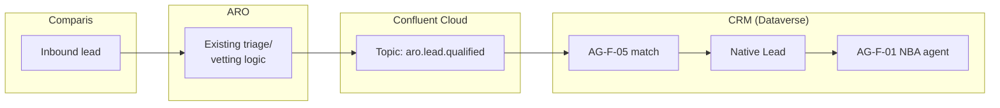

| Endpoint | Capability / service | Role |
| --- | --- | --- |
| ARO (existing triage) | Whatever vetting ARO applies today | Preserved unchanged |
| `aro.lead.qualified` (Kafka, illustrative) | Event once ARO has vetted a lead | Reuses ADR-0025's connectivity mechanism |
| `AG-F-05` agent | Match against existing Contact/PDV | Same guardrail as Option A |
| Dataverse `Lead` | Native lead table | Created only after ARO's vetting step |

- **Pros.** Preserves today's triage step without needing to know or
  rebuild what ARO actually does — lowest process disruption. Consistent
  integration paradigm with ADR-0028's `aro.*` topics — one substrate
  across the ARO relationship rather than two.
- **Cons.** Adds a round-trip through ARO before an advisor ever sees the
  lead in the Cockpit — worth weighing against how much response speed
  matters commercially for comparison-portal-driven leads, which are
  commonly shopped across multiple insurers in parallel (a general,
  reasonable consideration, not a confirmed customer figure). Keeps a
  demand-side object (Lead intake) partly dependent on ARO, which cuts
  against the general direction of concentrating demand-side objects in
  CRM ([ADR-0008](./ADR-0008-thin-crm-over-systems-of-record.md)).
- **Design pattern.** Event-carried state transfer via a new ARO-owned
  Kafka topic, same shape as ADR-0028's shared integration surface.
- **Licence.** Reuses ADR-0025's Confluent Cloud/connector licensing.

#### Advisory Cockpit walk-through (Option B)

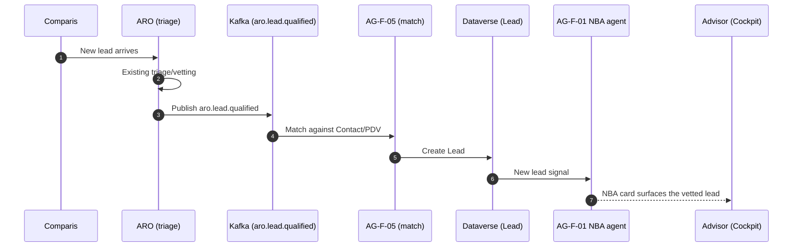

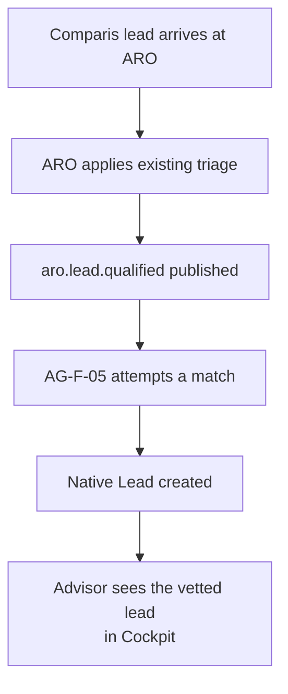

### Option C — Hybrid (dual-path by lead type or match confidence)

Leads that `AG-F-05` can confidently match to an existing, already-known
party (e.g. an existing policyholder shopping for an additional line of
cover) route directly to CRM (Option A's fast path); leads that cannot be
confidently matched — genuinely new, unknown people — route via ARO first
(Option B's vetted path), on the reasoning that unknown parties may
warrant more scrutiny before reaching an advisor. The exact split
criterion is illustrative here and would need to be defined with the
customer.

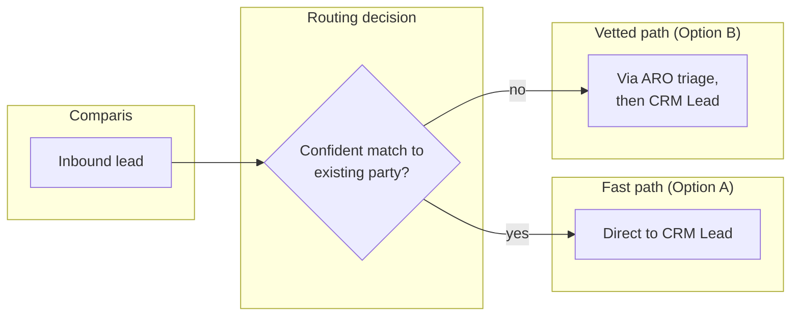

| Endpoint | Capability / service | Role |
| --- | --- | --- |
| `AG-F-05` match-confidence check | Decides which path a lead takes | The routing criterion itself needs definition with the customer |
| Fast path | Same as Option A | For confidently-matched, already-known parties |
| Vetted path | Same as Option B | For unmatched/unknown parties |

- **Pros.** Best of both — speed for already-known parties who likely need
  no further vetting, ARO's existing scrutiny preserved for genuinely new
  people. Incremental: could evolve toward Option A over time as
  confidence in direct-to-CRM validation grows, the same Strangler-Fig-like
  reasoning applied in
  [ADR-0028](./ADR-0028-aro-case-task-management-integration-pattern.md)
  and [ADR-0029](./ADR-0029-pdv-partner-master-data-integration-pattern.md)'s
  own Option C patterns.
- **Cons.** The most complex of the three — two intake paths to build,
  monitor, and keep consistent; the routing/split criterion itself needs
  careful definition and may not perfectly align with ARO's actual
  vetting value.
- **Design pattern.** Content-based routing (split by match confidence or
  lead type) over two integration paths.
- **Licence.** Sum of Option A's and Option B's licence drivers.

## Comparison — Part 1 (Comparis lead intake)

| Criterion | Option A — Direct to CRM | Option B — Via ARO | Option C — Hybrid |
| --- | --- | --- | --- |
| Speed to advisor visibility | Fastest | Slowest (ARO round-trip) | Fast for known parties, slower for unknown |
| Preserves today's ARO vetting | No | Yes, fully | Yes, for unmatched leads only |
| Concentrates demand-side data in CRM ([ADR-0008](./ADR-0008-thin-crm-over-systems-of-record.md)) | Fully | Partially | Mostly |
| Process disruption from today | Highest | None | Medium |
| Engineering complexity | Lowest | Low–Medium | Highest |
| Reuses ADR-0025/0028 Kafka substrate | No (external API only) | Yes | Partially |

## Part 2 — Salesforce → Dynamics 365 Marketing migration pattern

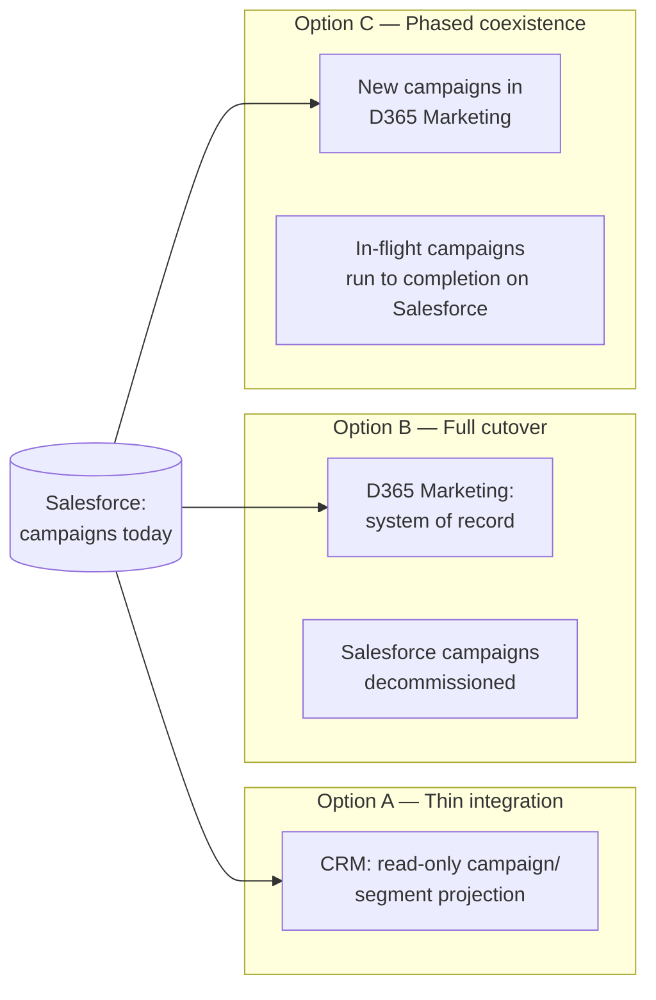

### Option A — Thin integration only (Salesforce stays authoritative)

CRM gets a read-only projection of active campaign and segment membership
from Salesforce via API/connector — enough for `AG-F-01` and `AG-F-06` to
know a household is in an active campaign — but campaign creation and
execution stay on Salesforce. Included as the honest baseline, even though
it does not realise the stated migration goal.

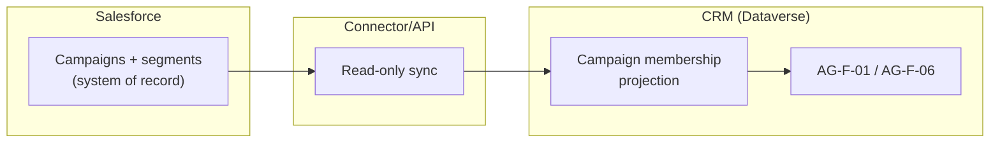

| Endpoint | Capability / service | Role |
| --- | --- | --- |
| Salesforce campaign/segment API | Read-only export | Source of truth stays on Salesforce |
| Connector | Periodic or near-real-time sync | Keeps CRM's projection current |
| CRM campaign-membership projection | Read-only | Advisory Cockpit/NBA signal only |

- **Pros.** Minimal change, lowest risk, no historical campaign data
  migration required.
- **Cons.** Does not realise the stated migration goal. Native D365
  Marketing capability and `AG-F-06`'s campaign/content-assist tooling go
  unused. Two campaign systems remain long-term.
- **Design pattern.** Read-through projection, same shape as the
  Policy/Claim/Quote pattern in
  [ADR-0008](./ADR-0008-thin-crm-over-systems-of-record.md).
- **Licence.** Connector/API licensing only; no D365 Marketing migration
  cost, but its native capability stays uncosted and unrealised.

### Option B — Full cutover (D365 Marketing becomes system of record)

A one-time migration of active and historical campaign data, segment
definitions, and templates from Salesforce into Dynamics 365 Marketing;
Salesforce is decommissioned for campaign management once complete.

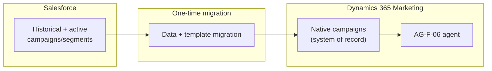

| Endpoint | Capability / service | Role |
| --- | --- | --- |
| Salesforce export | One-time historical extract | Migration source |
| Migration/ETL job | Transform campaigns, segments, templates | One-time cutover |
| D365 Marketing | Native campaigns, `AG-F-06` | Full native capability from cutover day |

- **Pros.** Realises the stated migration goal immediately; unlocks
  `AG-F-06`'s native campaign/content-assist capability fully; one system
  going forward.
- **Cons.** Highest risk — a single cutover; requires a full historical
  data migration and template/audience rebuild; any Salesforce campaigns
  still in flight at cutover time need careful handling (pause, complete
  before cutover, or manually re-created in D365 Marketing).
- **Design pattern.** Hard cutover with one-time data migration.
- **Licence.** Standard Dynamics 365 Marketing licensing; migration/ETL
  tooling cost is one-time.

### Option C — Phased coexistence (Strangler Fig by campaign)

New campaigns launch in Dynamics 365 Marketing going forward; existing,
in-flight Salesforce campaigns run to completion on Salesforce. A
dual-visibility layer keeps `AG-F-01`/`AG-F-06` aware of active campaigns
on both systems during the transition window, until Salesforce is fully
decommissioned.

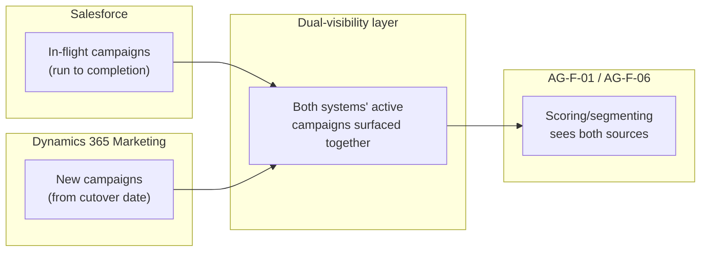

| Endpoint | Capability / service | Role |
| --- | --- | --- |
| Salesforce (declining) | In-flight campaigns only | Wound down as campaigns complete |
| D365 Marketing (growing) | All new campaigns from cutover date | Native `AG-F-06` capability available immediately for new work |
| Dual-visibility layer | Combines both systems' active campaign signals | Feeds `AG-F-01`/`AG-F-06` consistently during the window |

- **Pros.** Lowest disruption to already-running campaigns; incremental
  and reversible per-campaign; consistent with the coexistence pattern
  used in [ADR-0028](./ADR-0028-aro-case-task-management-integration-pattern.md)
  and [ADR-0029](./ADR-0029-pdv-partner-master-data-integration-pattern.md)'s
  own Option C.
- **Cons.** Two systems to operate and monitor during the transition;
  requires dual segment/consent reconciliation — consent per contact per
  channel ([ADR-0010](./ADR-0010-consent-per-contact-per-channel.md)) must
  stay authoritative regardless of which system a given campaign runs
  from, which adds real complexity to the dual-visibility layer.
- **Design pattern.** Strangler Fig — new work on the target platform,
  legacy work wound down in place.
- **Licence.** Standard Dynamics 365 Marketing licensing plus the
  dual-visibility layer's build/run cost, temporary.

#### Advisory Cockpit / campaign walk-through (shared across Part 2 options)

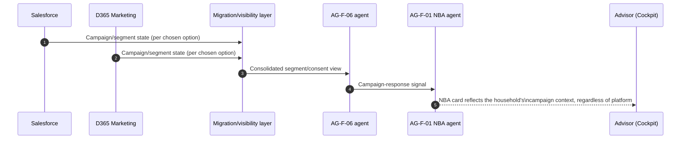

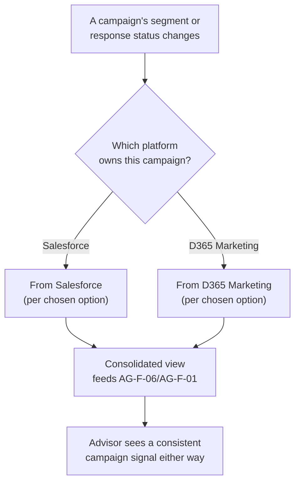

## Comparison — Part 2 (Salesforce → D365 Marketing)

| Criterion | Option A — Thin integration | Option B — Full cutover | Option C — Phased coexistence |
| --- | --- | --- | --- |
| Realises the stated migration goal | No | Yes, immediately | Yes, incrementally |
| Business risk | Lowest | Highest — single cutover | Lowest of the migration paths |
| Historical data migration required | No | Yes, once, all at once | Only for campaigns not yet complete at cutover |
| Uses native D365 Marketing / `AG-F-06` capability | No | Yes, fully | Yes, for new campaigns immediately |
| Systems to operate during transition | 2, indefinitely | 1, after cutover | 2, temporarily |
| Design pattern fit | Read-through projection | Hard cutover | Strangler Fig |

## Cross-cutting: Prospect lifecycle — not a new decision

Regardless of which options are chosen in Part 1 and Part 2, every party
arriving via either path lands on the **existing** Contact lifecycle stage
already fully specified by
[ADR-0009](./ADR-0009-lead-as-interest-on-existing-person.md): `Prospect` /
`Interested Party` / `Customer` as a status on Contact, not a record
migration. This ADR introduces no new "Prospect Management" system or
state — it only confirms that a Comparis-sourced lead (Part 1) and a
Salesforce-migrated campaign contact (Part 2) both promote through that
same existing stage model once qualified, exactly like any other lead
source already listed in ADR-0009 (Claim-to-Lead, Service-to-Lead,
Campaign, Inbound).

## Decision or working hypothesis

**No option is selected, and no lean is stated**, on either the Comparis
lead-intake axis or the Salesforce migration axis. Both are presented for
the Enterprise Architect and the customer's IT/architecture stakeholders
to weigh together. The two axes are independent — for example, a Direct-
to-CRM Comparis intake (Part 1, Option A) could pair with a Phased
Salesforce coexistence (Part 2, Option C), or any other combination; this
ADR does not assume they must be resolved together.

## Evidence and assumptions

- **Known (verified).** [ADR-0009](./ADR-0009-lead-as-interest-on-existing-person.md)
  already establishes the native, inverted Lead model, typed `leadSource`,
  and the Prospect/Interested Party/Customer lifecycle stage this ADR
  reuses without re-deciding. [ADR-0008](./ADR-0008-thin-crm-over-systems-of-record.md)
  establishes the general thin-CRM/external-reference-key boundary applied
  to Part 2's projection option. [ADR-0010](./ADR-0010-consent-per-contact-per-channel.md)
  already establishes the consent-per-contact-per-channel gate that Part
  2's coexistence option must respect. `AG-F-06` (Campaign & Content Assist
  Agent) is already defined in [AGENTS.md](../../AGENTS.md).
  [ADR-0025](./ADR-0025-crm-core-systems-kafka-confluent-integration-pattern.md)
  and [ADR-0028](./ADR-0028-aro-case-task-management-integration-pattern.md)
  already establish the Kafka connectivity mechanism and `aro.*` topic
  convention reused by Part 1's Option B/C.
- **Inferred, not yet confirmed.** Whether ARO performs any meaningful
  triage/vetting/enrichment on Comparis leads today, and if so what it
  actually does (asked directly of the user; left open). The actual volume
  and complexity of Salesforce's current campaign/segment data available
  for a potential migration. Whether Comparis exposes a real-time
  webhook/API today or only a batch export.
- **Evidence still required.** Confirmation from the team operating ARO of
  its actual Comparis-lead processing logic, if any. A technical spike
  against Comparis's actual integration interface (webhook/API vs. batch).
  A data-quality and volume assessment of Salesforce's current campaign
  and segment data before committing to Option B or C of Part 2.

## Validation and review triggers

Reopen this ADR when: the team operating ARO confirms its actual
Comparis-lead processing logic; Comparis's actual technical integration
interface is confirmed; a data-quality/volume assessment of Salesforce's
campaign data is completed; or a pilot GA is nominated for either the
Comparis intake change or the Salesforce migration. Decision owner:
`AG-E-05` CRM Domain Expert (accountable), with `AG-E-09` Integration
Engineer, `AG-E-03` Enterprise Architect, `AG-E-10` Insurance Domain
Expert, and the customer's IT/Architect stakeholder as required reviewers.

## Consequences

- **At the next release.** No implementation ships from this ADR alone —
  it is evaluation only, pending stakeholder discussion.
- **Operationally.** Whichever options are chosen, both feed `AG-F-01`'s
  NBA scoring and `AG-F-06`'s segment/consent-aware campaign targeting —
  cross-reference [AGENTS.md](../../AGENTS.md) once decided.
- **Contract with ADR-0009.** A new typed `leadSource = "Comparis"` value
  is added regardless of which Part 1 option is chosen; the qualification-
  to-Opportunity behaviour stays exactly as ADR-0009 already defines it.
- **Contract with ADR-0010.** Part 2's Option C (phased coexistence)
  specifically depends on consent staying authoritative and consistent
  across both campaign platforms during the transition window — flagged
  here as a design requirement for the dual-visibility layer, not yet
  resolved.
- **Contract with ADR-0025/ADR-0028.** Part 1's Option B/C depend on the
  same Kafka connectivity mechanism and topic-naming convention already
  established there.
- **Reversibility.** Part 1: highest for Option A (nothing ARO-side to
  unwind), lowest for Option B (process dependency on ARO is entrenched),
  medium for Option C. Part 2: highest for Option A, lowest for Option B
  once Salesforce is decommissioned, medium for Option C (reversible
  per-campaign during the window).

## Competitive note

Many CRM programmes treat lead-source and campaign-platform migrations as
a single all-or-nothing cutover event, which is exactly what turns a
manageable transition into a high-risk one. Presenting the Comparis
intake and Salesforce migration questions as independent, each with an
honest low-risk baseline alongside a full-cutover and a phased-coexistence
path, shows the customer they can sequence these two changes on their own
timelines rather than being forced into a single combined migration
event.
