# ADR-0031 — Power Platform Environment Strategy for Insurance Business Models (Household / Business / Broker)

| Field | Value |
| --- | --- |
| **Status** | Proposed hypothesis |
| **Date** | 2026-08-15 |
| **Decision mode** | Working hypothesis — **no option selected, no lean stated**, on two separate open axes: (1) how many distinct populations warrant environment-level segregation, and (2) combined vs. separated environment topology; fully open for Enterprise Architect + customer IT/architecture stakeholder review |
| **Confidence** | Medium for the general environment-vs-Business-Unit mechanism (grounded in published Microsoft guidance) — **Low** for which population framing (two-way B2C/B2B or three-way Household/Business/Broker) actually matches the customer's operating model, which is explicitly unconfirmed |
| **Deciders** | `AG-E-03` Enterprise Architect (accountable — environment/org topology) · `AG-E-04` SecDevOps (environment provisioning, ALM pipeline shape) · `AG-E-08` Dataverse Modeler (Business Unit and schema impact) · customer IT/Architect (`P-06`) |
| **Topic area** | A4 — ALM, environment and release strategy · A8 — deployment, environment topology · A2 — data model (touches `Account`/`accountType` boundary) |
| **Use case** | Illustrated with **AG-F-01 Next-Best-Action Agent** (Advisory Cockpit) walk-throughs below each option |
| **Licence** | `[TBD]` — Option A stays within a single environment's existing Dataverse capacity entitlement; Options B and C add per-environment storage/API/Copilot Studio consumption on top, and may require additional Power Platform capacity add-ons depending on how many environments are provisioned |
| **Upgrade impact** | Low for Option A (one environment, one release train) · High for Option B (N environments, N release trains, plus a new cross-environment reconciliation layer to build and maintain) · Medium for Option C (two release trains, one narrower reconciliation surface) |
| **CAF methodology** | Ready — landing-zone/environment topology is a foundational "Ready" decision · Govern — ongoing environment lifecycle and blast-radius governance |
| **WAF pillar(s)** | Primary: Security (blast-radius isolation and least-privilege segregation) and Operational Excellence (environment count directly drives release/administration overhead). Trade-off against: Cost Optimization (every additional environment carries its own capacity, storage, and administration cost) |
| **Zero Trust** | This ADR is about **where** the verify-explicitly/least-privilege boundary is drawn (environment vs. Business Unit), not a new identity mechanism — the actual security-role and Entra-group mechanics are already defined in [ADR-0026](./ADR-0026-entra-power-platform-dynamics365-identity-access-management.md) and apply unchanged inside whichever topology is chosen here |
| **Responsible AI** | `AG-F-01`'s Next-Best-Action scoring must not leak signals or data across a boundary where they do not belong — e.g. broker commission/book-of-business data must never surface inside a household advisor's cockpit, and vice versa. Whichever environment topology is chosen must preserve this separation either structurally (Option B/C) or through Business-Unit-scoped security roles and NBA agent configuration (Option A) |

> **Illustrative naming note.** The user's original framing named only "B2B
> and B2C," but [ADR-0006](./ADR-0006-account-centre-of-gravity.md) already
> defines **three** `accountType` values — `Household`, `Business`, and
> `Broker`. Whether Broker should be folded into "B2B," treated as a fully
> distinct third population, or something in between has **not** been
> resolved ahead of this ADR — the user explicitly asked that this framing
> question itself become part of the ADR's content rather than being
> answered as a precondition. It is addressed directly below, and Options B
> and C each show illustrative variants for both a two-way and a three-way
> reading rather than committing to one. Environment names below are
> illustrative, following the same convention as prior ADRs in this series.

## Context

Three things already established elsewhere in this repository, plus one
deliberately unconfirmed framing question, set the stage:

1. [ADR-0006](./ADR-0006-account-centre-of-gravity.md) makes **one**
   `Account` entity — discriminated by `accountType`
   (`Household` · `Business` · `Broker`) — the centre of gravity CRM
   organises everything around, specifically to preserve a single 360° view
   and avoid schema fragmentation. **This ADR asks whether that one-Account
   position should also mean one *environment*, or whether the CRM's
   Dataverse footprint should instead be split across multiple environments
   along the same or a different population boundary.**
2. Published Microsoft guidance is explicit that separate Power Platform/
   Dataverse **environments** are the right tool "when segregation is
   required of data, plugins, workflows, or admin resources that cannot be
   easily isolated by using business units" (Microsoft Learn,
   *Environment strategy for Power Platform*), and that Dataverse
   **Business Units** plus security roles are the built-in, supported
   mechanism for segregating data and access *within* a single environment
   — commonly named by convention such as
   `<lifecycle>-<region>-<business unit>-<purpose>` (Microsoft Learn,
   *Develop a tenant environment strategy to adopt Power Platform at
   scale*). Both mechanisms are real and documented; neither is
   automatically the right answer for this customer's Household/Business/
   Broker split.
3. [ADR-0020](./ADR-0020-domain-ownership-within-six-solution-architecture.md)
   already establishes six Dataverse **solution packages** as the unit of
   domain ownership and deployment. That is a solution-*packaging* concern —
   how functionality is divided into deployable units — which is related to
   but distinct from this ADR's environment/org-*topology* concern — how
   many physical Dataverse environments those solutions get installed into,
   and whether the same six solutions are installed once or repeated across
   several environments.
4. This ADR is about the customer's **target production** environment
   topology. It is unrelated to
   [docs/ENVIRONMENTS.md](../ENVIRONMENTS.md), which describes the
   showcase's own DEV/TEST Power Platform environments used to build this
   demo — a different, smaller-scoped concern that this ADR does not
   revisit.

**Explicitly not known and not assumed:** whether the customer's own
operating model genuinely treats Broker as a population as distinct from
Business as Business is from Household, or whether "B2B" was always meant to
include brokers as a sub-case. This ADR does not resolve that question
before proceeding — it is addressed as part of the design itself, in the
section immediately below, and every option that involves any separation is
shown with both a two-way and a three-way variant.

Scope, as agreed with the user:

- **In scope.** The production Power Platform/Dataverse environment
  topology for the Household/Business/Broker population(s), and how
  Business Units, security roles, and the ALM release pipeline interact
  with whichever topology is chosen.
- **Out of scope, deliberately.** The showcase's own DEV/TEST environment
  setup ([docs/ENVIRONMENTS.md](../ENVIRONMENTS.md)); the six-solution
  packaging decision itself
  ([ADR-0020](./ADR-0020-domain-ownership-within-six-solution-architecture.md));
  the specific security-role design and Entra-to-Dataverse mapping
  mechanics, already covered in
  [ADR-0026](./ADR-0026-entra-power-platform-dynamics365-identity-access-management.md).
- **Validating use case.** **AG-F-01 Next-Best-Action Agent** (Advisory
  Cockpit) — illustrated below with an advisor who serves a household that
  is also a small-business owner, and separately a broker relationship —
  precisely the case where environment topology determines whether one
  advisor screen is even possible.

## Framing question — how many populations need segregating? (open, part of this ADR)

Before the three topology options can even be compared, the population
count itself needs stating as an open question, not an assumption:

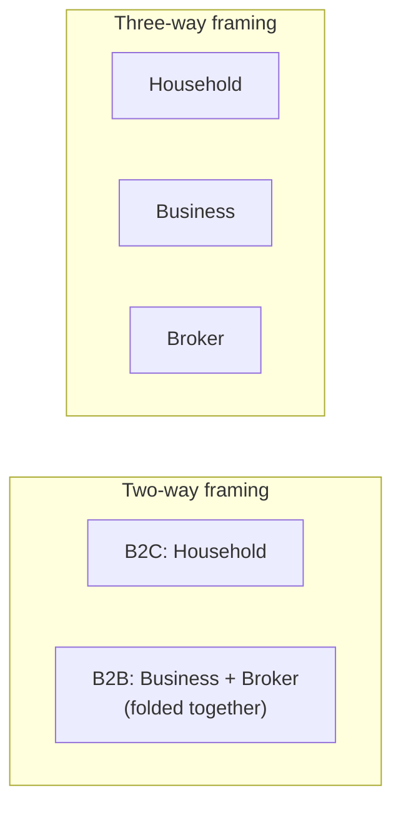

- **Two-way (B2C / B2B).** Matches the user's original shorthand literally.
  Treats Broker as simply a variant of Business — a plausible reading if
  brokers are legally/operationally similar enough to business customers
  (e.g. both invoiced entities, both potentially represented by an
  authorised contact) that they do not need distinct treatment.
- **Three-way (Household / Business / Broker).** Matches
  [ADR-0006](./ADR-0006-account-centre-of-gravity.md)'s literal
  `accountType` enumeration. Recognises that a broker is typically an
  **external, non-employee identity** representing a book of other
  customers' business — a materially different Zero Trust and
  identity-governance profile than an in-house Household or Business
  relationship, which may justify separate treatment regardless of whether
  Business and Household are combined or split.

Both framings are carried forward below: **Option A** is agnostic to the
framing (a single environment covers any number of populations equally).
**Option B** is shown with both a two-way and a three-way separated variant.
**Option C** is shown with two illustrative hybrid groupings, one aligned to
each framing.

## Options overview

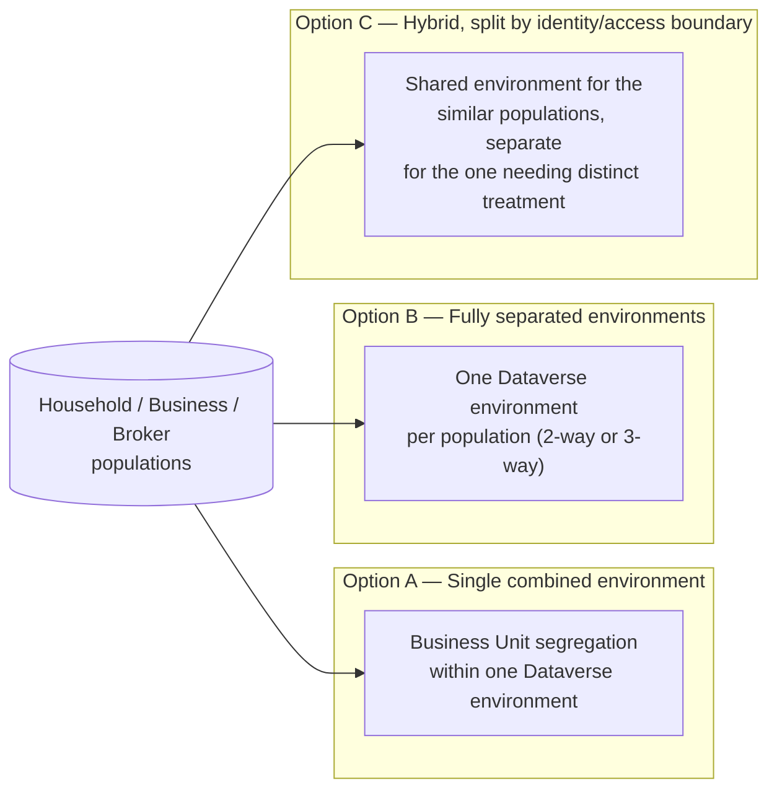

### Option A — Single combined environment, Business-Unit segregation

All in-scope populations (Household, Business, and Broker, however many are
recognised) share **one** production Dataverse environment. Business Units —
one per population, or fewer if some are grouped — plus security roles
segregate data visibility and administrative boundaries within that single
environment, exactly as Microsoft's guidance describes as the built-in
alternative to separate environments.

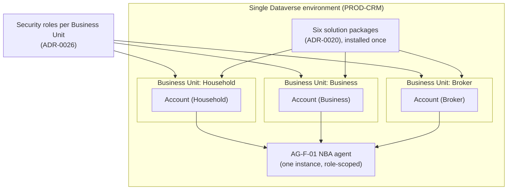

| Endpoint | Capability / service | Role |
| --- | --- | --- |
| Single Dataverse environment (`PROD-CRM`, illustrative) | Production Power Platform environment | Hosts all populations |
| Business Units (Household / Business / Broker, or fewer) | Native Dataverse hierarchical segregation | Data and admin-resource visibility boundary |
| Security roles ([ADR-0026](./ADR-0026-entra-power-platform-dynamics365-identity-access-management.md)) | Entra-group-mapped role assignment | Enforces least privilege within each Business Unit |
| Six solution packages ([ADR-0020](./ADR-0020-domain-ownership-within-six-solution-architecture.md)) | Deployment unit | Installed once, shared by every Business Unit |
| `AG-F-01` NBA agent | Copilot Studio / scoring pipeline | One shared instance, scoped by the advisor's security role |

- **Pros.** Matches [ADR-0006](./ADR-0006-account-centre-of-gravity.md)'s
  one-Account/one-360°-view position most directly — a household member who
  is also a small-business owner, or an advisor who needs to see both a
  household's and a broker-referred book's activity, is a single query
  against one environment, not a cross-environment join. One release train,
  one ALM pipeline, one set of environment-level admin resources to
  maintain. Lowest ongoing operational overhead of the three options.
- **Cons.** Every population shares the same blast radius — a plugin bug,
  a bad solution deployment, or a runaway workflow affecting one population
  can affect all of them. Broker users, who are commonly external/
  non-employee identities, sit inside the same environment-level admin
  trust boundary as internal Household/Business data, which may not satisfy
  a stricter Zero Trust posture some IT stakeholders expect for external
  parties.
- **Design pattern.** Native Dataverse Business Unit hierarchy + security
  role matrix — the same pattern Microsoft's own guidance names as the
  default alternative to environment proliferation.
- **Licence.** Stays within a single environment's existing Dataverse
  capacity/storage entitlement; no additional environment-level Power
  Platform capacity add-on required.

#### Advisory Cockpit walk-through (Option A)

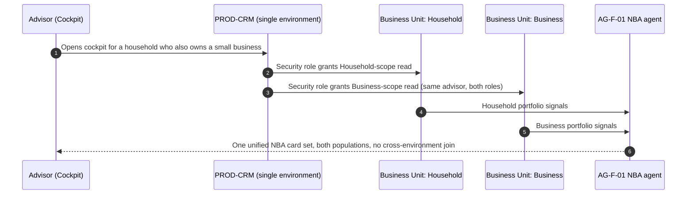

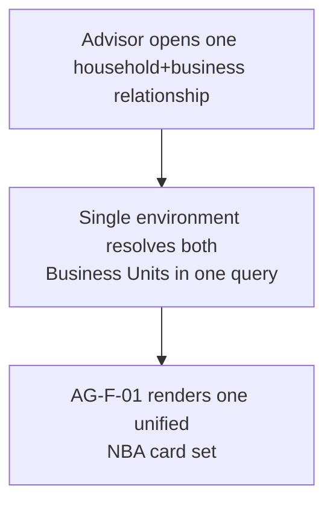

**Note.** This is the option where the cross-population Advisory Cockpit
scenario is structurally simplest — there is no reconciliation layer to
build, because there is only one environment to query.

### Option B — Fully separated environments per population

Each recognised population gets its **own** Dataverse environment,
independently released and administered. Shown here with both the two-way
and three-way framing as illustrative sub-variants, since which grouping
makes sense has not been confirmed.

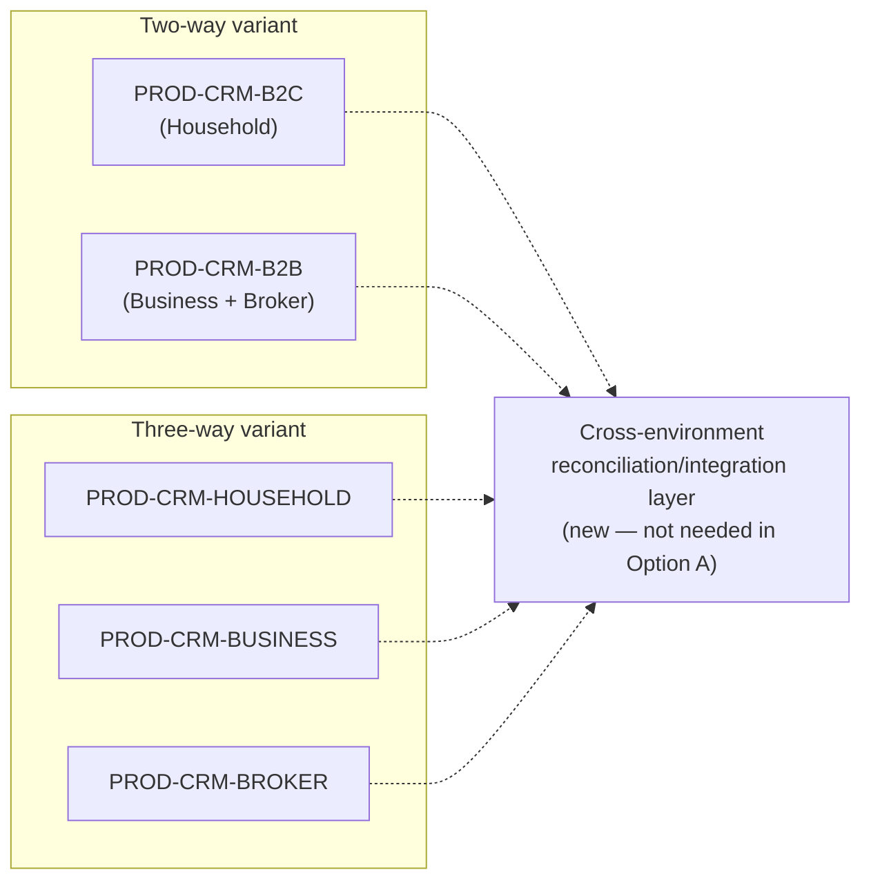

| Endpoint | Capability / service | Role |
| --- | --- | --- |
| Per-population Dataverse environment (`PROD-CRM-B2C`/`PROD-CRM-B2B`, or `PROD-CRM-HOUSEHOLD`/`PROD-CRM-BUSINESS`/`PROD-CRM-BROKER`, illustrative) | Independent production environments | One per recognised population |
| Six solution packages ([ADR-0020](./ADR-0020-domain-ownership-within-six-solution-architecture.md)) | Deployment unit | Installed and released independently in each environment |
| Cross-environment reconciliation/integration layer (new) | Custom sync, or reuse of the Databricks/Fabric analytics plane ([ADR-0024](./ADR-0024-dataverse-to-databricks-integration-pattern.md)) | Only mechanism able to reconstruct a unified 360° view for a party spanning populations |
| `AG-F-01` NBA agent | Copilot Studio / scoring pipeline, one instance per environment | No native shared instance — scoring must run separately per environment or be centralised outside Dataverse |

- **Pros.** Strongest blast-radius isolation — a bad deployment or incident
  in one environment cannot affect another. Each population can have its
  own release cadence, which matters if, for example, Broker-facing
  features need faster (or slower) iteration than Household features.
  Broker's external/non-employee users can sit in a fully separate
  environment-level trust boundary from internal Household/Business data,
  the cleanest Zero Trust posture of the three options for that specific
  population.
- **Cons.** Directly tensions with
  [ADR-0006](./ADR-0006-account-centre-of-gravity.md)'s one-Account/one-
  360°-view position: a person who is both a household member and a
  small-business owner, or an advisor who needs to see both a household's
  and a broker's book, now requires a **new cross-environment
  reconciliation/integration layer** that does not exist in Option A —
  itself a material new build, not a configuration choice. Highest
  operational overhead of the three options: N environments means N release
  trains, N sets of admin resources, and N times the base Power Platform
  capacity/storage entitlement.
- **Design pattern.** Environment-per-bounded-context, with a federation/
  integration layer bridging them — architecturally similar to a
  multi-tenant-by-environment pattern, and reuses the same class of
  cross-system integration thinking already applied to the Databricks
  analytics plane in
  [ADR-0024](./ADR-0024-dataverse-to-databricks-integration-pattern.md).
- **Licence.** Full additional Dataverse capacity/storage entitlement per
  extra environment, plus whatever the reconciliation layer's underlying
  platform costs (custom integration compute, or Databricks/Fabric
  consumption if that plane is reused).

#### Advisory Cockpit walk-through (Option B)

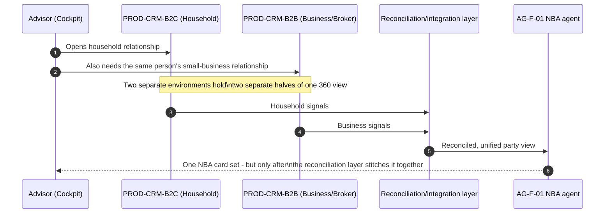

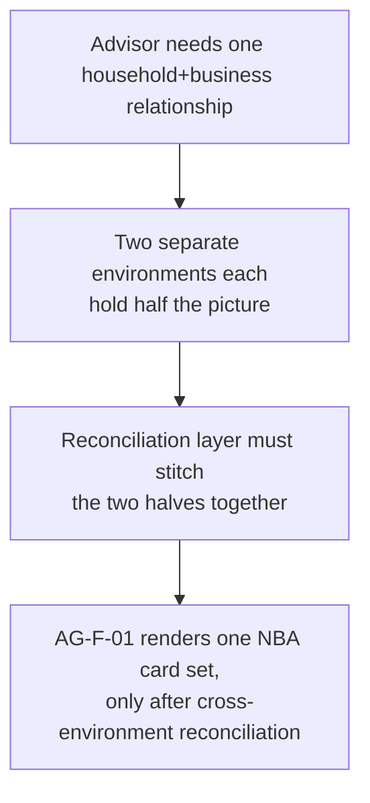

**Note.** This is the option where the Advisory Cockpit scenario is
structurally hardest — the very isolation that makes Option B attractive
for blast-radius and release-cadence reasons is exactly what a person
spanning two populations has to pay for, via a new reconciliation layer.

### Option C — Hybrid, split by identity/access boundary

Populations are grouped into **two** environments, along whichever boundary
genuinely needs different identity/access treatment — not necessarily the
same boundary as the two-way/three-way business framing above. Two
illustrative groupings are shown, since which boundary matters most has not
been confirmed either.

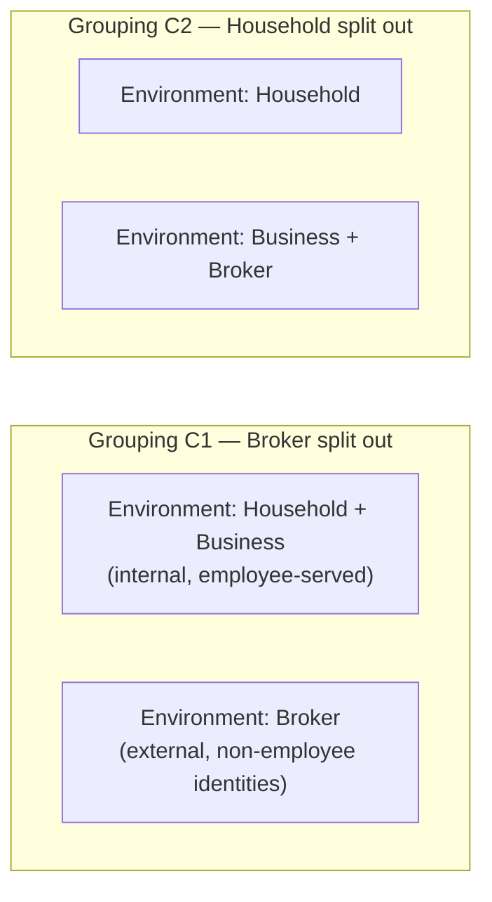

| Endpoint | Capability / service | Role |
| --- | --- | --- |
| Shared environment (`PROD-CRM-INTERNAL` or `PROD-CRM-HOUSEHOLD`, illustrative) | Hosts the population(s) grouped together | Business Unit segregation still applies within it, as in Option A |
| Separated environment (`PROD-CRM-BROKER` or `PROD-CRM-B2B`, illustrative) | Hosts the population needing distinct identity/access treatment | Independent release train and admin boundary for that one population |
| Six solution packages ([ADR-0020](./ADR-0020-domain-ownership-within-six-solution-architecture.md)) | Deployment unit | Installed in both environments, but only one release train needs to move at external-facing speed |
| Narrower reconciliation/integration layer (new, smaller than Option B's) | Custom sync or Databricks/Fabric reuse ([ADR-0024](./ADR-0024-dataverse-to-databricks-integration-pattern.md)) | Needed only for the one boundary actually separated, not for every pair of populations |
| `AG-F-01` NBA agent | Copilot Studio / scoring pipeline, one instance per environment (two total) | Fewer instances to reconcile than Option B's N |

- **Pros.** Targets the isolation Option B is trying to achieve — typically
  the external/non-employee Broker identity boundary — without paying
  Option B's full N-environment cost for populations (Household, Business)
  that do not actually need different treatment from each other. Narrower,
  more tractable reconciliation surface than Option B: only one boundary,
  not every pair.
- **Cons.** Still tensions with
  [ADR-0006](./ADR-0006-account-centre-of-gravity.md) for whichever
  population ends up split out — a Household member who also has a broker
  relationship (e.g. is themselves an insurance intermediary) still needs
  the reconciliation layer to get a unified view. Which grouping (C1 vs.
  C2) is right depends entirely on the still-open two-way/three-way framing
  question above and on facts not yet confirmed with the customer (e.g.
  whether brokers are truly external identities today, or already
  internally managed).
- **Design pattern.** Selective environment-per-bounded-context — the same
  pattern as Option B, deliberately applied to only one boundary instead of
  every population pair, keeping the rest on Option A's Business-Unit
  pattern.
- **Licence.** One additional environment's capacity/storage entitlement
  (not N-1 as in a fully three-way Option B), plus a narrower reconciliation
  layer cost than Option B's.

#### Advisory Cockpit walk-through (Option C)

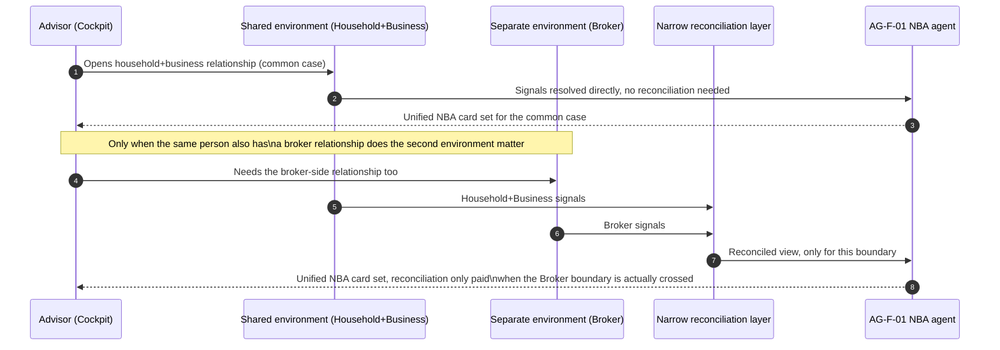

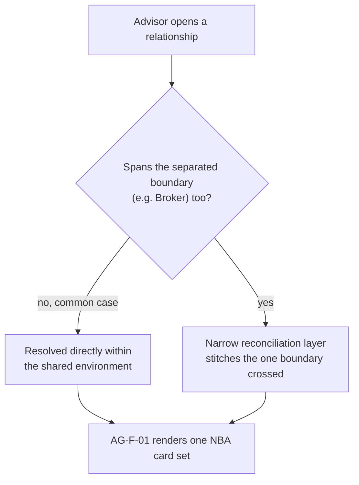

**Note.** Option C pays Option B's reconciliation cost only for the
narrower slice of cases that actually cross the chosen boundary, while
keeping Option A's simplicity for the common case — the trade-off is that
picking the *wrong* boundary (C1 vs. C2, or a boundary that turns out not to
match the customer's real identity/access needs) means re-doing the split
later.

## Comparison — environment topology options

| Criterion | Option A — Single combined | Option B — Fully separated | Option C — Hybrid |
| --- | --- | --- | --- |
| Matches ADR-0006's one-Account/360°-view position | Directly | No — needs a new reconciliation layer for every population pair | Partially — needs reconciliation only for the one separated boundary |
| Blast-radius isolation | Lowest — one shared environment | Highest | Medium — isolates only the separated population |
| Release cadence independence | None — one release train | Full — N independent release trains | Partial — two release trains |
| Fit for external/non-employee Broker identities (Zero Trust) | Weakest — same trust boundary as internal populations | Strongest, if Broker is fully split out | Strong, if the Broker boundary is the one chosen (Grouping C1) |
| New reconciliation/integration layer required | No | Yes — for every population pair | Yes — but only for one boundary |
| Operational/administration overhead | Lowest | Highest | Medium |
| Environment/capacity licence cost | Baseline (one environment) | Highest (N environments) | Medium (two environments) |
| Sensitivity to the still-open two-way/three-way framing question | Low — agnostic to population count | High — shape changes materially by framing | High — determines which grouping (C1/C2) applies |

## Decision or working hypothesis

**No option is selected, and no lean is stated**, on either the population-
framing question (two-way vs. three-way) or the environment-topology
question (Option A/B/C). Both are genuinely open, and deliberately left
that way: the framing question depends on facts about the customer's
Broker relationship (internal vs. external identity, shared vs. distinct
release needs) not yet confirmed, and the topology question is a real
trade-off between [ADR-0006](./ADR-0006-account-centre-of-gravity.md)'s
360°-view position and legitimate blast-radius/Zero-Trust arguments for
separation — a trade-off the Enterprise Architect and customer IT
stakeholders need to weigh together, not one this ADR should pre-empt.

## Evidence and assumptions

- **Known (verified).** [ADR-0006](./ADR-0006-account-centre-of-gravity.md)
  already establishes the one-`Account`/`accountType` position this ADR
  weighs against. [ADR-0020](./ADR-0020-domain-ownership-within-six-solution-architecture.md)
  already establishes the six-solution packaging unit referenced in every
  option's endpoint table. [ADR-0026](./ADR-0026-entra-power-platform-dynamics365-identity-access-management.md)
  already establishes the security-role/Business-Unit mechanics reused
  unchanged inside whichever topology is chosen. Microsoft Learn guidance
  (*Environment strategy for Power Platform* and *Develop a tenant
  environment strategy to adopt Power Platform at scale*) is the source for
  the environment-vs-Business-Unit segregation guidance cited in Context —
  confirmed by direct research this session, not invented.
- **Inferred, not confirmed.** Whether Broker should be read as a two-way
  "B2B" sub-case or a genuinely distinct third population; whether Broker
  users are, today, external/non-employee identities (which would favour
  separation) or already internally managed (which would weaken that
  argument); how frequently one party genuinely spans two populations (a
  household member who is also a small-business owner, or who is also a
  broker) — the frequency of this case materially affects how costly
  Option B/C's reconciliation layer is in practice.
- **Missing evidence to resolve this.** A confirmed answer from the
  customer on Broker's actual identity/employment status and release-
  cadence needs; an estimate of how many parties in the existing book span
  more than one population; and whether the customer's IT organisation has
  an existing environment-count or governance ceiling that would rule
  Option B out on cost/administration grounds alone, independent of the
  population-framing question.

## Validation and review triggers

- Confirm with the customer's IT/identity team whether Broker users are
  managed as external Entra guest/B2B identities today or as internal
  accounts — this materially changes the strength of Option B/C's
  Zero-Trust argument for splitting Broker out.
- Confirm an estimate (even approximate) of how many parties span more than
  one population — this is the single biggest driver of how expensive
  Option B's or Option C's reconciliation layer will be to build and run in
  practice.
- Confirm whether the customer's Power Platform governance model has an
  existing environment-count ceiling or per-environment cost policy that
  would independently constrain the topology choice.
- Re-review this ADR once [ADR-0020](./ADR-0020-domain-ownership-within-six-solution-architecture.md)'s
  six-solution packaging and [ADR-0026](./ADR-0026-entra-power-platform-dynamics365-identity-access-management.md)'s
  security-role design move from proposed to accepted, since both directly
  shape how any of these three options would actually be implemented.

## Consequences

- **If Option A is chosen.** The Advisory Cockpit scenario stays
  structurally simple (no reconciliation layer), but every population
  shares one blast radius and one release cadence — any future argument for
  splitting Broker out later means a migration, not a configuration change.
- **If Option B is chosen.** Blast-radius isolation and independent release
  cadence are gained, but at the cost of a new, non-trivial cross-
  environment reconciliation/integration layer that has no equivalent today
  — this is new engineering scope, not a reuse of anything already designed
  in this repository, and it directly complicates
  [ADR-0006](./ADR-0006-account-centre-of-gravity.md)'s 360°-view guarantee
  for any party spanning populations.
- **If Option C is chosen.** The trade-off is narrower and more targeted
  than Option B's, but the choice of *which* boundary to separate (Grouping
  C1 vs. C2) is itself a bet on facts not yet confirmed — picking the wrong
  boundary means re-doing the split later, likely at higher cost than
  getting it right the first time.
- **Regardless of option.** Whichever topology is chosen, the security-role
  and Entra-group mechanics of [ADR-0026](./ADR-0026-entra-power-platform-dynamics365-identity-access-management.md)
  apply unchanged — this ADR decides *where* those boundaries sit
  (environment vs. Business Unit), not *how* access is actually enforced.

## Competitive note

Microsoft's own published guidance for Power Platform at scale treats
"start with the fewest environments that satisfy your segregation needs,
and use Business Units before reaching for a new environment" as the
default recommendation — which is a real, documented lean toward something
like Option A as a starting position, not an invented one. This ADR
deliberately does not adopt that lean as this ADR's decision, because the
customer's specific Broker-identity and blast-radius facts are not yet
confirmed; it is noted here only so the Enterprise Architect and IT
stakeholders know it exists as external context for their discussion.
