# ADR-0033 — CRM UX Placement in the B2E Landscape: Headless, UX Layer, or Hybrid

| Field | Value |
| --- | --- |
| **Status** | Proposed hypothesis |
| **Date** | 2026-08-15 |
| **Decision mode** | Working hypothesis — **no option selected, no lean stated**; fully open for Enterprise Architect + customer IT/architecture stakeholder review |
| **Confidence** | Low–Medium — the headless and embedding mechanisms are Microsoft-documented and verified; the B2E Angular shell's actual current architecture, extensibility model, and cross-launch mechanism are described by the customer at a conceptual level only and are not independently confirmed |
| **Deciders** | `AG-E-03` Enterprise Architect (accountable — UX/system-boundary decision) · `AG-E-02` Developer (implementation feasibility) · `AG-E-06` Responsible-AI & Compliance Officer (Copilot embedding/content-safety inheritance) · customer IT/Architect (`P-06`) |
| **Topic area** | A1 — Architecture vision (where the CRM system boundary meets the employee-facing UX boundary) · A5 — Workflow/business cases (how `P-01` Advisor, `P-03` Assistance agent, `P-04` Marketer actually work day to day) · A6 — AI/agents/governance (how `AG-F-01`/`AG-F-03`/`AG-F-04` agents are surfaced) |
| **Use case** | Illustrated with **AG-F-01 Next-Best-Action Agent** (Advisory Cockpit) walk-throughs below each option |
| **Licence** | Option-specific — validate Power Apps Premium and applicable Dynamics 365 / Copilot Studio rights per persona; headless options may also consume connector, message, or BFF capacity |
| **Upgrade impact** | High for Option A (every native D365/Copilot Studio feature investment must be re-built by hand in Angular) · Medium for Option C · Low for Option B's native baseline · Medium for the focused B1/B2 Code App variants |
| **CAF methodology** | Plan · Adopt — this is a target-application-architecture decision, not an environment or governance change |
| **WAF pillar(s)** | Primary: Operational Excellence (one UX to build and maintain vs. two) and Performance Efficiency (latency/consistency of the advisor's daily workflow). Trade-off against: Cost Optimization (Option A's ongoing custom-build cost) |
| **Zero Trust** | Orthogonal to this ADR — every option authenticates through the same Entra ID token and Conditional Access posture established in [ADR-0032](./ADR-0032-entra-power-platform-dynamics365-identity-access-management.md); this ADR only changes **where** that token is used to reach CRM's surfaces, not how identity is verified |
| **Responsible AI** | Whichever option is chosen, AI-drafted content (NBA rationale, Copilot chat replies) must remain disclosed as AI-assisted and grounded in retrieved CRM context ([docs/AI.md](../AI.md)); Option A carries the added burden of re-implementing that disclosure/grounding UX by hand instead of inheriting it from Copilot Studio's native surface |
| **B1/B2 parity design** | [Power Apps Code Apps Foundation and Advisor Cockpit B1/B2 Parity Proof](../superpowers/specs/2026-08-19-power-apps-code-app-advisor-cockpit-parity-design.md) |

> **Illustrative naming note.** "B2E" (Business-to-Employee), its Angular
> technology choice, and the "Absprung" (jump/cross-launch) behaviour it
> already uses for Versicherungsprozesse, Schadenprozesse, and ARO are as
> described by the customer. The shell's actual extensibility model (whether
> it supports embedding third-party widgets, its own SSO implementation
> details, its release cadence) is not independently confirmed and is
> flagged the same way ADR-0019's Siebel specifics and ADR-0031's
> Versicherungsprozesse/Schadenprozesse names were flagged.

## Context

The customer already runs a **B2E (Business-to-Employee) Angular
application** as a cross-system user-experience layer — "a user experience
layer for all systems, end to end, per user role," whose job is to
orchestrate the front ends of every subsystem for every employee and to let
the user **jump ("Absprung") into the advisory process** with the actual
core systems (Versicherungsprozesse, Schadenprozesse, and — per
[ADR-0034](./ADR-0034-aro-case-task-management-integration-pattern.md) — the
dedicated case/task system **ARO**). Each of those core systems keeps its own
native UI; B2E is the role-based home screen and launcher, not a
re-implementation of their screens.

CRM (Dynamics 365 / Dataverse, with Copilot Studio agents such as
**AG-F-01 Next-Best-Action**) was designed and built assuming its own native
model-driven app — the **Advisor Cockpit** — is the advisor's day-to-day
surface. The B2E landscape fact reopens that assumption: should CRM be
treated **the same way** as the other core systems (its own native UI,
reached by cross-launch), or **differently** (no native UI at all, fully
absorbed into B2E's own Angular front end), or something in between? This is
a genuine, unresolved architecture question, not a foregone conclusion, and
the customer has asked for it to be evaluated with **no lean** — exactly the
two framings raised directly by the customer (CRM headless vs. CRM as the
UX layer for customer engagement), plus a hybrid this ADR adds as a third,
credible middle ground.

Scope, as agreed with the user:

- **In scope.** Where the CRM-native surfaces (Advisor Cockpit forms, NBA
  cards, embedded Copilot Studio chat) are rendered and how B2E reaches
  them — for the internal-facing personas already scoped by
  [ADR-0032](./ADR-0032-entra-power-platform-dynamics365-identity-access-management.md).
- **Out of scope, deliberately.** Redesigning B2E itself, or changing how
  the *other* core systems (Versicherungsprozesse, Schadenprozesse, ARO) are
  launched from B2E — those patterns are assumed to stay as they are today.
- **Validating use case.** **AG-F-01 Next-Best-Action Agent** (Advisory
  Cockpit) — illustrated below for each option: how an advisor sees, opens,
  and acts on an NBA card for a household, starting from B2E.

This ADR does **not** pick an option. It documents three credible patterns —
grounded in Microsoft-documented mechanisms, not invented — exactly as
[ADR-0030](./ADR-0030-dataverse-to-databricks-integration-pattern.md),
[ADR-0031](./ADR-0031-crm-core-systems-kafka-confluent-integration-pattern.md),
and [ADR-0032](./ADR-0032-entra-power-platform-dynamics365-identity-access-management.md)
did before it.

## Options

All three options answer the same question — **where does the advisor
actually see and act on CRM content** — but differ in how much of the UX is
custom-built inside B2E versus inherited from Dataverse/Copilot Studio's own
native surfaces.

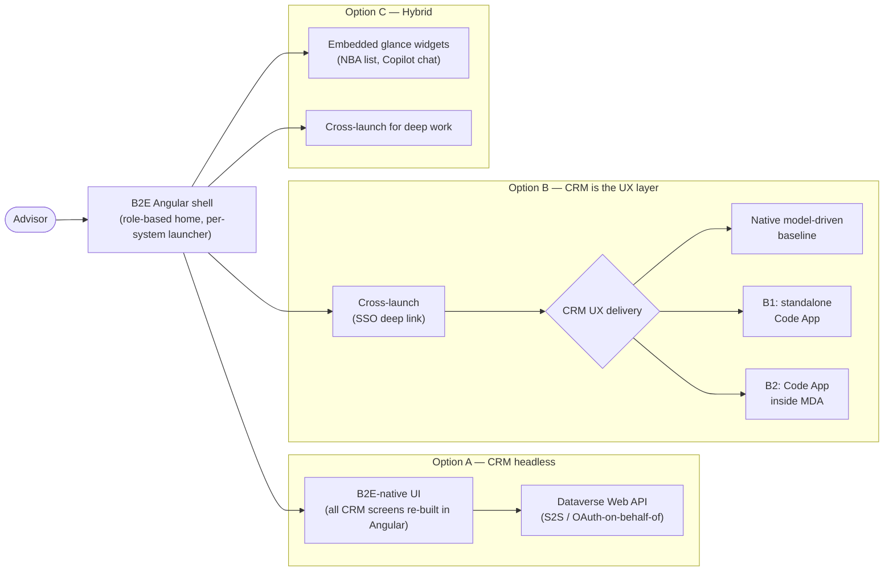

### Option A — CRM headless behind B2E

B2E's own Angular front end owns **100% of the customer-engagement
screens**. CRM is consumed purely as an API: Dataverse Web API for data,
Power Automate/Azure Functions as an optional backend-for-frontend (BFF),
and Copilot Studio's **Direct Line API / Microsoft 365 Agents SDK** for
conversational capability, embedded as a custom Angular component rather
than through the native D365 chat pane. The model-driven Advisor Cockpit is
kept only for administration/configuration, not for daily advisor use.

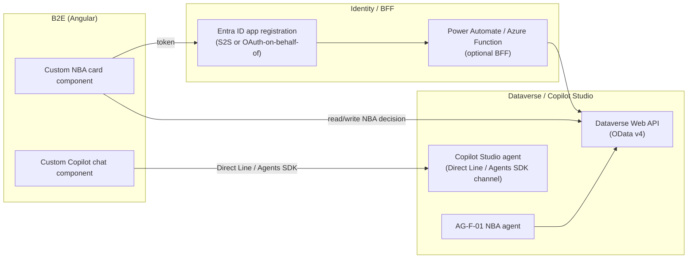

| Endpoint | Capability / service | Role |
| --- | --- | --- |
| Dataverse Web API (OData v4) | Standard Dataverse data access | Read/write NBA cards, Account/Household, decisions |
| Entra ID app registration | S2S client-credentials or OAuth on-behalf-of-user | Token issuance for the Angular app / BFF |
| Power Automate or Azure Function (optional) | Backend-for-Frontend | Shields the Angular app from raw Dataverse semantics, applies business logic |
| Copilot Studio Direct Line API / Microsoft 365 Agents SDK | Documented custom-channel integration for Copilot Studio agents | Embeds AG-F-01/AG-F-04 conversational capability inside a non-Microsoft web app |
| Application Insights (or B2E's existing telemetry) | Custom instrumentation | Since native D365 telemetry is bypassed |

- **Pros.** One consistent visual design system across every system for the
  advisor — no seam between CRM and the other core systems' screens (all are
  reached the "B2E way"). Full control over layout, caching, and offline
  behaviour. Fits the existing "Absprung" mental model if the target state
  is that CRM should **not** be special-cased relative to how other systems
  are visually unified (arguably the opposite reading of "Absprung" — see
  Option B).
- **Cons.** Forfeits nearly every out-of-box Dataverse/Copilot Studio
  capability — forms, business rules, timeline control, Power Apps component
  framework controls, the native embedded Copilot chat pane, and every
  future first-party feature Microsoft ships must be re-built and kept in
  parity by hand. Directly works against
  [DESIGN-PRINCIPLES.md](../DESIGN-PRINCIPLES.md)'s "configuration → low-code
  → pro-code" preference by forcing pro-code for everything. Responsible-AI
  guardrails that ship natively with Copilot Studio's own embedded
  experience (disclosure, content safety, grounding citations) must be
  re-implemented and kept in lockstep. Largest, most open-ended ongoing
  engineering cost of the three options. Highest upgrade impact — a
  Dataverse schema or form change does not surface in the UX until someone
  rebuilds the Angular component.
- **Design pattern.** Backend-for-Frontend (BFF) / API-Gateway — CRM becomes
  purely a "system of engagement API" behind B2E.
- **Licence.** Standard Dataverse API and Copilot Studio message-capacity
  entitlements are still consumed per user even though no native UI is
  shown; add optional Power Automate/Azure Function consumption for the BFF.

#### Advisory Cockpit walk-through (Option A)

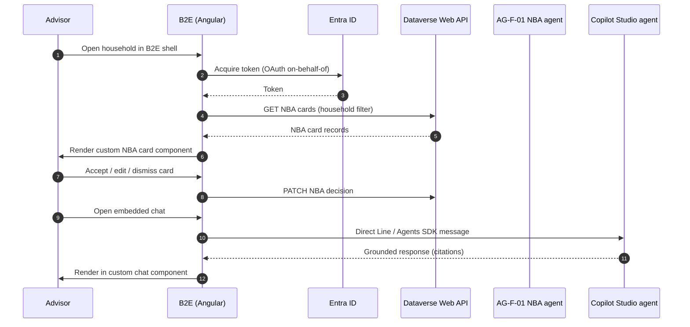

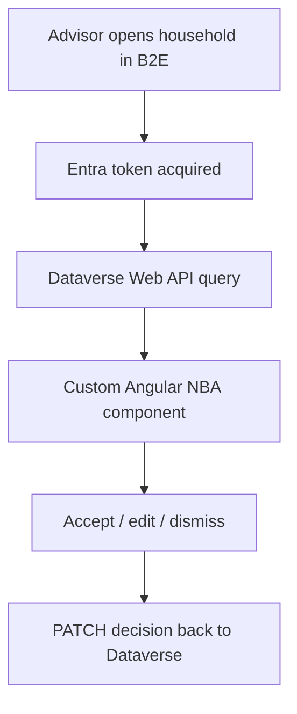

**Note.** The advisor's accept/edit/dismiss decision is still the recorded,
accountable act regardless of which component renders the card
([ADR-0014](./ADR-0014-agents-advisory-by-design.md)) — Option A only changes
**who built the pixels**, not the advisory-by-design guardrail.

### Option B — CRM is the UX layer for customer engagement (cross-launch)

Option B fixes the **ownership boundary**, not the rendering technology:
B2E remains the role-based home screen and performs an Entra-SSO-backed
cross-launch, while Power Apps owns the customer-engagement experience.
CRM is therefore treated like the other core systems rather than rebuilt in
B2E. B0 represents the native model-driven baseline option; two Code App
variants extend the same boundary without selecting an implementation
prematurely.

The B1/B2 parity proof starts at the **CRM UX boundary**. It does not build,
simulate, or test a B2E Angular shell, launcher, SSO hand-off, or integration
contract. B2E remains landscape context for the eventual architecture decision
only.

#### Option B0 — Native model-driven baseline

Under B0, the native D365 model-driven **Advisor Cockpit**, including its
embedded Copilot Studio chat pane, would be where the advisor works customer
engagement. When the advisor selects "Advisory" for a household, B2E would
deep-link to the record as it already does for Versicherungsprozesse,
Schadenprozesse, and ARO.

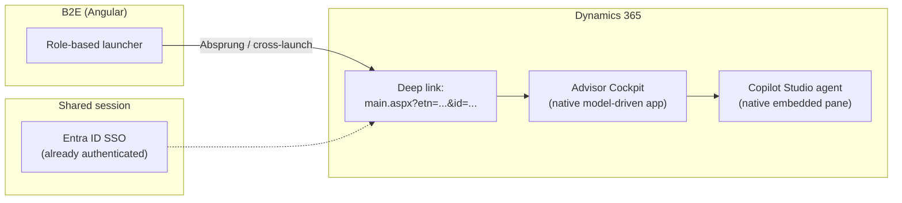

| Endpoint | Capability / service | Role |
| --- | --- | --- |
| B2E role-based launcher | Existing B2E navigation, unchanged pattern | Entry point, same treatment as other core systems |
| Entra ID SSO | Already-established session (no re-authentication) | Seamless cross-launch |
| Dynamics 365 record deep-link URL | Standard, long-supported model-driven app navigation | Opens directly to the relevant household/record |
| Dataverse (native) | Standard forms, business rules, timeline | Full native capability, no re-build |
| Copilot Studio agent (native embedded pane) | Out-of-box D365 chat integration | AG-F-01/AG-F-04 surfaced with no extra integration work |

- **Pros.** Near-zero custom UX code for CRM. Every native capability is
  available immediately and stays available as Microsoft ships new features
  (forms, business rules, timeline, embedded Copilot Chat/Sales Copilot).
  Fully aligned with [DESIGN-PRINCIPLES.md](../DESIGN-PRINCIPLES.md)'s
  config-first preference. Treats CRM exactly like the other core systems —
  no special engineering pattern to invent or maintain. Fastest option to
  deliver and cheapest to keep current across upgrades.
- **Cons.** The advisor experiences a visual/navigational context-switch
  between B2E's shell and the D365 app — acceptable if that is already the
  accepted pattern for the other systems, but it means CRM does not
  contribute to a single, visually unified "one app" feel for the advisor
  over time. Two "homes" to context-switch between for any workflow that
  spans B2E and CRM in the same moment.
- **Design pattern.** Cross-launch / deep-link with SSO — the same
  integration pattern already used for the other core systems, extended to
  CRM rather than inventing a new one.
- **Licence.** Standard Dynamics 365 and Copilot Studio per-user licensing;
  no additional API/BFF consumption.

##### Advisory Cockpit walk-through (Option B0)

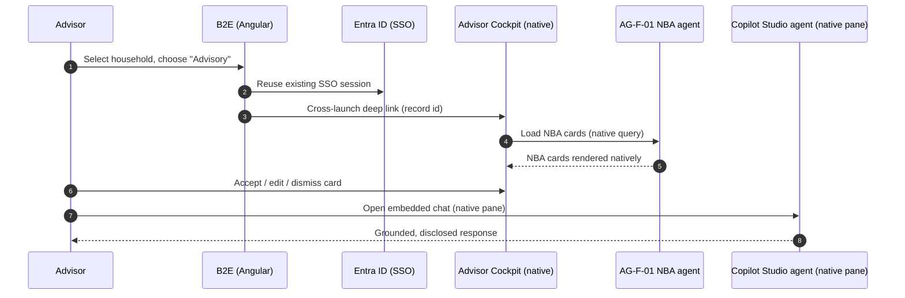

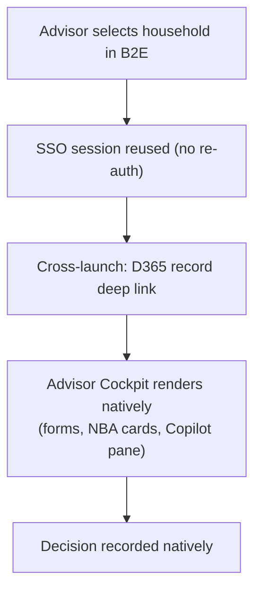

**Note.** Same [ADR-0014](./ADR-0014-agents-advisory-by-design.md) guardrail
applies — this option changes **where** the advisor lands, not who is
accountable for the decision.

#### Option B1 — Standalone Code App as the CRM experience

The advisor opens a full-screen **Power Apps Code App** on the Power Apps
managed host. The Code App receives user, app, environment, Dataverse
organization, query-parameter, and session context from the Power Apps host.
It uses generated, strongly typed Dataverse services under the signed-in
advisor's identity for the bespoke cockpit. Native forms, timeline, views, and
other deep CRM work remain in the model-driven app and are reached through
record-aware deep links from the Code App.

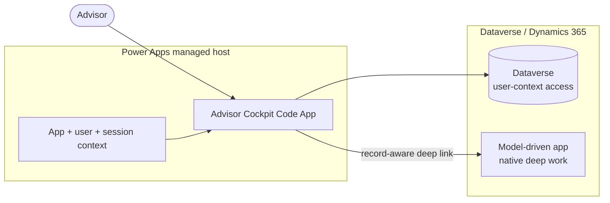

| Endpoint | Capability / service | Role |
| --- | --- | --- |
| Power Apps managed host | Entra authentication, app loading, sharing, DLP, operational telemetry | Runs the standalone Code App |
| `@microsoft/power-apps` context API | App, user, environment, query parameter, and session context | Personalizes the cockpit and correlates telemetry |
| Generated Dataverse services | Strongly typed connector models and operations | Reads cockpit data and records structured human decisions |
| Model-driven app deep link | Standard native navigation | Opens forms, timeline, and other deep CRM work |

- **Pros.** Gives the dense cockpit the full viewport and maximum responsive
  control without iframe/CSP coupling. It retains Power Platform-managed
  Entra authentication, DLP, sharing, monitoring, connectors, and
  solution-aware deployment. It also creates a clear reusable rule: Code Apps
  build bespoke full-page experiences; model-driven configuration builds
  native CRM forms, views, and timelines.
- **Cons.** Adds a second Power Apps navigation surface and an explicit
  Code App-to-MDA hand-off. Native panes and controls do not appear
  automatically inside the standalone Code App, so the boundary must remain
  intentional and record context must survive every deep link. Sharing and
  entitlements apply to both destinations.
- **Design pattern.** Managed-host micro-frontend with native deep-work links.
- **Licence.** Power Apps Premium plus any applicable Dynamics 365 and
  Copilot Studio entitlements; exact persona-level use rights require
  licensing validation.
- **Maturity.** Power Apps Code Apps are generally available. This B1
  composition remains a design option until proved in DEV and TEST.

##### Advisory Cockpit walk-through (Option B1)

Concrete use case: **AG-F-01 Next-Best-Action Agent** writes ranked,
explainable NBA records to Dataverse. The standalone Code App is the advisor's
full-screen work surface; it records the human decision and hands off only
native deep work to the model-driven app.

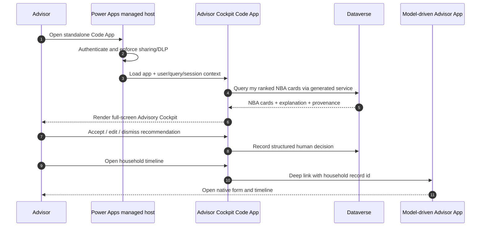

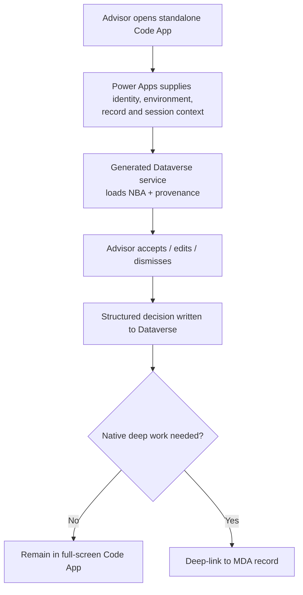

**Challenge exposed by the use case.** B1 is credible only if the selected
record and advisor context survive the Code App-to-MDA hand-off, the same
Dataverse security role constrains both surfaces, and the advisor's decision is
written exactly once. A visually successful standalone cockpit that loses
record context or creates a second decision path fails the proof.

#### Option B2 — Code App embedded in the model-driven Advisor App

The advisor opens the model-driven Advisor App, which hosts the deployed Code
App in a full-page sitemap web-resource iframe while retaining the MDA command
surface, forms, timeline, and native navigation around it. The environment's
Content Security Policy adds only the specific Dynamics 365 organization
origin to `frame-ancestors`; same-tenant users still require the Code App to be
shared with them.

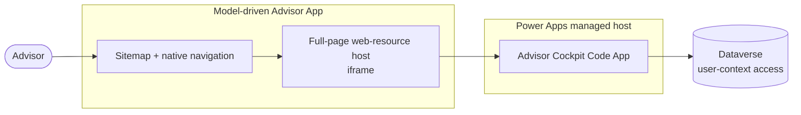

| Endpoint | Capability / service | Role |
| --- | --- | --- |
| Model-driven Advisor App | Sitemap, forms, views, timeline, native navigation | Owns the containing CRM shell |
| Full-page web-resource iframe | Supported host for the Code App play URL | Places the bespoke cockpit inside the MDA |
| Environment CSP `frame-ancestors` | Least-privilege organization-origin allowlist | Permits the MDA to frame the Code App |
| Power Apps managed host + generated Dataverse services | Entra-authenticated runtime and typed data access | Runs the cockpit and records the advisor decision |

- **Pros.** Keeps advisors inside one CRM navigation model and places bespoke
  Code App pages beside native forms and views. Native deep work is one MDA
  navigation action away, while Code App source retains normal React,
  TypeScript, Vite, and test practices.
- **Cons.** Adds a web-resource host, environment-specific CSP
  configuration, nested loading/navigation, and viewport/accessibility
  constraints. The embedded path must be tested in the real MDA, not only in
  the standalone player. Framed Code Apps are same-tenant only, and both MDA
  access and Code App sharing must be correct.
- **Design pattern.** Governed iframe micro-frontend inside the native CRM
  shell.
- **Licence.** Power Apps Premium plus any applicable Dynamics 365 and
  Copilot Studio entitlements; exact persona-level use rights require
  licensing validation.
- **Maturity.** Power Apps Code Apps and documented iframe hosting are
  generally available. This B2 composition remains a design option until
  proved in DEV and TEST.

##### Advisory Cockpit walk-through (Option B2)

The same **AG-F-01** NBA records validate B2, but the model-driven Advisor App
owns the outer navigation and hosts the Code App cockpit. The walkthrough
therefore tests the extra CSP, iframe, sharing, and nested-navigation boundary
that B1 avoids.

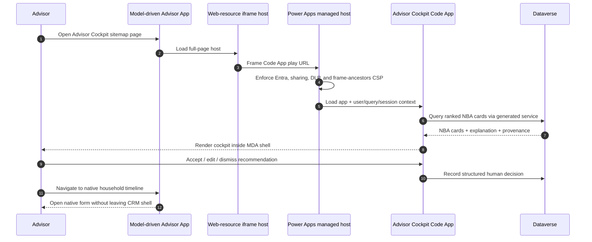

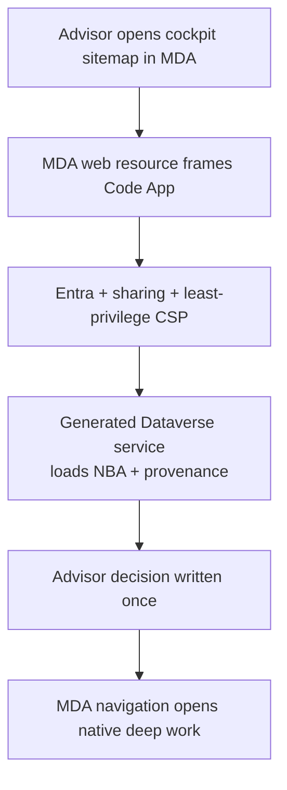

**Challenge exposed by the use case.** B2 is credible only if the embedded
cockpit receives the correct household context, fits the production MDA
viewport without nested-navigation or accessibility regressions, and survives
DEV-to-TEST promotion with environment-specific CSP and app identity resolved
without source edits. Passing the standalone Code App tests alone does not
prove B2.

#### Option B Code App variant comparison

| Criterion | B1 — Standalone Code App | B2 — Embedded Code App |
| --- | --- | --- |
| Advisor shell | Dedicated full-screen Power Apps experience | Model-driven Advisor App |
| Native CRM deep work | Record-aware cross-launch from Code App | Adjacent MDA navigation |
| Viewport and responsive freedom | Highest | Constrained by MDA + iframe host |
| Environment configuration | App identity, sharing, and solution deployment | Same, plus least-privilege CSP `frame-ancestors` |
| Runtime coupling | Code App + Dataverse | Code App + iframe host + MDA + Dataverse |
| Primary failure mode | Lost context or duplicate UX across Code App/MDA | CSP, sharing, viewport, or nested-navigation failure |
| Required E2E proof | Power Apps player → Code App → decision → MDA deep link | MDA sitemap → embedded Code App → decision → native page |

Neither B1 nor B2 is selected. Both preserve the candidate engineering rule
that Code Apps are primary for **bespoke full-page experiences**, while
model-driven configuration remains primary for forms, views, timelines, and
other native CRM capabilities.

The approved visual baseline for this proof is the fixture-backed local PCF
harness and its captured screenshots. Although the PCF artifact is deployed to
DEV, it is not attached to a user-visible running surface and is therefore
neither live comparison evidence nor a runtime fallback. The live comparison
is B1 versus B2 in DEV and TEST.

### Option C — Hybrid: embedded glance surfaces + cross-launch for deep work

B2E embeds lightweight, high-frequency "glance" widgets directly in its own
shell — an NBA card list and a Copilot Studio chat widget, both reached
headlessly (Dataverse Web API reads + Copilot Studio's Direct Line/Agents
SDK embed) — while anything deeper (editing an Opportunity, full timeline,
case work) still cross-launches into the native Advisor Cockpit exactly as
in Option B. This is a genuine middle ground, not a compromise invented for
its own sake: it targets the highest-frequency, highest-value interactions
for in-shell treatment while leaving everything else on the native,
zero-maintenance path.

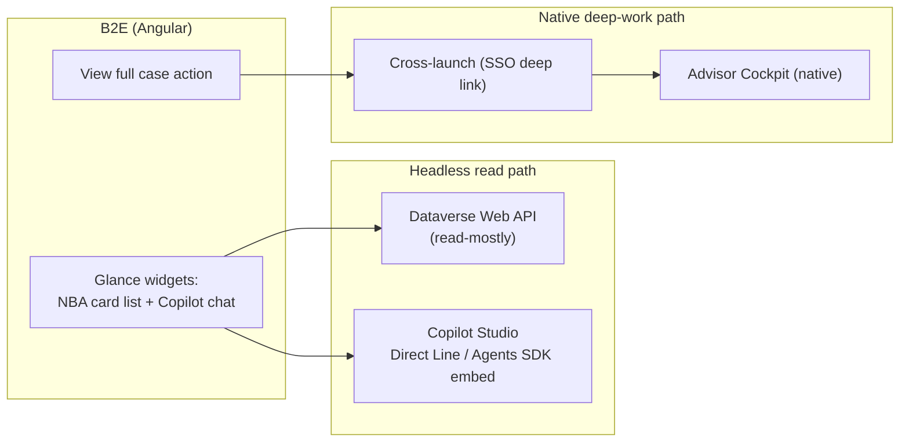

| Endpoint | Capability / service | Role |
| --- | --- | --- |
| Dataverse Web API (read-mostly) | Same mechanism as Option A, scoped to glance widgets | Populates the in-shell NBA card list |
| Copilot Studio Direct Line / Agents SDK embed | Same mechanism as Option A | Embedded chat widget for quick questions |
| Dynamics 365 record deep-link + SSO | Same mechanism as Option B | "View full case" / edit actions |
| Advisor Cockpit (native) | Full native forms/business rules | Deep work surface, unchanged from Option B |

- **Pros.** Delivers the "orchestrated front end" goal for the interactions
  advisors do most often, inside B2E's own visual chrome, without having to
  re-build the *entire* CRM UI. Incremental — glance widgets can be added
  surface by surface as value is proven. Concentrates the custom-build
  effort on the highest-frequency screens only, leaving the long tail of
  CRM functionality on the zero-maintenance native path.
- **Cons.** Two integration mechanisms to build, govern, and keep
  consistent (headless API/Copilot embed **and** deep-link/SSO). Requires
  deliberate UX design so "when do I stay in B2E vs. get sent to D365" is
  never ambiguous to the advisor. Parity risk — the glance widget's NBA
  card must track whatever the native cockpit does, or the two surfaces
  drift apart over time. Governance question: which Copilot Studio channel
  (native pane vs. custom Direct Line embed) is the system of record for a
  given conversation needs an explicit answer.
- **Design pattern.** Composite UI / micro-frontend — selective headless
  integration for high-frequency reads, native deep-link for everything
  else.
- **Licence.** A superset of A and B — Dataverse API/Copilot Studio message
  consumption for the glance widgets, plus standard per-user D365/Copilot
  Studio licensing for the deep-work path.

#### Advisory Cockpit walk-through (Option C)

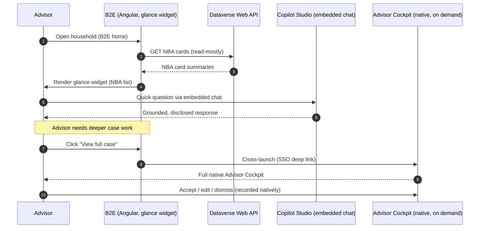

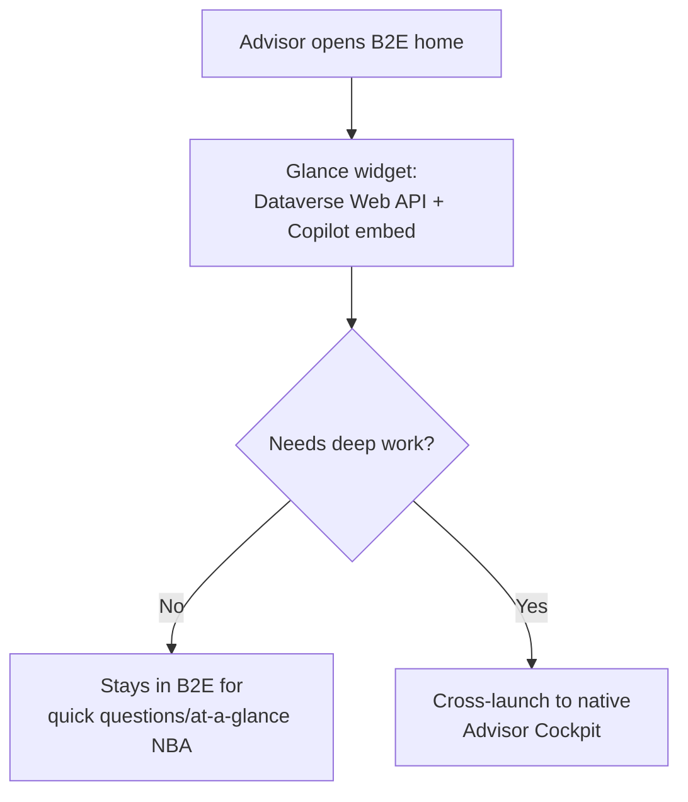

**Note.** Same [ADR-0014](./ADR-0014-agents-advisory-by-design.md) guardrail
applies to both paths — the glance widget's "accept/edit/dismiss" and the
native cockpit's are the same recorded act, just captured from two entry
points.

## Comparison

| Criterion | Option A — CRM headless | Option B — CRM is the UX layer | Option C — Hybrid |
| --- | --- | --- | --- |
| Custom UI build/maintenance burden | Highest — everything re-built | None for B0; focused bespoke-page build for B1/B2 | Medium — glance widgets only |
| Native D365/Copilot Studio feature inheritance | None — must be re-implemented | Full in B0/deep-work MDA; deliberate hand-off from B1/B2 | Full for deep work; partial for glance widgets |
| Consistency with other core systems' pattern | Diverges — CRM is special-cased into B2E | Matches — same cross-launch pattern as ARO/Versicherungsprozesse/Schadenprozesse | Matches for deep work; diverges for glance widgets |
| Time to deliver | Slowest | B0 fastest; B1 simpler than B2 | Medium |
| Responsible AI/Content Safety inheritance | Must be re-implemented and kept in parity | Native for MDA capabilities; explicitly implemented/tested in bespoke B1/B2 pages | Inherited for deep work; must be re-verified for the embedded chat widget |
| Advisor context-switch | None — one shell throughout | B0: B2E→MDA; B1 adds Code App→MDA; B2 stays inside MDA | Only when deep work is needed |
| Licence cost driver | Dataverse API + Copilot Studio message consumption, possibly BFF compute | Dynamics 365 for B0; B1/B2 add Power Apps Code App entitlement validation | Superset of A and B |
| Upgrade impact | High | Low for B0; medium for focused B1/B2 pages | Medium |
| Reversibility | Low — large custom investment to unwind | High for B0; medium-high for isolated B1/B2 pages | Medium — glance widgets to unwind, deep-link path unaffected |
| Design pattern fit | BFF / API Gateway | Cross-launch + native baseline or managed-host micro-frontend | Composite UI / micro-frontend |

## Decision or working hypothesis

**No option is selected, and no lean is stated.** All three are credible;
the trade-offs above are presented for the Enterprise Architect and the
customer's IT/architecture stakeholders to weigh together. Option C is
flagged as a genuine middle ground worth particular attention because it
does not force an all-or-nothing choice between "rebuild everything" and
"accept every context-switch" — but it is not automatically the
recommendation, since it also carries the added governance burden of
running two integration mechanisms at once.

Option B now has three delivery shapes: native baseline B0 and Code App
variants B1/B2. No delivery shape is selected either. The Advisory Cockpit
walkthrough is mandatory for each future variant added to this ADR: an option
that cannot preserve identity, CRM record context, one accountable human
decision, and a governed DEV-to-TEST path is not a viable architecture option.

## Evidence and assumptions

- **Known (verified).** Dataverse Web API supports server-to-server (S2S)
  and OAuth on-behalf-of-user authentication for external web applications
  (Microsoft Learn, "Build web applications using server-to-server (S2S)
  authentication"). Copilot Studio agents support integration into custom
  web/native applications via the **Microsoft 365 Agents SDK** or the
  **Direct Line API** as a documented alternative when the Agents SDK
  doesn't cover the scenario (Microsoft Learn, "Integrate with web or native
  apps by using Microsoft 365 Agents SDK"). Dynamics 365 model-driven app
  record deep-link URLs are a long-standing, supported navigation
  mechanism. Embedding *other* content inside a model-driven app form via
  an iframe control is documented and includes an explicit
  "restrict cross-frame scripting" security property (Microsoft Learn,
  "Add an iframe to a model-driven app main form") — the **reverse**
  (embedding the whole D365 UCI app inside a third-party shell via iframe)
  is not a documented, supported pattern and is deliberately **not**
  proposed as an option here.
- **Known (verified, Code Apps).** Power Apps Code Apps are generally
  available and run on the Power Apps managed host with Entra authentication,
  DLP, sharing, and platform monitoring. The Power Apps client library
  generates models/services for connector requests; `getContext` exposes app,
  environment, Dataverse organization, query-parameter, user, tenant, and
  session context. Microsoft documents framing a deployed Code App in a
  model-driven app web resource and requires the Dynamics 365 organization
  origin in the environment's CSP `frame-ancestors`; embedded users must be
  in the same tenant. Source: [Code Apps architecture](https://learn.microsoft.com/power-apps/developer/code-apps/architecture),
  [get context](https://learn.microsoft.com/power-apps/developer/code-apps/how-to/retrieve-context),
  and [embed in an iframe](https://learn.microsoft.com/power-apps/developer/code-apps/how-to/embed-iframe).
- **Inferred, not yet confirmed.** That B2E already performs SSO-backed
  cross-launch for Versicherungsprozesse/Schadenprozesse/ARO today, as
  described conceptually by the customer — the actual mechanism (deep link,
  token-sharing, session hand-off) is not independently verified. B2E's own
  extensibility model — whether it can host third-party embedded widgets at
  all, which would gate Option C and Option A.
- **Evidence still required.** Journey-mapping with real advisors on how
  disruptive the B2E↔D365 context-switch actually is today for the other
  core systems (this directly informs whether Option B's "con" is a real
  problem or a non-issue). B2E's current technical documentation
  (framework version, hosting, extensibility APIs). Copilot Studio Direct
  Line channel governance and message-cost model at the customer's actual
  advisor headcount.
- **Evidence still required for B1/B2.** A like-for-like Advisory Cockpit
  proof in DEV and TEST: generated Dataverse service behavior under the
  advisor role; app/session context and record-aware navigation into native MDA
  work; one-write decision semantics; responsive/accessibility results;
  telemetry correlation; Code App sharing and environment rebinding; and, for
  B2 only, least-privilege CSP plus real MDA viewport/navigation behavior. B2E
  integration evidence is explicitly outside this proof.

## Validation and review triggers

Reopen this ADR when: the customer's IT team documents B2E's actual
architecture and extensibility model; a journey-mapping exercise with real
advisors is run against the existing cross-launch pattern; [ADR-0034](./ADR-0034-aro-case-task-management-integration-pattern.md)
(ARO integration) clarifies exactly how the "Absprung" mechanism works
today, since that is the closest working precedent for Option B/C's
endpoint table; or a proof-of-concept of Option C's glance widget is built
and advisor feedback is collected. Decision owner: `AG-E-03` Enterprise
Architect (accountable), with `AG-E-02` Developer, `AG-E-06`
Responsible-AI & Compliance Officer, and the customer's IT/Architect
stakeholder as required reviewers.

For B1/B2 specifically, reopen when the Advisory Cockpit proof produces DEV
and TEST evidence or when Code Apps hosting, ALM, licensing, CSP, context, or
model-driven embedding guidance changes. A local Vite pass or standalone
player screenshot is insufficient evidence for either end-to-end option.

## Consequences

- **At the next release.** No implementation ships from this ADR alone — it
  is evaluation only, pending stakeholder discussion.
- **Operationally.** Whichever option is chosen reshapes how `AG-F-01`
  Next-Best-Action, `AG-F-03` Case Management prefill, and `AG-F-04`
  Conversation Intelligence agents are actually delivered to the advisor —
  cross-reference [AGENTS.md](../../AGENTS.md) once decided.
- **Contract with ADR-0032.** The Entra ID token and Conditional Access
  posture from [ADR-0032](./ADR-0032-entra-power-platform-dynamics365-identity-access-management.md)
  underpins all three options equally — this ADR does not change that
  model, only how the resulting token is used to reach CRM's surfaces.
- **Contract with ADR-0034.** The ARO integration pattern
  ([ADR-0034](./ADR-0034-aro-case-task-management-integration-pattern.md))
  should use the same UX-placement answer this ADR eventually settles on,
  for consistency across the B2E landscape's core systems.
- **Reversibility.** Highest for Option B0 (native, nothing custom to
  unwind), medium-high for B1/B2 because each bespoke page remains isolated,
  lowest for Option A (large custom investment), and medium for Option C.

## Competitive note

Many insurers either bolt on a separate employee portal with no technical
bridge back to the CRM's own AI capability (forcing advisors to
double-enter or forgo Copilot assistance inside the portal), or accept full
vendor lock-in to a single monolithic front end. Demonstrating that
Dataverse and Copilot Studio support a genuine **spectrum** — from fully
headless API consumption to fully native, with a documented, incremental
hybrid in between — shows the customer does not have to make an
irreversible, all-or-nothing UX bet on day one.
