# ADR-0034 — ARO Case/Task Management Integration Pattern and Opportunity Migration

| Field | Value |
| --- | --- |
| **Status** | Proposed hypothesis |
| **Date** | 2026-08-15 |
| **Decision mode** | Working hypothesis — **no option selected, no lean stated**; fully open for Enterprise Architect + customer IT/architecture stakeholder review |
| **Confidence** | Low–Medium — the Kafka connectivity substrate is already evaluated in [ADR-0031](./ADR-0031-crm-core-systems-kafka-confluent-integration-pattern.md); ARO's actual event/API capability, its exact Kafka topic ownership boundary versus Versicherungsprozesse/Schadenprozesse, and its historical Opportunity data quality are not yet confirmed |
| **Deciders** | `AG-E-09` Integration Engineer (accountable — event contracts, versioning) · `AG-E-03` Enterprise Architect · `AG-E-05` CRM Domain Expert / `AG-E-10` Insurance Domain Expert (Opportunity/Quote business semantics) · customer IT/Architect (`P-06`) |
| **Topic area** | A2 — Data model (Opportunity/Quote ownership boundary) · A3 — Integration, interfaces, system orchestration · A5 — Workflow/business cases (the sales process spans ARO and CRM today) |
| **Use case** | Illustrated with **AG-F-01 Next-Best-Action Agent** (Advisory Cockpit) walk-throughs below each option |
| **Licence** | `[TBD]` — reuses whichever Confluent Cloud/connector licensing model [ADR-0031](./ADR-0031-crm-core-systems-kafka-confluent-integration-pattern.md) settles on; Option C additionally needs a temporary reconciliation-service compute budget |
| **Upgrade impact** | Medium for Option A (adds one more projection, same shape as existing Policy/Claim/Quote projections) · High for Option B (one-time cutover with historical data migration) · High for Option C while the reconciliation layer is live, then reduces to Low once decommissioned |
| **CAF methodology** | Plan · Adopt — deciding and rolling out the target Opportunity ownership model |
| **WAF pillar(s)** | Primary: Reliability (dual-write/cutover consistency risk) and Operational Excellence. Trade-off against: Cost Optimization (Option C's temporary reconciliation layer) |
| **Zero Trust** | The ARO↔CRM event flow reuses the same verified-service-identity posture as [ADR-0031](./ADR-0031-crm-core-systems-kafka-confluent-integration-pattern.md) — no new identity pattern is introduced here |
| **Responsible AI** | `AG-F-01`'s Next-Best-Action scoring is only as current as the case/quote signal it receives; a migration in flight (Option C) risks a temporary staleness window between ARO and CRM that must be disclosed in the NBA card's "as of" timestamp, not hidden |

> **Illustrative naming note.** "ARO" (Arbeits-Organisations-System) and its
> description — a dedicated system managing insurance quotes/offers,
> contracts-in-progress, and claim case-work, separate from
> Versicherungsprozesse and Schadenprozesse — are as described by the
> customer. Whether ARO or Schadenprozesse is the actual publisher of the
> `claim.status-changed` Kafka topic named in
> [ADR-0031](./ADR-0031-crm-core-systems-kafka-confluent-integration-pattern.md)
> is **not confirmed** — this ADR treats that boundary conservatively (see
> Evidence and assumptions) rather than asserting it either way. Topic names
> below are illustrative, following the same convention as ADR-0031's.

## Context

The customer's system landscape includes a dedicated, separate **case/task
management system — ARO** — that handles insurance quotes/offers and
contracts-in-progress ("Versicherungs Offerten und Verträge") as well as
claim case-work ("Schadenfälle"), distinct from the Versicherungsprozesse
and Schadenprozesse engines already covered by
[ADR-0031](./ADR-0031-crm-core-systems-kafka-confluent-integration-pattern.md).
Two facts make this directly relevant to CRM's data model:

1. **Sales Opportunities ("Verkaufschancen") currently live on ARO, and the
   customer has stated they should be replaced** — moved to CRM. This is
   not a new decision: [ADR-0008](./ADR-0008-thin-crm-over-systems-of-record.md)
   already lists **Opportunity** among the demand-side objects CRM natively
   owns (alongside LeadCluster, Activity, Consent, Case, NextBestAction),
   while **Policy, Claim, and Quote** exist as CRM-side projections carrying
   external reference keys back to the systems of record. ARO's role as the
   *current* home for Opportunities was simply not known when ADR-0008 was
   written. This ADR operationalises what ADR-0008 already decided in
   principle, now that the concrete legacy owner is known.
2. **ARO's claim case-work and quote-in-progress data still belongs on
   ARO** — this ADR does not propose absorbing quote calculation or claims
   adjudication into Dataverse, consistent with the non-negotiable
   [ADR-0008](./ADR-0008-thin-crm-over-systems-of-record.md) thin-CRM
   position.

[ADR-0031](./ADR-0031-crm-core-systems-kafka-confluent-integration-pattern.md)
already evaluated **how** to build a Kafka connection to a core system
(direct client, managed connector, dedicated microservice, or native
Dataverse push) — that mechanism decision is not reopened here. This ADR
adds ARO as a system sharing that same substrate and focuses on the
question ADR-0031 did not have the information to ask: **what should
happen to the Opportunity object that currently lives on ARO?**

Scope, as agreed with the user:

- **In scope.** (1) The integration pattern for ARO's case/claim/quote
  visibility into CRM (a shared surface, common to every option below), and
  (2) the Opportunity ownership/migration model (where the options differ).
- **Out of scope, deliberately.** Lead intake from Comparis into ARO, and
  the Salesforce → Dynamics 365 Marketing campaign-management migration —
  both deferred to a later ADR on the CRM lead/opportunity/campaign
  external landscape. Claims adjudication and quote-calculation logic
  itself, which stays on ARO/Schadenprozesse/Versicherungsprozesse
  regardless of which option is chosen.
- **Validating use case.** **AG-F-01 Next-Best-Action Agent** (Advisory
  Cockpit) — illustrated below: an NBA card that should reflect both an
  in-progress quote and an open claim for the same household, and how an
  Opportunity is created/managed under each option.

This ADR does **not** pick an option. It documents three credible patterns
so the Enterprise Architect and the customer's IT stakeholders can choose
with the trade-offs in front of them, exactly as
[ADR-0030](./ADR-0030-dataverse-to-databricks-integration-pattern.md),
[ADR-0031](./ADR-0031-crm-core-systems-kafka-confluent-integration-pattern.md),
[ADR-0032](./ADR-0032-entra-power-platform-dynamics365-identity-access-management.md),
and [ADR-0033](./ADR-0033-crm-ux-placement-in-b2e-landscape.md) did before
it.

## Shared integration surface (applies to every option)

Regardless of which Opportunity-migration option is chosen, CRM needs
read-visibility into ARO's case/claim/quote status for the Advisory Cockpit
— this part is common ground, not itself in dispute.

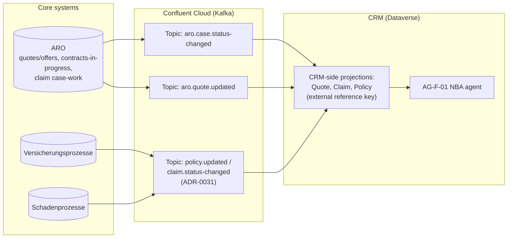

| Endpoint | Capability / service | Role |
| --- | --- | --- |
| Confluent Cloud Kafka topics | `aro.case.status-changed`, `aro.quote.updated` (new, illustrative naming, mirrors ADR-0031's `policy.updated`/`claim.status-changed` convention) | Event backbone for ARO visibility |
| Connectivity mechanism | Whichever of ADR-0031's four options (direct Kafka client, managed connector, dedicated microservice, native Dataverse push) the customer selects | Reused, not re-decided here |
| CRM-side projections | Extends the existing Quote/Claim/Policy projection pattern ([ADR-0008](./ADR-0008-thin-crm-over-systems-of-record.md)) | Read-through summary with external reference key back to ARO |
| AG-F-01 NBA agent | Consumes the projections as scoring input | E.g. "household has an open claim" or "quote in progress" as an NBA signal |

## Options

The three options below differ only in **where the Opportunity object is
authoritative** and **how the transition happens** — not in the shared
visibility surface above.

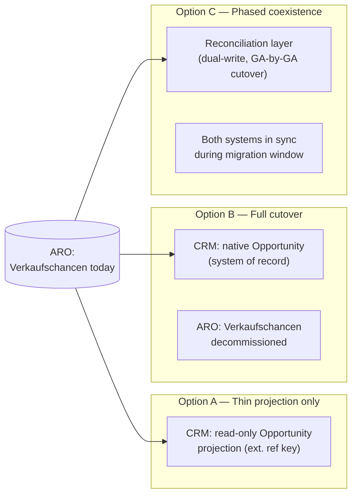

### Option A — Thin projection only (ARO stays authoritative)

CRM does not migrate Opportunity ownership. ARO remains the system of
record for Verkaufschancen; CRM extends the same projection pattern already
used for Policy/Claim/Quote to also cover Opportunity — a read-only summary
with an external reference key (`aro_opportunityid`), refreshed via the
`aro.quote.updated` topic. Any create/edit action happens in ARO's own UI,
reached via the B2E cross-launch pattern
([ADR-0033](./ADR-0033-crm-ux-placement-in-b2e-landscape.md)). Included here
as the honest baseline for comparison, even though it does not realise the
customer's stated aspiration to replace ARO's Verkaufschancen capability.

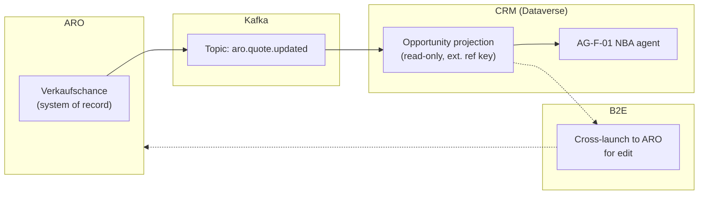

| Endpoint | Capability / service | Role |
| --- | --- | --- |
| `aro.quote.updated` Kafka topic | Same substrate as the shared surface above | Keeps CRM projection current |
| CRM Opportunity table | Read-only projection, `aro_opportunityid` external key | Advisory Cockpit summary/scoring only |
| B2E cross-launch | Same mechanism as [ADR-0033](./ADR-0033-crm-ux-placement-in-b2e-landscape.md) Option B | Advisor edits the opportunity on ARO's native UI |

- **Pros.** Minimal change — reuses the already-established Policy/Claim/
  Quote projection pattern, nothing new to design. No business-process
  disruption; no historical data migration; fastest and lowest-risk of the
  three options; no reconciliation layer to build or later decommission.
- **Cons.** Does **not** realise the customer's explicitly stated goal that
  Verkaufschancen "soll abgelöst werden" (should be replaced). The sales
  workflow stays split across two systems and two UIs. CRM's native
  sales-pipeline capability (forecasting, sales stages, Copilot-assisted
  opportunity scoring/Sales Copilot) goes unused for the core sales motion,
  leaving real product value on the table. Does not reduce ARO's footprint
  at all.
- **Design pattern.** Read-through projection with external reference key —
  identical in shape to the existing Policy/Claim/Quote pattern.
- **Licence.** No new licence driver beyond the existing Kafka connectivity
  mechanism; CRM's native Sales Copilot/forecasting features remain unused
  and therefore uncosted (and unrealised).

#### Advisory Cockpit walk-through (Option A)

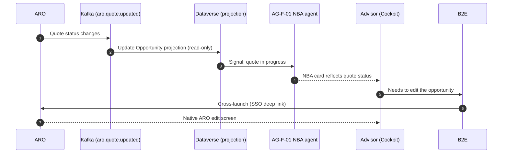

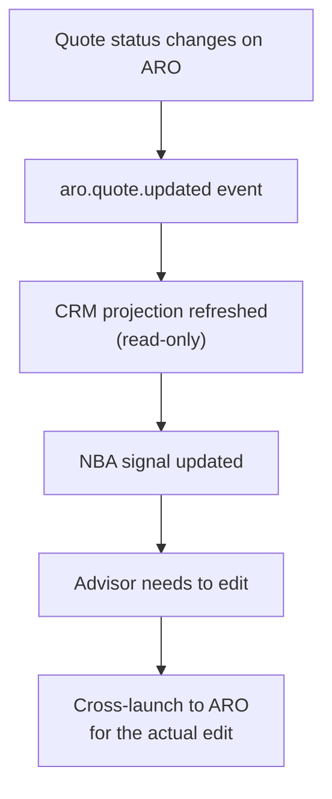

**Note.** The advisor's NBA accept/edit/dismiss decision stays the recorded
act ([ADR-0014](./ADR-0014-agents-advisory-by-design.md)); this option only
changes where the underlying Opportunity is actually edited.

### Option B — Full cutover (CRM becomes system of record)

On a defined cutover date, CRM's native Opportunity entity becomes the
system of record for Verkaufschancen; ARO's Opportunity/Verkaufschancen
capability is decommissioned (its claim case-work and quote-calculation
capability are unaffected). Historical Opportunity data migrates from ARO
to Dataverse once. Going forward, when a CRM Opportunity is won, CRM
publishes an outbound event (e.g. `crm.opportunity-won`) so
Versicherungsprozesse/ARO can create the resulting contract — the reverse
direction of ADR-0031's existing outbound pattern
(`crm.address-changed`).

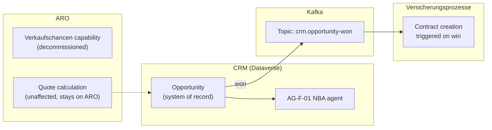

| Endpoint | Capability / service | Role |
| --- | --- | --- |
| CRM Opportunity table | Native Dataverse entity, full sales-pipeline/Sales Copilot capability | System of record |
| One-time migration job | Bulk data migration, ARO Opportunity history → Dataverse | Historical continuity |
| `crm.opportunity-won` Kafka topic (outbound) | Reuses ADR-0031's outbound mechanism | Triggers contract creation in Versicherungsprozesse |
| ARO Verkaufschancen capability | Decommissioned for this object type only | Quote calculation and claims case-work unaffected |

- **Pros.** Directly realises the customer's stated target state.
  Consolidates the sales pipeline in one system, matching the "one CRM"
  vision. Unlocks native Sales Copilot/forecasting/AI-assisted scoring for
  the core sales motion. Reduces total system count for that capability —
  a simpler landscape going forward, one less UI for advisors to learn.
- **Cons.** Highest-risk, single-cutover approach — any advisor workflow
  built around ARO's opportunity screens must be retrained/rebuilt at once.
  Requires a clean, one-time historical data migration (data quality risk
  from a highly customised legacy system). The `crm.opportunity-won` →
  contract-creation event contract must be schema-correct, idempotent, and
  failure-handled **before** cutover — a missed event means a sale never
  becomes a policy. Low reversibility once ARO's capability is switched
  off, unless an explicit rollback plan is built and rehearsed.
- **Design pattern.** System-of-record cutover / hard migration.
- **Licence.** Standard Dataverse Sales/Sales Copilot per-user licensing;
  no ongoing dual-system cost once cutover completes.

#### Advisory Cockpit walk-through (Option B)

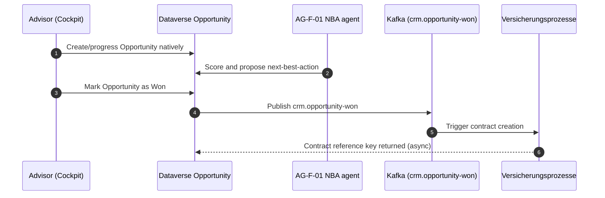

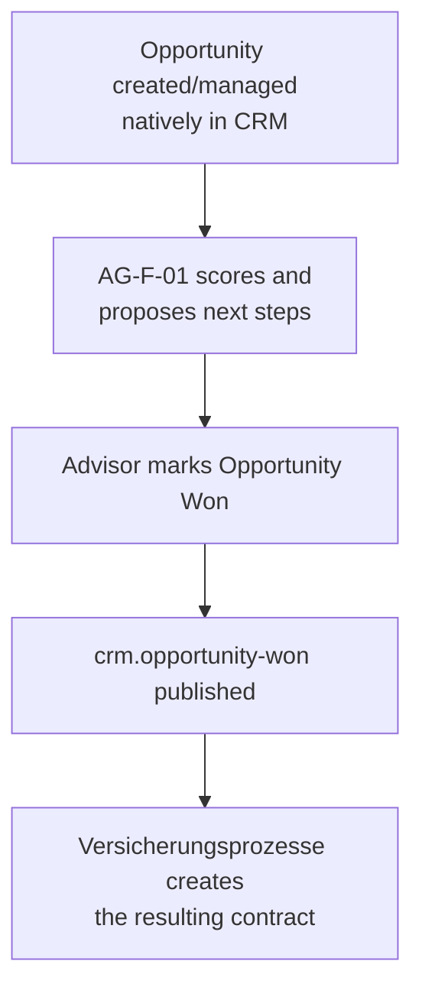

**Note.** [ADR-0014](./ADR-0014-agents-advisory-by-design.md)'s
advisory-by-design guardrail is unaffected — the advisor still marks the
Opportunity won; the agent only scores and recommends.

### Option C — Phased/coexistence migration (Strangler Fig)

Both systems run in parallel during a defined migration window. A
reconciliation layer (an Azure Function or Power Automate flow, in the
same shape as [ADR-0031](./ADR-0031-crm-core-systems-kafka-confluent-integration-pattern.md)'s
Option A/C) keeps CRM's Opportunity and ARO's Verkaufschance in sync,
bidirectionally, for a defined subset — a pilot GA or a single product
line — before expanding. ARO's Opportunity capability is switched off only
once every GA/product has cut over, at which point the reconciliation
layer itself is decommissioned.

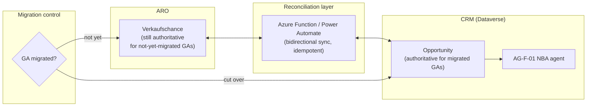

| Endpoint | Capability / service | Role |
| --- | --- | --- |
| Reconciliation layer | Azure Function / Power Automate, reusing ADR-0031's shape | Bidirectional, idempotent sync during the migration window |
| Migration control (per-GA/product flag) | Feature-flag style rollout | Determines which system is authoritative for a given GA/product |
| CRM Opportunity table | Authoritative only for cut-over GAs | Partial system of record during the window |
| ARO Verkaufschance | Authoritative for not-yet-migrated GAs | Decommissioned only at 100% cutover |

- **Pros.** Lowest business risk of the three — realistic for a highly
  customised legacy system where hidden dependencies are likely (the same
  caution [ADR-0019](./ADR-0019-provisional-insurance-data-model-shape.md)
  applies to the Contoso Insurance Siebel-mirrored option). Lets the CRM Opportunity
  model be validated against real advisor workflows before full commitment.
  Rollback is possible per-GA at any point during the window. Matches the
  well-understood Strangler Fig pattern for legacy modernisation.
- **Cons.** Requires building **and later decommissioning** a temporary
  reconciliation layer — real engineering cost twice over. Risk of the two
  systems drifting or double-counting an Opportunity if the reconciliation
  logic has a defect. Longest calendar time to reach the target state.
  Advisors and support staff must stay trained on two systems' worth of
  Opportunity UI for the duration of the migration window.
- **Design pattern.** Strangler Fig — incremental migration with a
  reconciling façade, retired once the migration completes.
- **Licence.** Adds temporary Azure Function/Power Automate compute for
  the reconciliation layer, on top of standard Dataverse Sales licensing
  once a GA has cut over.

#### Advisory Cockpit walk-through (Option C)

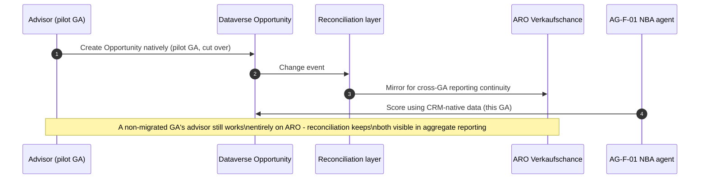

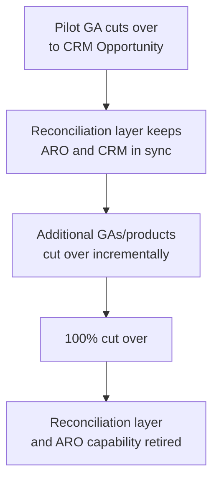

**Note.** As in Options A and B, [ADR-0014](./ADR-0014-agents-advisory-by-design.md)'s
guardrail is unchanged throughout the migration window regardless of which
system the advisor is currently working in.

## Comparison

| Criterion | Option A — Thin projection | Option B — Full cutover | Option C — Phased coexistence |
| --- | --- | --- | --- |
| Realises the customer's stated goal (replace ARO's Verkaufschancen) | No | Yes, immediately | Yes, incrementally |
| Business risk | Lowest | Highest — single cutover | Lowest of the migration paths |
| Calendar time to target state | N/A — never migrates | Fastest | Slowest |
| Custom engineering cost | Lowest | Medium — one-time migration + event contract | Highest — build and later decommission a reconciliation layer |
| Uses native D365 Sales/Sales Copilot capability | No | Yes, fully | Yes, per cut-over GA |
| Historical data migration required | No | Yes, once, all at once | Yes, incrementally per GA |
| Rollback / reversibility | High (nothing to unwind) | Low once ARO is decommissioned | Medium — rollback possible per-GA during the window |
| Licence cost driver | None new | Standard Dataverse Sales licensing | Standard Dataverse Sales licensing + temporary reconciliation compute |
| Design pattern fit | Read-through projection (existing shape) | Hard cutover | Strangler Fig |

## Decision or working hypothesis

**No option is selected, and no lean is stated.** All three are credible;
the trade-offs above are presented for the Enterprise Architect and the
customer's IT/architecture stakeholders to weigh together. Option C follows
the customary caution applied elsewhere in this repository to highly
customised legacy landscapes (the same caution
[ADR-0019](./ADR-0019-provisional-insurance-data-model-shape.md) applies to
Contoso Insurance's Siebel-mirrored option), but it is not presented as a
recommendation — Option B may be entirely appropriate if ARO's Opportunity
data and business rules turn out to be simpler than assumed, and Option A
remains valid if the customer decides the migration is not worth the
engineering cost right now.

## Evidence and assumptions

- **Known (verified).** [ADR-0008](./ADR-0008-thin-crm-over-systems-of-record.md)
  already decided Opportunity is a CRM-native, demand-side object, while
  Policy, Claim, and Quote are CRM-side projections with external reference
  keys — this ADR operationalises that decision now that ARO is known as
  the current Opportunity owner. [ADR-0031](./ADR-0031-crm-core-systems-kafka-confluent-integration-pattern.md)
  already evaluated four credible Kafka connectivity mechanisms, reused
  here without re-derivation.
- **Inferred, not yet confirmed.** Whether ARO or Schadenprozesse is the
  actual publisher of the `claim.status-changed` topic named in ADR-0031 —
  now that ARO's case-work role is known, it is plausible ARO is the real
  publisher (or that both publish at different granularities), but this is
  **not asserted** either way and should be confirmed with the customer's
  integration team. Whether ARO exposes any API beyond Kafka events for
  reading current Opportunity/Quote state. The volume and quality of
  ARO's historical Opportunity data available for a migration.
- **Evidence still required.** Confirmation from ARO's owning technical
  team of its actual event-publishing capability and topic ownership
  boundaries. A technical spike connecting to a sandbox/test ARO Kafka
  topic to confirm schema and cadence. A data-quality assessment of ARO's
  current Verkaufschancen records before committing to Option B or C's
  migration path.

## Validation and review triggers

Reopen this ADR when: ARO's owning technical team confirms its actual
event-publishing capability and the `claim.status-changed` topic ownership
boundary with Schadenprozesse; [ADR-0031](./ADR-0031-crm-core-systems-kafka-confluent-integration-pattern.md)'s
connectivity mechanism is selected (this ADR's shared surface depends on
it); a data-quality assessment of ARO's historical Verkaufschancen records
is completed; or a pilot GA is nominated for Option C. Decision owner:
`AG-E-09` Integration Engineer (accountable), with `AG-E-03` Enterprise
Architect, `AG-E-05` CRM Domain Expert / `AG-E-10` Insurance Domain Expert,
and the customer's IT/Architect stakeholder as required reviewers.

## Consequences

- **At the next release.** No implementation ships from this ADR alone — it
  is evaluation only, pending stakeholder discussion.
- **Operationally.** Whichever option is chosen adds ARO's case/claim/quote
  signals to `AG-F-01`'s scoring inputs — cross-reference
  [AGENTS.md](../../AGENTS.md) once decided — and reshapes the sales
  workflow described in [PRD.md](../PRD.md)/[DESIGN-PRINCIPLES.md](../DESIGN-PRINCIPLES.md)
  around Opportunity ownership.
- **Contract with ADR-0031.** The shared integration surface depends on
  whichever Kafka connectivity mechanism ADR-0031 settles on; if a purely
  outbound-focused option (ADR-0031's Option D) is chosen there, it would
  need pairing with an inbound-capable mechanism to support this ADR's
  `aro.case.status-changed`/`aro.quote.updated` topics — flagged here as a
  cross-ADR consistency requirement, not resolved.
- **Contract with ADR-0008.** Options B and C, once complete, retire the
  ambiguity of Quote-as-projection-of-a-not-yet-won-Opportunity by giving
  CRM a clear, native Opportunity object; Quote remains a projection either
  way.
- **Contract with ADR-0033.** Option A's cross-launch to ARO for editing an
  Opportunity should use the same UX-placement pattern
  [ADR-0033](./ADR-0033-crm-ux-placement-in-b2e-landscape.md) settles on,
  for consistency across the B2E landscape's core systems.
- **Reversibility.** Highest for Option A (nothing to unwind), lowest for
  Option B once ARO's capability is decommissioned, medium for Option C
  (reversible per-GA during the migration window, harder after full
  cutover).

## Competitive note

Many CRM migration projects default to an all-or-nothing "rip and replace"
of the legacy system regardless of its complexity. Demonstrating that
Dataverse and the Confluent Cloud event backbone support a genuine,
incremental Strangler Fig migration path — alongside the honest thin-
projection and full-cutover alternatives — shows the customer they are not
forced into a single, irreversible migration strategy for a highly
customised legacy system like ARO.
