# ADR-0038 — Microsoft Purview & Power Platform/Dynamics 365 Compliance and Regulatory Governance

| Field | Value |
| --- | --- |
| **Status** | Proposed hypothesis |
| **Date** | 2026-08-15 |
| **Decision mode** | Working hypothesis — **no option selected, no lean stated**; fully open for Enterprise Architect + customer IT/architecture + compliance/legal stakeholder review |
| **Confidence** | Medium — the Purview capabilities themselves are documented, published Microsoft product features, but which regulatory obligations actually apply to this customer (GDPR, Swiss revDSG, financial-regulator outsourcing rules) remain `[TBD]` in [docs/COMPLIANCE.md](../COMPLIANCE.md) and are not decided here |
| **Deciders** | `AG-E-06` Responsible-AI & Compliance Officer (accountable — RAI, consent, personal-data flows) · `AG-E-03` Enterprise Architect · `AG-E-04` SecDevOps (tenant-level Purview/DLP configuration) · customer IT/Architect (`P-06`) · customer legal/DPO function |
| **Topic area** | A6 — Responsible AI, consent, compliance · A2 — data model (sensitivity/classification of Account/Contact/Interaction data) · A9 — platform governance |
| **Use case** | Illustrated with **AG-F-01 Next-Best-Action Agent** (Advisory Cockpit) and **AG-F-04 Conversation Intelligence & Transcript Agent** walk-throughs below each option |
| **Licence** | `[TBD]` — Option A stays within existing Power Platform/Dynamics 365 licensing (native DLP data policies and Dataverse auditing carry no separate cost); Option B requires Microsoft 365 E5/A5/G5 Compliance (or the standalone Microsoft Purview add-on SKUs) for Data Map, sensitivity labels, Communication Compliance, and full Compliance Manager assessments — several Purview capabilities are gated to these higher licence tiers; Option C incurs Option A's cost first, then Option B's incrementally |
| **Upgrade impact** | Low for Option A (native, already-in-product features) · Medium–High for Option B (new tenant-wide Purview configuration, sensitivity label taxonomy design, and licence tier change) · Medium for Option C (spread over time, same end-state cost as Option B but staged) |
| **CAF methodology** | Secure · Govern — this is squarely a landing-zone security/governance decision about how the customer's tenant-wide compliance posture extends into the CRM's Dataverse/Dynamics 365 surface |
| **WAF pillar(s)** | Primary: Security (data classification, DLP, auditability) and Operational Excellence (which governance capabilities are actually operated day to day). Trade-off against: Cost Optimization (Purview's fuller capabilities are licence-gated) |
| **Zero Trust** | Extends the "verify explicitly" and "assume breach" posture already established for identity in [ADR-0032](./ADR-0032-entra-power-platform-dynamics365-identity-access-management.md) into the **data** dimension: not just who can access a record, but what sensitivity that record carries, whether it can leave the tenant boundary, and whether that access was subsequently audited |
| **Responsible AI** | Directly closes gaps in [docs/COMPLIANCE.md](../COMPLIANCE.md)'s "not legal advice" skeleton: Purview Compliance Manager gives a concrete assessment mechanism for the GDPR/revDSG/financial-regulator-outsourcing `[TBD]` rows; Purview Data Lifecycle Management is the concrete mechanism behind the "Retention & deletion" `[TBD]` row. `AG-F-01`'s NBA-driven outbound and `AG-F-04`'s transcript/summary write-backs must respect whichever DLP/sensitivity posture is chosen — an AI-drafted communication must not bypass a control a human-drafted one would have to pass |

> **Illustrative naming note.** Two mechanisms share the word "DLP" and are
> easy to conflate: **Power Platform's own native data policies** (connector
> business/non-business/blocked classification, configured in the Power
> Platform admin center, scoped at tenant or environment level) and
> **Microsoft Purview DLP** (Microsoft 365-wide, content- and
> sensitivity-label-based, also covers Microsoft 365 Copilot/Copilot Chat
> interactions). Both are real, currently-shipping Microsoft capabilities,
> both are complementary rather than alternatives, and neither replaces the
> other — this is addressed directly in the cross-cutting section below
> rather than left to reader assumption. All facts about specific Purview
> capabilities cited in this ADR (Data Map/Dataverse scanning, sensitivity
> labels for Dynamics 365 email, Purview Audit for Dataverse/model-driven-app
> activity, Compliance Manager, Communication Compliance) were confirmed
> against Microsoft Learn documentation while writing this ADR, not assumed.

## Context

[docs/COMPLIANCE.md](../COMPLIANCE.md) is an explicit **draft skeleton**,
owned by `AG-E-06`, with several rows marked `[TBD]` — GDPR/revDSG,
financial-regulator outsourcing expectations, DPIA, and retention &
deletion. It already states plainly that this repository is not legal
advice and that the customer's legal/DPO function validates any real
position. This ADR does **not** resolve those `[TBD]` rows — it documents
the **technical mechanism options** available to eventually back them,
which is a materially different and narrower question.

Three things already decided elsewhere bound this ADR's scope:

1. [ADR-0010](./ADR-0010-consent-per-contact-per-channel.md) already
   establishes consent, per contact per channel, as a hard gate — this ADR
   is not about consent itself, but about the classification/DLP/audit
   layer that sits alongside it once a communication or record is in
   scope.
2. [ADR-0016](./ADR-0016-governed-outbound.md) already establishes that all
   outbound digital messaging routes through message template → Outbound
   Configuration → flow, and is therefore already a natural checkpoint
   where a DLP or sensitivity-label control could apply — this ADR asks
   *whether and how deeply* to add that control, not whether the outbound
   path itself should change.
3. [ADR-0032](./ADR-0032-entra-power-platform-dynamics365-identity-access-management.md)
   already establishes the Entra-to-security-role identity mechanics and
   explicitly flagged, in its own text, that it "gives a concrete,
   demonstrable answer to the compliance/regulatory attestation question
   the next ADR (Purview) will need" — this is that ADR.

Scope, as agreed with the user:

- **In scope.** How deeply Microsoft Purview's data-governance capabilities
  (Data Map/cataloging, sensitivity labels, DLP, Audit, Compliance Manager,
  Communication Compliance) extend into the Dataverse/Dynamics 365 surface
  this CRM is built on, and the trade-offs of each depth.
- **Out of scope, deliberately.** Which specific regulations apply to this
  customer and how (a legal/DPO determination, tracked as `[TBD]` in
  [docs/COMPLIANCE.md](../COMPLIANCE.md)); the consent mechanism itself
  ([ADR-0010](./ADR-0010-consent-per-contact-per-channel.md)); the identity/
  security-role mechanics ([ADR-0032](./ADR-0032-entra-power-platform-dynamics365-identity-access-management.md)).
- **Validating use case.** **AG-F-01 Next-Best-Action Agent** (Advisory
  Cockpit) and **AG-F-04 Conversation Intelligence & Transcript Agent** —
  illustrated below with an advisor sending an AI-assisted, NBA-triggered
  communication to a household, and a transcript/summary being written back
  after the call — both are exactly the moments where classification, DLP,
  and audit either apply or don't.

## Cross-cutting: Power Platform data policies vs. Microsoft Purview DLP (not a new decision, terminology note)

Both mechanisms exist today, independent of which option below is chosen,
and are not alternatives to each other:

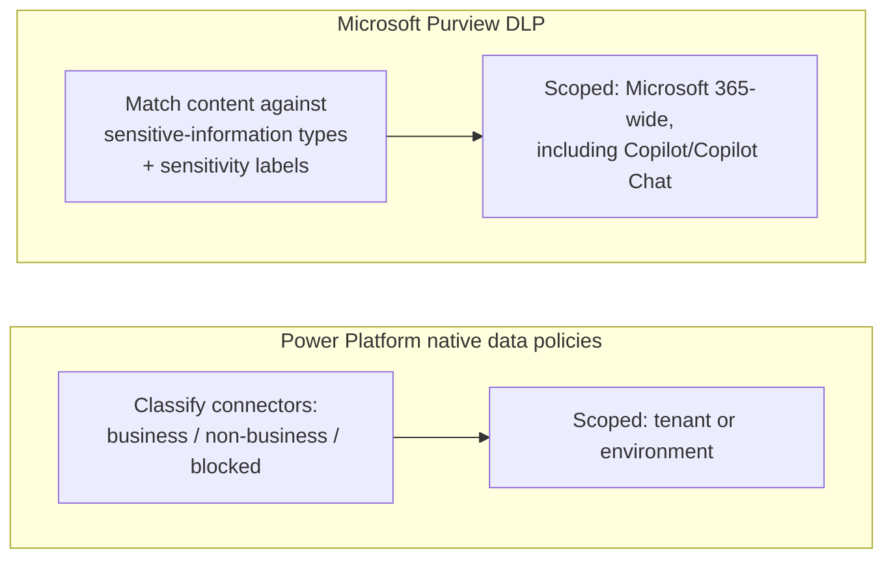

- **Power Platform data policies** govern *which connectors a maker can
  combine in one flow or app* (e.g. preventing a flow from mixing a
  business-classified Dataverse connector with a non-business-classified
  consumer connector) — a **connector-combination** guardrail, native to
  Power Platform, no Purview licence required.
- **Microsoft Purview DLP** governs *what content, once classified or
  labelled, is allowed to move where* — a **content-based** guardrail,
  spanning Exchange, SharePoint, Teams, and (per current Microsoft
  documentation) Microsoft 365 Copilot/Copilot Chat interactions.
- Both apply regardless of which option (A/B/C) below is chosen — Option A
  already includes native Power Platform data policies; Options B and C add
  Purview DLP's content-based layer on top, at different points in time.

## Options overview

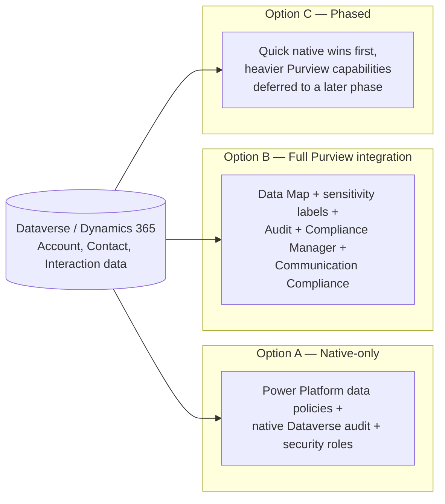

### Option A — Native-only governance

Relies entirely on capabilities already native to Power Platform and
Dataverse, with no incremental Purview configuration beyond whatever
generic tenant-wide Purview posture already exists for Microsoft 365 (e.g.
Exchange/SharePoint DLP unrelated to this CRM specifically).

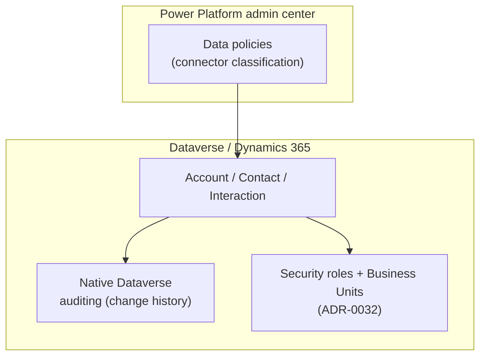

| Endpoint | Capability / service | Role |
| --- | --- | --- |
| Power Platform admin center — Data policies | Native connector business/non-business/blocked classification | Prevents unsafe connector combinations in flows/apps touching CRM data |
| Dataverse native auditing | Built-in change-history logging | Who changed what field, when — no separate licence |
| Security roles + Business Units ([ADR-0032](./ADR-0032-entra-power-platform-dynamics365-identity-access-management.md)) | Native access segregation | Already decided elsewhere, reused unchanged |
| Generic tenant-wide Purview posture (if any) | Whatever Purview configuration already exists for Exchange/SharePoint/Teams | Unrelated to CRM specifically — not extended by this option |

- **Pros.** No incremental licence cost — every capability here is already
  included in standard Power Platform/Dynamics 365 licensing. Fastest to
  stand up; nothing new to design or roll out. Native Dataverse auditing
  already gives a real, working "who changed what" answer without any
  Purview dependency.
- **Cons.** No content-based DLP on outbound communications — an
  AI-drafted or advisor-drafted email could contain sensitive content with
  nothing checking it beyond the connector-level guardrail. No
  classification/cataloging of what sensitive data actually lives in
  Dataverse — the "Retention & deletion" and DPIA `[TBD]` rows in
  [docs/COMPLIANCE.md](../COMPLIANCE.md) stay unanswered by tooling. No
  unified, cross-workload audit view — Dataverse's native audit log is
  Dataverse-only, not correlated with Exchange/Teams activity for the same
  household.
- **Design pattern.** Platform-native governance — using only what ships
  in the box, deliberately not reaching for a separate compliance product.
- **Licence.** No incremental cost beyond existing Power Platform/Dynamics
  365 licensing.

#### Advisory Cockpit walk-through (Option A)

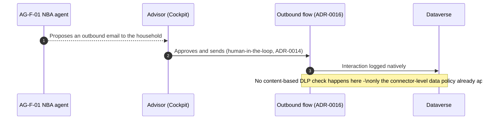

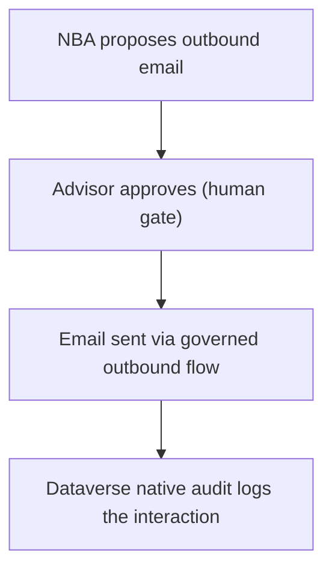

**Note.** The human-approval gate from
[ADR-0014](./ADR-0014-agents-advisory-by-design.md) still applies — the
gap this option leaves is purely at the *content* level: nothing
automatically checks the email's content for sensitive information before
it leaves the tenant.

### Option B — Full Purview integration

Dataverse is registered as a source in **Purview Data Map** and scanned for
classification/cataloging; **sensitivity labels** are enabled for Dynamics
365 email (per Microsoft's documented model-driven-app email
sensitivity-label feature); **Purview DLP** policies apply content-based
rules to outbound communications, including any AI-drafted content;
**Purview Audit** captures Dataverse/model-driven-app activity in the
unified audit log; **Compliance Manager** runs regulatory assessments
against whichever templates apply once legal/DPO confirms them; **Purview
Communication Compliance** monitors advisor communications for policy
violations.

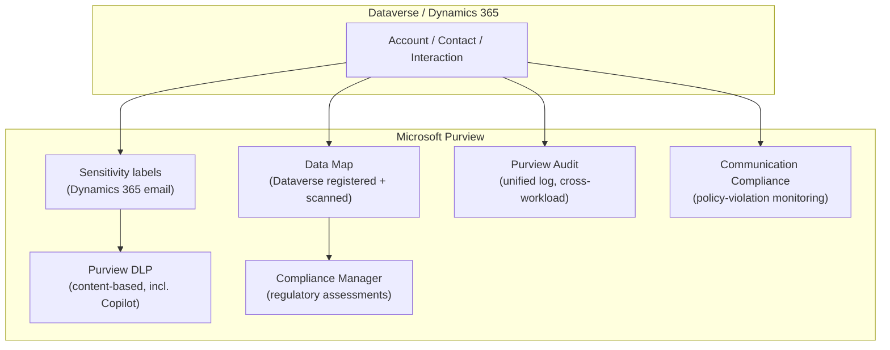

| Endpoint | Capability / service | Role |
| --- | --- | --- |
| Purview Data Map (Dataverse source, registered + scanned) | Cataloging/classification of Dataverse data at rest | Answers "what sensitive data lives where" for the DPIA/retention `[TBD]` rows |
| Sensitivity labels for Dynamics 365 email | Classify and protect email content/attachments | Labels travel with content across services |
| Purview DLP (Microsoft 365-wide) | Content-based policy enforcement, including Copilot/Copilot Chat | Blocks or warns on sensitive content leaving the tenant, including AI-drafted content |
| Purview Audit | Unified, cross-workload activity log including Dataverse/model-driven-app activity | Correlates CRM activity with Exchange/Teams/SharePoint activity for the same household |
| Purview Compliance Manager | Regulatory assessment templates and scoring | Concrete mechanism for the GDPR/revDSG/financial-regulator `[TBD]` rows, once legal/DPO confirms applicable templates |
| Purview Communication Compliance | Monitors advisor communications for policy violations | Complements, does not replace, the human-approval gate ([ADR-0014](./ADR-0014-agents-advisory-by-design.md)) |

- **Pros.** Directly answers most of [docs/COMPLIANCE.md](../COMPLIANCE.md)'s
  `[TBD]` rows with a real, documented technical mechanism rather than
  leaving them open. Content-based DLP genuinely checks AI-drafted outbound
  communications, not just connector combinations. A single, unified,
  cross-workload audit trail — a real answer to a regulator or auditor
  asking "show me everything that touched this household's data."
- **Cons.** Licence-gated — most of these capabilities require Microsoft
  365 E5/A5/G5 Compliance (or standalone Purview add-on SKUs), a real
  incremental cost. Highest upfront design effort: a sensitivity-label
  taxonomy has to be designed and agreed before labels are useful, not
  just switched on. Communication Compliance and Compliance Manager both
  need genuine policy/template configuration work, not just enablement —
  configuring them badly can create false confidence without real
  protection.
- **Design pattern.** Platform-wide information-governance overlay —
  content classification and DLP as a first-class layer above every
  workload, including Dataverse, rather than per-workload native controls
  alone.
- **Licence.** Microsoft 365 E5/A5/G5 Compliance (or standalone Purview
  SKUs) for Data Map, full DLP, Communication Compliance, and full
  Compliance Manager scoring; incremental to whatever Power Platform/
  Dynamics 365 licensing Option A already assumes.

#### Advisory Cockpit walk-through (Option B)

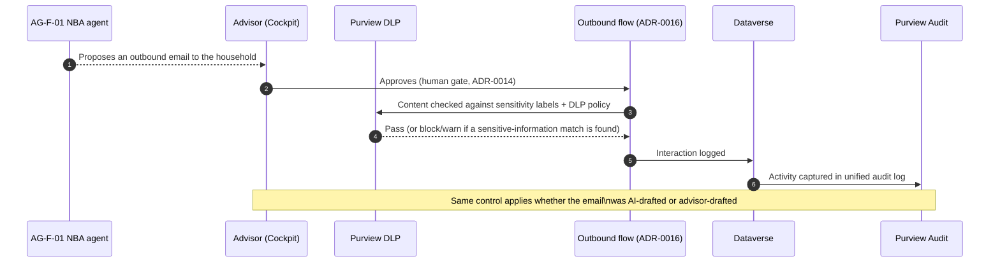

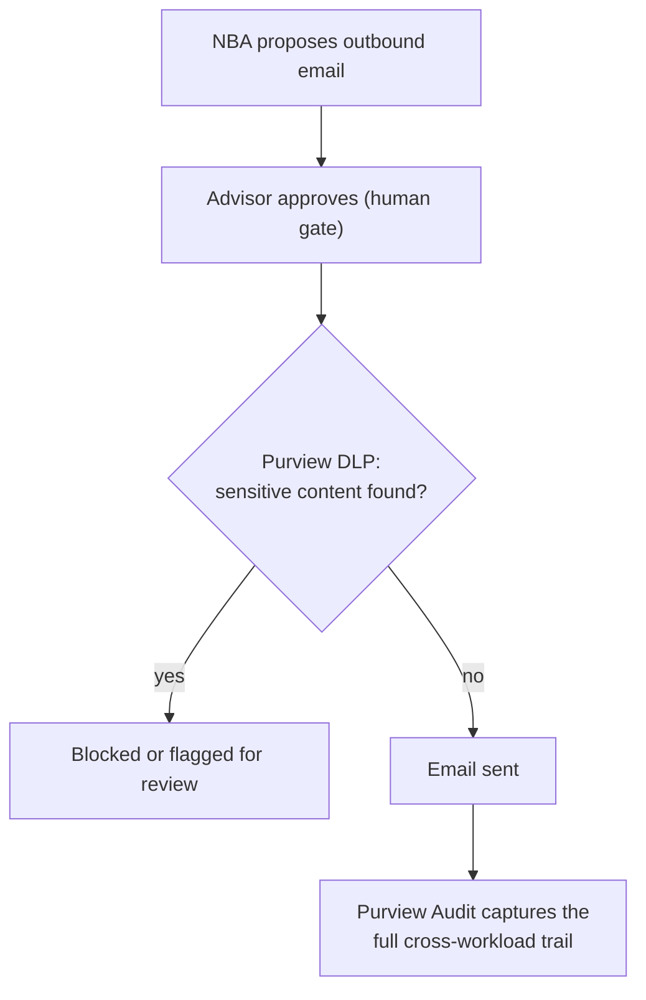

**Note.** This is the option where an AI-drafted communication is held to
the *same* content-level scrutiny as a human-drafted one — directly
supporting the Responsible-AI expectation that agent-assisted output isn't
quietly exempt from a control a human would face.

### Option C — Phased

Starts with the lowest-effort, already-native-feeling capabilities —
**Purview Audit** for Dataverse/model-driven-app activity (a configuration
step, not new infrastructure) alongside Option A's native data policies —
and defers the heavier, licence-gated, design-intensive capabilities (Data
Map cataloging, sensitivity-label taxonomy, Communication Compliance) to a
later phase, once real usage volume and a confirmed regulatory template
list justify the added governance overhead.

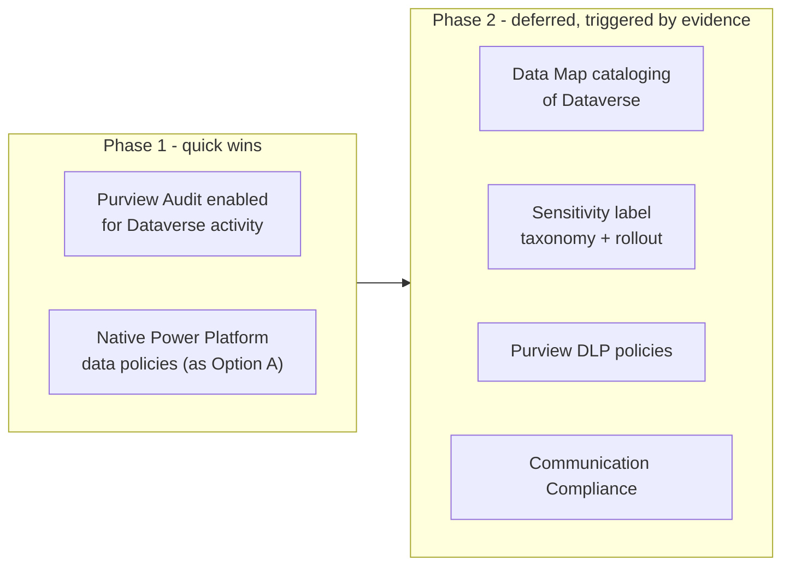

| Endpoint | Capability / service | Role |
| --- | --- | --- |
| Purview Audit (Phase 1) | Unified activity log, enabled early | Lowest-effort capability that already answers "who did what, when" across CRM |
| Native Power Platform data policies (Phase 1) | Connector classification, as Option A | Already-native, zero incremental licence cost |
| Purview Data Map, sensitivity labels, DLP, Communication Compliance (Phase 2, deferred) | Full Option B capability set | Rolled out once volume/regulatory confirmation justifies the licence and design cost |

- **Pros.** Gets a real, working audit trail and connector guardrail in
  place immediately, at effectively no incremental cost — closing the
  single biggest visible gap in Option A first. Defers the expensive,
  design-intensive work (label taxonomy, DLP policy tuning, Communication
  Compliance configuration) until there is real evidence — actual data
  volume, actual confirmed regulatory templates — to design it against,
  rather than guessing upfront.
- **Cons.** Content-based DLP protection does not exist during Phase 1 —
  the same gap Option A has, just deliberately temporary rather than
  permanent. Requires an explicit, tracked trigger for when Phase 2
  starts, or "temporary" risks quietly becoming permanent by inertia (the
  same risk any hypothesis-driven ADR in this repository calls out
  explicitly — see [docs/adr/README.md](./README.md)'s "Hypothesis-driven
  decisions" section).
- **Design pattern.** Staged rollout with an explicit evidence-based
  trigger for the next phase — the same phased-coexistence lineage as
  [ADR-0036](./ADR-0036-crm-lead-campaign-external-landscape.md)'s Part 2
  Option C.
- **Licence.** Phase 1 has no incremental cost. Phase 2 incurs Option B's
  full licence cost, but deferred in time, which may better match a
  budget-cycle or a "prove it's needed first" governance stance.

#### Advisory Cockpit walk-through (Option C)

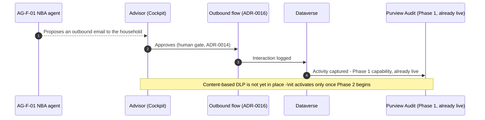

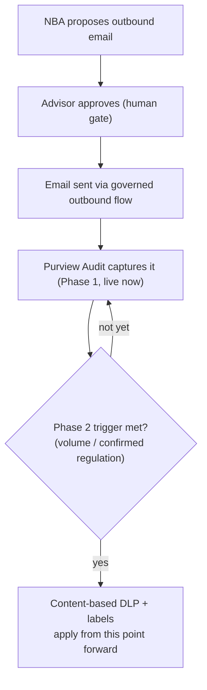

**Note.** The walk-through looks identical to Option A's until the Phase 2
trigger fires — the risk to manage explicitly is making sure that trigger
is a real, tracked decision point (see Validation triggers below), not an
indefinitely-postponed "later."

## Comparison — compliance governance options

| Criterion | Option A — Native-only | Option B — Full Purview | Option C — Phased |
| --- | --- | --- | --- |
| Content-based DLP on outbound (incl. AI-drafted) | No | Yes | Not until Phase 2 |
| Cataloging of sensitive data at rest (Data Map) | No | Yes | Not until Phase 2 |
| Unified, cross-workload audit trail | No — Dataverse-native audit only | Yes | Yes, from Phase 1 |
| Answers `docs/COMPLIANCE.md` `[TBD]` rows with a real mechanism | Minimally | Most directly | Partially now, fully once Phase 2 completes |
| Incremental licence cost | None | Highest (E5/A5/G5 Compliance or Purview SKUs) | None initially, Option B's cost deferred |
| Upfront design effort (label taxonomy, DLP tuning) | None | Highest, all upfront | Spread over time, informed by real evidence |
| Risk of "temporary" becoming permanent | N/A | N/A | Yes, unless Phase 2's trigger is explicitly tracked |

## Decision or working hypothesis

**No option is selected, and no lean is stated.** The single most
consequential missing input is not technical — it is legal/regulatory: the
`[TBD]` rows in [docs/COMPLIANCE.md](../COMPLIANCE.md) (which regulations
actually apply, what a DPIA would require, what retention periods are
mandated) have to be confirmed by the customer's legal/DPO function before
any of these three options can be judged as "enough" or "not enough" for
this customer's actual obligations. This ADR documents the technical
mechanism options so that conversation can happen with real choices in
front of it, not to pre-empt it.

## Evidence and assumptions

- **Known (verified).** [docs/COMPLIANCE.md](../COMPLIANCE.md) already
  exists as a draft skeleton with explicit `[TBD]` rows. [ADR-0010](./ADR-0010-consent-per-contact-per-channel.md)
  already establishes the consent gate. [ADR-0016](./ADR-0016-governed-outbound.md)
  already establishes the outbound message routing this ADR's DLP options
  attach to. [ADR-0032](./ADR-0032-entra-power-platform-dynamics365-identity-access-management.md)
  already establishes the identity/security-role mechanics and explicitly
  names this as "the next ADR (Purview)." Every specific Purview capability
  cited above (Data Map/Dataverse scanning, Dynamics 365 email sensitivity
  labels, Purview Audit for Dataverse/model-driven-app activity, Compliance
  Manager, Communication Compliance, Power Platform's native data policies,
  and Purview DLP's coverage of Microsoft 365 Copilot/Copilot Chat) was
  confirmed against Microsoft Learn documentation while writing this ADR.
- **Inferred, not confirmed.** Whether the customer's actual licence estate
  already includes Microsoft 365 E5/A5/G5 Compliance (which would make
  Option B/C's Phase 2 cost much lower, since the licence would already be
  paid for) or would require a net-new purchase; which specific regulatory
  templates (GDPR, Swiss revDSG, a financial-regulator outsourcing
  framework) actually apply and would need to be modelled in Compliance
  Manager.
- **Missing evidence to resolve this.** Confirmation from the customer's
  legal/DPO function on which `[docs/COMPLIANCE.md](../COMPLIANCE.md)` `[TBD]`
  rows are actually in scope; confirmation of the customer's current
  Microsoft 365 licence tier; and, if Option C is favoured, agreement on
  what concrete, measurable trigger (e.g. a specific data volume, a
  specific confirmed regulatory deadline) starts Phase 2.

## Validation and review triggers

- Confirm with the customer's legal/DPO function which regulatory regimes
  apply, resolving [docs/COMPLIANCE.md](../COMPLIANCE.md)'s `[TBD]` rows —
  this is the single biggest input this ADR is waiting on.
- Confirm the customer's current Microsoft 365 licence tier, since it
  directly changes Option B's/Option C's Phase 2 real incremental cost.
- If Option C is chosen, agree and record an explicit, measurable Phase 2
  trigger before proceeding, so "phased" does not quietly become
  "permanent Phase 1" by inertia.
- Re-review once [ADR-0032](./ADR-0032-entra-power-platform-dynamics365-identity-access-management.md)
  moves from proposed to accepted, since its security-role design is a
  direct input to how Purview's classification/audit surfaces map back to
  who is accountable for what.

## Consequences

- **If Option A is chosen.** No incremental cost or design effort, but a
  real content-level gap remains on outbound communications, and the
  `docs/COMPLIANCE.md` `[TBD]` rows stay unanswered by any concrete
  technical mechanism.
- **If Option B is chosen.** The strongest, most defensible compliance
  posture of the three, directly answering most `docs/COMPLIANCE.md`
  `[TBD]` rows with a real mechanism — at the cost of the highest licence
  tier and the most upfront design effort (a sensitivity-label taxonomy
  that has to be right, not just switched on).
- **If Option C is chosen.** A pragmatic middle path, but only if the
  Phase 2 trigger is treated as a genuine, tracked decision point — the
  same hypothesis-driven discipline this repository already applies to
  every other proposed-hypothesis ADR ([docs/adr/README.md](./README.md)'s
  "Hypothesis-driven decisions" section) applies here too.
- **Regardless of option.** The human-approval gate from
  [ADR-0014](./ADR-0014-agents-advisory-by-design.md) is unaffected — none
  of these options change who is accountable for a customer-facing
  decision, only what technical control layer sits alongside that
  decision.

## Competitive note

Microsoft's own Purview documentation is explicit that sensitivity labels
are "the foundational protection mechanism" and that DLP, Audit,
eDiscovery, and Copilot protections all build on the same label taxonomy —
a real, documented architectural lean toward Option B's full-integration
shape, not an invented one. This ADR deliberately does not adopt that lean
as this ADR's decision, because the customer's actual regulatory scope and
licence estate are not yet confirmed; it is noted here only as external
context for the Enterprise Architect and compliance stakeholders'
discussion.
