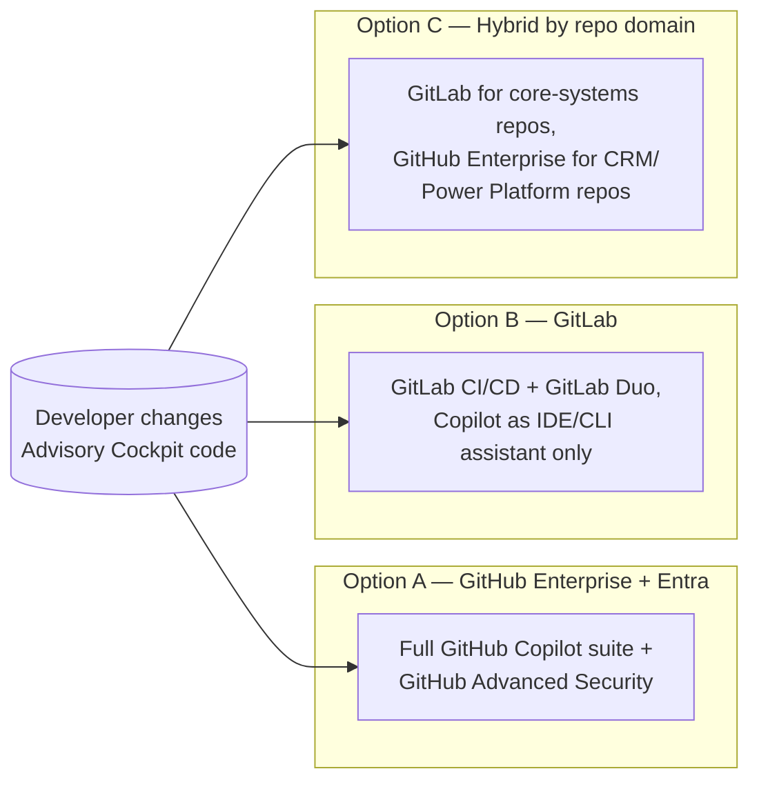
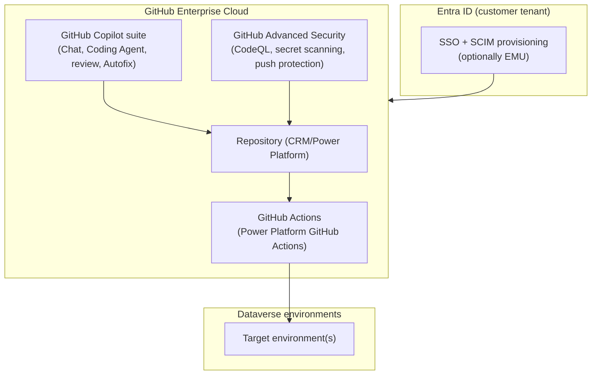
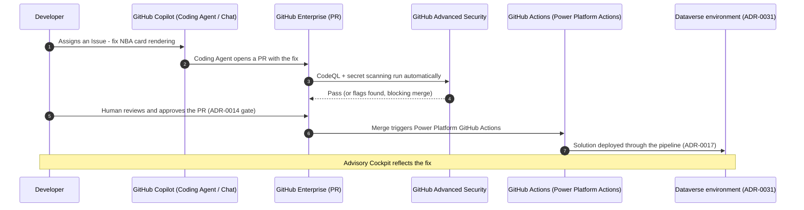
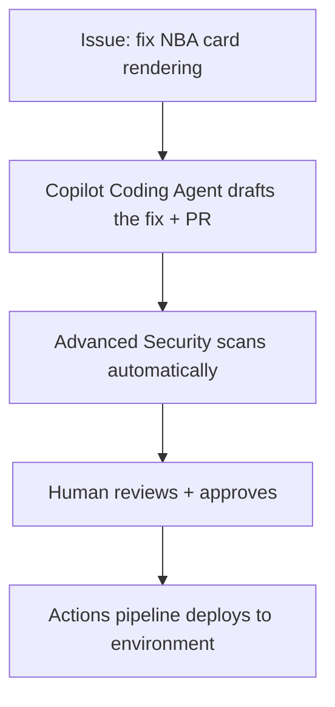
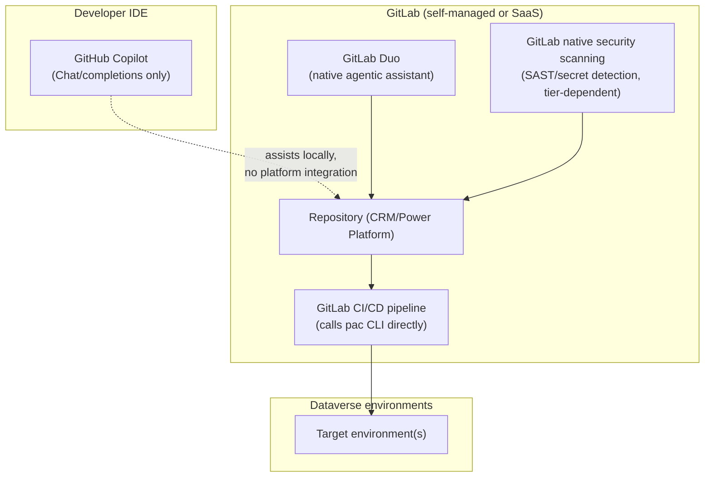
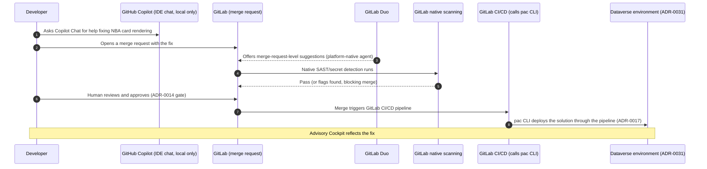
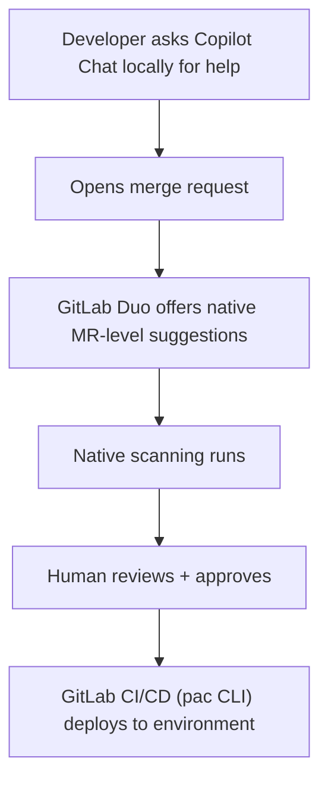
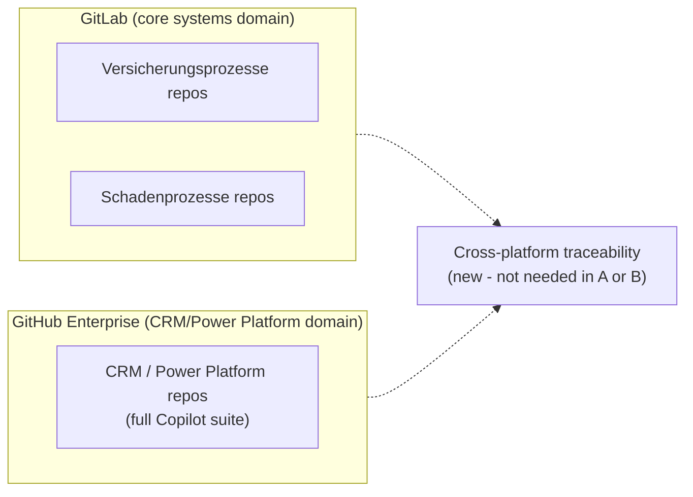
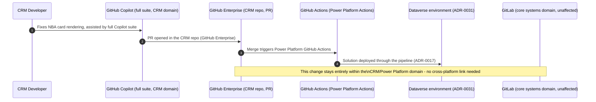
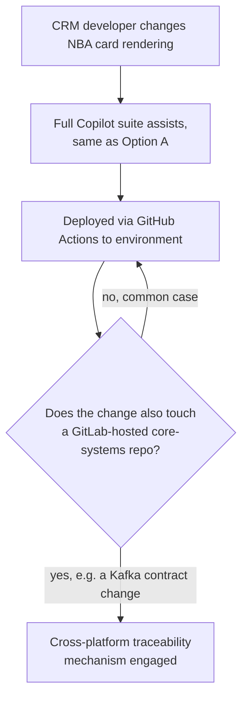

# ADR-0039 — DevSecOps CI/CD Operating Model: GitHub Enterprise + Entra vs. GitLab

| Field | Value |
| --- | --- |
| **Status** | Proposed hypothesis |
| **Date** | 2026-08-15 |
| **Decision mode** | Working hypothesis — **no option selected, no lean stated**; fully open for Enterprise Architect + customer IT/architecture stakeholder review |
| **Confidence** | Medium — the platform-capability facts below (which Copilot features are GitHub-specific vs. host-agnostic, which Power Platform ALM tooling Microsoft ships for which host) are confirmed published facts; which platform the customer's broader engineering organisation already standardises on is **not confirmed** |
| **Deciders** | `AG-E-04` SecDevOps (accountable — CI/CD platform, pipeline security posture) · `AG-E-03` Enterprise Architect · customer IT/Architect (`P-06`) · customer engineering leadership (platform standardisation authority) |
| **Topic area** | A4 — ALM, environment and release strategy · A8 — deployment, lifecycle, versioning, rollback · A9 — platform/tooling governance |
| **Use case** | Illustrated with a **"shipping a change to the Advisory Cockpit"** walk-through below each option — a developer fixing/extending the `AG-F-01` Next-Best-Action card rendering, traced end to end from code change to production |
| **Licence** | `[TBD]` — Option A requires GitHub Enterprise Cloud (with or without Enterprise Managed Users) plus GitHub Copilot Enterprise/Business and GitHub Advanced Security seats; Option B requires a GitLab Ultimate (or equivalent) tier for native security scanning plus GitLab Duo seats, with GitHub Copilot IDE/CLI seats layered on top as an optional developer add-on; Option C sums the relevant parts of both, scoped by repo domain |
| **Upgrade impact** | Low for whichever platform is already the customer's engineering standard (reuses existing governance, identity, and pipeline investment) · Medium–High for migrating an existing estate to a new platform · Medium for Option C (only the CRM/Power-Platform repo domain moves, not the whole engineering estate) |
| **CAF methodology** | Ready · Manage — platform choice is a foundational "Ready" decision, and CI/CD operating discipline is an ongoing "Manage" concern |
| **WAF pillar(s)** | Primary: Operational Excellence (release automation, developer experience, tooling consistency) and Security (pipeline identity, secret handling, code-scanning coverage). Trade-off against: Cost Optimization (licence tiers differ materially between options) |
| **Zero Trust** | Regardless of platform, the same posture already established for this showcase's own CI in [ADR-0002](./ADR-0002-oidc-federation-for-github-actions-to-entra.md) and generalised for Power Platform/Dynamics 365 access in [ADR-0026](./ADR-0026-entra-power-platform-dynamics365-identity-access-management.md) applies: workload identity federation over stored secrets, least-privilege service identities, and no long-lived credentials. This ADR is about **which platform hosts that pipeline**, not a new identity mechanism |
| **Responsible AI** | Any AI-assisted code change (via GitHub Copilot's agentic features, GitLab Duo, or Copilot's IDE-level assistant, depending on the option) still passes through the same human-reviewed pull/merge-request gate before reaching an environment — no option here grants an AI agent unattended commit rights to a protected branch, matching the same agents-advisory posture already established for runtime agents in [ADR-0014](./ADR-0014-agents-advisory-by-design.md) |

> **Illustrative naming note.** This ADR is about the customer's **target
> production** engineering CI/CD platform for ongoing Power Platform/
> Dynamics 365 and surrounding integration development. It is distinct
> from, and does not revisit, this showcase repository's own build-time CI
> already decided in
> [ADR-0002](./ADR-0002-oidc-federation-for-github-actions-to-entra.md),
> [ADR-0003](./ADR-0003-terraform-as-iac-toolchain.md),
> [ADR-0004](./ADR-0004-ci-plane-app-registrations-and-github-environments.md),
> and [ADR-0005](./ADR-0005-power-platform-application-users-for-ci.md) —
> those stay in force for this repository regardless of which option below
> the customer eventually picks for their own estate, and are cited here
> only as a working precedent to reuse or adapt. Which platform the
> customer's engineering organisation already standardises on outside CRM
> is **not confirmed** — presented as open below, not assumed.

## Context

[ADR-0017](./ADR-0017-alm-everything-through-the-pipeline.md) already
establishes the platform-agnostic rule this ADR sits under: no change
reaches any environment except through the pipeline, every change is
traceable to a PR, an ADR, and a test run, and rollback is a pipeline
action. That rule holds regardless of which platform hosts the pipeline —
this ADR is about **which platform**, not whether the rule applies.

`AG-E-04` (SecDevOps, [.github/agents/secdevops.agent.md](../../.github/agents/secdevops.agent.md))
is already defined as accountable for CI/CD, policy-as-code, identity, and
secret handling, with existing guardrails — OIDC-only authentication, no
stored secrets, least-privilege service identities — that this ADR does not
revisit; they apply unchanged under any of the three options below.

Two platform-capability facts, confirmed while researching this ADR, matter
directly to the comparison:

1. **GitHub Copilot's core IDE/CLI experience (chat, completions, inline
   suggestions) works with code from any Git host, including GitLab** — it
   does not require the repository itself to live on GitHub. Its **agentic**
   capabilities — the Copilot Coding Agent autonomously resolving GitHub
   Issues and opening pull requests, Copilot's native inline code-review
   comments on a pull request, and direct GitHub Actions workflow
   integration — are **GitHub-specific** and do not have a GitLab
   equivalent through Copilot itself. GitLab's own competing agentic layer,
   **GitLab Duo**, is a separate product filling that role for GitLab-hosted
   repositories, not a Copilot feature running on GitLab.
2. **Microsoft ships two first-party Power Platform ALM automation
   surfaces**: the **Power Platform Build Tools for Azure DevOps** and
   **Power Platform GitHub Actions**
   ([pcf-alm.instructions.md](../../.github/instructions/pcf-alm.instructions.md)).
   There is no equivalent first-party **GitLab CI/CD** template — a GitLab
   pipeline would call the same underlying `pac` CLI directly from generic
   GitLab CI YAML, which is fully possible (the CLI itself is host-agnostic)
   but without the ready-made task/action wrapper Microsoft publishes for
   Azure DevOps and GitHub.

Scope, as agreed with the user:

- **In scope.** The customer's target production CI/CD platform choice for
  ongoing Power Platform/Dynamics 365 and integration development, and how
  GitHub Copilot's or GitLab Duo's capabilities fit each choice.
- **Out of scope, deliberately.** This showcase repository's own build-time
  CI (already decided, ADR-0002/0003/0004/0005); re-deciding
  [ADR-0017](./ADR-0017-alm-everything-through-the-pipeline.md)'s
  pipeline-only rule itself; re-deciding
  [ADR-0026](./ADR-0026-entra-power-platform-dynamics365-identity-access-management.md)'s
  identity mechanics.
- **Validating use case.** A concrete **"shipping a change to the Advisory
  Cockpit"** scenario — a developer fixes or extends the `AG-F-01`
  Next-Best-Action card rendering — walked through end to end under each
  option below, since this is exactly the kind of everyday change the
  chosen platform has to handle well.

## Options overview

### Option A — GitHub Enterprise (Cloud), Entra-federated organisation

The customer's engineering organisation standardises on **GitHub Enterprise
Cloud**, with the org's identity federated to Entra ID (SAML SSO and SCIM
provisioning, optionally Enterprise Managed Users for stricter identity
control), extending this showcase repository's own
[ADR-0002](./ADR-0002-oidc-federation-for-github-actions-to-entra.md)/
[ADR-0004](./ADR-0004-ci-plane-app-registrations-and-github-environments.md)
pattern to the customer's real estate. The full GitHub Copilot suite —
Chat, Coding Agent, native pull-request code-review comments, Autofix — and
GitHub Advanced Security (CodeQL, secret scanning, push protection) are
available natively.

| Endpoint | Capability / service | Role |
| --- | --- | --- |
| GitHub Enterprise Cloud org | Source hosting, PR/issue workflow | Single platform for all CRM/Power Platform repos |
| Entra ID SSO + SCIM (optionally EMU) | Identity federation | Reuses the same Entra tenant already governing Dataverse access ([ADR-0026](./ADR-0026-entra-power-platform-dynamics365-identity-access-management.md)) |
| GitHub Actions + Power Platform GitHub Actions | Native, first-party CI/CD automation | Documented Microsoft-shipped ALM path ([pcf-alm.instructions.md](../../.github/instructions/pcf-alm.instructions.md)) |
| GitHub Copilot suite (Chat, Coding Agent, code review, Autofix) | Full agentic developer assistance | Coding Agent can resolve an Issue and open a PR autonomously; still gated by human PR review |
| GitHub Advanced Security (CodeQL, secret scanning, push protection) | Native security scanning | Same mechanism already relied on for this showcase repo ([SECURITY.md](../SECURITY.md)) |

- **Pros.** Every GitHub Copilot capability, including the agentic ones,
  works natively — no capability gap. Directly reuses and extends the
  identity-federation and CI-plane pattern this showcase repository has
  already proven in [ADR-0002](./ADR-0002-oidc-federation-for-github-actions-to-entra.md)/
  [ADR-0004](./ADR-0004-ci-plane-app-registrations-and-github-environments.md),
  rather than inventing a new one for the customer. First-party Power
  Platform GitHub Actions removes the CLI-wiring effort Option B requires.
- **Cons.** Requires the customer's broader engineering organisation to
  standardise on (or add) GitHub Enterprise — a real organisational change
  if GitLab is already the incumbent platform elsewhere in the
  organisation, not just a CRM-team-local decision.
- **Design pattern.** Single-platform-native CI/CD, extending this
  repository's own proven identity-federation and pipeline pattern.
- **Licence.** GitHub Enterprise Cloud, GitHub Copilot Enterprise/Business,
  and GitHub Advanced Security seats/consumption.

#### "Shipping a change to the Advisory Cockpit" walk-through (Option A)

**Note.** The Coding Agent step is optional — a developer can just as
well write the fix by hand and use Copilot Chat for assistance — the
point is that the full spectrum, from autonomous-agent-drafted to
fully-manual, is available on one platform without a capability gap.

### Option B — GitLab as the primary DevSecOps platform

The customer's engineering organisation standardises on **GitLab**
(self-managed or SaaS), using GitLab CI/CD pipelines, GitLab's native
security scanning (SAST/secret detection, tier-dependent), and **GitLab
Duo** as the platform-native agentic assistant for merge requests and
pipelines. GitHub Copilot remains available only as an **IDE/CLI-level
developer assistant** — chat, completions, inline suggestions in VS
Code/JetBrains — since it does not require the repository to live on
GitHub, but its agentic and native-PR-review capabilities do not carry
over.

| Endpoint | Capability / service | Role |
| --- | --- | --- |
| GitLab (self-managed or SaaS) | Source hosting, merge-request workflow | Single platform for all repos, matching an existing GitLab-standardised estate |
| GitLab CI/CD | Pipeline automation | Calls the `pac` CLI directly — no first-party Microsoft GitLab template exists, unlike Azure DevOps/GitHub |
| GitLab Duo | Native agentic assistant (merge requests, pipeline fixes) | The platform-native equivalent role to Copilot's agentic layer, but a genuinely different product |
| GitHub Copilot (IDE/CLI only) | Local chat/completions in the developer's editor | Available regardless of host, but no PR-native review comments or autonomous issue resolution |
| GitLab native security scanning | SAST, secret detection (tier-dependent) | GitLab's own equivalent to GitHub Advanced Security |

- **Pros.** Matches an existing GitLab-standardised engineering estate
  without an organisational platform change. GitLab Duo provides a genuine,
  supported agentic capability — not a gap, just a different product than
  Copilot's. No first-party Microsoft GitLab ALM template exists, but the
  underlying `pac` CLI is host-agnostic, so the automation itself is fully
  achievable, just without a ready-made task wrapper.
- **Cons.** GitHub Copilot's agentic features (Coding Agent, native PR
  review) are simply not available on GitLab — if the organisation has
  standardised specifically on GitHub Copilot as its AI-assisted
  development strategy, this option means either accepting Copilot as an
  IDE-only tool alongside GitLab Duo as the platform-native agent (two
  different AI products for two different roles), or forgoing Copilot's
  agentic capability entirely. No first-party Microsoft-shipped GitLab
  CI/CD template for Power Platform ALM — more pipeline-authoring effort
  than Option A's ready-made GitHub Actions.
- **Design pattern.** Single-platform-native CI/CD on the incumbent
  estate's existing tooling, calling the host-agnostic `pac` CLI directly
  from custom GitLab CI YAML.
- **Licence.** GitLab Ultimate (or whichever tier includes the required
  security scanning) plus GitLab Duo seats; GitHub Copilot IDE/CLI seats
  as an optional developer add-on layered on top, at Copilot's standard
  per-seat cost.

#### "Shipping a change to the Advisory Cockpit" walk-through (Option B)

**Note.** Two different AI assistants play two different roles here —
Copilot helps the developer locally while writing code, GitLab Duo acts on
the merge request itself — rather than one tool spanning both, as in
Option A.

### Option C — Hybrid, split by repository domain

GitLab remains the system-of-record for the customer's broader engineering
organisation — including the core systems this landscape already depends
on (Versicherungsprozesse, Schadenprozesse) — while the **CRM/Power
Platform repository domain** specifically moves to GitHub Enterprise, to
get the full agentic Copilot experience where the CRM engineering team
works day to day. This mirrors the same domain-scoped-coexistence pattern
already used for the customer's estate in
[ADR-0028](./ADR-0028-aro-case-task-management-integration-pattern.md)
and [ADR-0030](./ADR-0030-crm-lead-campaign-external-landscape.md).

| Endpoint | Capability / service | Role |
| --- | --- | --- |
| GitLab (core systems domain) | Hosts Versicherungsprozesse/Schadenprozesse repos | Unchanged for teams outside CRM |
| GitHub Enterprise (CRM/Power Platform domain) | Hosts CRM repos, full Copilot suite + Advanced Security | Matches Option A exactly, scoped to one domain |
| Cross-platform traceability mechanism (new) | Linking a GitLab-tracked epic/issue to a GitHub PR, or a shared work-tracking tool (e.g. Azure Boards/Jira) spanning both | Only needed where a change genuinely spans both domains (e.g. the Kafka event contract in [ADR-0025](./ADR-0025-crm-core-systems-kafka-confluent-integration-pattern.md)) |

- **Pros.** CRM engineering gets the full GitHub Copilot agentic
  experience without requiring the whole engineering organisation to
  migrate off GitLab. Narrower organisational change than Option A,
  narrower AI-capability gap than Option B — each team gets the platform
  best suited to it.
- **Cons.** Introduces a genuinely new problem neither Option A nor Option
  B has: **cross-platform traceability** for any change that spans both
  domains — for example, a Kafka event-contract change
  ([ADR-0025](./ADR-0025-crm-core-systems-kafka-confluent-integration-pattern.md))
  touching both a GitLab-hosted core-systems repo and a GitHub-hosted CRM
  repo needs a way to link the two, which neither platform provides
  natively out of the box. Two platforms to administer, secure, and keep
  identity-federated instead of one.
- **Design pattern.** Domain-scoped platform coexistence — the same
  lineage as this repository's own phased-coexistence options in
  ADR-0028/ADR-0030, applied to tooling rather than data.
- **Licence.** GitHub Enterprise/Copilot/Advanced Security for the CRM
  domain (as Option A), plus whatever GitLab tier the core-systems domain
  already pays for (largely a sunk cost if GitLab is already the
  incumbent) — no need to re-licence GitLab for the domain that stays on
  it.

#### "Shipping a change to the Advisory Cockpit" walk-through (Option C)

**Note.** For the common CRM-only case, Option C looks identical to Option
A — the trade-off only appears the moment a change genuinely spans both
domains, exactly like Option C's counterparts in ADR-0031/ADR-0028's hybrid
patterns.

## Comparison — DevSecOps platform options

| Criterion | Option A — GitHub Enterprise | Option B — GitLab | Option C — Hybrid by domain |
| --- | --- | --- | --- |
| Full GitHub Copilot agentic suite (Coding Agent, native PR review) available | Yes, everywhere | No — IDE/CLI assistant only | Yes, in the CRM/Power Platform domain only |
| Platform-native agentic alternative if not using Copilot's agentic layer | N/A | GitLab Duo | N/A within the CRM domain, GitLab Duo in the core-systems domain |
| First-party Microsoft Power Platform ALM automation | Yes — Power Platform GitHub Actions | No — calls `pac` CLI directly in custom pipeline YAML | Yes, within the CRM domain |
| Matches an existing GitLab-standardised engineering estate | No — requires organisational platform change | Yes, directly | Partially — only the CRM domain moves |
| New cross-platform traceability problem introduced | No | No | Yes — for changes spanning both domains |
| Organisational change scope | Whole engineering org | None | One domain (CRM/Power Platform) |
| Licence/cost shape | New GitHub Enterprise + Copilot + Advanced Security spend | Reuses existing GitLab investment, adds optional Copilot IDE seats | Sum of both, scoped narrowly |

## Decision or working hypothesis

**No option is selected, and no lean is stated.** The deciding fact this
ADR is waiting on is organisational, not technical: **which platform, if
either, the customer's broader engineering organisation already
standardises on outside CRM** — that single fact makes Option A, B, or C
the obviously lower-friction choice, and it has not been confirmed. Absent
that confirmation, all three remain credible on pure technical merit.

## Evidence and assumptions

- **Known (verified).** [ADR-0002](./ADR-0002-oidc-federation-for-github-actions-to-entra.md)/
  [ADR-0004](./ADR-0004-ci-plane-app-registrations-and-github-environments.md)
  already establish and prove the OIDC-federated, GitHub-Actions-based CI
  pattern this ADR's Option A extends to the customer's estate.
  [ADR-0017](./ADR-0017-alm-everything-through-the-pipeline.md) already
  establishes the platform-agnostic pipeline-only rule every option
  operates under. [pcf-alm.instructions.md](../../.github/instructions/pcf-alm.instructions.md)
  already documents that Microsoft ships first-party Power Platform ALM
  automation for Azure DevOps and GitHub Actions, with no GitLab-native
  equivalent. GitHub Copilot's host-agnostic IDE/CLI capability versus its
  GitHub-specific agentic capability, and GitLab Duo's role as a separate
  competing agentic product, were confirmed via direct research while
  writing this ADR, not assumed.
- **Inferred, not confirmed.** Whether the customer's broader engineering
  organisation (beyond the CRM team) already has a platform standard in
  place, and if so which one; whether an existing GitLab estate (if any)
  is self-managed or SaaS, which affects Option B's/Option C's actual
  administration overhead.
- **Missing evidence to resolve this.** A confirmed answer from the
  customer's engineering leadership on the existing platform standard (if
  any); confirmation of whether GitHub Copilot is already a strategic,
  organisation-wide AI-assistance investment (which would strengthen
  Option A/C) or an open question itself; and, if Option C is considered,
  a concrete inventory of which changes genuinely span the GitLab and
  GitHub domains today (e.g. how often the Kafka contract in
  [ADR-0025](./ADR-0025-crm-core-systems-kafka-confluent-integration-pattern.md)
  actually changes) to size the cross-platform traceability problem
  realistically.

## Validation and review triggers

- Confirm with the customer's engineering leadership what CI/CD platform
  (if any) is already standardised on outside the CRM team — the single
  biggest input this ADR is waiting on.
- Confirm whether GitHub Copilot is already a named, organisation-wide
  strategic tooling investment, independent of this ADR, which would
  materially strengthen the case for Option A or Option C over Option B.
- If Option C is chosen, confirm a concrete list of changes that
  historically span both the GitLab core-systems domain and the CRM
  domain, to properly size the cross-platform traceability mechanism
  needed rather than over- or under-building it.
- Re-review once [ADR-0025](./ADR-0025-crm-core-systems-kafka-confluent-integration-pattern.md)
  (the Kafka integration pattern) moves from proposed to accepted, since
  it is the most likely source of genuinely cross-domain changes under
  Option C.

## Consequences

- **If Option A is chosen.** The full GitHub Copilot agentic suite and
  first-party Power Platform GitHub Actions are available immediately, at
  the cost of requiring the customer's engineering organisation to adopt
  or extend GitHub Enterprise, which may be a larger change than the CRM
  programme alone can decide.
- **If Option B is chosen.** No organisational platform change is needed if
  GitLab is already the standard, and GitLab Duo provides a real, supported
  agentic alternative — but GitHub Copilot's agentic capabilities are
  simply unavailable, and Power Platform ALM automation requires more
  custom pipeline-authoring effort than Option A's ready-made GitHub
  Actions.
- **If Option C is chosen.** The CRM team gets the best of Option A's
  Copilot experience without forcing an organisation-wide migration, but a
  genuinely new cross-platform traceability mechanism must be designed and
  maintained — this is new engineering/process scope, not free.
- **Regardless of option.** `AG-E-04`'s existing Zero Trust guardrails
  (OIDC-only, no stored secrets, least-privilege service identities) apply
  unchanged, and [ADR-0017](./ADR-0017-alm-everything-through-the-pipeline.md)'s
  pipeline-only rule is not up for renegotiation under any option.

## Competitive note

Both GitHub and GitLab publish head-to-head competitive material
positioning their own AI-assistant (GitHub Copilot's agentic suite vs.
GitLab Duo's Agent Platform) as the stronger DevSecOps AI story — this is
vendor-competitive noise, not a neutral technical fact, and this ADR
deliberately does not adopt either vendor's framing as its own lean. The
one non-vendor-contested fact worth carrying forward is the capability
boundary confirmed above: Copilot's agentic features require GitHub
specifically, and that boundary is real regardless of which vendor's
marketing is being read.
