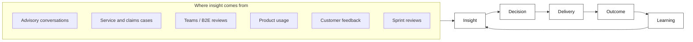
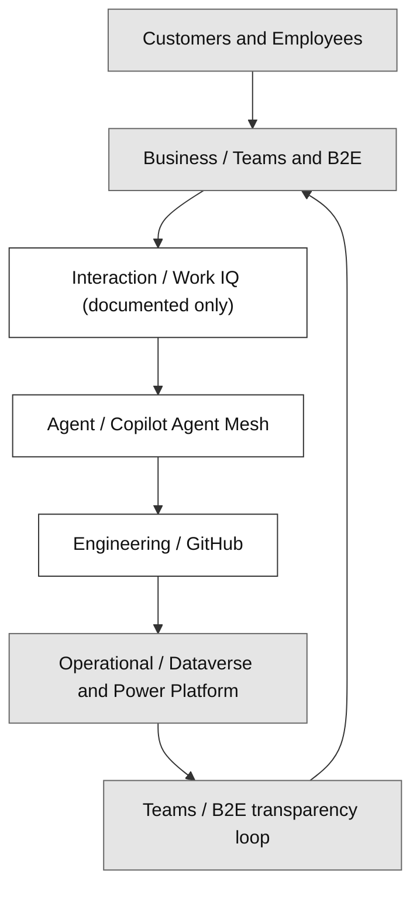
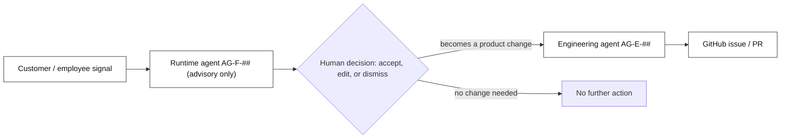
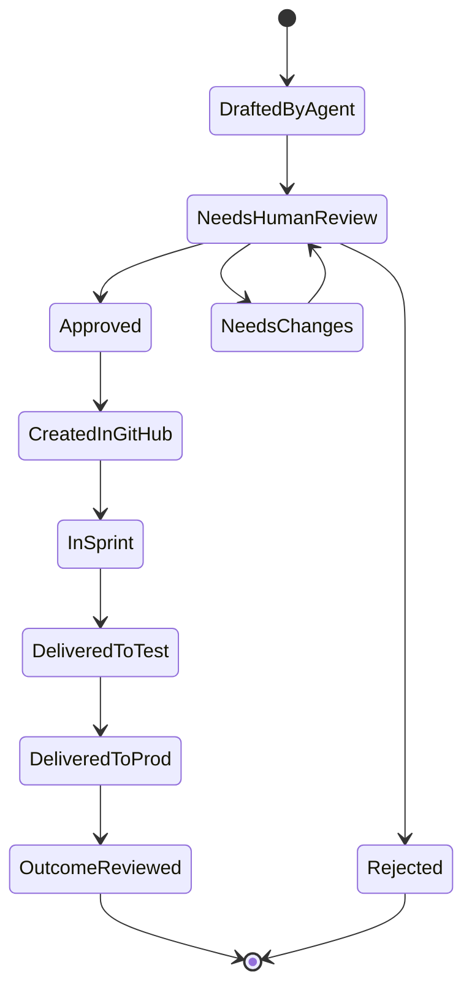

# Design Pattern 00: Frontier Firm operating model for insurance

**Audience:** EA / IT stakeholders of any insurer evaluating whether - and how - to establish a Frontier Firm-style agentic operating model.  
**Related doc:** `docs/FRONTIER-OPERATING-MODEL.md` (full detail for this showcase's own instantiation)

## 1. Why a Frontier Firm model for an insurer

Microsoft's 2025/2026 Work Trend Index frames the Frontier Firm around agents, human agency, and the opportunity for every organization. That makes the first insurance question an operating-model question, not an integration question: before choosing any single API, UI, or data pattern, an insurer must decide how customer-facing employees, copilots, approval points, engineering delivery, and the system of record work together. That is how a Frontier Company actually builds and operates a solution with Microsoft's current agentic stack. Without that shared accountability model, every downstream pattern - Work IQ, GitHub, Dataverse, Copilot Studio, or core-system integration - gets implemented in isolation.

Sections 2-7 below set out that operating model end to end: vision, requirements, architecture, agent roster, governance, and roadmap. Sections 8-9 then show how to establish it yourself and how Contoso Insurance did.

## 2. Vision and the operating loop

Contoso Insurance's Frontier Firm vision, adapted from the source idea doc's north star:

> Every relevant interaction with a customer, employee, or system automatically strengthens Contoso Insurance's advice, product, and processes.

Stated technically:

> Contoso Insurance becomes a Human-led, Agent-operated advisory practice, in which the Business/Teams and B2E layer steers human-agent interaction, GitHub orchestrates the digital delivery, and Dataverse reflects the operational reality.

This vision runs as a loop, not a one-off project:

Six principles keep the loop honest:

| Principle | What it means for Contoso Insurance |
| --- | --- |
| Human-led | Advisors and named humans set direction, standards, priorities, and approvals ([ADR-0014](../adr/ADR-0014-agents-advisory-by-design.md)). |
| Agent-operated | Runtime and engineering agents handle analysis, structuring, proposals, drafts, and recurring operational work (`AGENTS.md`). |
| HITL-controlled | Critical steps stay under human control, with no exceptions ([ADR-0014](../adr/ADR-0014-agents-advisory-by-design.md)). |
| GitHub-driven | Every implementation-relevant requirement becomes traceable, versioned, and sprint-ready (`AGENTS.md` section 3). |
| Dataverse-backed | Operational truth lives in Dataverse and Power Platform ([ADR-0008](../adr/ADR-0008-thin-crm-over-systems-of-record.md)). |
| Teams/B2E-visible | Employees coordinate with customers, agents, and each other through Teams and the B2E UX layer ([ADR-0033](../adr/ADR-0033-crm-ux-placement-in-b2e-landscape.md)). |

**Full detail:** `docs/FRONTIER-OPERATING-MODEL.md` section 4 maps each loop stage onto this repo's existing traceability chain, mechanism by mechanism.

## 3. What the operating model must deliver

Relevant insight about Contoso Insurance's customers, advisors, and processes is generated constantly - in Teams/B2E discussions, advisory notes, meeting transcripts, GitHub issues, sprint reviews, product usage, customer feedback, and operational Dataverse data. Without a standardized loop, that insight risks going uncaptured, unprioritized, undelivered, or unmeasured.

**Who this model is for**, mapped to this repo's real personas (`docs/PERSONAS-JOURNEY.md`) rather than generic role labels:

| Audience | Personas | Role in the loop |
| --- | --- | --- |
| Primary - practitioners | P-01 Advisor (GA), P-02 General Agent lead, P-03 Assistance agent, P-04 Marketer, P-05 Broker manager | Generate Insight, consume Decision/Outcome status |
| Secondary - build and govern | P-06 IT/Architect, P-07 Business owner/Data steward, plus the engineering agents (`AG-E-01` Product Owner and peers) | Turn Insight into Decision and Delivery, own Outcome measurement |

**What this model is explicitly not**, for its first iteration:

- No fully autonomous prioritization without human sign-off.
- No autonomous PROD deployment without review.
- No unreviewed processing of sensitive customer data - health, financial exposure, or claims detail - by an arbitrary agent ([ADR-0038](../adr/ADR-0038-purview-power-platform-dynamics365-compliance.md)).
- No wholesale replacement of existing advisory or engineering processes.
- No autonomously issued binding recommendation, quote, or policy change - agents recommend, a named human decides, with no exception (`AGENTS.md`).

## 4. The five control planes and how they connect

| Control plane | Generic insurance meaning |
| --- | --- |
| Business / Teams | The coordination layer between customer-facing staff and the customers, brokers, partners, and internal colleagues they serve through the insurer's everyday workplace surfaces. |
| Interaction / Work IQ | The human-agent interaction surface layered over collaboration tools, where people ask for help, inspect context, delegate tasks, and stay in control of agent work. |
| Agent / Copilot Agent Mesh | The named roster of task-focused runtime and engineering agents, each with a clear purpose, owner, maturity, and handoff boundary. |
| Engineering / GitHub | The delivery toolchain that versions the agent mesh itself: prompts, ADRs, issues, pull requests, CI evidence, and the engineering agents that keep the mesh reviewable and releasable. |
| Operational / Dataverse + Power Platform | The operational system-of-record layer where customer-relationship processes, governed actions, audit, events, security, and CRM workflow live. |

> **In this showcase:** Business/Teams, Agent/Copilot Agent Mesh, Engineering/GitHub, and Operational/Dataverse are **built**. Interaction/Work IQ is **documented only** - see `docs/FRONTIER-OPERATING-MODEL.md` section 8 for why, and how a real engagement would wire it up.

These five planes are not independent - each Insight/Decision/Delivery/Outcome cycle crosses all five in sequence:

*Legend: white = Microsoft platform capability, red = a Contoso Insurance-owned system, grey = shared/jointly-owned - the same convention used in `docs/FRONTIER-OPERATING-MODEL.md`'s Solution Context diagrams.*

**Full detail:** `docs/FRONTIER-OPERATING-MODEL.md` section 5 (adapted table with Built/Documented-only status per plane) and its Solution Context section for the full Contoso-specific architecture.

## 5. The agent roster behind the planes

Every plane above runs on named agents, and every agent is advisory: it recommends, a human decides, with no exception ([ADR-0014](../adr/ADR-0014-agents-advisory-by-design.md), `AGENTS.md`). Agent IDs follow `AGENTS.md`'s two classes: `AG-F-##` are runtime/functional agents inside the showcase, and `AG-E-##` are engineering/build-time agents that build it.

| Idea-doc role | Existing agent(s) | Notes |
| --- | --- | --- |
| Voice of Customer | `AG-E-01` Product Owner (accountable intake), informed by `AG-F-04` Conversation Intelligence & Transcript Agent | Runtime signal feeds engineering backlog framing |
| Product Discovery | `AG-E-01` Product Owner | - |
| Architecture | `AG-E-03` Enterprise Architect, with `AG-E-08` Dataverse Modeler and `AG-E-09` Integration Engineer as specialists | Matches `AGENTS.md`'s non-delegable "Architecture approval" authority |
| Delivery | `AG-E-02` Developer, with `AG-E-08` Dataverse Modeler and `AG-E-11` UX Designer | - |
| Release | `AG-E-04` SecDevOps | Owns pipelines/environments per ADR-0039 |
| Outcome | `AG-E-07` Data Engineer & Scientist (the Frontier Firm loop is explicit in their charter), fed by `AG-F-##` runtime telemetry | - |
| Governance | `AG-E-06` Responsible-AI & Compliance Officer | Matches `AGENTS.md`'s non-delegable "RAI/compliance review" authority; ties to Purview (ADR-0038) |
| Quality | Distributed - `AG-E-02` (tests), `AG-E-04` (pipeline gates), `AG-E-06` (RAI evals) | Shared by design, not force-fit to one owner |
| *(cross-cutting)* | `AG-E-12` Frontier Firm Guide | Owns and maintains this operating model documentation itself |

A signal only becomes a product change once a human has said so:

**Full detail:** `docs/FRONTIER-OPERATING-MODEL.md` section 6 for the complete role-mapping rationale, `AGENTS.md` for the full agent registry and its non-delegable-authority rules.

## 6. HITL governance and data sensitivity

Five principles govern every agent in the mesh:

1. Agents produce proposals, not final decisions, in critical processes.
2. Sensitive customer data is minimized or redacted before it reaches GitHub.
3. Every relevant publication or handoff has a named owner.
4. Every agent action is traceable.
5. Automation may increase transparency; it never replaces accountability.

Four data classes decide how a signal may be handled:

| Class | Examples | Processing rule |
| --- | --- | --- |
| Public / non-critical | General feature requests, technical release notes, non-personal process notes | Agentic processing allowed; GitHub intake after standard review |
| Internal business data | Internal priorities, roadmap topics, process issues, employee feedback | Authorized teams/GitHub areas only; no auto-publish without review |
| Personal customer data (PII) | Name, contact details, advisory notes with personal reference | Redaction before GitHub, purpose limitation, human review |
| Sensitive data | Health data (life/health lines), financial exposure, claims specifics | Highest protection class; no unreviewed GitHub handoff - only abstracted requirements or anonymized patterns |

**Redaction in practice** - a raw signal never reaches GitHub as-is:

- Raw: *"Customer Jane Doe mentioned during her claim follow-up that the online claim-status tracker is confusing."*
- GitHub-safe: *"A customer mentioned during a claim follow-up that the online claim-status tracker is confusing."*
- As a requirement: *"As a customer, I want to track my claim status with minimal steps, so that I don't need to call the service desk for updates."*

Every proposal moves through the same approval states, end to end:

**Full detail:** `docs/FRONTIER-OPERATING-MODEL.md` section 7, [ADR-0014](../adr/ADR-0014-agents-advisory-by-design.md) (agents advisory by design), [ADR-0038](../adr/ADR-0038-purview-power-platform-dynamics365-compliance.md) (Purview compliance; the classification above is illustrative, pending ADR-0038's still-open option choice).

## 7. Roadmap, phased and status-tagged

The same six phases `docs/FRONTIER-OPERATING-MODEL.md` section 9 defines, tagged so nobody mistakes narrative for delivered capability:

```mermaid
flowchart LR
    classDef built fill:#d1fae5,stroke:#065f46,stroke-width:1px,color:#111111
    classDef demoed fill:#fef3c7,stroke:#92400e,stroke-width:1px,color:#111111
    classDef docOnly fill:#e5e5e5,stroke:#666666,stroke-width:1px,stroke-dasharray: 4 2,color:#111111

    P0["Phase 0: Foundation"]:::built --> P1["Phase 1: Teams/B2E to GitHub transparency"]:::demoed
    P1 --> P2["Phase 2: Work IQ agent intake"]:::docOnly
    P2 --> P3["Phase 3: Sprint review to GitHub"]:::built
    P3 --> P4["Phase 4: Release to outcome loop"]:::demoed
    P4 --> P5["Phase 5: Agent mesh scaling"]:::demoed
```

*Legend: green = Built, amber = Demoed via docs, grey dashed = Documented-only - green and amber are new here, while grey deliberately reuses section 4's shared colour, set apart by the dashed stroke rather than a new hue.*

**Full detail:** `docs/FRONTIER-OPERATING-MODEL.md` section 9 for the full description of each phase's deliverables.

## 8. A four-step establishment method

Any insurer's EA/IT team can follow this method to stand up their own version:

1. **Inventory your own control-plane equivalents.** Identify which existing products, portals, collaboration tools, engineering systems, and operational platforms already play each role. Many insurers already have all five planes in place, but under different names and with unclear ownership boundaries.
2. **Map the idea-doc's eight abstract roles onto your own org chart and agent registry.** Follow the pattern used in `docs/FRONTIER-OPERATING-MODEL.md` section 6: map the model onto your actual Enterprise Architects, UX Designers, Product Owners, Domain Experts, runtime agents, and compliance authorities rather than leaving the operating model at generic Frontier-role labels.
3. **Phase your roadmap.** Tag each phase the way `docs/FRONTIER-OPERATING-MODEL.md` section 9 does: **[Built]**, **[Demoed via docs]**, or **[Documented-only]**. That forces honest sequencing and prevents a future-state narrative from being mistaken for a delivered capability.
4. **Set HITL and governance guardrails before any agent is granted write access.** Use the same non-negotiable starting point expressed in `docs/FRONTIER-OPERATING-MODEL.md` section 7: agents recommend, a named human decides. Then bind that principle to concrete review authority, compliance controls, and approval points before any agent is allowed to mutate operational records.

## 9. Contoso Insurance as the worked example

This repo is the worked example of the method above, applied to the Contoso Insurance Advisory Cockpit use case:

- Vision and operating loop: section 2 above.
- What the model must deliver: section 3 above.
- Control-plane inventory: section 4 above, and `docs/FRONTIER-OPERATING-MODEL.md` section 5 for full detail.
- Agent roster and role mapping: section 5 above, and `docs/FRONTIER-OPERATING-MODEL.md` section 6 for full detail.
- HITL/governance guardrails: section 6 above, and `docs/FRONTIER-OPERATING-MODEL.md` section 7 for full detail.
- Work IQ <-> GitHub pattern (documented only, not covered in this doc): `docs/FRONTIER-OPERATING-MODEL.md` section 8.
- Roadmap phasing: section 7 above, and `docs/FRONTIER-OPERATING-MODEL.md` section 9 for full detail.
- The concrete artefacts this method produced: the 11 ADR-linked pattern docs in this same folder - see `docs/design/README.md` for the full index.

## Validate this live

During the demo, first walk this document section by section (section 2 vision -> section 3 requirements -> section 4 control planes -> section 5 agents -> section 6 governance -> section 7 roadmap -> section 8 method -> section 9 worked example) to deliver the full mental model in one pass. For deeper detail on any topic, open `docs/FRONTIER-OPERATING-MODEL.md`, which covers the same ground at greater depth (its own section 5 control planes, section 6 role mapping, section 7 governance, section 8 Work IQ pattern, section 9 roadmap - note these section numbers refer to that document, not this one) to show this is a real, repo-grounded method, not a slide-only framework. Then open `docs/superpowers/sprints/` to show the requirement -> ADR -> design-pattern -> deployed-evidence loop this repo actually runs.

## Decision

No final decision recorded here - this pattern doc is a method, not an ADR, and carries no accept/reject status. Selecting and adapting a target operating model for a real insurer deployment requires an EA/IT stakeholder workshop; see `docs/FRONTIER-OPERATING-MODEL.md` for full context to bring to that conversation.
