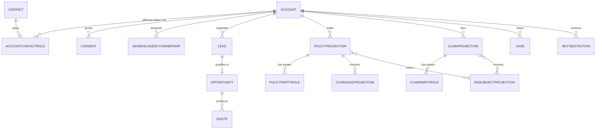
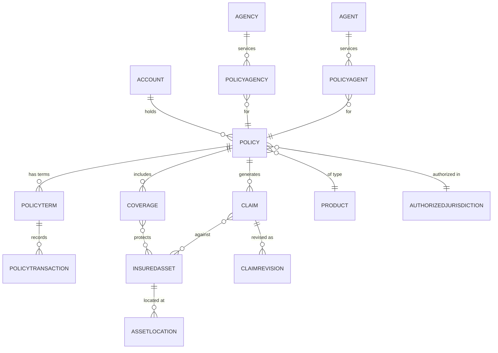
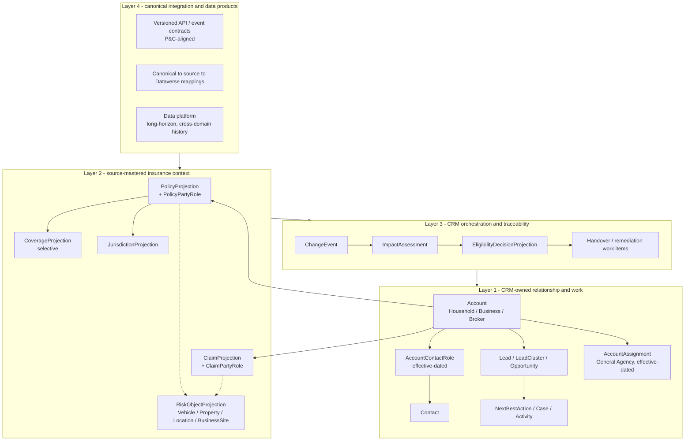
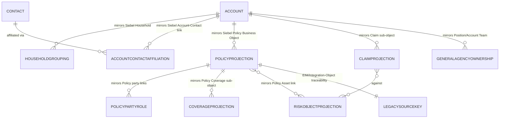

# Design Pattern 02: Insurance data model shape

**Audience:** EA / IT stakeholders evaluating how Contoso Insurance policy/claim entities should be modeled in Dataverse.
**Related ADR:** `docs/adr/ADR-0019-provisional-insurance-data-model-shape.md`

## Why this matters

Getting the core insurance data model wrong early (policy, claim, party/role shape) is expensive to unwind later — every downstream integration (Databricks, Kafka, PDV, ARO) assumes a stable shape. This pattern lets stakeholders compare the model options before the team commits engineering effort to any one of them.

## Options considered

### Option A: Harden the BizApp Solution Engineer ERD

Take the engineer's proposed ERD as the target Dataverse physical model. Retain CRM-owned party, demand, service, assistance, broker, and AI entities, plus thin Product, Policy, Claim, and Quote projection records. Add only the relationships needed to make the stated curveball scenarios internally consistent — effective-dated AccountContactRole, governed Location, CoverageProjection, a reusable RiskObjectProjection (replacing the assistance-only Vehicle boundary), and typed party roles on both Policy and Claim.

*This diagram shows Option A's hardened ERD: CRM-owned party, demand, and thin insurance-projection entities, with only the relationships needed to make the curveball scenarios internally consistent.*

**Pros:**
- Fastest route from validated prototype screens to a coherent target schema.
- Lowest initial modelling and synchronization cost.
- Preserves terminology already used by demo journeys and workspaces.
- Keeps insurance-core processing outside CRM.
- Easy for the showcase team to understand and implement incrementally.

**Cons:**
- Remains a Contoso Insurance-specific physical vocabulary with weaker portability to other insurers and data products.
- A flat projection can accumulate unrelated summary fields as new journeys arrive.
- Private, commercial, broker, and assistance use cases can force repeated table redesign when they share risk objects differently.
- Canonical mappings may become an integration-document concern rather than a property of the model.
- The smallest local model may still duplicate data that the data platform or virtual tables could expose more effectively.

**Favoured when:** Core APIs already provide screen-ready policy/claim/coverage summaries; Dataverse needs only a small resilient cache; near-term delivery speed is more valuable than broad canonical reuse.

---

### Option B: Persist a broad P&C canonical model in Dataverse

Shape the operational Dataverse schema closely around the Microsoft Property and Casualty Common Data Model (CDM). Persist most canonical entities — Policy, Coverage, PolicyTransaction, Claim, ClaimRevision, typed insured assets, Location, Agency, Agent, Payment, Line of Business, Product, and AuthorizedJurisdiction — rather than using lightweight projections. Accepted party decisions would either be mapped onto this model or revisited where CDM uses concepts such as Group and GroupMember.

*This diagram shows Option B's broad P&C canonical model: policy, coverage, claim, insured-asset, agency, and jurisdiction entities persisted in Dataverse close to the Microsoft P&C CDM shape.*

**Pros:**
- Richest canonical insurance semantics in the CRM platform.
- Strongest fit for future insurance workflows that need detailed local state.
- Reduces translation for consumers already aligned to the same canonical definitions.
- Makes relationships such as coverage-to-risk-object and claim-to-revision explicit.
- Supports broad cross-line queries without repeated API composition.

**Cons:**
- Conflicts with the thin-CRM decision (ADR-0008) unless the core systems cannot fulfil required operational responsibilities.
- Creates duplicate operational state and a permanent synchronization, reconciliation, retention, and deletion burden.
- Increases Dataverse storage, security, integration, testing, and upgrade scope.
- Encourages business logic to migrate into CRM because detailed entities are locally available.
- Canonical completeness can exceed what any approved CRM journey needs.
- Requires a separate licensing and maturity assessment; the conceptual CDM entities are not assumed to be a supported, deployable Dataverse package.

**Favoured when:** Contoso Insurance intentionally assigns material policy or claims processing responsibility to CRM; core systems cannot provide required availability or event contracts; the programme accepts Dataverse as an operational insurance platform and formally supersedes ADR-0008.

---

### Option C: Layered hybrid — CRM operating model plus canonical insurance context

Retain the engineer's CRM-owned operating model and add a deliberately small, use-case-driven insurance-context layer. Use the P&C CDM as the canonical vocabulary for contracts and mappings, but do not treat it as a mandate to persist the entire canonical model in Dataverse. The model is organized into four explicit layers:

- **Layer 1 — CRM-owned relationship and work:** Account (Household/Business/Broker), Contact, effective-dated AccountContactRole, Consent, Lead/LeadCluster/Opportunity, Case, Activity, NextBestAction, effective-dated AccountAssignment for General Agency and broker management.
- **Layer 2 — source-mastered insurance context:** PolicyProjection, CoverageProjection (only where coverage existence changes a CRM decision), ClaimProjection, RiskObjectProjection with typed facets (Vehicle, Property/Building, Location, BusinessSite), JurisdictionProjection, and Product/LineOfBusiness reference data. Every projection carries source-system metadata; CRM never calculates rating, underwriting, reserves, settlement, or commission.
- **Layer 3 — CRM orchestration and traceability:** ChangeEvent, ImpactAssessment, EligibilityDecisionProjection (recording the engine outcome, not reimplementing the rule), and Handover/remediation work items.
- **Layer 4 — canonical integration and data products:** Versioned API/event contracts using P&C-aligned names; explicit canonical-to-source-to-Dataverse mappings; the data platform holds long-horizon analytical history while Dataverse holds only operational context needed by named journeys.

*This diagram shows Option C's layered hybrid: CRM-owned relationship and work (Layer 1) flowing into source-mastered insurance-context projections (Layer 2), CRM orchestration and traceability (Layer 3), and canonical integration and data products (Layer 4).*

**Pros:**
- Preserves the proven CRM operating model and thin-CRM boundary.
- Adds exactly the insurance semantics required by the relocation, B2B, broker, claims, and assistance journeys.
- Supports canonical integration without copying the full insurance core.
- Allows the physical mechanism to follow Contoso Insurance's actual API, event, and data-platform capabilities.
- Limits personal-data replication and keeps persona-based security tractable.
- Creates a controlled path to expand or shrink projections without changing the canonical contract.

**Cons:**
- Requires disciplined governance to stop "one more projection field" from becoming an unbounded local insurance model.
- Introduces mapping work between canonical contracts, source schemas, data products, and physical Dataverse tables.
- Some journeys may combine persisted and virtualized data, increasing observability and failure-mode complexity.
- Teams must distinguish source state, projection state, orchestration state, and analytical history.
- The precise Layer 2 table set cannot be finalized before integration discovery.

**Favoured when:** Insurance systems remain authoritative (ADR-0008 holds); CRM needs reliable operational context richer than a pure live-service UI; Contoso Insurance's integration and data platform can expose identifiers, events, or governed data products that support controlled projections.

---

### Option D: Migration-mirrored — shape the extension close to Contoso Insurance's Siebel CRM object model

Keep the same CRM-owned foundation as Options A/C (Account, Contact, effective-dated AccountContactRole, Consent, Lead/Opportunity, Case, NextBestAction), but shape Layer 2's insurance-context projections and their field-level mapping as close as possible to the actual, highly customized Siebel CRM object model Contoso Insurance operates today. The explicit goal is to minimize transformation logic and cutover risk during the migration itself, using Siebel's own well-documented data-model concepts and extraction mechanism (Integration Objects, EIM staging tables) as the bridge. Party maps to Siebel's Account and Contact; PolicyProjection mirrors Siebel's Policy Business Object; RiskObjectProjection mirrors Siebel's Asset entity; ClaimProjection mirrors the Claims sub-object; every mirrored entity carries an explicit legacy-source key matching Siebel's own EIM row identifiers.

> **Important caveat:** Contoso Insurance's actual Siebel customizations are not documented in this repository. The shapes above are generic, publicly documented Siebel CRM / Siebel Financial Services concepts used only as an illustrative pattern. A source-schema discovery pass against the real Siebel instance is mandatory before this option can be estimated or committed to.

*This diagram shows Option D's Siebel-mirrored shape: Account/Contact/Policy/Claim/RiskObject projections mapped as closely as possible to Contoso Insurance's Siebel object model, with legacy source keys carried for EIM/Integration-Object traceability.*

**Pros:**
- Fastest, most traceable source-to-target mapping — every legacy field/table has a near 1:1 counterpart, minimizing custom transformation logic during the highest-risk phase of a highly customized migration.
- Simplest reconciliation: mirrored records can be diffed directly against Siebel's own EIM extracts using preserved legacy identifiers, consistent with Microsoft's complex-migration guidance on staging, success/error tables, and record-count reconciliation.
- De-risks cutover by enabling a phased, side-by-side validation window rather than a single irreversible transform.
- Business questions during migration are the easiest to answer because the shapes stay recognizable to Contoso Insurance's own business and support teams.

**Cons:**
- Carries Siebel's own historical technical debt and highly customized quirks directly into Dataverse, unless a second canonicalization wave is explicitly funded and scheduled.
- Weakest canonical/semantic alignment of the four options — no better than Option A, and materially behind Option C, on external reuse and cross-line query capability.
- Runs against Microsoft's own complex-migration guidance that literal 1:1 mirroring is usually unnecessary and costly: table/column relevance analysis "commonly eliminates 30–40% of columns and up to 20% of tables."
- Contoso Insurance's actual customizations are not documented in this repository; a source-schema discovery pass is mandatory before this option can be estimated with any confidence.

**Favoured when:** Migration timeline and cutover risk dominate the decision more than long-term canonical elegance; deep, multi-decade Siebel customization makes a clean-room redesign too risky; Integration Object/EIM extraction tooling is mature and reusable; the programme explicitly funds a second canonicalization wave that converges Layer 2 toward Option C.

---

## Comparison

| Criterion | Option A — hardened ERD | Option B — broad P&C in Dataverse | Option C — layered hybrid | Option D — Siebel-mirrored |
| --- | --- | --- | --- | --- |
| Thin-CRM alignment | Strong | Weak unless ADR-0008 is superseded | Strong | Strong (Policy/Claim/Asset remain projections, not masters) |
| Delivery speed | Highest | Lowest | Medium | Highest for the initial migration wave; lower once a canonicalization wave is counted |
| Canonical semantic depth | Low to medium | Highest | High at contracts; selective in storage | Lowest — mirrors legacy vocabulary, not canonical semantics |
| Dataverse footprint | Small | Large | Small to medium | Medium to large unless actively pruned |
| Core-system duplication | Low | High | Low | Low (still projections, sourced from Siebel or its successor) |
| B2C and B2B extensibility | Medium | High | High | Low to medium — legacy shape was not designed for it |
| Integration mapping effort | Medium | Medium | Highest initially, reusable later | Lowest initially (reuses Siebel's own EIM/Integration Objects), highest later if canonicalized |
| Data-platform adaptability | Medium | Low to medium | Highest | Medium |
| Operational resilience | Medium to high | High locally | High when projections are selected by SLA | Medium — inherits legacy resilience characteristics |
| Reversibility | High | Low | High | Medium — reversible only if a canonicalization wave is actually funded |
| Governance burden | Medium | High | High but bounded by explicit projection rules | High — must actively prevent legacy technical debt from calcifying |
| Migration risk (cutover from Siebel) | Medium | Medium to high | Medium | Lowest — this is Option D's defining strength |

## Key diagram

The most representative diagram for this pattern is the Option C (layered hybrid) diagram shown above under [Options considered](#options-considered) — it depicts the working-hypothesis option pending Contoso Insurance integration and data-platform discovery, and shows how the four layers relate.

## Validate this live

Open `docs/adr/ADR-0019-provisional-insurance-data-model-shape.md` to see the full technical rationale and the current status of the decision. Cross-check against `docs/design/contoso-insurance-data-model-extension.md` for the concrete Dataverse table/column implementation of the chosen option.

## Decision

See `docs/adr/ADR-0019-provisional-insurance-data-model-shape.md` for the recorded decision and its rationale — this pattern doc exists to support re-discussing the tradeoffs with stakeholders, not to override the ADR.
