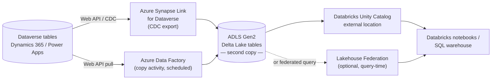
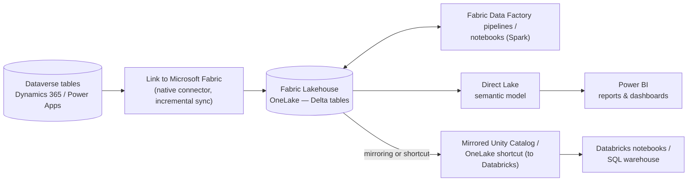
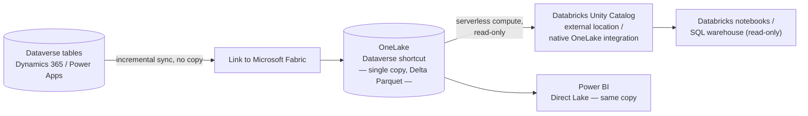
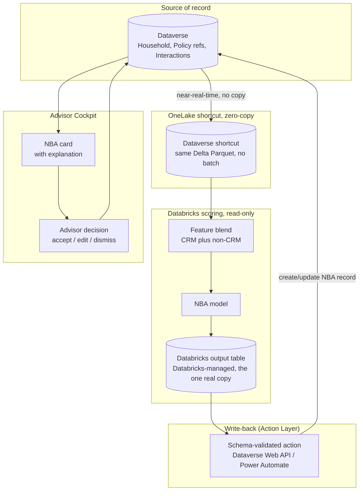
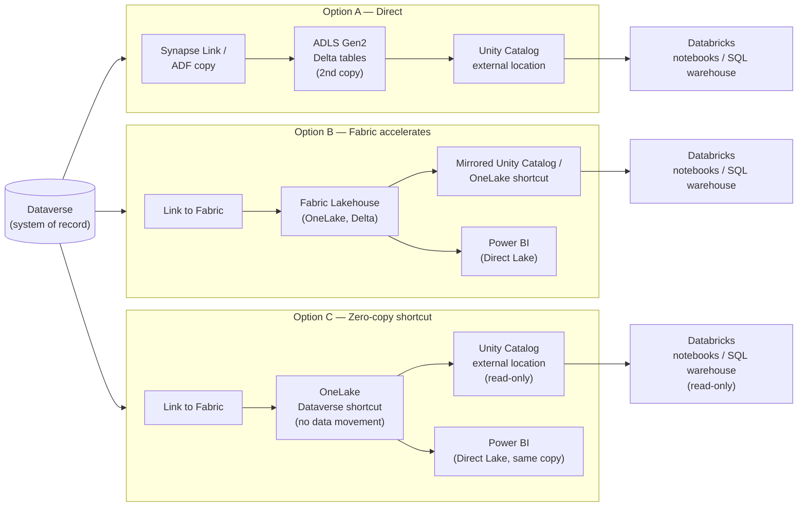

# Design Pattern 03: Dataverse to Databricks integration

**Audience:** EA / IT stakeholders evaluating how CRM data should reach the Databricks analytics platform.
**Related ADR:** `docs/adr/ADR-0030-dataverse-to-databricks-integration-pattern.md`

## Why this matters

Analytics teams need timely, reliable access to CRM data without coupling Dataverse's transactional performance to downstream reporting load. This pattern lets stakeholders weigh how tightly the Sales Advisory Cockpit's data should be coupled to the Databricks platform before committing to an integration mechanism.

The choice directly shapes the architecture of the **AG-F-01 Next-Best-Action Agent** — the agent that scores the whole book on a schedule and surfaces explainable NBA cards in the advisor cockpit. Every option here answers the same question from [ADR-0018](../adr/ADR-0018-analytics-split-crm-vs-databricks.md): *how does Dataverse data reach the analytics platform?* In all cases, Dataverse remains the system of record; Databricks is a downstream consumer only ([ADR-0008](../adr/ADR-0008-thin-crm-over-systems-of-record.md)).

## Options considered

The three options share the same source (Dataverse) and the same consuming platform (Databricks), but differ in which endpoints sit between them and which service does the copying — or whether anything is copied at all.

### Option A — Direct Dataverse → Databricks (bypass Fabric)

Export Dataverse via **Azure Synapse Link for Dataverse** (Delta Lake on ADLS Gen2) or a scheduled **Dataverse Web API / Azure Data Factory copy** into Databricks-managed storage; Databricks reads through Lakehouse Federation or a Unity Catalog external location pointed at the export.

- **Pros.** Mature, GA for years. No new platform dependency — no Fabric capacity to licence or justify. The Databricks team keeps full control of its own storage and compute. Simplest story if the customer has no Fabric estate today.
- **Cons.** Creates a **second copy** of Dataverse data — directly against OneLake's "one copy of data" principle and ADR-0018's analytics-split intent. ETL/copy latency and schema-drift risk. Duplicate governance (Dataverse RBAC vs. Databricks Unity Catalog, no shared lineage). Ongoing pipeline maintenance cost. Swims against Microsoft's current Fabric/OneLake interoperability investment — a strategic risk if that becomes the supported path forward.
- **Design pattern.** Classic ETL/ELT "bulk export + copy" — matches INTEGRATION.md's *Bulk / scheduled* pattern in its plainest form.
- **Licence.** 🧩 configuration / own build (ADF pipelines, or Synapse Link — which Microsoft is de-emphasising in favour of Fabric mirroring; current support posture `[TBD]`).

*Option A's architecture: Dataverse exports through Synapse Link or a scheduled ADF copy into a second Delta Lake copy on ADLS Gen2, which Databricks then reads via Unity Catalog or Lakehouse Federation.*

### Option B — Microsoft Fabric / OneLake as the acceleration and orchestration layer

Use **Link to Microsoft Fabric** (the native Dataverse → Fabric Lakehouse feature) to land Dataverse tables, then use Fabric notebooks, Data Factory pipelines, and Direct Lake semantic models to transform and serve — natively to Power BI, and to Databricks either via a further OneLake shortcut or a mirrored Unity Catalog relationship.

- **Pros.** Reuses the native, low-code Dataverse → Fabric connector Microsoft already documents and supports. One ingestion path serves Power BI, data science, and Databricks at once. Databricks Unity Catalog ↔ Fabric mirroring is **GA (July 2025)** — the tooling exists today. Capacity may already be paid for if the customer holds Power BI Premium/Fabric capacity.
- **Cons.** Requires **Fabric capacity** — a licence and cost line that may not exist yet; flag honestly rather than assume it. Adds a platform hop: more surface to secure, govern, and operate (Zero Trust posture must now cover three platforms, not two). Needs Fabric skills alongside existing Databricks skills. Risk of being read as Microsoft-platform lock-in by a customer that has standardised on Databricks.
- **Design pattern.** Medallion architecture inside a Fabric Lakehouse, with OneLake as the shared storage layer and Databricks treated as an additional compute engine over the same Delta tables.
- **Licence.** ➕ additional licence required (Fabric capacity SKU) — exact tier `[TBD]`.

*Option B's architecture: the native Link to Microsoft Fabric connector lands Dataverse tables in a OneLake Lakehouse, which serves Power BI directly and reaches Databricks via Unity Catalog mirroring or a OneLake shortcut.*

### Option C — Zero-copy: Dataverse → OneLake shortcut ← Databricks reads directly

Use **Link to Microsoft Fabric**'s OneLake **Dataverse shortcut** (Delta Parquet, no data movement) as the landing surface, and have Databricks read that same OneLake location directly via Unity Catalog external location / native OneLake integration — no ETL, no Fabric compute beyond the shortcut itself.

- **Pros.** True **"one copy of data"** — no duplication, no drift, lowest storage cost. Dataverse stays the sole system of record, cleanly compliant with ADR-0008 and ADR-0018 by construction, not by policy enforcement. Near-real-time reflection of Dataverse changes through Fabric's incremental Link sync. Databricks consumes read-only, which fits [ADR-0014](../adr/ADR-0014-agents-advisory-by-design.md) (agents advisory, humans decide) — there is no write path back into CRM to govern.
- **Cons.** The newest option: Unity Catalog ↔ Fabric mirroring and native OneLake reads from Databricks are 2025-era capabilities; feature limits (large tables, complex Dataverse relationships, throttling) are `[TBD]` and need validation against the customer's actual data volumes. Cross-tenant / service-principal permissions must be verified explicitly on both sides (Zero Trust). Still requires a minimum Fabric capacity for the shortcut/Link-to-Fabric feature even though no data is copied. Databricks **writing** into OneLake natively is roadmap, not GA — this option is read-only by current platform limits, not just by design.
- **Design pattern.** Shared bronze layer via OneLake shortcut — zero-ETL, single-copy interoperability across two compute engines on the same open Delta table.
- **Licence.** 🧩 configuration (native features) + a Fabric capacity floor — exact minimum SKU `[TBD]`.

*Option C's architecture: the OneLake Dataverse shortcut moves no data — Databricks and Power BI both read the same single Delta Parquet copy directly, read-only.*

Option C's read side is zero-copy, but its write-back is not — the diagram below (from the ADR's Advisory Cockpit walk-through) shows the one deliberate exception: scored NBA output must still land in a Databricks-managed table before the schema-validated Action Layer pushes it into Dataverse.

*Option C's write-back exception: the zero-copy guarantee applies only to the read side — scored output still passes through a Databricks-managed table and the schema-validated Action Layer before reaching Dataverse.*

## Hosting options

The three data-path options above answer *how book-wide NBA scoring data reaches Databricks*. The four hosting options below answer an orthogonal question: *how does the advisor's Copilot experience delegate a single-household, on-demand ask to the data platform* — for example "why this NBA?" or "refresh this household's recommendation now". Any data-path option (A, B, or C) can sit underneath any hosting pattern.

The common delegation mechanism across all four is the **Databricks Genie MCP server** (`/api/2.0/mcp/genie`) — a Databricks-native managed endpoint where Copilot Studio adds it directly via Tools → Add a tool → Model Context Protocol. Unity Catalog permissions are always enforced. Alternatives exist (custom connector/Power Automate → Databricks SQL Statement Execution API; Fabric Data Agent as a Copilot Studio knowledge source) and are documented in the ADR.

### Hosting Option A — Copilot agent embedded in the Advisor Cockpit

A custom Copilot Studio agent hosted directly on the household/account form via a **PCF control + Microsoft 365 Agents SDK**, following Microsoft's own reference architecture for extending Dynamics 365 model-driven apps with a custom agent.

- **Pros.** The advisor never leaves the record — household context is already known, no resolution step needed. Matches the existing "cockpit" mental model. An official Microsoft reference architecture exists to build against.
- **Cons.** Genuinely new build effort: a PCF control, a custom Copilot Studio agent, and Microsoft 365 Agents SDK auth wiring. Ties the cockpit's AI experience to a specific extensibility investment with its own upgrade-impact surface (PCF ALM rules apply). The Genie MCP endpoint is a 2026 **preview** feature — support/SLA posture `[TBD]`.
- **Design pattern.** *Agent-as-embedded-copilot* — a per-record, context-aware assistant surfaced through the app shell itself, delegating heavy analytical lifting to an external tool via MCP.
- **Licence.** 🧩 own build (PCF control + Copilot Studio agent configuration) + Databricks preview feature; Copilot Studio licensing tier `[TBD]`.

### Hosting Option B — Separate Copilot Studio agent in Teams

The same orchestration logic published standalone — the advisor consults it outside the model-driven app entirely, via a Copilot Studio agent connected to Microsoft Teams. Because there is no implicit record context, the agent must first resolve which household is meant, and any recommendation still has to be reviewed in the Advisor Cockpit — ADR-0014 requires the decision surface to remain the cockpit, not a chat transcript.

- **Pros.** Fastest to stand up — no PCF control to build. Reachable from mobile/Teams when the advisor isn't in the app. Shares the same Genie MCP tool and Action Layer as Hosting Option A. Good for piloting the delegation mechanism before committing to embedding.
- **Cons.** Loses implicit record context — needs an extra household-resolution step, adding latency and a disambiguation failure mode. Creates a second surface the advisor context-switches to; the decision (accept/edit/dismiss) still must happen back in the cockpit per ADR-0014. Risks becoming a weaker "shadow cockpit" if adoption skews toward Teams.
- **Design pattern.** *Agent-as-companion-channel* — identical orchestration and Action Layer, a decoupled front door with an added identity-resolution step.
- **Licence.** 🧩 own build (Copilot Studio agent, mostly shared configuration with Hosting Option A) + Databricks preview feature; Teams / Microsoft 365 Copilot publishing licence `[TBD]`.

### Hosting Option C — Extend the out-of-the-box Microsoft 365 Copilot pane in the model-driven app

Rather than build a new UI surface (Option A) or leave the app entirely (Option B), extend the **native Microsoft 365 Copilot side pane that already ships with the model-driven app** using two native mechanisms: (1) set a default agent to bind the custom Copilot Studio agent as the pane's starting experience, and (2) `Xrm.Copilot.*` client APIs scripted from the existing household form to push record context in and let the agent's response drive real form behaviour back.

- **Pros.** Reuses UI advisors already know — no new PCF control, no separate Teams app; lowest incremental build effort of the three. Bidirectional by design: `addActionHandler` lets the agent's response trigger real form behaviour. Likely the lowest incremental licence cost if Microsoft 365 Copilot is already licensed org-wide.
- **Cons.** `updateContext` — the piece that would auto-pass the open household's record context into the agent — is explicitly **preview**; today context likely has to be restated explicitly in the prompt. Setting a default agent **replaces** the generic Microsoft 365 Copilot experience for that app. Still requires model-driven app form-script customisation with its own ALM/testing surface.
- **Design pattern.** *Agent-as-default-pane* — reuse the platform's own Copilot chrome and extend it via configuration + scripted client APIs, rather than building new UI or leaving the app.
- **Licence.** 🧩 own build (Copilot Studio agent configuration + form scripts) + Databricks preview feature; relies on Microsoft 365 Copilot licensing already covering the app — exact tier/eligibility `[TBD]`.

### Hosting Option D — Extend the native "Copilot in Dynamics 365 Sales" agent in place

Rather than swap in a custom default agent (Hosting Option C), keep the **pre-built, native Sales Copilot agent** that already ships with Dynamics 365 Sales and extend it in place via the app-specific customization surface in Copilot Studio — adding custom topics, an "Explain this NBA" prompt in the native `SalesSparks` prompt guide, and glossary terms so the existing native agent understands insurance-vertical business terms (e.g. "household", "NBA") without any UI or form-script work.

- **Pros.** Keeps the native, already-familiar Sales Copilot experience intact — additive customization, not a wholesale swap. Likely the lowest change-management cost of all four: advisors keep the interface they already use. Glossary/synonyms let the existing native agent understand insurance-vertical terms with zero UI or form-script work.
- **Cons.** Explicitly a **preview** capability per Microsoft's own documentation. Only applies if the Advisor Cockpit is genuinely built on Dynamics 365 Sales (an app with both lead and opportunity tables) — `[TBD]` for this showcase, not yet confirmed. Custom topics are billed via Copilot Studio consumption credits, so cost scales with usage. Less control than a fully custom agent (Hosting Option A).
- **Design pattern.** *Agent-as-extended-native-copilot* — keep the platform's own pre-built domain agent and graft new topics/tools/glossary onto it in place, rather than replacing it (Hosting Option C) or building a new one (Hosting Options A/B).
- **Licence.** Requires Dynamics 365 Sales licensing + Copilot Studio Author role + custom-topic consumption credits + Databricks preview feature; exact incremental cost `[TBD]`.

## Comparison

### Integration-path comparison (Options A–C)

| Criterion | Option A — Direct | Option B — Fabric-mediated | Option C — Zero-copy shortcut |
| --- | --- | --- | --- |
| **Data copies** | Second copy on ADLS Gen2 | One copy in Fabric Lakehouse | Zero extra copies |
| **Latency** | Batch/scheduled | Incremental Fabric sync | Near-real-time via Link sync |
| **Pipeline maintenance** | High — custom ADF/Synapse pipelines | Low — native Fabric connector | Very low — shortcut configuration only |
| **Fabric capacity required** | No | Yes | Yes (minimum SKU for shortcut) |
| **Databricks write-back** | Possible | Possible (via Fabric pipeline) | Read-only by current platform limits |
| **Governance footprint** | Two separate stacks (Dataverse RBAC + Unity Catalog) | Three stacks (Dataverse + Fabric + Unity Catalog) | Shared Unity Catalog over same Delta tables |
| **ADR-0008 compliance** | By policy — second copy must be governed | By design — Fabric is the coordinating layer | By construction — Dataverse is the only copy |
| **Platform maturity** | GA, long-standing | GA (Unity Catalog↔Fabric mirroring GA July 2025) | 2025-era; scale/throttle limits `[TBD]` |
| **Working lean** | Least preferred — second copy runs counter to ADR-0018 | Viable if Fabric capacity exists | Best match for ADR-0008/0018 if maturity validates |

### Hosting-option comparison (Options A–D)

| Criterion | Hosting A — Embedded PCF | Hosting B — Teams standalone | Hosting C — Native M365 pane | Hosting D — Extend native Sales agent |
| --- | --- | --- | --- | --- |
| **Build effort** | High (PCF + Agents SDK) | Low (reuses Hosting A config) | Medium (form scripts) | Low (topics + glossary only) |
| **Implicit record context** | Yes — form context available | No — resolution step required | Partial — `updateContext` preview | Yes — Sales Copilot already has record context |
| **Decision surface** | In-cockpit ✅ | Cockpit (separate tab) ⚠️ | In-cockpit ✅ | In-cockpit ✅ |
| **Native experience preserved** | No — custom UI | No — separate channel | Partial — default agent replaces generic chat | Yes — native agent extended |
| **Prerequisite** | None | None | Microsoft 365 Copilot licence | Dynamics 365 Sales app |
| **Maturity** | GA PCF, preview Genie MCP | GA Teams publish, preview Genie MCP | Preview `updateContext` + preview Genie MCP | Preview (D365 Sales Copilot extension) |
| **Change-management cost** | Medium | High (context switch) | Medium | Low |

## Key diagram

The diagram below shows all three integration-path options side by side — how each routes from Dataverse through to Databricks notebooks/SQL warehouse. This is the representative overview diagram from ADR-0030.

## Validate this live

Open `docs/adr/ADR-0030-dataverse-to-databricks-integration-pattern.md` for the full technical detail and the accepted decision, plus the runbook `databricks-mcp-setup-runbook.md` referenced there for hands-on validation steps.

## Decision

See `docs/adr/ADR-0030-dataverse-to-databricks-integration-pattern.md` for the recorded decision — this pattern doc exists to support re-discussing the tradeoffs with stakeholders, not to override the ADR.

At the time of writing the ADR carries status **"Proposed hypothesis — no option selected"**. The working lean (not a decision) is that **Option C** (zero-copy shortcut) best matches ADR-0008/ADR-0018, provided its feature maturity and scale limits validate against the customer's actual Databricks/Fabric estate. Reopen the ADR when the customer's Fabric/Databricks estate is confirmed, or when Databricks ships native OneLake write support.
