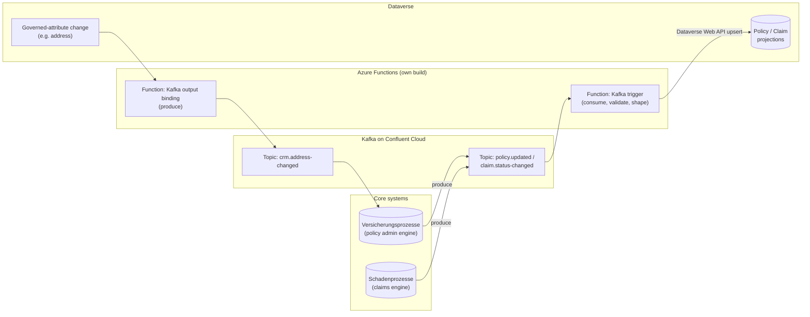
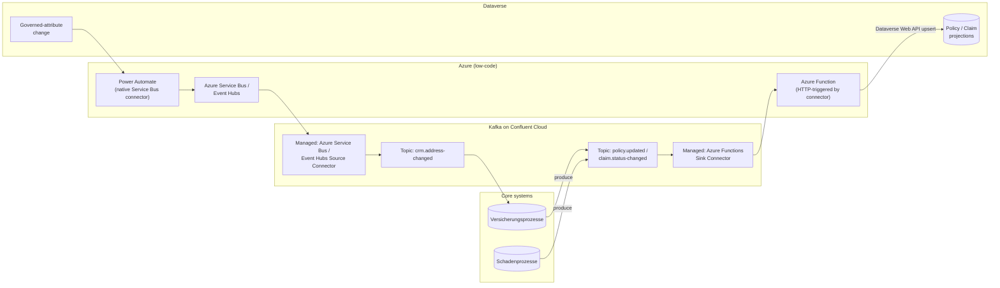
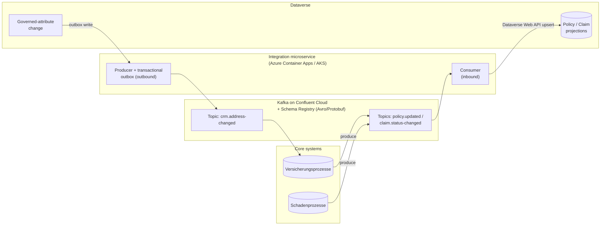
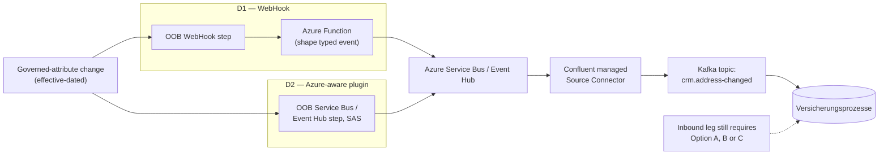
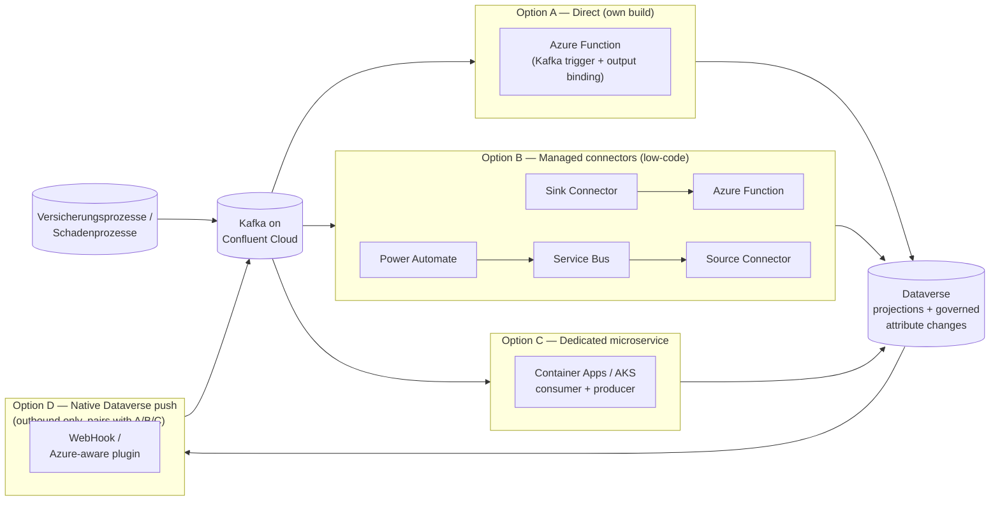

# Design Pattern 04: CRM to core-systems Kafka/Confluent integration

**Audience:** EA / IT stakeholders evaluating event-driven integration between the CRM and Versicherungsprozesse/Schadenprozesse core systems.
**Related ADR:** `docs/adr/ADR-0031-crm-core-systems-kafka-confluent-integration-pattern.md`

## Why this matters

The core insurance systems already use Kafka Confluent Cloud for event-based integration. The Advisory Cockpit use case needs to decide whether and how the CRM plugs into that same event backbone, rather than inventing a parallel integration mechanism. This pattern frames that decision for stakeholders before implementation.

Two directions must be solved simultaneously:

- **Inbound** — the Versicherungsprozesse (policy admin engine) and Schadenprozesse (claims engine) systems publish state-change events (e.g. `PolicyUpdated`, `ClaimStatusChanged`) that must refresh the CRM's Policy/Claim projections. Per ADR-0008 (thin CRM), Dataverse never re-implements rating or claims adjudication — it only keeps its reference-keyed projections current.
- **Outbound** — CRM-originated governed-attribute events (e.g. `AddressChanged`, per the ADR-0011 cascade) must reach the core systems via the same Kafka backbone, carrying mandatory effective dating and a correlation identifier.

One hard constraint applies across all options: **Confluent Cloud authentication is secret/connection-string only** — Managed Identity is not supported. Key Vault-backed secret rotation is the best available Zero Trust posture here, not a passwordless one.

## Options considered

### Option A — Direct Kafka client via Azure Functions (own build, serverless)

Azure Functions has a native Kafka trigger (consume) and Kafka output binding (produce), both Confluent Cloud–compatible over SASL_SSL. One Function app covers both legs: a Kafka-triggered function consumes core-system topics and upserts CRM projections; a second function, invoked from Dataverse, produces outbound events onto Confluent Cloud.

*This diagram shows Option A's architecture: one Azure Function app covers both legs — a Kafka-triggered function consuming core-system topics into CRM projections, and a second function producing outbound governed-attribute events back onto Confluent Cloud.*

**Pros:**
- Lowest latency in both directions.
- Single technology/skillset (Azure Functions) covers both legs.
- No Confluent connector licensing cost.
- Full control over schema validation and dead-letter handling in code.

**Cons:**
- Azure Functions consumption-plan limits (cold start, execution timeout, batch-size ceilings) can throttle under bursty claim/policy volumes.
- Offset management, retries and dead-lettering are hand-rolled — the reliability-engineering cost sits entirely with the team.
- Confluent Cloud auth is secret-based only (no Managed Identity); Key Vault rotation is mandatory.

**Licence:** 🧩 own build (Azure Functions code, Kafka client libraries).

---

### Option B — Confluent-managed connectors at the edge (low-code, asymmetric)

Use Confluent Cloud's fully-managed connectors to minimise custom Kafka client code. The two directions necessarily use different mechanisms — no managed Kafka→Azure sink connector exists in the current Confluent catalogue, so this asymmetry is a fact of the connector catalogue, not a design choice.

- **Inbound:** Confluent's managed Azure Functions Sink Connector batches Kafka records and HTTP-POSTs them to a thin, HTTP-triggered Azure Function, which upserts the Dataverse projection.
- **Outbound:** Power Automate (native Dataverse + Service Bus connectors) relays the governed-attribute change to Azure Service Bus, from which Confluent's managed Service Bus/Event Hubs Source Connector picks it up and produces to Kafka. Power Automate must remain a **pure relay with no business logic**.

*This diagram shows Option B's asymmetric architecture: a managed Sink Connector plus a thin Function handles the inbound leg, while Power Automate relays outbound changes through Service Bus to a managed Source Connector back onto Kafka.*

**Pros:**
- Least custom code on either leg.
- Confluent operates scaling, offsets and dead-lettering for the inbound leg (dedicated `success-<connector-id>` / `error-<connector-id>` topics).
- Outbound leg is pure low-code — matches the config → low-code → pro-code preference.

**Cons:**
- Two different mechanisms for the two directions — two operational surfaces to monitor.
- No symmetric Kafka→Azure sink connector exists: the "no Kafka client code" property does not extend to a hypothetical inbound-via-Service-Bus path.
- Confluent managed-connector task-hours are an additional cost on top of Azure compute.
- Function and Confluent cluster should be co-located by region to control latency and egress cost.

**Licence:** Native/low-code (Power Automate, Service Bus) + 🧩 configuration (Confluent connectors, thin Function adapter).

---

### Option C — Dedicated integration microservice (own build, containerised)

A dedicated Kafka-native service (e.g. .NET or Java using Confluent's client libraries) running on Azure Container Apps or AKS, covering both directions with full Confluent Schema Registry (Avro/Protobuf) enforcement and a transactional outbox for outbound delivery guarantees. This escapes Azure Functions' consumption-plan constraints entirely, at the cost of owning a running service.

*This diagram shows Option C's architecture: a single dedicated microservice on Container Apps/AKS owns both the inbound consumer and the outbound producer with a transactional outbox, against topics governed by Confluent Schema Registry.*

**Pros:**
- Most control of the four options — handles high volume and complex/nested schemas via Schema Registry, custom batching, and exactly-once-ish semantics via the outbox pattern.
- Escapes Azure Functions' consumption-plan limits.
- Single, consistent technology stack for both directions (unlike Option B's two mechanisms).

**Cons:**
- Highest operational burden — a service to build, scale, patch and monitor.
- Requires Kafka/Confluent expertise on the team; a genuine skills investment.
- Most infrastructure to own (compute environment, networking, observability) — the heaviest Operational Excellence cost among the options.

**Licence:** 🧩 own build (heaviest custom-build option of the four).

---

### Option D — Native Dataverse push, no Power Automate hop (outbound-focused complement)

Two real, low/no-code mechanisms exist at the Dataverse platform level itself:

- **D1 — WebHook registration.** Register a WebHook endpoint plus a plugin step on the governed message (Plug-in Registration tool). Dataverse POSTs the serialised execution context (JSON) to an HTTPS endpoint — e.g. a thin Azure Function that reshapes it into the typed `AddressChanged` contract and produces to Kafka. No Power Automate, no custom plugin assembly.
- **D2 — Azure-aware Service Bus/Event Hub integration.** Register a Service Endpoint (SAS-based) and the out-of-box Azure-aware plugin step. Dataverse posts the execution context straight to Service Bus/Event Hub with **zero custom code**. Confluent's managed Service Bus/Event Hubs Source Connector then relays it into Kafka — the same relay technology as Option B's outbound leg, minus the Power Automate hop.

**This option only solves the outbound direction.** Dataverse has no symmetric "subscribe to an external Kafka topic" capability, so the inbound leg (core systems → CRM) always still needs Option A, B or C.

*This diagram shows Option D's two native Dataverse mechanisms (D1 WebHook, D2 Azure-aware plugin) both feeding Service Bus/Event Hub for relay into Kafka — with the inbound leg still requiring Option A, B or C.*

**Pros:**
- Removes Power Automate as an operational hop/cost for the outbound leg.
- D2 needs **zero custom code** — pure configuration.
- Dataverse's own asynchronous service handles retry/backoff natively (exponential-backoff retry until the system job is marked Failed), with System Jobs visibility for operational monitoring.

**Cons:**
- **Outbound-only** — always a complement to Option A, B or C, never a full answer by itself.
- D1 still needs a shaping Function (removes Power Automate specifically, not all custom compute).
- SAS-key (D2) and WebHook (D1) authentication are legacy, pre-Entra-ID patterns — a Zero Trust trade-off to flag explicitly.
- **Documented 192 KB payload truncation ceiling** on the Service Bus/Event Hub path silently drops `PreEntityImages`/`PostEntityImages` beyond that size — a correctness risk for large household/portfolio payloads that must be tested against the golden thread's actual record size.

**Licence:** Native/configuration (Dataverse OOB features) + 🧩 configuration (Confluent connector, optional shaping Function for D1).

## Comparison

| Criterion | Option A — Direct (Functions) | Option B — Managed connectors | Option C — Dedicated microservice | Option D — Native Dataverse push |
| --- | --- | --- | --- | --- |
| Direction(s) covered | Both, symmetric | Both, asymmetric mechanisms | Both, symmetric | Outbound only — pairs with A/B/C |
| Custom code burden | Medium — Function code both legs | Low — thin adapter + low-code flow | High — full service to build/run | Low–Medium — D2 zero code, D1 needs shaping Function |
| Operational ownership | Team owns Function + Kafka client reliability | Confluent + Power Platform share ownership; team owns thin adapter | Team owns full service lifecycle | Dataverse platform + team (Function for D1 only) |
| Latency | Lowest | Low–Medium — extra connector/relay hop | Low, tunable | Medium — extra Service Bus/Event Hub hop |
| Zero Trust / auth model | Secret-based to Confluent, no MI; Key Vault rotation | Secret-based to Confluent; native connectors for Azure legs | Secret-based to Confluent; MI usable for Azure-side calls | SAS/WebHook key — legacy, pre-Entra ID |
| Schema/contract enforcement | In Function code, against `api/events/*.schema.json` | In thin Function (inbound); Power Automate is a dumb relay (outbound) | Enforced via Confluent Schema Registry (Avro/Protobuf) | Downstream of the native push — must be enforced elsewhere |
| Cost driver | Azure Functions compute | Confluent managed-connector task-hours + Azure compute | Container Apps/AKS compute + ops headcount | Azure Service Bus/Event Hub + Confluent connector |
| Reversibility | High — stateless Functions, easy to replace | High — connectors can be swapped/removed | Medium — more infra to unwind | High — OOB features, easy to disable |
| Design pattern fit | Typed domain event, literal | Typed domain event + relay variant | Typed domain event + outbox | Typed domain event, shaping deferred |
| Licence | 🧩 own build | Native/low-code + 🧩 configuration | 🧩 own build, heaviest | Native (D2) / 🧩 configuration (D1) |

## Key diagram

The diagram below is the overview of all four options from ADR-0031, showing how each option positions between the core systems, the Kafka backbone, and Dataverse.

## Validate this live

Open `docs/adr/ADR-0031-crm-core-systems-kafka-confluent-integration-pattern.md` for the full technical rationale, including how the Advisory Cockpit use case was used to validate the chosen pattern.

## Decision

See `docs/adr/ADR-0031-crm-core-systems-kafka-confluent-integration-pattern.md` for the recorded decision — this pattern doc exists to support re-discussing the tradeoffs with stakeholders, not to override the ADR.

> As of the ADR's current status ("Proposed hypothesis — no option selected, no lean stated"), all four options remain fully open for Enterprise Architect and customer IT/architecture stakeholder review. Option D is always a complement, not a standalone answer. The deciders are `AG-E-03` Enterprise Architect (accountable), `AG-E-09` Integration Engineer, `AG-E-04` SecDevOps, and the customer's IT/Architect (`P-06`).
