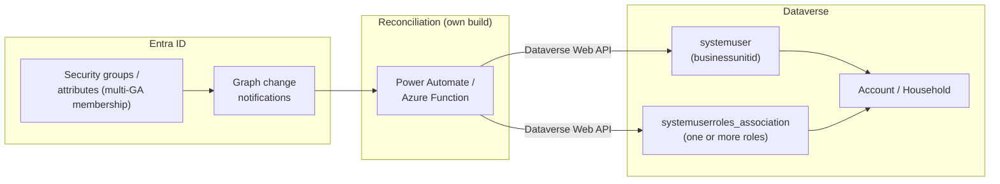
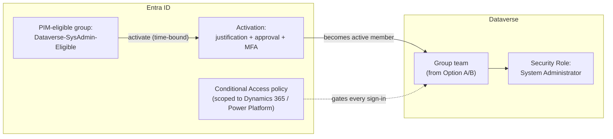
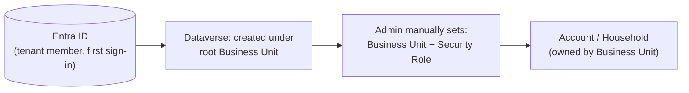
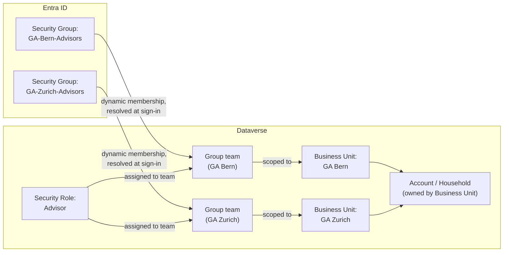

# Design Pattern 05: Identity and access management (Entra to Power Platform/Dynamics 365)

**Audience:** EA / IT / security stakeholders evaluating how Entra security roles map to Power Platform and Dynamics 365 access.
**Related ADR:** `docs/adr/ADR-0032-entra-power-platform-dynamics365-identity-access-management.md`

## Why this matters

Insurance is a regulated industry — who can see which customer/policy data is a compliance question, not just an IT convenience question. Contoso Insurance runs roughly 80 independent General Agents (GAs), each owning a local book of households. ADR-0013 decided that GA ownership is a governed, dated relationship on the Account — but left the technical mechanism for access-follows-territory as `[TBD]`. This pattern frames the four IAM options so security and business stakeholders can align on the Entra-to-Power-Platform security model before it is built.

The validating use case is **AG-F-01 Next-Best-Action Agent** (Advisory Cockpit): which advisor can see which household's NBA cards, and what happens when GA territory changes or elevated access is needed?

> **Advisory-by-design:** Regardless of which option is chosen, the named advisor's accept/edit/dismiss decision on any NBA card remains the recorded, accountable act ([ADR-0014](../adr/ADR-0014-agents-advisory-by-design.md)). IAM only controls *who can reach the cockpit for which households* — not the advisory guardrail itself.

## Options considered

All four options answer the same underlying question — **how does an Entra ID identity end up with a Dataverse Security Role scoped to the right Business Unit** — but differ in how much is native configuration versus custom automation, and in how they handle stable GA-scoped access versus cross-GA or time-bound elevated access.

### Option A — Native Entra Group-Team per GA Business Unit (config-only)

One **Entra Security Group per GA** (e.g. `GA-Bern-Advisors`) backs one Dataverse **group team**, scoped to that GA's Business Unit, with a Security Role (e.g. "Advisor") assigned to the team. Group membership is evaluated **dynamically at sign-in** — no import, no separate provisioning step for the user beyond adding them to the Entra group. This is a documented, native Dataverse feature (Power Platform admin center → Environment → **Teams** → Team type "Microsoft Entra Security group").

- **Pros.** Zero custom code. Provisioning/deprovisioning is dynamic — adding or removing a user from the Entra group is the entire lifecycle action. Directly gives ADR-0013's territory question a technical mechanism: Entra group membership becomes the system of record for "which GA can this advisor see," fully auditable via the group team's membership and `systemuserroles_association`. Declarative, group-driven access — the configuration-over-code end of the design-principles preference.
- **Cons.** One team per Business Unit: a user who needs access across more than one GA (a Broker Manager covering three GAs, or an advisor temporarily covering a colleague) must be added to multiple Entra groups — workable, but does not compose cleanly for personas (Marketer, Business owner/Data steward) who need cross-BU access by design. Group-membership changes are **cached for up to 8 hours** of continuous sign-in — access changes are not instantaneous. Bootstrapping ~80 GA teams by hand does not scale; this requires a scripted, idempotent bootstrap (same shape as ADR-0005's CI application users). Does not by itself provide time-bound elevation for privileged roles (System Administrator/Customizer).
- **Licence.** Native / configuration (Power Platform admin center). The 80-team bootstrap should be scripted/IaC-managed.

### Option B — Automated per-user reconciliation (custom sync)

A Graph API-driven reconciliation job (Power Automate or an Azure Function, triggered on Entra group/attribute change notifications) computes each user's target Business Unit(s) and Security Role(s), then calls the Dataverse Web API to set `systemuser.businessunitid` and manage `systemuserroles_association` directly. Unlike Option A's one-team-per-BU model, this supports **many-to-many** combinations — a single user with roles/access spanning multiple GAs or a mix of functional roles.

*This diagram shows the automated reconciliation path: an Entra group/attribute change notification triggers a reconciliation job that sets Business Unit and Security Role assignments directly via the Dataverse Web API, supporting the many-to-many, cross-BU access Option A's one-team-per-BU model cannot.*

- **Pros.** The only option that cleanly handles a persona whose access does not fit one Business Unit — a Broker Manager (`P-05`) covering several GAs, a Marketer (`P-04`) or Business owner/Data steward (`P-07`) needing central, cross-BU access by design. Change notifications can react faster than Option A's 8-hour cache. Generalises the reconciliation pattern ADR-0005 already used for CI service principals to human users.
- **Cons.** Real custom code to build, run, and monitor — retries, idempotency, and drift detection (if the job fails silently, a leaver's access is not revoked) are the team's responsibility. A second identity-plane moving part alongside native mechanisms. Requires its own reliability engineering and alerting to avoid privilege drift.
- **Licence.** 🧩 own build (reconciliation service/flow + monitoring).

### Option C — PIM for Groups + Conditional Access (Zero-Trust hardening layer)

Not a replacement for A or B, but a layer on top of either. **Entra PIM for Groups** makes membership of privileged groups (e.g. the group backing a "System Administrator" Dataverse team) **eligible** rather than standing — activation requires justification, optional approval, and is time-bound. **Conditional Access** policies scoped to the Dynamics 365/Power Platform cloud app enforce MFA, device compliance, and named-location restrictions on every sign-in.

*This diagram shows the PIM hardening layer: privileged group membership is eligible rather than standing, requiring justification and approval to activate time-bound access, while Conditional Access gates every sign-in — layered on top of whichever base model (Option A or B) is chosen.*

- **Pros.** Standing privilege is minimised — System Administrator/Customizer access exists only when actively needed and is fully audited (who activated, when, why, approved by whom). "Verify explicitly" is enforced at every sign-in. Recurring access reviews give a concrete, demonstrable answer to regulatory attestation questions. Directly matches SECURITY.md's Zero Trust framing and closes its "Identity & access model" `[TBD]`.
- **Cons.** **Licence-gated** — PIM for Groups requires **Microsoft Entra ID Governance (P2)**; the customer's actual Entra licence tier is unconfirmed (`[TBD]`). Approval workflows add latency for legitimate access — a break-glass exception must be defined for incidents. Conditional Access misconfiguration is a real lockout risk; needs a report-only rollout phase before enforcement. This option does **not** solve the multi-BU access problem on its own — it must be paired with Option A or B for the underlying territory model.
- **Licence.** Native / configuration (Entra admin center) but **licence cost-gated**: Entra ID Governance P2 required for PIM for Groups.

### Option D — Manual baseline (individual assignment, no automation)

The admin manually sets each `systemuser`'s Business Unit and Security Role via the Power Platform admin center or Dataverse UI. New Entra ID users are created under the **root Business Unit** on first sign-in and must be moved and role-assigned by hand. No Entra group linkage exists.

*This diagram shows the manual baseline: a new Entra ID user lands under the root Business Unit by default until an admin manually sets the correct Business Unit and Security Role — the slowest and least auditable of the four paths.*

- **Pros.** Zero build effort, zero new infrastructure, zero Entra group hygiene prerequisite — works today, for a small pilot or demo scale.
- **Cons.** Does not scale to ~80 GAs / hundreds of advisors — every onboarding, offboarding, and GA reassignment is a manual step. A leaver's access is revoked only if someone remembers to do it — the weakest audit trail of the four options and no automatic drift detection. An ADR-0013 territory reassignment requires a manual Security Role/BU edit each time, with no technical link back to the governed business-case record.
- **Licence.** Native (Power Platform admin center, no build) — but operationally the most expensive option over time.

## Comparison

| Criterion | Option A — Native Group-Team | Option B — Automated reconciliation | Option C — PIM + Conditional Access | Option D — Manual baseline |
| --- | --- | --- | --- | --- |
| Handles single-GA advisors | Yes, cleanly | Yes, but more machinery than needed | Adds hardening on top of A/B | Yes, but manual per user |
| Handles cross-BU / multi-GA personas | Only via multiple group memberships | Yes, cleanly — its core strength | N/A — inherits from A/B | Yes, but manual per user |
| Handles privileged/time-bound access | No | No | Yes — its core strength | No, standing access only |
| Custom code burden | None | Medium–High — reconciliation service | Low — Entra configuration | None |
| Latency of access change | Up to 8h (group-membership cache) | Faster — event-driven, but adds a hop | Minutes (activation) once base model resolves | Hours–days (ticket-driven) |
| Audit trail | Group + team membership, native | Custom job's own logging | PIM activation log + access reviews | Weakest — manual, easy to miss |
| Licence cost driver | None beyond existing Entra/Dataverse | Azure Function/Power Automate compute | Entra ID Governance P2 (`[TBD]` confirm tier) | None, but heaviest ops cost |
| Scales to ~80 GAs | Yes, with a scripted bootstrap | Yes | N/A — layer, not a base model | No |
| Resolves ADR-0013's access-follows-territory need | Yes, directly | Yes, more flexibly | N/A — layer, not a base model | No |
| Reversibility | High — native feature, easy to unwind | Medium — custom service to decommission | High — Entra policy, easy to disable | High — nothing to unwind |
| Design pattern fit | Declarative, group-driven | Reconciliation/sync (ADR-0005 shape) | Defense-in-depth, layered | None — explicit baseline |

## Key diagram

The diagram below depicts an illustrative Entra-to-Power-Platform role-mapping flow using Option A as the example — the native, config-only path that directly links an Entra Security Group to a Dataverse Business Unit-scoped group team, resolving GA territory access at sign-in without custom code. No option has been selected yet; this diagram illustrates one of the four credible options, not a decided architecture.

## Validate this live

Open `docs/adr/ADR-0032-entra-power-platform-dynamics365-identity-access-management.md` for the full technical rationale. Note that no option has been selected — this ADR is an open working hypothesis pending Enterprise Architect and customer IT/architect stakeholder review.

## Decision

See `docs/adr/ADR-0032-entra-power-platform-dynamics365-identity-access-management.md` for the recorded decision — this pattern doc exists to support re-discussing the tradeoffs with stakeholders, not to override the ADR.
