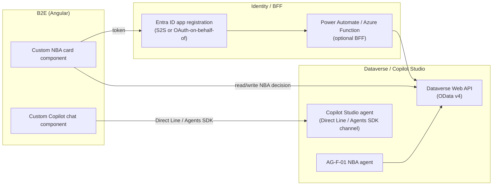
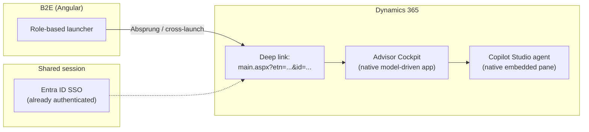
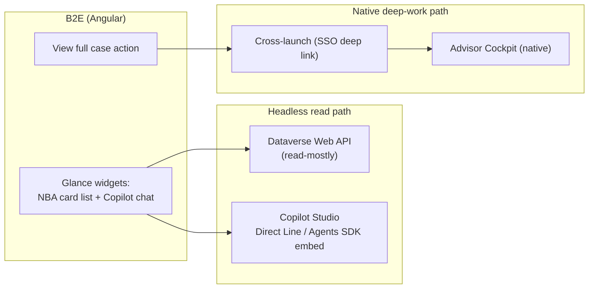
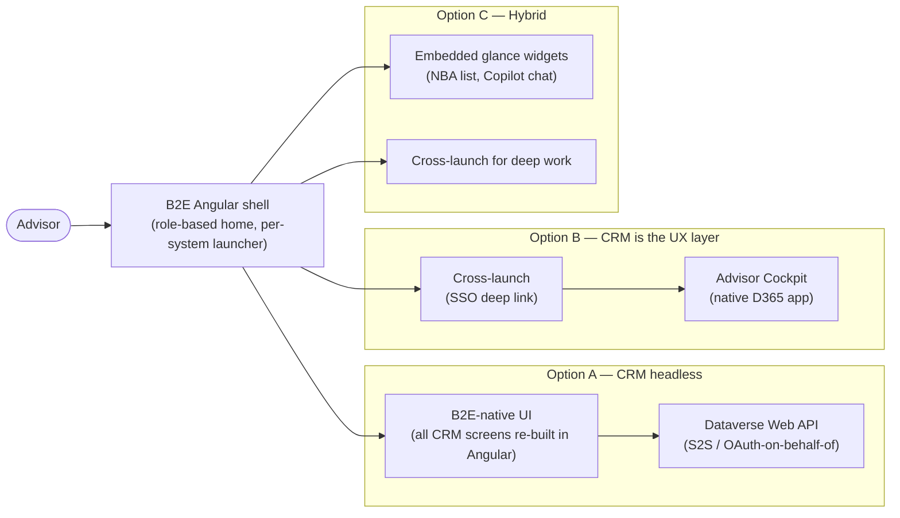

# Design Pattern 06: CRM UX placement in the B2E landscape

**Audience:** EA / IT / UX stakeholders evaluating where CRM screens should live relative to the overarching B2E (Angular) employee experience layer.
**Related ADR:** `docs/adr/ADR-0033-crm-ux-placement-in-b2e-landscape.md`

## Why this matters

Employees need one coherent front end across systems (B2E), but the CRM (Dynamics 365) has its own native UX. This pattern frames where the Advisory Cockpit's screens should actually live — embedded, orchestrated, or standalone — so the decision is made deliberately rather than by default.

The customer already runs a **B2E Angular application** as a cross-system UX layer — a role-based home screen that lets the advisor jump ("Absprung") into core systems (Versicherungsprozesse, Schadenprozesse, ARO). Each of those systems keeps its own native UI; B2E is the launcher, not a re-implementation of their screens. The question is whether CRM (Dynamics 365 / Copilot Studio) should be treated identically — given its own cross-launch slot — or differently, because of its AI-agent layer (AG-F-01, AG-F-03, AG-F-04).

## Options considered

### Option A — CRM headless behind B2E

B2E's Angular front end owns **100% of the customer-engagement screens**. CRM is consumed purely as an API: Dataverse Web API for data, an optional Power Automate / Azure Function backend-for-frontend (BFF), and Copilot Studio's **Direct Line API / Microsoft 365 Agents SDK** for conversational capability embedded as a custom Angular component. The native Advisor Cockpit is kept only for administration, not daily advisor use.

*This diagram shows Option A's fully headless shape: B2E owns all UI, reaching Dataverse and Copilot Studio purely through APIs (Web API, Direct Line/Agents SDK) with no native D365 surface in the advisor's daily path.*

- **Design pattern.** Backend-for-Frontend (BFF) / API-Gateway — CRM becomes a "system of engagement API" behind B2E.
- **Pros.** One consistent visual design system for the advisor across all systems — no visual seam between CRM and other core systems. Full control over layout, caching, and offline behaviour.
- **Cons.** Forfeits nearly every out-of-box Dataverse/Copilot Studio capability — forms, business rules, timeline, the native embedded Copilot chat pane, and every future Microsoft-shipped feature must be re-built and kept in parity by hand. Responsible-AI guardrails (disclosure, content safety, grounding citations) that ship natively with Copilot Studio must be re-implemented and kept in lockstep. Highest ongoing engineering cost, highest upgrade impact. Directly contradicts the repo's "configuration → low-code → pro-code" preference by forcing pro-code for everything. Lowest reversibility — a large custom investment to unwind.
- **Licence.** Standard Dataverse API and Copilot Studio message-capacity entitlements are still consumed per user even with no native UI; add optional Power Automate / Azure Function consumption for the BFF.

### Option B — CRM is the UX layer for customer engagement (cross-launch)

The native D365 model-driven **Advisor Cockpit** — including its embedded Copilot Studio chat pane — is where the advisor works customer engagement. B2E remains the role-based home screen and, when the advisor selects "Advisory" for a household, performs an **Entra-SSO-backed cross-launch** (deep link to the record) exactly as it already does for Versicherungsprozesse, Schadenprozesse, and ARO. CRM is treated identically to every other core system rather than special-cased.

*This diagram shows Option B's cross-launch shape: B2E's existing role-based launcher hands off via SSO to a Dynamics 365 deep link, landing the advisor in the native Advisor Cockpit with its embedded Copilot Studio pane.*

- **Design pattern.** Cross-launch / deep-link with SSO — the same integration pattern already used for the other core systems, extended to CRM.
- **Pros.** Near-zero custom UX code. Every native capability is available immediately and stays available as Microsoft ships new features (forms, business rules, timeline, embedded Copilot Chat / Sales Copilot). Fully aligned with the config-first design preference. Fastest to deliver and cheapest to keep current across upgrades. Highest reversibility.
- **Cons.** The advisor experiences a visual/navigational context-switch between B2E's shell and the D365 app — acceptable if that is already the accepted pattern for other systems, but CRM does not contribute to a "one app" feel over time. Two "homes" to context-switch between for workflows that span B2E and CRM in the same moment.
- **Licence.** Standard Dynamics 365 and Copilot Studio per-user licensing; no additional API/BFF consumption.

### Option C — Hybrid: embedded glance surfaces + cross-launch for deep work

B2E embeds lightweight, high-frequency **"glance" widgets** directly in its own shell — an NBA card list and a Copilot Studio chat widget, both reached headlessly (Dataverse Web API reads + Copilot Studio Direct Line/Agents SDK embed) — while anything deeper (editing an Opportunity, full timeline, case work) still cross-launches into the native Advisor Cockpit as in Option B. This targets the highest-frequency, highest-value interactions for in-shell treatment while leaving everything else on the zero-maintenance native path.

*This diagram shows Option C's hybrid shape: high-frequency glance widgets read headlessly from Dataverse and Copilot Studio inside B2E, while deeper work still cross-launches to the native Advisor Cockpit.*

- **Design pattern.** Composite UI / micro-frontend — selective headless integration for high-frequency reads, native deep-link for everything else.
- **Pros.** Delivers the "orchestrated front end" goal for the interactions advisors do most often, without re-building the entire CRM UI. Incremental — glance widgets can be added surface by surface as value is proven. Concentrates custom-build effort on highest-frequency screens only.
- **Cons.** Two integration mechanisms to build, govern, and keep consistent (headless API/Copilot embed **and** deep-link/SSO). Requires deliberate UX design so "when do I stay in B2E vs. get sent to D365" is never ambiguous. Parity risk — the glance widget's NBA card must track whatever the native cockpit does, or the two surfaces drift apart. Governance question: which Copilot Studio channel (native pane vs. custom Direct Line embed) is the system of record for a given conversation.
- **Licence.** A superset of A and B — Dataverse API/Copilot Studio message consumption for glance widgets, plus standard per-user D365/Copilot Studio licensing for the deep-work path.

## Comparison

| Criterion | Option A — CRM headless | Option B — CRM is the UX layer | Option C — Hybrid |
| --- | --- | --- | --- |
| Custom UI build/maintenance burden | Highest — everything re-built | None | Medium — glance widgets only |
| Native D365/Copilot Studio feature inheritance | None — must be re-implemented | Full, automatic | Full for deep work; partial for glance widgets |
| Consistency with other core systems' pattern | Diverges — CRM is special-cased into B2E | Matches — same cross-launch pattern as ARO/Versicherungsprozesse/Schadenprozesse | Matches for deep work; diverges for glance widgets |
| Time to deliver | Slowest | Fastest | Medium |
| Responsible AI/Content Safety inheritance | Must be re-implemented and kept in parity | Inherited natively | Inherited for deep work; must be re-verified for the embedded chat widget |
| Advisor context-switch | None — one shell throughout | Yes, between B2E and D365 | Only when deep work is needed |
| Licence cost driver | Dataverse API + Copilot Studio message consumption, possibly BFF compute | Standard per-user licensing only | Superset of A and B |
| Upgrade impact | High | Low | Medium |
| Reversibility | Low — large custom investment to unwind | High — nothing custom to unwind | Medium — glance widgets to unwind, deep-link path unaffected |
| Design pattern fit | BFF / API Gateway | Cross-launch / deep-link with SSO | Composite UI / micro-frontend |

## Key diagram

The diagram below shows the overall landscape of all three options — where the advisor enters and how each option routes them to CRM content:

## Validate this live

Open `docs/adr/ADR-0033-crm-ux-placement-in-b2e-landscape.md` for the full technical rationale and accepted decision.

## Decision

See `docs/adr/ADR-0033-crm-ux-placement-in-b2e-landscape.md` for the recorded decision — this pattern doc exists to support re-discussing the tradeoffs with stakeholders, not to override the ADR.
