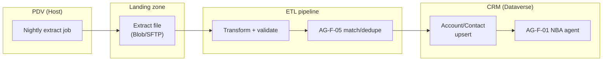
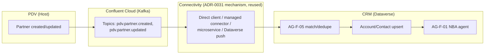
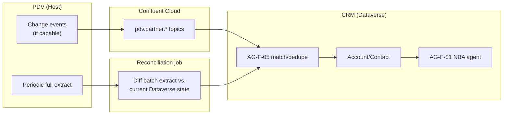
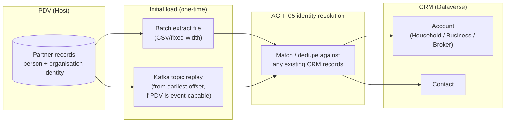

# Design Pattern 08: PDV partner master data integration

**Audience:** EA / IT / data-governance stakeholders evaluating how the CRM sources and stays in sync with partner/customer master data.
**Related ADR:** `docs/adr/ADR-0035-pdv-partner-master-data-integration-pattern.md`

## Why this matters

PDV is the system of record (master) for partner/customer data. If the CRM doesn't have a clean, well-defined initial-load and ongoing-sync contract with PDV, Advisory Cockpit users end up working from stale or duplicated customer records. This pattern frames that integration decision for stakeholders.

PDV's role is direct: it feeds the `Account` (Household / Business / Broker) and `Contact` records that `AG-F-01` (Next-Best-Action Agent) scores against and that `AG-F-05` (Data-Quality & Identity-Resolution Agent) keeps clean. A stale or duplicated party record means a misrouted NBA card.

**Two things are explicitly not yet known** and must not be assumed:

1. Whether PDV can publish real-time change events or is limited to periodic batch/file extracts.
2. Whether CRM may ever originate a party record before PDV does.

All three options below are presented to surface the trade-offs — no option has been selected.

## Options considered

### Shared foundation — initial data load (common to all options)

Regardless of which steady-state option is chosen, CRM needs a one-time bulk migration of PDV's existing partner population into Dataverse Account/Contact at go-live. Two mechanisms are available:

- **Batch extract-and-load** (full CSV/fixed-width extract from PDV, landed in Azure Blob/SFTP, transformed and upserted via Azure Data Factory or Power Platform Dataflows) — natural pairing with Option A and available regardless.
- **Point-in-time Kafka topic replay** (consuming `pdv.partner.created`/`pdv.partner.updated` from earliest offset) — only viable if PDV is confirmed to be Kafka-capable; natural pairing with Options B and C.

Every incoming record passes through `AG-F-05` before landing as an Account/Contact, so any pre-existing CRM records are matched rather than duplicated.

---

### Option A — Batch/file-based periodic sync

PDV exports a periodic (e.g. nightly) full or delta extract to a landing zone; an ETL pipeline transforms and upserts it into Dataverse Account/Contact, passing every record through `AG-F-05` for matching.

*This diagram shows the batch path: a nightly PDV extract lands, is transformed, matched by `AG-F-05`, and upserted into Dataverse Account/Contact.*

**Pros:**
- Matches the plausible technical reality of a legacy Host system with no real-time interface — if that turns out to be true, this is the only mechanism that will actually work without a costly bolt-on change-data-capture layer added to PDV.
- Simple, well-understood ETL pattern; the batch window makes full-refresh reconciliation and auditability straightforward.
- Lowest engineering complexity of the three options.
- Inherent self-healing: a fresh full extract naturally corrects any prior sync gap.

**Cons:**
- Data can be stale between batch windows — an address change captured on PDV today may not reach CRM's Advisory Cockpit until the next nightly run.
- Directly affects how quickly the household-relocation golden thread (ADR-0011 event cascade, UC-01) can trigger, if PDV — not an in-CRM edit — is where the change is first captured.
- If PDV turns out to be perfectly capable of real-time events, this option leaves that capability unused.

**Licence:** Azure Data Factory / Power Platform Dataflows consumption cost; no Kafka topic cost.

---

### Option B — Event-driven real-time sync

If PDV can publish change events, it emits `pdv.partner.created` and `pdv.partner.updated` to Confluent Cloud. CRM consumes via whichever of ADR-0031's four connectivity mechanisms is selected, matching every event through `AG-F-05` before upserting near-real-time.

*This diagram shows the event-driven path: PDV's change events flow through Kafka and the reused ADR-0031 connectivity mechanism into `AG-F-05` matching and near-real-time Dataverse upserts.*

**Pros:**
- Near-real-time freshness feeding both `AG-F-01`'s scoring and the ADR-0011 event cascade almost immediately — the closest fit to a "same-day" relocation golden thread.
- Reuses the same Confluent Cloud backbone and connectivity mechanism already used for Versicherungsprozesse, Schadenprozesse, and ARO (ADR-0031, ADR-0034) — one integration paradigm across the landscape instead of a second, separate one just for PDV.

**Cons:**
- Assumes a technical capability that is **not confirmed** — if PDV is genuinely a batch-only Host system, this option is not buildable without a bridging change-data-capture layer bolted onto PDV, which is itself a non-trivial and possibly customer-unwanted change to a legacy system outside CRM's control.
- Event-driven sync alone has no inherent "catch-up" safety net if an individual event is lost or a consumer has downtime, unlike batch's built-in full-refresh reconciliation.

**Licence:** Reuses ADR-0031's Confluent Cloud/connector licensing model; no separate ETL tool cost.

---

### Option C — Hybrid (event-driven deltas + periodic batch reconciliation)

Steady state runs on event-driven deltas (Option B) for freshness, but a periodic (e.g. weekly) full-batch reconciliation pass (Option A's mechanism) runs alongside it as a self-healing safety net — catching missed events, schema drift, or manual corrections made directly on PDV outside its normal event-publishing path. Any mismatch the reconciliation pass finds is surfaced to `AG-F-05` for review rather than auto-resolved.

*This diagram shows the hybrid path: event-driven deltas keep Dataverse current while a periodic batch reconciliation job independently diffs and catches any drift, both routing through `AG-F-05`.*

**Pros:**
- Combines near-real-time freshness for time-sensitive scenarios (the relocation/jurisdiction cascade) with an inherent self-healing safety net if PDV is only partially event-capable, an event is occasionally dropped, or PDV's operational team makes an out-of-band correction.
- Matches the caution this repository applies elsewhere to legacy-landscape integration — a coexistence pattern rather than betting the entire identity-data pipeline on one mechanism.
- Degrades gracefully: if PDV turns out to be 100% batch-only, the event path simply never fires and only the reconciliation pass runs (effectively Option A).

**Cons:**
- Highest engineering and operational complexity of the three — two pipelines to build, monitor, and keep consistent.
- The reconciliation-diff logic itself needs its own design (what counts as a conflict, who resolves it — directly tied to `AG-F-05`'s human-approved merge guardrail).
- Still assumes PDV can support at least partial real-time events; if PDV turns out to be 100% batch-only, this option adds unnecessary complexity over Option A.

**Licence:** Sum of Option A's and Option B's licence drivers, plus reconciliation-job compute.

---

### Cross-cutting: party origination & identity-resolution policy

Orthogonal to the three sync options is a second open question: **may CRM ever create a party before PDV does?**

- **Sub-option 1 — Strict PDV-first gating.** A CRM Account/Contact may only be created for a party that already exists in PDV. A prospect not yet in PDV is represented purely as a CRM Lead (per ADR-0009), with no Account/Contact created until PDV creates the party and the chosen sync mechanism brings it across. *Pros:* one unambiguous master, no reconciliation-direction complexity. *Cons:* a qualifying prospect may have to wait on a PDV round-trip before Opportunity conversion can proceed.

- **Sub-option 2 — CRM-can-originate (bidirectional).** CRM may create the Account/Contact first — e.g. a prospect qualifying and converting to an Opportunity before PDV has any record of them — and a later step informs PDV so the golden record eventually exists on both sides. Requires an explicit precedence rule for when PDV's own copy is created. *Pros:* no artificial delay in the sales process. *Cons:* a genuine dual-origination window exists; `AG-F-05` must handle the eventual match.

- **Sub-option 3 — Mixed by lifecycle stage.** Strict PDV-first for parties with an existing contractual relationship (policyholders, claimants), but CRM-can-originate for pre-sale prospects who by definition have no contractual relationship yet. Lead-to-Opportunity conversion triggers the request for PDV to create the canonical party record. *Pros:* matches the reality that PDV is likely built around contractual relationships, not pure prospects. *Cons:* the most nuanced rule to implement and explain — CRM's behaviour differs by a record's lifecycle stage.

## Comparison

### Steady-state sync options

| Criterion | Option A — Batch/file | Option B — Event-driven | Option C — Hybrid |
| --- | --- | --- | --- |
| Matches a batch-only "Host" system, if that's confirmed | Yes, directly | No — needs a bridging capability | Degrades gracefully to Option A |
| Freshness for the relocation/cascade scenario (ADR-0011) | Up to one batch cycle of latency | Near-real-time | Near-real-time, plus a safety net |
| Built-in catch-up if a change is missed | Yes — inherent to full-refresh batch | No — needs manual/ad-hoc recovery | Yes — the reconciliation pass |
| Reuses the ADR-0031 Kafka substrate | No | Yes | Yes |
| Engineering/operational complexity | Lowest | Medium | Highest |
| Licence drivers | ETL tool consumption | Confluent Cloud/connector (shared with ADR-0031) | Both |
| Design pattern fit | Batch ETL / extract-and-upsert | Event-carried state transfer | Event-carried state transfer + reconciliation (read-repair) |

### Party origination sub-options

| Criterion | Sub-option 1 — PDV-first | Sub-option 2 — CRM-can-originate | Sub-option 3 — Mixed |
| --- | --- | --- | --- |
| Sales-process delay risk | Highest (waits on PDV round-trip) | Lowest | Low for prospects, none for existing customers |
| Dual-origination/conflict risk | None | Highest | Medium — confined to the pre-sale stage |
| Implementation complexity | Lowest | Medium | Highest (stage-dependent logic) |
| Matches likely PDV scope (contractual parties) | Naturally, if PDV doesn't model prospects | N/A | Naturally |

## Key diagram

The diagram below shows the shared initial-load foundation that applies regardless of which steady-state option is chosen. Every incoming PDV record passes through `AG-F-05` (identity resolution) before landing as a Dataverse Account or Contact — ensuring no silent duplicates are created during the bulk migration.

## Validate this live

Open `docs/adr/ADR-0035-pdv-partner-master-data-integration-pattern.md` for the full technical rationale and accepted decision.

## Decision

See `docs/adr/ADR-0035-pdv-partner-master-data-integration-pattern.md` for the recorded decision — this pattern doc exists to support re-discussing the tradeoffs with stakeholders, not to override the ADR.
