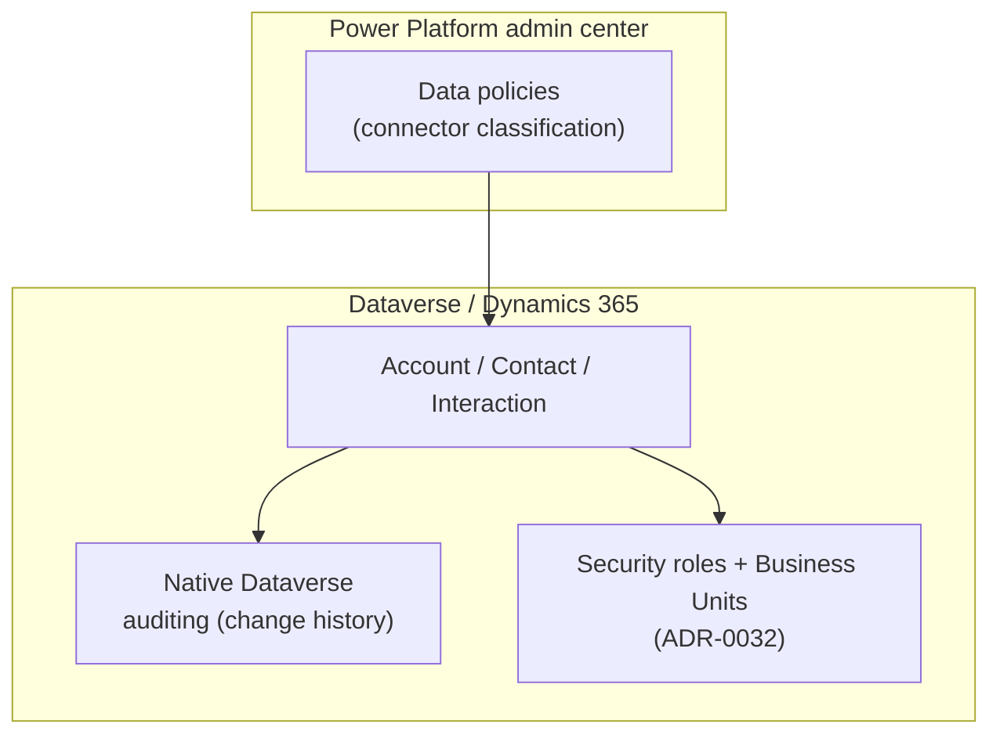
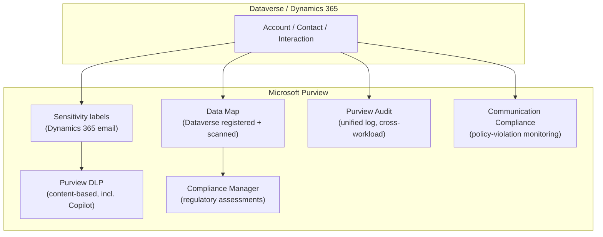
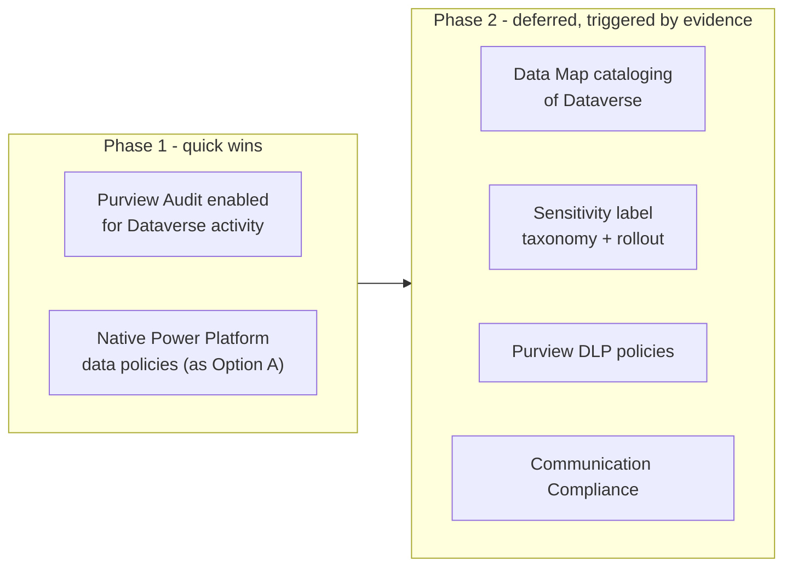
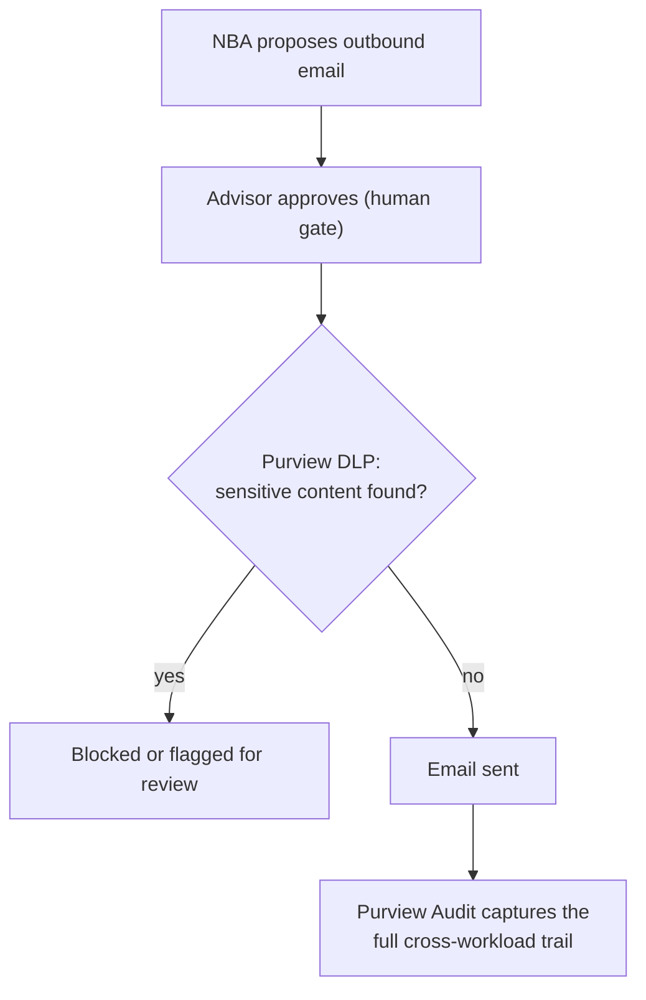

# Design Pattern 11: Purview compliance for Power Platform/Dynamics 365

**Audience:** EA / IT / compliance stakeholders evaluating data governance and regulatory controls for the CRM.
**Related ADR:** `docs/adr/ADR-0038-purview-power-platform-dynamics365-compliance.md`

## Why this matters

Insurance is subject to strict data protection and retention regulation. This pattern frames how Purview governance controls should apply to Power Platform/Dynamics 365 so compliance stakeholders can weigh in before implementation, not after an audit finding.

The ADR is a **working hypothesis with no option selected** — the single most consequential missing input is legal/regulatory: which regulations actually apply to this customer (GDPR, Swiss revDSG, financial-regulator outsourcing rules) must be confirmed by the customer's legal/DPO function before any option can be judged as sufficient or insufficient.

Two distinct DLP mechanisms exist and are complementary — not alternatives:

- **Power Platform native data policies** — govern which connectors a maker can combine in one flow or app (connector-combination guardrail, no Purview licence required).
- **Microsoft Purview DLP** — governs what *content*, once classified or labelled, is allowed to move where (content-based guardrail, spanning Exchange, SharePoint, Teams, and Microsoft 365 Copilot/Copilot Chat interactions).

Both apply regardless of which option below is chosen.

## Options considered

### Option A — Native-only governance

Relies entirely on capabilities already native to Power Platform and Dataverse, with no incremental Purview configuration beyond whatever generic tenant-wide Purview posture already exists for Microsoft 365.

Controls in scope:
- **Power Platform data policies** (connector business/non-business/blocked classification) — prevents unsafe connector combinations in flows/apps touching CRM data.
- **Native Dataverse auditing** (built-in change-history logging) — who changed what field, when; no separate licence.
- **Security roles + Business Units** (as established in ADR-0032) — access segregation, reused unchanged.

*Option A's governance surface: native Dataverse auditing and security roles, with Power Platform data policies gating which connectors can touch CRM data — no Purview involved.*

**Pros:**
- No incremental licence cost; every capability is already included in standard Power Platform/Dynamics 365 licensing.
- Fastest to stand up; nothing new to design or roll out.
- Native Dataverse auditing already gives a real "who changed what" answer without any Purview dependency.

**Cons:**
- No content-based DLP on outbound communications — an AI-drafted or advisor-drafted email could contain sensitive content with nothing checking it beyond the connector-level guardrail.
- No classification/cataloging of what sensitive data actually lives in Dataverse — the "Retention & deletion" and DPIA `[TBD]` rows in `docs/COMPLIANCE.md` stay unanswered by tooling.
- No unified, cross-workload audit view — Dataverse's native audit log is Dataverse-only, not correlated with Exchange/Teams activity for the same household.

**Design pattern:** Platform-native governance — using only what ships in the box, deliberately not reaching for a separate compliance product.
**Licence:** No incremental cost beyond existing Power Platform/Dynamics 365 licensing.

---

### Option B — Full Purview integration

Dataverse is registered as a source in **Purview Data Map** and scanned for classification/cataloging; **sensitivity labels** are enabled for Dynamics 365 email; **Purview DLP** policies apply content-based rules to outbound communications (including AI-drafted content); **Purview Audit** captures Dataverse/model-driven-app activity in the unified audit log; **Compliance Manager** runs regulatory assessments against whichever templates apply once legal/DPO confirms them; **Purview Communication Compliance** monitors advisor communications for policy violations.

Controls in scope:
- **Purview Data Map** (Dataverse registered + scanned) — cataloging/classification of Dataverse data at rest; answers "what sensitive data lives where" for the DPIA/retention `[TBD]` rows.
- **Sensitivity labels for Dynamics 365 email** — classify and protect email content/attachments; labels travel with content across services.
- **Purview DLP** (Microsoft 365-wide) — content-based policy enforcement, including Copilot/Copilot Chat; blocks or warns on sensitive content leaving the tenant, including AI-drafted content.
- **Purview Audit** — unified, cross-workload activity log including Dataverse/model-driven-app activity; correlates CRM activity with Exchange/Teams/SharePoint for the same household.
- **Compliance Manager** — regulatory assessment templates and scoring; concrete mechanism for the GDPR/revDSG/financial-regulator `[TBD]` rows, once legal/DPO confirms applicable templates.
- **Purview Communication Compliance** — monitors advisor communications for policy violations; complements, does not replace, the human-approval gate (ADR-0014).

*Option B's governance surface: Dataverse data flows into every Purview capability — Data Map, sensitivity labels, DLP, Audit, and Communication Compliance — the fullest, most licence-intensive option.*

**Pros:**
- Directly answers most of `docs/COMPLIANCE.md`'s `[TBD]` rows with a real, documented technical mechanism rather than leaving them open.
- Content-based DLP genuinely checks AI-drafted outbound communications, not just connector combinations.
- A single, unified, cross-workload audit trail — a real answer to a regulator or auditor asking "show me everything that touched this household's data."
- AI-drafted communications are held to the same content-level scrutiny as human-drafted ones, directly supporting the Responsible-AI expectation that agent-assisted output is not quietly exempt from a control a human would face.

**Cons:**
- Licence-gated — most capabilities require Microsoft 365 E5/A5/G5 Compliance (or standalone Purview add-on SKUs), a real incremental cost.
- Highest upfront design effort: a sensitivity-label taxonomy has to be designed and agreed before labels are useful, not just switched on.
- Communication Compliance and Compliance Manager both need genuine policy/template configuration work, not just enablement — configuring them badly can create false confidence without real protection.

**Design pattern:** Platform-wide information-governance overlay — content classification and DLP as a first-class layer above every workload, including Dataverse, rather than per-workload native controls alone.
**Licence:** Microsoft 365 E5/A5/G5 Compliance (or standalone Purview SKUs) for Data Map, full DLP, Communication Compliance, and full Compliance Manager scoring; incremental to Option A's existing Power Platform/Dynamics 365 licensing.

---

### Option C — Phased

Starts with the lowest-effort, already-native-feeling capabilities — **Purview Audit** for Dataverse/model-driven-app activity (a configuration step, not new infrastructure) alongside Option A's native data policies — and defers the heavier, licence-gated, design-intensive capabilities (Data Map cataloging, sensitivity-label taxonomy, Communication Compliance) to a later phase, once real usage volume and a confirmed regulatory template list justify the added governance overhead.

Controls in scope:
- **Phase 1 (immediate):** Purview Audit enabled for Dataverse activity + native Power Platform data policies (as Option A) — lowest-effort capability that already answers "who did what, when" across CRM, at effectively no incremental cost.
- **Phase 2 (deferred, evidence-triggered):** Full Option B capability set — Data Map, sensitivity labels, Purview DLP policies, Communication Compliance — rolled out once volume/regulatory confirmation justifies the licence and design cost.

*Option C's staged rollout: Phase 1 mirrors Option A's native controls; Phase 2, once triggered, adds Option B's full Purview capability set.*

**Pros:**
- Gets a real, working audit trail and connector guardrail in place immediately, at effectively no incremental cost — closing the single biggest visible gap in Option A first.
- Defers the expensive, design-intensive work (label taxonomy, DLP policy tuning, Communication Compliance configuration) until there is real evidence — actual data volume, actual confirmed regulatory templates — to design it against, rather than guessing upfront.

**Cons:**
- Content-based DLP protection does not exist during Phase 1 — the same gap Option A has, just deliberately temporary rather than permanent.
- Requires an explicit, tracked trigger for when Phase 2 starts, or "temporary" risks quietly becoming permanent by inertia.

**Design pattern:** Staged rollout with an explicit evidence-based trigger for the next phase.
**Licence:** Phase 1 has no incremental cost. Phase 2 incurs Option B's full licence cost, but deferred in time, which may better match a budget-cycle or a "prove it's needed first" governance stance.

## Comparison

| Criterion | Option A — Native-only | Option B — Full Purview | Option C — Phased |
| --- | --- | --- | --- |
| Content-based DLP on outbound (incl. AI-drafted) | No | Yes | Not until Phase 2 |
| Cataloging of sensitive data at rest (Data Map) | No | Yes | Not until Phase 2 |
| Unified, cross-workload audit trail | No — Dataverse-native audit only | Yes | Yes, from Phase 1 |
| Answers `docs/COMPLIANCE.md` `[TBD]` rows with a real mechanism | Minimally | Most directly | Partially now, fully once Phase 2 completes |
| Incremental licence cost | None | Highest (E5/A5/G5 Compliance or Purview SKUs) | None initially, Option B's cost deferred |
| Upfront design effort (label taxonomy, DLP tuning) | None | Highest, all upfront | Spread over time, informed by real evidence |
| Risk of "temporary" becoming permanent | N/A | N/A | Yes, unless Phase 2's trigger is explicitly tracked |

## Key diagram

The diagram below shows the Option B governance control flow — the fullest expression of how Purview sits in the outbound communication path, including content-based DLP, for both AI-drafted and human-drafted communications.

## Validate this live

Open `docs/adr/ADR-0038-purview-power-platform-dynamics365-compliance.md` for the full technical rationale and accepted decision.

## Decision

See `docs/adr/ADR-0038-purview-power-platform-dynamics365-compliance.md` for the recorded decision — this pattern doc exists to support re-discussing the tradeoffs with stakeholders, not to override the ADR.
