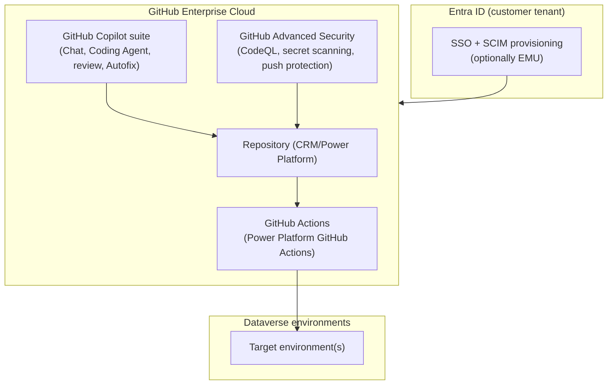
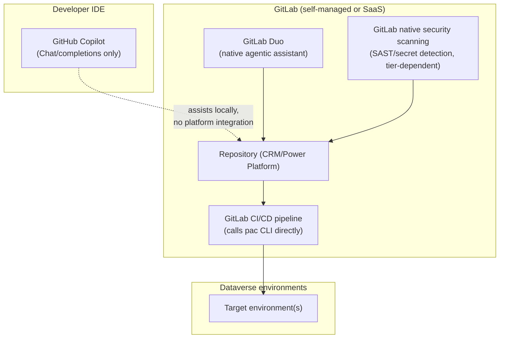
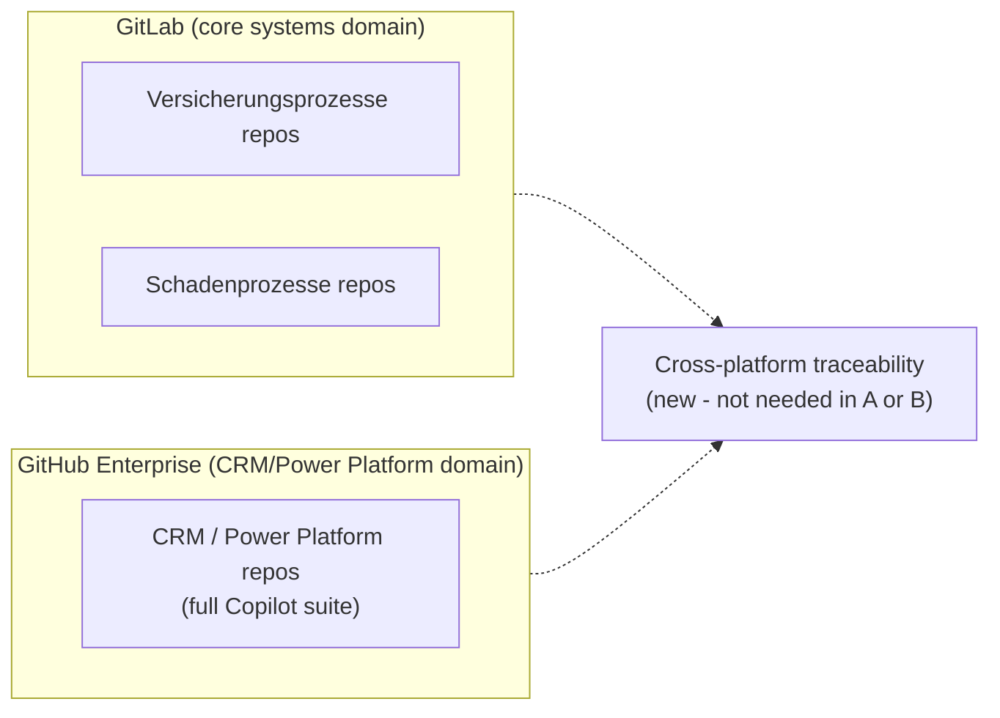
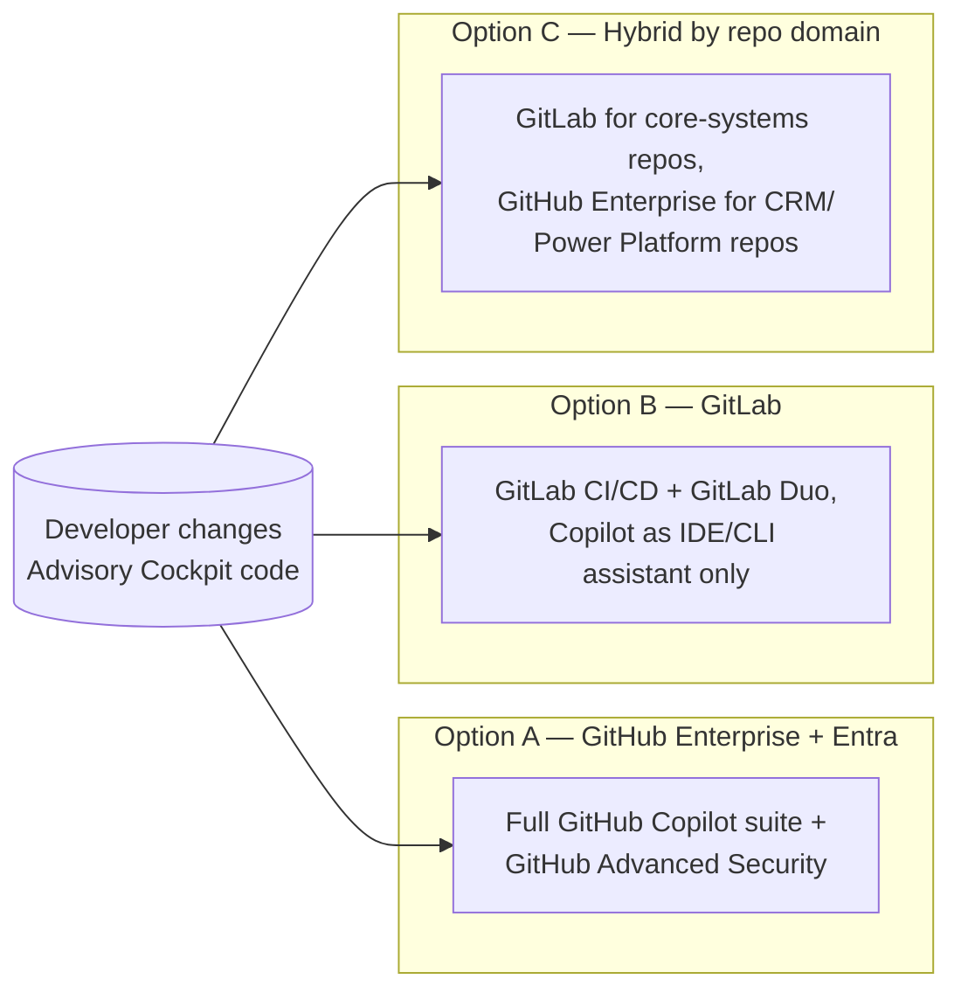

# Design Pattern 12: DevSecOps CI/CD operating model (GitHub Enterprise vs GitLab)

**Audience:** EA / IT / platform-engineering stakeholders evaluating the CI/CD operating model for Power Platform/Dynamics 365 delivery using GitHub Copilot.
**Related ADR:** `docs/adr/ADR-0039-devsecops-cicd-github-enterprise-vs-gitlab.md`

## Why this matters

The choice between GitHub Enterprise (with Entra-backed organisation) and GitLab as the CI/CD backbone shapes how GitHub Copilot can be used across the delivery lifecycle. GitHub Copilot's core IDE/CLI experience (chat, completions, inline suggestions) works with any Git host — but its **agentic capabilities** (Coding Agent autonomously resolving issues and opening pull requests, native PR code-review comments, Autofix) are **GitHub-specific**. GitLab's own agentic layer, GitLab Duo, fills that role for GitLab-hosted repositories as a separate product.

Microsoft ships first-party Power Platform ALM automation for Azure DevOps and GitHub Actions, but there is no equivalent first-party GitLab CI/CD template — a GitLab pipeline calls the `pac` CLI directly from custom YAML, which is fully achievable but without the ready-made task wrapper.

This pattern frames that platform decision for stakeholders using the Advisory Cockpit as the practical example: a developer fixing or extending the `AG-F-01` Next-Best-Action card rendering, traced end to end from code change to production.

## Options considered

### Option A — GitHub Enterprise (Cloud), Entra-federated organisation

The customer's engineering organisation standardises on **GitHub Enterprise Cloud**, with identity federated to Entra ID (SAML SSO and SCIM provisioning, optionally Enterprise Managed Users for stricter identity control). This extends the identity-federation and CI-plane pattern already proven in ADR-0002/ADR-0004 to the customer's real estate. The full GitHub Copilot suite — Chat, Coding Agent, native pull-request code-review comments, Autofix — and GitHub Advanced Security (CodeQL, secret scanning, push protection) are available natively.

*Option A's architecture: Entra-federated GitHub Enterprise hosting the repo, GitHub Actions, the full Copilot suite, and GitHub Advanced Security, deploying to the Dataverse environment topology.*

- **Pros.** Every GitHub Copilot capability, including the agentic ones, works natively — no capability gap. Directly reuses and extends the proven identity-federation and CI-plane pattern. First-party Power Platform GitHub Actions removes the pipeline-authoring effort that Option B requires.
- **Cons.** Requires the customer's broader engineering organisation to standardise on (or add) GitHub Enterprise — a real organisational change if GitLab is already the incumbent platform, not just a CRM-team-local decision.
- **Licence.** GitHub Enterprise Cloud, GitHub Copilot Enterprise/Business, and GitHub Advanced Security seats/consumption.

### Option B — GitLab as the primary DevSecOps platform

The customer's engineering organisation standardises on **GitLab** (self-managed or SaaS), using GitLab CI/CD pipelines, GitLab's native security scanning (SAST/secret detection, tier-dependent), and **GitLab Duo** as the platform-native agentic assistant for merge requests and pipelines. GitHub Copilot remains available only as an **IDE/CLI-level developer assistant** — chat, completions, inline suggestions in VS Code/JetBrains — since it does not require the repository to live on GitHub, but its agentic and native-PR-review capabilities do not carry over.

*Option B's architecture: GitLab hosts the repo, CI/CD, Duo, and native scanning; GitHub Copilot remains outside the platform as a local IDE-only assistant with no platform integration.*

- **Pros.** Matches an existing GitLab-standardised engineering estate without an organisational platform change. GitLab Duo provides a genuine, supported agentic capability — not a gap, just a different product than Copilot's. The underlying `pac` CLI is host-agnostic, so Power Platform ALM automation is fully achievable, just without a ready-made task wrapper.
- **Cons.** GitHub Copilot's agentic features (Coding Agent, native PR review) are simply not available on GitLab. If the organisation has standardised on GitHub Copilot as its AI-assisted development strategy, this option means either accepting two different AI products for two different roles (Copilot locally, GitLab Duo on the platform), or forgoing Copilot's agentic capability entirely. More custom pipeline-authoring effort than Option A's ready-made GitHub Actions.
- **Licence.** GitLab Ultimate (or whichever tier includes the required security scanning) plus GitLab Duo seats; GitHub Copilot IDE/CLI seats as an optional developer add-on layered on top.

### Option C — Hybrid, split by repository domain

GitLab remains the system-of-record for the customer's broader engineering organisation — including core systems — while the **CRM/Power Platform repository domain** specifically moves to GitHub Enterprise to get the full agentic Copilot experience where the CRM engineering team works day to day. This mirrors the same domain-scoped-coexistence pattern already used in the ADR-0034/ADR-0036 landscape decisions, applied to tooling rather than data.

*Option C's architecture: GitLab keeps the core-systems domain, GitHub Enterprise takes the CRM/Power Platform domain, with a new cross-platform traceability mechanism bridging the two.*

- **Pros.** CRM engineering gets the full GitHub Copilot agentic experience without requiring the whole engineering organisation to migrate off GitLab. Narrower organisational change than Option A, narrower AI-capability gap than Option B — each team gets the platform best suited to it.
- **Cons.** Introduces a genuinely new problem neither Option A nor Option B has: **cross-platform traceability** for any change that spans both domains (for example, a Kafka event-contract change touching both a GitLab-hosted core-systems repo and a GitHub-hosted CRM repo). Two platforms to administer, secure, and keep identity-federated instead of one.
- **Licence.** GitHub Enterprise/Copilot/Advanced Security for the CRM domain (as Option A), plus whatever GitLab tier the core-systems domain already pays for (largely a sunk cost if GitLab is already the incumbent) — no need to re-licence GitLab for the domain that stays on it.

## Comparison

| Criterion | Option A — GitHub Enterprise | Option B — GitLab | Option C — Hybrid by domain |
| --- | --- | --- | --- |
| Full GitHub Copilot agentic suite (Coding Agent, native PR review) available | Yes, everywhere | No — IDE/CLI assistant only | Yes, in the CRM/Power Platform domain only |
| Platform-native agentic alternative if not using Copilot's agentic layer | N/A | GitLab Duo | N/A within the CRM domain, GitLab Duo in the core-systems domain |
| First-party Microsoft Power Platform ALM automation | Yes — Power Platform GitHub Actions | No — calls `pac` CLI directly in custom pipeline YAML | Yes, within the CRM domain |
| Matches an existing GitLab-standardised engineering estate | No — requires organisational platform change | Yes, directly | Partially — only the CRM domain moves |
| New cross-platform traceability problem introduced | No | No | Yes — for changes spanning both domains |
| Organisational change scope | Whole engineering org | None | One domain (CRM/Power Platform) |
| Licence/cost shape | New GitHub Enterprise + Copilot + Advanced Security spend | Reuses existing GitLab investment, adds optional Copilot IDE seats | Sum of both, scoped narrowly |

## Key diagram

The diagram below shows all three options in relation to the same starting point — a developer making a change to the Advisory Cockpit code — illustrating how each option routes that change through a different CI/CD backbone.

## Validate this live

Open `docs/adr/ADR-0039-devsecops-cicd-github-enterprise-vs-gitlab.md` for the full technical rationale and accepted decision, including end-to-end "shipping a change to the Advisory Cockpit" walk-through sequence diagrams under each option.

## Decision

See `docs/adr/ADR-0039-devsecops-cicd-github-enterprise-vs-gitlab.md` for the recorded decision — this pattern doc exists to support re-discussing the tradeoffs with stakeholders, not to override the ADR.

> **Note.** As of the ADR's current status (Proposed hypothesis), no option is selected and no lean is stated. The deciding factor is organisational: which CI/CD platform, if either, the customer's broader engineering organisation already standardises on outside the CRM team. That single confirmed fact makes Option A, B, or C the obviously lower-friction choice. Regardless of the option chosen, `AG-E-04`'s Zero Trust guardrails (OIDC-only, no stored secrets, least-privilege service identities) and ADR-0017's pipeline-only delivery rule apply unchanged.
