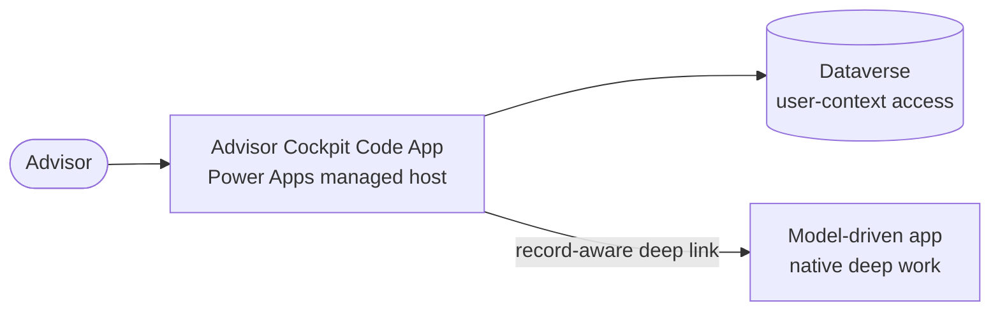
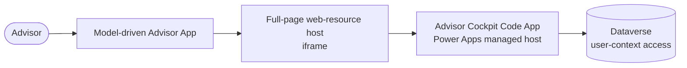
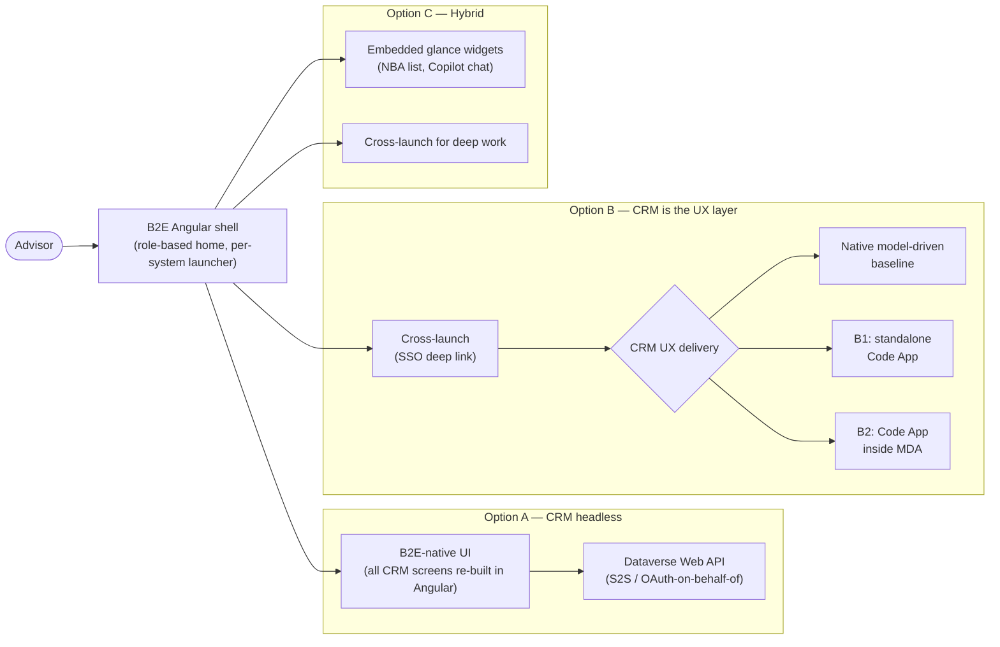

# Design Pattern: CRM UX placement in the B2E landscape

**Audience:** EA / IT / UX stakeholders evaluating where CRM screens should live relative to the overarching B2E (Angular) employee experience layer.
**Related ADR:** `docs/adr/ADR-0033-crm-ux-placement-in-b2e-landscape.md`
**Parity proof:** [Power Apps Code Apps Foundation and Advisor Cockpit B1/B2 Parity Proof](../superpowers/specs/2026-08-19-power-apps-code-app-advisor-cockpit-parity-design.md)

## Why this matters

Employees need one coherent front end across systems (B2E), but the CRM (Dynamics 365) has its own native UX. This pattern frames where the Advisory Cockpit's screens should actually live — embedded, orchestrated, or standalone — so the decision is made deliberately rather than by default.

The customer already runs a **B2E Angular application** as a cross-system UX layer — a role-based home screen that lets the advisor jump ("Absprung") into core systems (Versicherungsprozesse, Schadenprozesse, ARO). Each of those systems keeps its own native UI; B2E is the launcher, not a re-implementation of their screens. The question is whether CRM (Dynamics 365 / Copilot Studio) should be treated identically — given its own cross-launch slot — or differently, because of its AI-agent layer (AG-F-01, AG-F-03, AG-F-04).

## Options considered

### Option A — CRM headless behind B2E

B2E's Angular front end owns **100% of the customer-engagement screens**. CRM is consumed purely as an API: Dataverse Web API for data, an optional Power Automate / Azure Function backend-for-frontend (BFF), and Copilot Studio's **Direct Line API / Microsoft 365 Agents SDK** for conversational capability embedded as a custom Angular component. The native Advisor Cockpit is kept only for administration, not daily advisor use.

- **Design pattern.** Backend-for-Frontend (BFF) / API-Gateway — CRM becomes a "system of engagement API" behind B2E.
- **Pros.** One consistent visual design system for the advisor across all systems — no visual seam between CRM and other core systems. Full control over layout, caching, and offline behaviour.
- **Cons.** Forfeits nearly every out-of-box Dataverse/Copilot Studio capability — forms, business rules, timeline, the native embedded Copilot chat pane, and every future Microsoft-shipped feature must be re-built and kept in parity by hand. Responsible-AI guardrails (disclosure, content safety, grounding citations) that ship natively with Copilot Studio must be re-implemented and kept in lockstep. Highest ongoing engineering cost, highest upgrade impact. Directly contradicts the repo's "configuration → low-code → pro-code" preference by forcing pro-code for everything. Lowest reversibility — a large custom investment to unwind.
- **Licence.** Standard Dataverse API and Copilot Studio message-capacity entitlements are still consumed per user even with no native UI; add optional Power Automate / Azure Function consumption for the BFF.

### Option B — CRM is the UX layer for customer engagement (cross-launch)

Option B fixes the **ownership boundary**, not the rendering technology: B2E
remains the role-based home and performs an Entra-SSO-backed cross-launch, while
Power Apps owns the customer-engagement experience. The native D365
model-driven **Advisor Cockpit** is the B0 architecture baseline. Two Code App
variants extend that pattern without turning B2E into a custom CRM front end.

The B1/B2 proof deliberately starts at the **CRM UX boundary**. It does not
build, simulate, or test a B2E Angular shell, launcher, SSO hand-off, or
integration contract. B2E remains landscape context for the eventual
architecture decision only.

- **Design pattern.** Cross-launch / deep-link with SSO — the same integration pattern already used for the other core systems, extended to CRM.
- **Pros.** Near-zero custom UX code. Every native capability is available immediately and stays available as Microsoft ships new features (forms, business rules, timeline, embedded Copilot Chat / Sales Copilot). Fully aligned with the config-first design preference. Fastest to deliver and cheapest to keep current across upgrades. Highest reversibility.
- **Cons.** The advisor experiences a visual/navigational context-switch between B2E's shell and the D365 app — acceptable if that is already the accepted pattern for other systems, but CRM does not contribute to a "one app" feel over time. Two "homes" to context-switch between for workflows that span B2E and CRM in the same moment.
- **Licence.** Standard Dynamics 365 and Copilot Studio per-user licensing; no additional API/BFF consumption.

#### Option B1 — Standalone Code App as the CRM experience

The advisor opens a full-screen **Power Apps Code App** on the Power Apps
managed host. The Code App uses the signed-in advisor's Entra identity and
generated Dataverse services for the bespoke cockpit. Native forms, timelines,
and other deep CRM work remain in the model-driven app and are reached through
record-aware deep links from the Code App.

- **Design pattern.** Managed-host micro-frontend with native deep-work links.
- **Pros.** Gives a dense cockpit the full viewport and responsive control;
    avoids iframe/CSP coupling; retains Power Platform identity, DLP, sharing,
    monitoring, connectors, and solution-aware deployment. The Code App can be
    a reusable front door while the MDA remains the standard workspace for
    native CRM capabilities.
- **Cons.** Adds a second Power Apps navigation surface and an explicit
    Code App-to-MDA context hand-off. Native MDA panes and controls are not
    inherited inside the Code App, so each boundary must be deliberate rather
    than duplicated.
- **Licence and maturity.** Power Apps Code Apps are generally available.
    Power Apps Premium and any Dynamics 365/Copilot Studio use rights must be
    validated for the target personas and tenant.

#### Option B2 — Code App embedded in the model-driven Advisor App

The advisor opens the model-driven Advisor App, which hosts the deployed Code
App in a full-page sitemap web-resource iframe while retaining the MDA command
surface, forms, timeline, and native navigation around it. The environment's
Content Security Policy explicitly allows only the Dynamics 365 organization
origin in `frame-ancestors`.

- **Design pattern.** Governed iframe micro-frontend inside the native CRM
    shell.
- **Pros.** Keeps advisors in one MDA navigation model and places bespoke
    Code App pages beside native forms and views. Identity and data access remain
    Power Platform-managed, and native deep work is one MDA navigation action
    away.
- **Cons.** Adds a web-resource host, environment-specific CSP configuration,
    nested loading/navigation, and viewport/accessibility constraints. The
    embedded path must be tested in the MDA, not only in the standalone Code App
    player. Embedded access is same-tenant only.
- **Licence and maturity.** Power Apps Code Apps and documented iframe hosting
    are generally available. Power Apps Premium and Dynamics 365/Copilot Studio
    use rights still require persona-level validation.

#### B1/B2 comparison

| Criterion | B1 — Standalone Code App | B2 — Embedded Code App |
| --- | --- | --- |
| Advisor shell | Dedicated full-screen Power Apps experience | Model-driven Advisor App |
| Native CRM deep work | Cross-launch from the Code App | Adjacent MDA navigation |
| Viewport and responsive freedom | Highest | Constrained by MDA + iframe host |
| Environment configuration | App sharing and solution deployment | Same, plus least-privilege CSP `frame-ancestors` |
| Runtime coupling | Code App + Dataverse | Code App + iframe host + MDA + Dataverse |
| End-to-end proof | Power Apps player → Code App → MDA deep link | MDA sitemap → embedded Code App → native MDA page |

Both variants preserve the same governing rule: Code Apps are the primary
build path for **bespoke full-page experiences**, while model-driven
configuration remains primary for forms, views, timelines, and other native
CRM capabilities. Neither variant is selected by this pattern.

The approved visual baseline for this proof is the fixture-backed local PCF
harness and its captured screenshots. Although the PCF artifact is deployed to
DEV, it is not attached to a user-visible running surface and is therefore
neither live comparison evidence nor a runtime fallback. The live comparison
is B1 versus B2 in DEV and TEST.

### Option C — Hybrid: embedded glance surfaces + cross-launch for deep work

B2E embeds lightweight, high-frequency **"glance" widgets** directly in its own shell — an NBA card list and a Copilot Studio chat widget, both reached headlessly (Dataverse Web API reads + Copilot Studio Direct Line/Agents SDK embed) — while anything deeper (editing an Opportunity, full timeline, case work) still cross-launches into the native Advisor Cockpit as in Option B. This targets the highest-frequency, highest-value interactions for in-shell treatment while leaving everything else on the zero-maintenance native path.

- **Design pattern.** Composite UI / micro-frontend — selective headless integration for high-frequency reads, native deep-link for everything else.
- **Pros.** Delivers the "orchestrated front end" goal for the interactions advisors do most often, without re-building the entire CRM UI. Incremental — glance widgets can be added surface by surface as value is proven. Concentrates custom-build effort on highest-frequency screens only.
- **Cons.** Two integration mechanisms to build, govern, and keep consistent (headless API/Copilot embed **and** deep-link/SSO). Requires deliberate UX design so "when do I stay in B2E vs. get sent to D365" is never ambiguous. Parity risk — the glance widget's NBA card must track whatever the native cockpit does, or the two surfaces drift apart. Governance question: which Copilot Studio channel (native pane vs. custom Direct Line embed) is the system of record for a given conversation.
- **Licence.** A superset of A and B — Dataverse API/Copilot Studio message consumption for glance widgets, plus standard per-user D365/Copilot Studio licensing for the deep-work path.

## Comparison

| Criterion | Option A — CRM headless | Option B — CRM is the UX layer | Option C — Hybrid |
| --- | --- | --- | --- |
| Custom UI build/maintenance burden | Highest — everything re-built | None for native baseline; focused for B1/B2 bespoke pages | Medium — glance widgets only |
| Native D365/Copilot Studio feature inheritance | None — must be re-implemented | Full in baseline/deep-work MDA; deliberate hand-off from B1/B2 | Full for deep work; partial for glance widgets |
| Consistency with other core systems' pattern | Diverges — CRM is special-cased into B2E | Matches — same cross-launch pattern as ARO/Versicherungsprozesse/Schadenprozesse | Matches for deep work; diverges for glance widgets |
| Time to deliver | Slowest | Native baseline fastest; B1 simpler than B2 | Medium |
| Responsible AI/Content Safety inheritance | Must be re-implemented and kept in parity | Native for MDA capabilities; explicitly implemented and tested in bespoke B1/B2 pages | Inherited for deep work; must be re-verified for the embedded chat widget |
| Advisor context-switch | None — one shell throughout | Baseline: B2E→MDA; B1 adds Code App→MDA; B2 stays inside MDA | Only when deep work is needed |
| Licence cost driver | Dataverse API + Copilot Studio message consumption, possibly BFF compute | Dynamics 365 baseline; B1/B2 add Power Apps Code App entitlement validation | Superset of A and B |
| Upgrade impact | High | Low for native baseline; medium for focused B1/B2 pages | Medium |
| Reversibility | Low — large custom investment to unwind | High for baseline; medium-high for isolated B1/B2 pages | Medium — glance widgets to unwind, deep-link path unaffected |
| Design pattern fit | BFF / API Gateway | Cross-launch + native baseline or managed-host micro-frontend | Composite UI / micro-frontend |

## Key diagram

The diagram below shows the overall landscape of all three options — where the advisor enters and how each option routes them to CRM content:

## Validate this live

Open `docs/adr/ADR-0033-crm-ux-placement-in-b2e-landscape.md` for the full technical rationale and accepted decision.

## Decision

See `docs/adr/ADR-0033-crm-ux-placement-in-b2e-landscape.md` for the recorded decision — this pattern doc exists to support re-discussing the tradeoffs with stakeholders, not to override the ADR.
