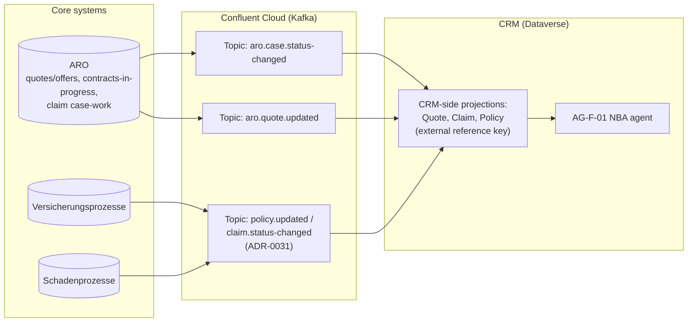

# Design Pattern: ARO case/task management integration

**Audience:** EA / IT stakeholders evaluating how CRM opportunities/cases connect to the ARO (Arbeits-Organisations) case management system.
**Related ADR:** `docs/adr/ADR-0034-aro-case-task-management-integration-pattern.md`

## Why this matters

ARO already owns insurance offers/contracts and claims case handling. The Advisory Cockpit's opportunity-to-policy handoff needs a clear integration contract with ARO so work isn't duplicated or lost between systems.

The key tension: ARO currently holds Verkaufschancen (sales opportunities), and the customer has stated these should be replaced by CRM's native Opportunity entity. At the same time, ARO's claim case-work and quote calculation must remain on ARO — the thin-CRM position ([ADR-0008](../adr/ADR-0008-thin-crm-over-systems-of-record.md)) is non-negotiable. This pattern frames the Opportunity ownership decision for stakeholders.

**Shared ground (not in dispute across any option):** CRM always needs read-visibility into ARO's case/claim/quote status for the Advisory Cockpit. That visibility is delivered by extending the existing Policy/Claim/Quote projection pattern via Confluent Cloud Kafka topics (`aro.case.status-changed`, `aro.quote.updated`), reusing the connectivity substrate evaluated in [ADR-0031](../adr/ADR-0031-crm-core-systems-kafka-confluent-integration-pattern.md). The three options below differ only in where the Opportunity object is authoritative and how the transition happens.

## Options considered

### Option A — Thin projection only (ARO stays authoritative)

CRM does not migrate Opportunity ownership. ARO remains the system of record for Verkaufschancen. CRM extends the existing Policy/Claim/Quote projection pattern with a read-only Opportunity projection carrying an `aro_opportunityid` external reference key, refreshed via the `aro.quote.updated` Kafka topic. Any create/edit action happens in ARO's own UI, reached via a B2E cross-launch ([ADR-0033](../adr/ADR-0033-crm-ux-placement-in-b2e-landscape.md)).

Included as the honest baseline — it does not realise the customer's stated aspiration to replace ARO's Verkaufschancen capability.

- **Pros.** Minimal change; reuses the already-established projection pattern without new design. No business-process disruption, no historical data migration, no reconciliation layer to build or later decommission. Fastest and lowest-risk of the three options.
- **Cons.** Does not realise the customer's explicitly stated goal that Verkaufschancen "soll abgelöst werden". The sales workflow stays split across two systems and two UIs. CRM's native sales-pipeline capability (forecasting, sales stages, Sales Copilot) goes unused for the core sales motion, leaving real product value on the table. Does not reduce ARO's footprint at all.
- **Design pattern.** Read-through projection with external reference key — identical in shape to the existing Policy/Claim/Quote pattern.
- **Licence.** No new licence driver; CRM's native Sales Copilot/forecasting features remain unused and therefore uncosted (and unrealised).

### Option B — Full cutover (CRM becomes system of record)

On a defined cutover date, CRM's native Opportunity entity becomes the system of record for Verkaufschancen; ARO's Opportunity/Verkaufschancen capability is decommissioned (its claim case-work and quote-calculation capability are unaffected). Historical Opportunity data migrates from ARO to Dataverse once. When a CRM Opportunity is won, CRM publishes an outbound event (`crm.opportunity-won`) so Versicherungsprozesse/ARO can create the resulting contract.

- **Pros.** Directly realises the customer's stated target state. Consolidates the sales pipeline in one system, matching the "one CRM" vision. Unlocks native Sales Copilot/forecasting/AI-assisted scoring for the core sales motion. Reduces total system count for that capability — a simpler landscape going forward, one less UI for advisors to learn.
- **Cons.** Highest-risk, single-cutover approach — all advisor workflows built around ARO's opportunity screens must be retrained/rebuilt at once. Requires a clean, one-time historical data migration (data quality risk from a highly customised legacy system). The `crm.opportunity-won` → contract-creation event contract must be schema-correct, idempotent, and failure-handled before cutover. Low reversibility once ARO's capability is switched off, unless an explicit rollback plan is built and rehearsed.
- **Design pattern.** System-of-record cutover / hard migration.
- **Licence.** Standard Dataverse Sales/Sales Copilot per-user licensing; no ongoing dual-system cost once cutover completes.

### Option C — Phased/coexistence migration (Strangler Fig)

Both systems run in parallel during a defined migration window. A reconciliation layer (Azure Function or Power Automate flow) keeps CRM's Opportunity and ARO's Verkaufschance in sync bidirectionally for a defined subset — a pilot GA or a single product line — before expanding. ARO's Opportunity capability is switched off only once every GA/product has cut over, at which point the reconciliation layer itself is decommissioned.

- **Pros.** Lowest business risk of the migration paths — realistic for a highly customised legacy system where hidden dependencies are likely. Lets the CRM Opportunity model be validated against real advisor workflows before full commitment. Rollback is possible per-GA at any point during the window. Matches the well-understood Strangler Fig pattern for legacy modernisation.
- **Cons.** Requires building and later decommissioning a temporary reconciliation layer — real engineering cost twice over. Risk of the two systems drifting or double-counting an Opportunity if the reconciliation logic has a defect. Longest calendar time to reach the target state. Advisors and support staff must stay trained on two systems' worth of Opportunity UI for the duration of the migration window.
- **Design pattern.** Strangler Fig — incremental migration with a reconciling façade, retired once the migration completes.
- **Licence.** Standard Dataverse Sales licensing plus temporary Azure Function/Power Automate compute for the reconciliation layer.

## Comparison

| Criterion | Option A — Thin projection | Option B — Full cutover | Option C — Phased coexistence |
| --- | --- | --- | --- |
| Realises the customer's stated goal (replace ARO's Verkaufschancen) | No | Yes, immediately | Yes, incrementally |
| Business risk | Lowest | Highest — single cutover | Lowest of the migration paths |
| Calendar time to target state | N/A — never migrates | Fastest | Slowest |
| Custom engineering cost | Lowest | Medium — one-time migration + event contract | Highest — build and later decommission a reconciliation layer |
| Uses native D365 Sales/Sales Copilot capability | No | Yes, fully | Yes, per cut-over GA |
| Historical data migration required | No | Yes, once, all at once | Yes, incrementally per GA |
| Rollback / reversibility | High (nothing to unwind) | Low once ARO is decommissioned | Medium — rollback possible per-GA during the window |
| Licence cost driver | None new | Standard Dataverse Sales licensing | Standard Dataverse Sales licensing + temporary reconciliation compute |
| Design pattern fit | Read-through projection (existing shape) | Hard cutover | Strangler Fig |

## Key diagram

The diagram below shows the shared integration surface that applies to every option: ARO publishes case and quote events to Confluent Cloud Kafka; CRM consumes them as read-only projections that feed the AG-F-01 NBA agent in the Advisory Cockpit. This is the decided common contract — the options above differ only in what happens to Opportunity ownership on top of this foundation.

## Validate this live

Open `docs/adr/ADR-0034-aro-case-task-management-integration-pattern.md` for the full technical rationale and accepted decision.

## Decision

See `docs/adr/ADR-0034-aro-case-task-management-integration-pattern.md` for the recorded decision — this pattern doc exists to support re-discussing the tradeoffs with stakeholders, not to override the ADR.
