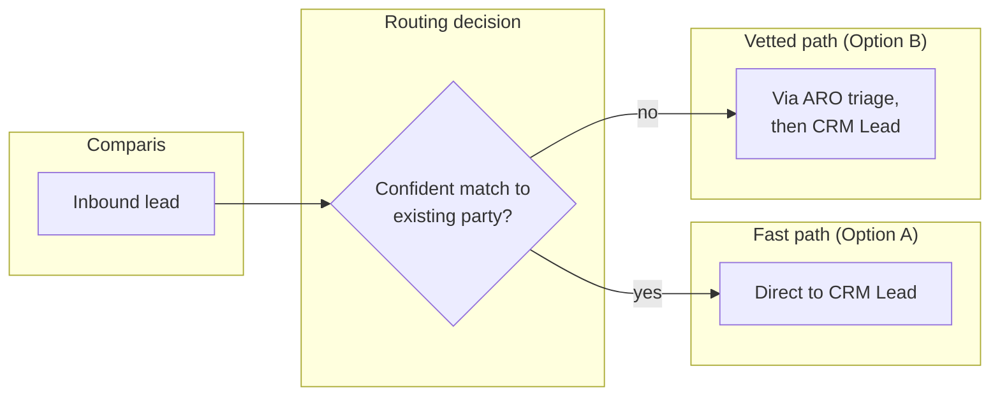

# Design Pattern: Lead and campaign external landscape

**Audience:** EA / IT / marketing-ops stakeholders evaluating how leads from Comparis and campaigns from Salesforce Campaign Management flow into the CRM/ARO landscape.
**Related ADR:** `docs/adr/ADR-0036-crm-lead-campaign-external-landscape.md`

## Why this matters

Leads originate externally (Comparis) and campaigns are managed in a separate system (Salesforce Campaign Management), but the Advisory Cockpit's opportunity data currently lives in ARO and is being migrated. This pattern frames how those external and legacy sources should feed the target CRM landscape.

Two independent questions are in scope:

1. **Comparis lead intake** — should inbound Comparis leads continue routing through ARO, go direct to CRM, or split by match confidence?
2. **Salesforce → Dynamics 365 Marketing** — should Salesforce stay as a read-through projection, be fully cut over, or be wound down incrementally as campaigns complete?

The two axes are independent and can be resolved on separate timelines.

## Options considered

### Part 1 — Comparis lead intake

#### Option A — Direct to CRM (bypasses ARO)

Comparis pushes a lead via API/webhook straight into an integration layer that creates a native Dataverse `Lead` record immediately (`leadSource = "Comparis"`). `AG-F-05` attempts to match the lead to an existing Contact/PDV party at intake.

- **Pros.** Fastest advisor visibility — native lead scoring, routing, and the Advisory Cockpit see the lead the moment it arrives, with no dependency on ARO's throughput. Cleanest fit with the thin-CRM boundary (ADR-0008): Lead is already a CRM-native demand-side object.
- **Cons.** Bypasses whatever triage, spam/junk filtering, or enrichment ARO may already apply today — if that logic is meaningful, it would need to be rebuilt in CRM or risk lower-quality leads reaching advisors directly. Represents the largest process change from today's flow.
- **Pattern.** Direct API/webhook ingestion with identity-resolution matching at intake.

#### Option B — Via ARO (ARO triages first)

Comparis leads continue flowing into ARO as they do today. ARO applies its existing triage/vetting, then publishes an `aro.lead.qualified` event (illustrative) to Confluent Cloud, which CRM consumes to create the native Lead.

- **Pros.** Preserves today's triage step without needing to know or rebuild what ARO actually does — lowest process disruption. Consistent integration paradigm with ADR-0034's `aro.*` Kafka topics — one substrate across the ARO relationship.
- **Cons.** Adds a round-trip through ARO before an advisor ever sees the lead — worth weighing against how much response speed matters commercially for comparison-portal leads (commonly shopped across multiple insurers in parallel). Keeps a demand-side object partly dependent on ARO, which cuts against concentrating demand-side objects in CRM (ADR-0008).
- **Pattern.** Event-carried state transfer via a new ARO-owned Kafka topic, same shape as ADR-0034's shared integration surface.

#### Option C — Hybrid (dual-path by lead type or match confidence)

Leads that `AG-F-05` can confidently match to an existing, already-known party (e.g. an existing policyholder shopping for an additional line of cover) route directly to CRM (Option A's fast path); leads that cannot be confidently matched route via ARO first (Option B's vetted path). The exact split criterion would need to be defined with the customer.

- **Pros.** Best of both — speed for already-known parties, ARO's existing scrutiny preserved for genuinely new people. Incremental: could evolve toward Option A over time as confidence in direct-to-CRM validation grows (the same Strangler-Fig reasoning applied in ADR-0034 and ADR-0035).
- **Cons.** The most complex of the three — two intake paths to build, monitor, and keep consistent; the routing criterion itself needs careful definition and may not perfectly align with ARO's actual vetting value.
- **Pattern.** Content-based routing (split by match confidence or lead type) over two integration paths.

---

### Part 2 — Salesforce → Dynamics 365 Marketing migration

#### Option A — Thin integration only (Salesforce stays authoritative)

CRM gets a read-only projection of active campaign and segment membership from Salesforce via API/connector — enough for `AG-F-01` and `AG-F-06` to know a household is in an active campaign — but campaign creation and execution stay on Salesforce. The honest baseline, even though it does not realise the stated migration goal.

- **Pros.** Minimal change, lowest risk, no historical campaign data migration required.
- **Cons.** Does not realise the stated migration goal. Native D365 Marketing capability and `AG-F-06`'s campaign/content-assist tooling go unused. Two campaign systems remain long-term.
- **Pattern.** Read-through projection — same shape as the Policy/Claim/Quote pattern in ADR-0008.

#### Option B — Full cutover (D365 Marketing becomes system of record)

A one-time migration of active and historical campaign data, segment definitions, and templates from Salesforce into Dynamics 365 Marketing; Salesforce is decommissioned for campaign management once complete.

- **Pros.** Realises the stated migration goal immediately; unlocks `AG-F-06`'s native campaign/content-assist capability fully; one system going forward.
- **Cons.** Highest risk — a single cutover; requires a full historical data migration and template/audience rebuild; any Salesforce campaigns still in flight at cutover time need careful handling (pause, complete before cutover, or manually re-created in D365 Marketing).
- **Pattern.** Hard cutover with one-time data migration.

#### Option C — Phased coexistence (Strangler Fig by campaign)

New campaigns launch in Dynamics 365 Marketing going forward; existing, in-flight Salesforce campaigns run to completion on Salesforce. A dual-visibility layer keeps `AG-F-01`/`AG-F-06` aware of active campaigns on both systems during the transition window, until Salesforce is fully decommissioned.

- **Pros.** Lowest disruption to already-running campaigns; incremental and reversible per-campaign; consistent with the coexistence pattern used in ADR-0034 and ADR-0035.
- **Cons.** Two systems to operate and monitor during the transition; requires dual segment/consent reconciliation — consent per contact per channel (ADR-0010) must stay authoritative regardless of which system a given campaign runs from, which adds real complexity to the dual-visibility layer.
- **Pattern.** Strangler Fig — new work on the target platform, legacy work wound down in place.

## Comparison

### Part 1 — Comparis lead intake

| Criterion | Option A — Direct to CRM | Option B — Via ARO | Option C — Hybrid |
| --- | --- | --- | --- |
| Speed to advisor visibility | Fastest | Slowest (ARO round-trip) | Fast for known parties, slower for unknown |
| Preserves today's ARO vetting | No | Yes, fully | Yes, for unmatched leads only |
| Concentrates demand-side data in CRM (ADR-0008) | Fully | Partially | Mostly |
| Process disruption from today | Highest | None | Medium |
| Engineering complexity | Lowest | Low–Medium | Highest |
| Reuses ADR-0031/0034 Kafka substrate | No (external API only) | Yes | Partially |

### Part 2 — Salesforce → D365 Marketing

| Criterion | Option A — Thin integration | Option B — Full cutover | Option C — Phased coexistence |
| --- | --- | --- | --- |
| Realises the stated migration goal | No | Yes, immediately | Yes, incrementally |
| Business risk | Lowest | Highest — single cutover | Lowest of the migration paths |
| Historical data migration required | No | Yes, once, all at once | Only for campaigns not yet complete at cutover |
| Uses native D365 Marketing / `AG-F-06` capability | No | Yes, fully | Yes, for new campaigns immediately |
| Systems to operate during transition | 2, indefinitely | 1, after cutover | 2, temporarily |
| Design pattern fit | Read-through projection | Hard cutover | Strangler Fig |

## Key diagram

The diagram below depicts the Part 1 Option C hybrid routing — the most representative flow because it shows how Comparis leads split between the direct-to-CRM fast path and the ARO-vetted path based on match confidence, making both axes of the decision visible in a single picture.

## Validate this live

Open `docs/adr/ADR-0036-crm-lead-campaign-external-landscape.md` for the full technical rationale and accepted decision.

## Decision

See `docs/adr/ADR-0036-crm-lead-campaign-external-landscape.md` for the recorded decision — this pattern doc exists to support re-discussing the tradeoffs with stakeholders, not to override the ADR.

> **Note:** As of the ADR's current status (Proposed hypothesis), no option is selected and no lean is stated on either axis. Both questions are open for Enterprise Architect and customer IT/architecture stakeholder review.
