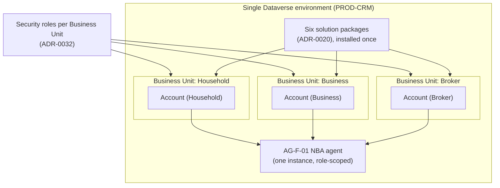

# Design Pattern: Power Platform environment strategy (B2B/B2C)

**Audience:** EA / IT / platform-ops stakeholders evaluating whether B2B and B2C insurance business models should share or have separate Power Platform environments.
**Related ADR:** `docs/adr/ADR-0037-power-platform-environment-strategy-b2b-b2c.md`

## Why this matters

The environment topology decision affects everything downstream — data segregation, deployment cadence, and blast radius of changes. Getting stakeholders aligned on combined-vs-separated environments before build-out avoids costly environment migrations later.

The decision also sits at the intersection of two competing positions already recorded in this repository: [ADR-0006](../adr/ADR-0006-account-centre-of-gravity.md) establishes **one `Account` entity with one 360° view** as the centre of gravity; separate environments by definition fragment that view and require a new reconciliation layer to reassemble it. The question is whether the blast-radius and Zero Trust gains justify that cost.

## Population framing — two-way or three-way?

Before comparing topologies, the number of populations to segregate must itself be stated as an open question. [ADR-0006](../adr/ADR-0006-account-centre-of-gravity.md) defines three `accountType` values: `Household`, `Business`, and `Broker`. Whether Broker folds into a "B2B" bucket or is a genuinely distinct third population (external/non-employee identities, separate release cadence) changes which option below is most appropriate and which grouping within that option makes sense.

- **Two-way (B2C / B2B):** Household vs. Business + Broker folded together. Appropriate if brokers are legally/operationally similar enough to business customers that they do not need distinct identity treatment.
- **Three-way (Household / Business / Broker):** Matches the literal `accountType` enumeration. Recognises that a broker is typically an external, non-employee identity with a materially different Zero Trust profile — which may justify separate treatment regardless of whether Business and Household are combined or split.

Both framings are carried through the options below. The right framing depends on facts not yet confirmed with the customer (see **Missing evidence** in the full ADR).

## Options considered

### Option A — Single combined environment, Business-Unit segregation

All populations (Household, Business, Broker) share **one** production Dataverse environment. Business Units — one per population — plus security roles segregate data visibility and administrative boundaries within that single environment. This is the mechanism Microsoft's own guidance names as the built-in alternative to environment proliferation.

- **Pros:**
  - Matches ADR-0006's one-Account/360°-view position most directly. A household member who is also a small-business owner is a single query against one environment — no reconciliation layer required.
  - One release train, one ALM pipeline, one set of environment-level admin resources. Lowest ongoing operational overhead of the three options.
  - Stays within a single environment's existing Dataverse capacity/storage entitlement — no additional Power Platform capacity add-on required.

- **Cons:**
  - Every population shares the same blast radius. A plugin bug, a bad solution deployment, or a runaway workflow affecting one population can affect all of them.
  - Broker users (often external/non-employee identities) sit inside the same environment-level trust boundary as internal Household/Business data, which may not satisfy a stricter Zero Trust posture.

- **Design pattern:** Native Dataverse Business Unit hierarchy + security role matrix.

---

### Option B — Fully separated environments per population

Each recognised population gets its own Dataverse environment, independently released and administered. Available in a two-way variant (`PROD-CRM-B2C` / `PROD-CRM-B2B`) or a three-way variant (`PROD-CRM-HOUSEHOLD` / `PROD-CRM-BUSINESS` / `PROD-CRM-BROKER`). A cross-environment reconciliation/integration layer is required to reconstruct a unified 360° view for any party that spans populations.

- **Pros:**
  - Strongest blast-radius isolation — a bad deployment or incident in one environment cannot affect another.
  - Each population can have its own release cadence.
  - Broker's external/non-employee users sit in a fully separate environment-level trust boundary — the cleanest Zero Trust posture for that population.

- **Cons:**
  - Directly tensions with ADR-0006's one-Account/360°-view position. A person who spans populations (e.g. household member who is also a small-business owner) now requires a **new cross-environment reconciliation/integration layer** that does not exist today — a material new engineering scope, not a configuration choice.
  - Highest operational overhead: N environments means N release trains, N sets of admin resources, and N times the base Power Platform capacity/storage entitlement.

- **Design pattern:** Environment-per-bounded-context, with a federation/integration layer bridging them — architecturally similar to a multi-tenant-by-environment pattern.

---

### Option C — Hybrid, split by identity/access boundary

Populations are grouped into **two** environments along whichever boundary genuinely needs different identity/access treatment. Two illustrative groupings:

- **Grouping C1 — Broker split out:** `Environment: Household + Business` (internal, employee-served) and `Environment: Broker` (external, non-employee identities).
- **Grouping C2 — Household split out:** `Environment: Household` and `Environment: Business + Broker`.

Within the shared environment, Business Unit segregation still applies (as in Option A). A **narrower** reconciliation/integration layer is needed only for the one boundary that is actually separated — not for every pair of populations as in Option B.

- **Pros:**
  - Targets the isolation Option B is trying to achieve (typically the Broker identity boundary) without paying Option B's full N-environment cost for populations that don't actually need different treatment from each other.
  - Narrower, more tractable reconciliation surface than Option B: one boundary, not every pair.

- **Cons:**
  - Still tensions with ADR-0006 for whichever population ends up split out.
  - Which grouping (C1 vs. C2) is right depends entirely on the still-open two-way/three-way framing question and on facts not yet confirmed with the customer (e.g. whether brokers are truly external identities today, or already internally managed). Picking the wrong boundary means re-doing the split later.

- **Design pattern:** Selective environment-per-bounded-context — Option B's pattern, deliberately applied to only one boundary instead of every population pair, keeping the rest on Option A's Business-Unit pattern.

## Comparison

| Criterion | Option A — Single combined | Option B — Fully separated | Option C — Hybrid |
| --- | --- | --- | --- |
| Matches ADR-0006's one-Account/360°-view position | Directly | No — needs a new reconciliation layer for every population pair | Partially — needs reconciliation only for the one separated boundary |
| Blast-radius isolation | Lowest — one shared environment | Highest | Medium — isolates only the separated population |
| Release cadence independence | None — one release train | Full — N independent release trains | Partial — two release trains |
| Fit for external/non-employee Broker identities (Zero Trust) | Weakest — same trust boundary as internal populations | Strongest, if Broker is fully split out | Strong, if the Broker boundary is the one chosen (Grouping C1) |
| New reconciliation/integration layer required | No | Yes — for every population pair | Yes — but only for one boundary |
| Operational/administration overhead | Lowest | Highest | Medium |
| Environment/capacity licence cost | Baseline (one environment) | Highest (N environments) | Medium (two environments) |
| Sensitivity to the still-open two-way/three-way framing question | Low — agnostic to population count | High — shape changes materially by framing | High — determines which grouping (C1/C2) applies |

## Key diagram

The diagram below depicts Option A — the single-combined-environment topology where Business Unit segregation within one Dataverse environment serves all populations. This is the option that aligns most directly with ADR-0006's one-Account/360°-view position and is therefore the natural baseline against which Options B and C are evaluated.

## Validate this live

Open `docs/adr/ADR-0037-power-platform-environment-strategy-b2b-b2c.md` for the full technical rationale and accepted decision.

## Decision

See `docs/adr/ADR-0037-power-platform-environment-strategy-b2b-b2c.md` for the recorded decision — this pattern doc exists to support re-discussing the tradeoffs with stakeholders, not to override the ADR.

> **Note (as of ADR-0037):** No option is currently selected and no lean is stated. Both the population-framing question (two-way vs. three-way) and the environment-topology question (Option A/B/C) are deliberately left open pending confirmation from the customer's IT/identity team. This pattern document is intended to frame the conversation with EA and IT stakeholders so that when those facts are confirmed, the right option can be selected with full awareness of the consequences.
