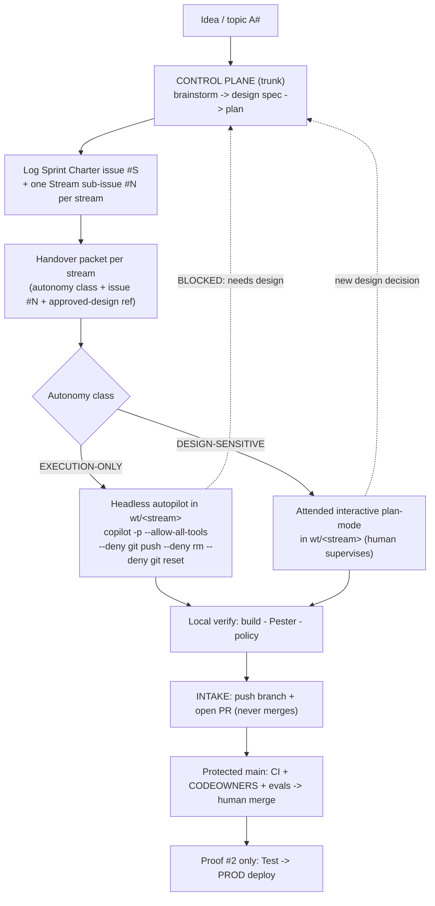

# Sprint Operating Model — the delegated pattern

| Field | Value |
| --- | --- |
| **Status** | Active process |
| **Date** | 2026-08-11 |
| **Scope** | How humans and agents run a sprint as a team in this repo |
| **Autonomy** | Agents recommend and prepare; a human reviews design and merges (execution-only streams may auto-merge on green CI — [ADR-0028](../adr/ADR-0028-scoped-auto-merge-execution-only.md)) |
| **Contracts** | [HANDOVER-CONTRACT.md](./contracts/HANDOVER-CONTRACT.md) · [INTAKE-CONTRACT.md](./contracts/INTAKE-CONTRACT.md) |
| **Decision record** | [ADR-0040](../adr/ADR-0040-delegated-sprint-operating-model.md) |
| **Design spec** | [2026-08-11-delegated-sprint-operating-model-design.md](./specs/2026-08-11-delegated-sprint-operating-model-design.md) |
| **Related** | [ADR-0014](../adr/ADR-0014-agents-advisory-by-design.md) · [ADR-0017](../adr/ADR-0017-alm-everything-through-the-pipeline.md) · [SUPERPOWERS_CONTRACT.md](../../SUPERPOWERS_CONTRACT.md) · [COPILOT-BUILD-GUIDE.md](../COPILOT-BUILD-GUIDE.md) |

---

## What this is

One standard, repeatable sprint process that is itself part of the
demonstration: *"here is how humans and agents run a sprint as a team —
brainstorm and design on the trunk, delegate parallel build streams to local
GitHub Copilot CLI sessions, and merge back through the same governance gates
every other change passes."*

It keeps design decisions human-owned, makes parallel work-streams safe, keeps
full traceability, and reuses — rather than replaces — the existing ALM gates.

## Two planes, one trunk



- **Control plane = the trunk workflow.** "On `main`" means the trunk line,
  realised through the existing short-lived-branch → PR → protected-`main`
  convention — **not** direct pushes to protected `main`. The Copilot session,
  or the operator at the keyboard, is the control plane.
- **Delegated plane = the worktree streams** under
  `C:\Users\urruegg\source\urruegg\wt\`, one git worktree per parallel stream,
  each on its own `feat/sprint-NNN-<stream>` branch, each driven by a local
  Copilot CLI session.

## Phase walkthrough

The full path from an idea to a merged, retired stream:

1. **Brainstorm** the idea on the trunk (control plane).
2. **Design spec** — write the worked design under
   [`docs/superpowers/specs/`](./specs/); it becomes the approved design ref.
3. **Plan** — write the delivery plan under
   [`docs/superpowers/plans/`](./plans/), decomposed into streams.
4. **Sprint-charter issue** — log the sprint as a GitHub issue `#S`
   (template: `.github/ISSUE_TEMPLATE/sprint-charter.md`).
5. **Stream issues + packets** — log one stream issue `#N` per stream
   (template: `.github/ISSUE_TEMPLATE/stream-handover.md`), each carrying an
   autonomy class per the [Handover Contract](./contracts/HANDOVER-CONTRACT.md).
6. **`New-SprintWorktree`** — create the isolated worktree and scaffold the
   packet from the template.
7. **`Invoke-StreamDelegation`** — dispatch the stream: headless autopilot for
   `EXECUTION-ONLY`, attended plan-mode for `DESIGN-SENSITIVE`.
8. **Build in the worktree** — the delegated session builds, tests and commits
   within the packet's `Allowed scope`, and cannot self-integrate.
9. **`Complete-StreamIntake`** — verify locally, push the branch, open a PR;
   it never merges (see the [Intake Contract](./contracts/INTAKE-CONTRACT.md)).
10. **Merge** — design-sensitive streams are merged by a named human via branch
    protection + CODEOWNERS + CI + evals. **Execution-only** streams (labelled
    `autonomy:execution-only`, touching no guarded path) may **auto-merge on
    green CI** via GitHub native auto-merge, which never bypasses branch
    protection ([ADR-0028](../adr/ADR-0028-scoped-auto-merge-execution-only.md)).
11. **`Remove-SprintWorktree`** — retire the worktree once its work is safely on
    the trunk; the guard refuses a dirty tree.

## Operator commands

Run these from the repo trunk checkout. Each script dot-sources its function;
paths are illustrative and match the sprint-001 conventions.

**1 — Create the stream worktree and scaffold its packet.**

```powershell
. scripts/orchestration/New-SprintWorktree.ps1
New-SprintWorktree -SprintId 'sprint-001' -StreamId 'smoke' `
    -IssueNumber <#N> -AutonomyClass 'EXECUTION-ONLY'
```

Creates `wt\sprint-001-smoke` on branch `feat/sprint-001-smoke` and writes the
packet under `docs/superpowers/sprints/sprint-001/streams/smoke.md`. Add
`-DryRun` to plan the `git worktree add` without running it.

**2 — Dispatch the stream according to its autonomy class.**

```powershell
. scripts/orchestration/Invoke-StreamDelegation.ps1
Invoke-StreamDelegation -PacketPath 'docs/superpowers/sprints/sprint-001/streams/smoke.md'
```

An `EXECUTION-ONLY` packet launches headless autopilot with the deny-list; a
`DESIGN-SENSITIVE` packet prints the attended launch instead. Passing
`-Headless` against a `DESIGN-SENSITIVE` packet **throws** — the guardrail.

**3 — Check the status board across worktrees.**

```powershell
. scripts/orchestration/Get-SprintStatus.ps1
Get-SprintStatus
```

Lists every stream worktree under the worktree root with its branch.

**4 — Intake: verify, push the branch, open the PR (never merges).**

```powershell
. scripts/orchestration/Complete-StreamIntake.ps1
Complete-StreamIntake -WorktreePath 'C:\Users\urruegg\source\urruegg\wt\sprint-001-smoke' `
    -Branch 'feat/sprint-001-smoke' -IssueNumber <#N> `
    -Title 'sprint-001/stream-smoke: mechanism proof'
```

Pushes the branch and opens a PR against `main`. It does not merge.

**5 — Retire the worktree after the PR merges.**

```powershell
. scripts/orchestration/Remove-SprintWorktree.ps1
Remove-SprintWorktree -WorktreePath 'C:\Users\urruegg\source\urruegg\wt\sprint-001-smoke'
```

Removes the worktree; the guard throws on a dirty tree unless `-Force` is
passed.

## Autopilot guardrail — operator rules

*"Any proposed design is not autopilot-approved; a human always reviews and the
agent raises clarification questions in the chat."* This is enforced at four
points — treat them as hard operator rules, not conventions:

1. **Design happens on the trunk, human-reviewed, before any packet exists.**
   A packet requires an `Approved design ref`; do not scaffold a stream for
   undesigned work.
2. **Never launch a `DESIGN-SENSITIVE` stream headless.** The wrapper refuses,
   and so must you — run it attended, in plan mode.
3. **Never remove the deny-list.** `git push`, `rm` and `git reset` stay denied
   for every headless stream so it cannot self-integrate or rewrite history.
4. **Honour the escalation rule.** A stream that meets a new design decision
   stops and writes `BLOCKED: needs design` back to the control-plane chat — it
   never decides. When you see that, take the decision on the trunk and re-issue
   the packet.

## Traceability chain

```
topic A# -> use case -> ADR -> design spec (trunk)
  -> Sprint Charter issue #S -> Stream issue #N + handover packet
  -> wt/<stream> branch -> PR -> CI + evals -> human merge to main
  -> (proof #2) Test -> PROD
```

Every packet, branch, PR and `STATUS.md` row carries `#S` / `#N`, so a whole
delegated run is auditable end to end.

## Sprint closing — required DEV + TEST evidence

*Anchored 2026-08-15, prompted mid-sprint-003 while its seed-pipeline stream
was in review (PRs #101–#106).* Grounds
[ADR-0017](../adr/ADR-0017-alm-everything-through-the-pipeline.md)'s "rollback
must be demonstrable, not described" in a concrete, checkable requirement for
every sprint charter, not just sprint-002's promotion-themed one.

**A sprint is not closed on "the code merged to `main`" alone.** Its charter's
Definition of Done must show, in the sprint's own `STATUS.md`, under a
`## Live DEV + TEST evidence` heading:

1. **DEV evidence** — the authoring/convergence pipeline (e.g. `cd-solution-dev.yml`)
   run **green against live DEV**, linked by run URL, with the **offline test
   suite's pass/fail counts** quoted alongside it (not just "CI is green" as a
   bare claim — the actual numbers, e.g. "385 passed, 0 failed, 2 skipped").
2. **TEST evidence** — the same change **promoted to TEST**, linked by run
   URL, with a step-by-step result table (mirroring
   [sprint-002's "Live promotion evidence"](./sprints/sprint-002-insurance-foundation-promotion/STATUS.md)
   — one row per pipeline step, ✅/❌/⚠️, defects found and fixed called out
   explicitly) and the TEST-side smoke/Pester result counts.
3. **If a sprint's scope genuinely does not reach TEST** (e.g. a
   documentation-only or research sprint), its Definition of Done must say so
   **explicitly, with a reason** — never a silent omission. A missing DEV or
   TEST evidence line reads as *not done*, not as *not applicable*.

This is a closing-time requirement, not a per-PR one: individual stream PRs
keep following their own `gate1` + evidence-in-PR convention as before: this
section is what the **sprint charter's own Definition of Done** checks against
before anyone calls the sprint closed. See
[the sprint-charter issue template](../../.github/ISSUE_TEMPLATE/sprint-charter.md)
for the checklist wording every new sprint charter now carries.

## The scripts

| Script | Responsibility |
| --- | --- |
| [New-SprintWorktree.ps1](../../scripts/orchestration/New-SprintWorktree.ps1) | Create `wt/<sprint>-<stream>` worktree + scaffold packet |
| [Invoke-StreamDelegation.ps1](../../scripts/orchestration/Invoke-StreamDelegation.ps1) | Dispatch wrapper: class → headless / attended command |
| [Complete-StreamIntake.ps1](../../scripts/orchestration/Complete-StreamIntake.ps1) | Push branch + open PR (never merges) |
| [Get-SprintStatus.ps1](../../scripts/orchestration/Get-SprintStatus.ps1) | Worktree + branch status board |
| [Remove-SprintWorktree.ps1](../../scripts/orchestration/Remove-SprintWorktree.ps1) | Retire a worktree, guarding uncommitted/unpushed work |
| [Read-HandoverPacket.ps1](../../scripts/orchestration/Read-HandoverPacket.ps1) | Shared packet parser used by the above |
