# Frontier Operating Model Documentation Implementation Plan

> **For agentic workers:** REQUIRED SUB-SKILL: Use superpowers:subagent-driven-development (recommended) or superpowers:executing-plans to implement this plan task-by-task. Steps use checkbox (`- [ ]`) syntax for tracking.

**Goal:** Implement the approved design in `docs/superpowers/specs/2026-08-16-frontier-operating-model-design.md` — rename ADR-0023 to ADR-0040, fix stale cross-references left over from the ADR renumbering, add a "Frontier Firm operating model" section to `docs/MICROSOFT-FRAMEWORKS.md`, create `docs/FRONTIER-OPERATING-MODEL.md`, and create 12 new customer-facing "design pattern" documents (plus an index) in `docs/design/` — one per already-accepted ADR — so the repo has a single narrative arc from business framing (Frontier Firm) through design-pattern options down to accepted ADRs, with zero broken cross-references.

**Architecture:** This is a documentation-only change set. No code, no build, no tests in the traditional sense. "Tests" are structural/link-integrity checks implemented as inline PowerShell `Select-String`/`Test-Path` commands run against the repo, because the repo has no markdownlint/remark/link-check tooling configured. Each task is scoped to one coherent file or one tight group of files that change together (e.g., a rename plus its four live referrers).

**Tech Stack:** Markdown documentation only. Validation via PowerShell (`Select-String`, `Test-Path`, `git status`) — no npm/pip packages, no repo build system involved.

---

## Reference tables (used by multiple tasks — read once, use throughout)

**Old draft-number → final ADR-number mapping** (needed by Task 2 for stale cross-reference resolution):

| Old draft # (as still written in some cross-references) | Final ADR # | File | Topic |
|---|---|---|---|
| 0024 | 0030 | `ADR-0030-dataverse-to-databricks-integration-pattern.md` | Databricks integration |
| 0025 | 0031 | `ADR-0031-crm-core-systems-kafka-confluent-integration-pattern.md` | Kafka/Confluent integration |
| 0026 | 0032 | `ADR-0032-entra-power-platform-dynamics365-identity-access-management.md` | IAM (Entra ↔ Power Platform/Dynamics 365) |
| 0027 | 0033 | `ADR-0033-crm-ux-placement-in-b2e-landscape.md` | CRM UX placement in B2E landscape |
| 0028 | 0034 | `ADR-0034-aro-case-task-management-integration-pattern.md` | ARO case/task management integration |
| 0029 | 0035 | `ADR-0035-pdv-partner-master-data-integration-pattern.md` | PDV partner master data integration |
| 0030 | 0036 | `ADR-0036-crm-lead-campaign-external-landscape.md` | Lead/Campaign external landscape |
| 0031 | 0037 | `ADR-0037-power-platform-environment-strategy-b2b-b2c.md` | Power Platform environment strategy (B2B/B2C) |
| 0032 | 0038 | `ADR-0038-purview-power-platform-dynamics365-compliance.md` | Purview compliance |
| 0033 | 0039 | `ADR-0039-devsecops-cicd-github-enterprise-vs-gitlab.md` | DevSecOps CI/CD |

**Important:** ADR-0026 as it appears in the *current, final* numbering is a real, different, already-accepted ADR: "Inbound analytics projection pattern" (`docs/adr/ADR-0026-inbound-analytics-projection-pattern.md`). Any cross-reference in the repo that says "ADR-0026" must be checked against context before touching it — some correctly mean the real ADR-0026 (leave alone), others are stale old-numbering self-references that actually meant what is now ADR-0032 (IAM) and must be corrected. See Task 2 for the full resolution method and worked examples.

---

### Task 1: Rename ADR-0023 to ADR-0040 and fix its four live referrers

**Files:**
- Rename: `docs/adr/ADR-0023-delegated-sprint-operating-model.md` → `docs/adr/ADR-0040-delegated-sprint-operating-model.md`
- Modify: `docs/adr/ADR-0040-delegated-sprint-operating-model.md` (H1 title line only, after rename)
- Modify: `docs/adr/README.md`
- Modify: `docs/superpowers/SPRINT-OPERATING-MODEL.md:10`
- Modify: `docs/superpowers/contracts/INTAKE-CONTRACT.md:9,57`
- Modify: `docs/superpowers/contracts/HANDOVER-CONTRACT.md:10,65`
- Modify: `docs/superpowers/sprints/sprint-001/sprint.md:10,47`

**Do NOT modify** `docs/superpowers/specs/2026-08-11-*.md` or `docs/superpowers/plans/2026-08-11-*.md` — these are dated historical records of a point in time and are intentionally left referencing the old number, exactly like an ADR is never renumbered retroactively.

- [ ] **Step 1: Rename the ADR file**

Run:
```powershell
git mv docs/adr/ADR-0023-delegated-sprint-operating-model.md docs/adr/ADR-0040-delegated-sprint-operating-model.md
```
Expected: command succeeds silently; `git status` shows the file as renamed.

- [ ] **Step 2: Update the H1 title inside the renamed file**

The file's first heading currently reads:
```
# ADR-0023 - Delegated sprint operating model (Copilot CLI control plane)
```
Change it to:
```
# ADR-0040 - Delegated sprint operating model (Copilot CLI control plane)
```
Also check the header metadata table immediately below the H1 (it has a row like `| ADR | ADR-0023 |` or similar `ADR-0023` self-reference) — update every literal `ADR-0023` occurrence inside this file to `ADR-0040`. Do not change anything else in the file (its content/decision/date/status must stay exactly as-is).

- [ ] **Step 3: Verify no remaining ADR-0023 text inside the renamed file**

Run:
```powershell
Select-String -Path "docs/adr/ADR-0040-delegated-sprint-operating-model.md" -Pattern "ADR-0023"
```
Expected: no output (no matches).

- [ ] **Step 4: Update `docs/adr/README.md` index**

Find the existing table row referencing ADR-0023 (delegated sprint operating model) and change its ADR number and filename link from `ADR-0023` / `ADR-0023-delegated-sprint-operating-model.md` to `ADR-0040` / `ADR-0040-delegated-sprint-operating-model.md`. Keep the row's title text, status, and date columns unchanged.

Then find the line that reads:
```
`0039` is the latest allocated sequence; use `0040` for the next ADR
```
and change it to:
```
`0040` is the latest allocated sequence; use `0041` for the next ADR
```

Do NOT add ADR-0040 to the "proposed hypothesis" list near the bottom of the file (lines ~86-88) — ADR-0040's own status is Accepted, so it belongs only in the main index table like every other accepted ADR.

- [ ] **Step 5: Fix the four live referring documents**

In `docs/superpowers/SPRINT-OPERATING-MODEL.md`, line 10 currently links to `ADR-0023-delegated-sprint-operating-model.md` (or references "ADR-0023"). Change every such occurrence in this file to `ADR-0040-delegated-sprint-operating-model.md` / "ADR-0040".

In `docs/superpowers/contracts/INTAKE-CONTRACT.md`, lines 9 and 57 reference ADR-0023 / the old filename. Change both to ADR-0040 / the new filename.

In `docs/superpowers/contracts/HANDOVER-CONTRACT.md`, lines 10 and 65 reference ADR-0023 / the old filename. Change both to ADR-0040 / the new filename.

In `docs/superpowers/sprints/sprint-001/sprint.md`, lines 10 and 47 reference ADR-0023 / the old filename. Change both to ADR-0040 / the new filename.

In every case, only change the ADR number and filename — do not alter surrounding prose.

- [ ] **Step 6: Verify no stray references to the old name remain outside the excluded historical files**

Run:
```powershell
Select-String -Path "docs/**/*.md" -Pattern "ADR-0023" -Exclude "2026-08-11-*" | Where-Object { $_.Path -notmatch "specs\\2026-08-11|plans\\2026-08-11" }
```
Expected: no output. (If the `-Exclude` filter doesn't catch nested-path dated files, manually confirm the only remaining hits are inside `docs/superpowers/specs/2026-08-11-*.md` and `docs/superpowers/plans/2026-08-11-*.md`.)

- [ ] **Step 7: Commit**

```bash
git add docs/adr/ADR-0040-delegated-sprint-operating-model.md docs/adr/README.md docs/superpowers/SPRINT-OPERATING-MODEL.md docs/superpowers/contracts/INTAKE-CONTRACT.md docs/superpowers/contracts/HANDOVER-CONTRACT.md docs/superpowers/sprints/sprint-001/sprint.md
git commit -m "docs(adr): renumber ADR-0023 to ADR-0040 and fix live cross-references"
```

---

### Task 2: Fix stale internal ADR cross-references (ADR-0011, ADR-0031–ADR-0039)

**Files:**
- Modify: `docs/adr/ADR-0011-event-driven-cascade.md` (line 49 area)
- Modify: `docs/adr/ADR-0031-crm-core-systems-kafka-confluent-integration-pattern.md`
- Modify: `docs/adr/ADR-0032-entra-power-platform-dynamics365-identity-access-management.md`
- Modify: `docs/adr/ADR-0033-crm-ux-placement-in-b2e-landscape.md`
- Modify: `docs/adr/ADR-0034-aro-case-task-management-integration-pattern.md`
- Modify: `docs/adr/ADR-0035-pdv-partner-master-data-integration-pattern.md`
- Modify: `docs/adr/ADR-0036-crm-lead-campaign-external-landscape.md`
- Modify: `docs/adr/ADR-0037-power-platform-environment-strategy-b2b-b2c.md`
- Modify: `docs/adr/ADR-0038-purview-power-platform-dynamics365-compliance.md`
- Modify: `docs/adr/ADR-0039-devsecops-cicd-github-enterprise-vs-gitlab.md`

**Do NOT modify** `docs/adr/ADR-0018-analytics-split-crm-vs-databricks.md` — its "ADR-0026" reference (line 34) is already correct (it means the real, accepted "Inbound analytics projection pattern" ADR).

**Resolution method** (apply to every "ADR-00NN" text/link match found by the search in Step 1, in file order):
1. If the mention is a markdown link with a filename, e.g. `[ADR-0025](./ADR-0025-crm-core-systems-kafka-confluent-integration-pattern.md)`: check whether that filename exists on disk with `Test-Path`. If it does not exist, look up the number embedded in the *filename slug* (not just the bare number) in the mapping table above and replace both the number and filename with the correct final ADR file.
2. If the mention is a bare "(ADR-00NN)" with no filename, read the surrounding sentence/topic. Match the topic to a row in the mapping table (e.g., "Dataverse environment" topic → Environment strategy row → ADR-0037), not to the literal number alone — the same literal number can legitimately refer to different ADRs depending on which document era it was written in.
3. If a matched number (e.g., 0026) currently already resolves to a real, existing, topically-consistent ADR file (e.g., ADR-0026-inbound-analytics-projection-pattern.md, and the surrounding text is genuinely about analytics projection, not IAM), leave it unchanged — it is not stale.

**Worked example (ambiguous case) — MUST be handled exactly this way:** `docs/adr/ADR-0039-devsecops-cicd-github-enterprise-vs-gitlab.md` contains a bare mention "Dataverse environment (ADR-0031)". ADR-0031 currently and correctly refers to the Kafka/Confluent ADR — but this particular mention is about environment topology/topology strategy, not Kafka. Applying the resolution method: the topic is "Dataverse environment" → matches the Environment-strategy row in the mapping table → old draft number for that topic was 0031 → final number is ADR-0037. So this specific mention must become "(ADR-0037)", even though ADR-0031 is a valid, different, real ADR elsewhere. Do not resolve by number match alone; resolve by topic match.

- [ ] **Step 1: Enumerate every ADR-00NN mention in the 10 in-scope files**

Run per file (repeat for all 10 files listed above):
```powershell
Select-String -Path "docs/adr/ADR-0031-crm-core-systems-kafka-confluent-integration-pattern.md" -Pattern "ADR-00\d\d" -AllMatches
```
Record every match with its line number and full line text for review. Do this for all 10 files before making any edits, so you have a complete worklist.

- [ ] **Step 2: Classify and fix each match using the resolution method above**

For each recorded match, apply steps 1–3 of the resolution method. Edit the file in place, changing only the ADR number (and filename inside markdown links, if present) — never alter surrounding prose, punctuation, or link text labels beyond the number itself.

Pay special attention to:
- Any mention of "0024" topic (Databricks) → must become 0030.
- Any mention of "0025" topic (Kafka) → must become 0031.
- Any mention of "0026" topic that is really about IAM/Entra/Security Roles (not analytics) → must become 0032.
- Any mention of "0027" topic (CRM UX/B2E) → must become 0033.
- Any mention of "0028" topic (ARO) → must become 0034.
- Any mention of "0029" topic (PDV) → must become 0035.
- Any mention of "0030" topic (Lead/Campaign) that is NOT the real ADR-0030 (Databricks) → must become 0036.
- Any mention of "0031" topic that is about environment strategy (NOT Kafka) → must become 0037.
- Any mention of "0032" topic that is about Purview/compliance (NOT IAM) → must become 0038.
- Any mention of "0033" topic (DevSecOps) → must become 0039.

- [ ] **Step 3: Fix `docs/adr/ADR-0011-event-driven-cascade.md` line 49**

This file contains `[ADR-0025](./ADR-0025-crm-core-systems-kafka-confluent-integration-pattern.md)`. `ADR-0025-crm-core-systems-kafka-confluent-integration-pattern.md` does not exist on disk (confirm with `Test-Path docs/adr/ADR-0025-crm-core-systems-kafka-confluent-integration-pattern.md`, expected `False`). Replace with `[ADR-0031](./ADR-0031-crm-core-systems-kafka-confluent-integration-pattern.md)`.

- [ ] **Step 4: Confirm `docs/adr/ADR-0018-analytics-split-crm-vs-databricks.md` is untouched**

Run:
```powershell
git status docs/adr/ADR-0018-analytics-split-crm-vs-databricks.md
```
Expected: no output (file not modified). This file's existing ADR-0026 reference is correct and must remain exactly as it was before this task started.

- [ ] **Step 5: Verify every markdown-link-style ADR cross-reference in the 10 modified files now points to a file that exists**

Run:
```powershell
$files = @(
  "docs/adr/ADR-0011-event-driven-cascade.md",
  "docs/adr/ADR-0031-crm-core-systems-kafka-confluent-integration-pattern.md",
  "docs/adr/ADR-0032-entra-power-platform-dynamics365-identity-access-management.md",
  "docs/adr/ADR-0033-crm-ux-placement-in-b2e-landscape.md",
  "docs/adr/ADR-0034-aro-case-task-management-integration-pattern.md",
  "docs/adr/ADR-0035-pdv-partner-master-data-integration-pattern.md",
  "docs/adr/ADR-0036-crm-lead-campaign-external-landscape.md",
  "docs/adr/ADR-0037-power-platform-environment-strategy-b2b-b2c.md",
  "docs/adr/ADR-0038-purview-power-platform-dynamics365-compliance.md",
  "docs/adr/ADR-0039-devsecops-cicd-github-enterprise-vs-gitlab.md"
)
foreach ($f in $files) {
  Select-String -Path $f -Pattern "\]\(\./(ADR-00\d\d-[a-z0-9-]+\.md)\)" -AllMatches | ForEach-Object {
    foreach ($m in $_.Matches) {
      $target = "docs/adr/" + $m.Groups[1].Value
      if (-not (Test-Path $target)) { Write-Output "BROKEN LINK in $f -> $target" }
    }
  }
}
```
Expected: no "BROKEN LINK" output.

- [ ] **Step 6: Commit**

```bash
git add docs/adr/ADR-0011-event-driven-cascade.md docs/adr/ADR-0031-crm-core-systems-kafka-confluent-integration-pattern.md docs/adr/ADR-0032-entra-power-platform-dynamics365-identity-access-management.md docs/adr/ADR-0033-crm-ux-placement-in-b2e-landscape.md docs/adr/ADR-0034-aro-case-task-management-integration-pattern.md docs/adr/ADR-0035-pdv-partner-master-data-integration-pattern.md docs/adr/ADR-0036-crm-lead-campaign-external-landscape.md docs/adr/ADR-0037-power-platform-environment-strategy-b2b-b2c.md docs/adr/ADR-0038-purview-power-platform-dynamics365-compliance.md docs/adr/ADR-0039-devsecops-cicd-github-enterprise-vs-gitlab.md
git commit -m "docs(adr): fix stale cross-references left over from ADR renumbering"
```

---

### Task 3: Add "Frontier Firm operating model" framework section to `docs/MICROSOFT-FRAMEWORKS.md`

**Files:**
- Modify: `docs/MICROSOFT-FRAMEWORKS.md`

- [ ] **Step 1: Add a new framework section**

Append a new section at the end of `docs/MICROSOFT-FRAMEWORKS.md`, following the same heading level and structure pattern used by the existing framework sections in that file (each existing section has a heading naming the framework, a short description paragraph, and a bullet list of key references). Add:

```markdown
## Frontier Firm operating model

Microsoft's Work Trend Index research describes the "Frontier Firm" — an organization that restructures how work gets done around human-agent teams, with AI agents taking on defined work alongside employees rather than merely assisting them. This repo's agentic delegated-sprint operating model (see `docs/FRONTIER-OPERATING-MODEL.md`) is a concrete, reduced-scope instantiation of that mental model, scoped to the Contoso Insurance Sales Advisory use case.

- Frontier Firm research and definition: https://www.microsoft.com/en-us/worklab/frontier-firm-resources
- Microsoft Work Trend Index: https://www.microsoft.com/en-us/worklab/work-trend-index
- This repo's adaptation: `docs/FRONTIER-OPERATING-MODEL.md`
- Design pattern walkthrough for stakeholder demos: `docs/design/00-frontier-firm-operating-model-for-insurance.md`
```

- [ ] **Step 2: Verify the file still parses as valid markdown structure**

Run:
```powershell
Select-String -Path "docs/MICROSOFT-FRAMEWORKS.md" -Pattern "^## Frontier Firm operating model$"
```
Expected: exactly one match.

- [ ] **Step 3: Commit**

```bash
git add docs/MICROSOFT-FRAMEWORKS.md
git commit -m "docs: add Frontier Firm operating model framework reference"
```

---

### Task 4: Create `docs/FRONTIER-OPERATING-MODEL.md`

**Files:**
- Create: `docs/FRONTIER-OPERATING-MODEL.md`

- [ ] **Step 1: Create the file using spec sections 1-12 as source content**

Read `docs/superpowers/specs/2026-08-16-frontier-operating-model-design.md` in full (all 12 numbered sections — this is the real, verbatim source; do not invent content). Transplant that content into a new standalone document at `docs/FRONTIER-OPERATING-MODEL.md` with this structure:

```markdown
# Frontier Operating Model — Contoso Insurance CRM Showcase

> Adapted from Microsoft's Work Trend Index "Frontier Firm" research and the real Work IQ capability (see `docs/MICROSOFT-FRAMEWORKS.md#frontier-firm-operating-model`), scoped to this repo's Contoso Insurance Advisory Cockpit use case.

## Solution context

Two target-architecture pictures ground everything that follows: where Contoso Insurance's experience, agent, and data layers are heading, and how the ten concrete integration patterns between them connect the CRM to the wider system landscape. Every ADR and design-pattern doc in this repo is a zoomed-in view of one piece of these two pictures.

### The target state, layer by layer

```mermaid
flowchart TB
    classDef msft fill:#ffffff,stroke:#333333,stroke-width:1px,color:#111111
    classDef contoso fill:#fde8e8,stroke:#b91c1c,stroke-width:1px,color:#111111
    classDef shared fill:#e5e5e5,stroke:#666666,stroke-width:1px,color:#111111

    subgraph L1["1. Experience and productivity"]
        direction LR
        A1["M365 Teams and Outlook (Work IQ)"]:::msft
        A2["B2E Portal (Angular)"]:::contoso
        A3["D365 side by side: Advisory Cockpit and agency network"]:::msft
        A4["Mobile: online and offline"]:::msft
    end

    subgraph L2["2. Agents and orchestration"]
        direction LR
        B1["Copilot Studio agents"]:::msft
        B2["Azure AI Foundry: own models"]:::msft
        B3["MCP tools and context"]:::msft
        B4["Human in the loop: delegation and approval"]:::shared
    end

    subgraph L3["3. CRM modules: model driven apps"]
        direction LR
        C1["Sales"]:::msft
        C2["Service and Contact Center"]:::msft
        C3["Customer Insights: Journeys and Data"]:::msft
        C4["Contoso Insurance specific apps"]:::shared
    end

    subgraph L4["4. Lean system of record (CRM)"]
        direction LR
        D1["Dataverse: data model plus Contoso Insurance extension (lean)"]:::shared
        D2["Entra ID RBAC: row and field level security by territory"]:::msft
        D3["Virtual Tables and events: Web API (OData v4)"]:::msft
        D4["ALM: versioned solutions"]:::msft
    end

    subgraph L5["5. Analytics and integration (zero copy)"]
        direction LR
        E1["OneLake and Fabric: zero copy mirroring"]:::msft
        E2["Power BI: Direct Lake"]:::msft
        E3["Databricks Unity Catalog: leading lake"]:::contoso
        E4["Confluent Cloud: Kafka backbone"]:::contoso
    end

    subgraph L6["6. Platform layer: Azure and OpenShift"]
        direction LR
        F1["SAP, JAP, HALO"]:::contoso
        F2["Siebel: to be retired"]:::contoso
        F3["PDV and ARO: PDV leads the customer master"]:::contoso
        F4["Claims, contract, and policy systems"]:::contoso
    end

    L1 --> L2 --> L3 --> L4 --> L5 --> L6
```



*Legend: white = Microsoft platform capability, red = a Contoso Insurance-owned system, grey = shared/jointly-owned. A governance overlay — Entra ID, Purview, DLP, and regional data-residency controls — applies across every layer above, not just one.*

Three threads run through this picture, each already reflected in this repo's ADRs:

1. **The collaboration world.** People already work in Teams and Outlook, including across the agency network. Agent and CRM capability integrates natively there, under Entra ID and existing tenant policies — the B2E integration is flexible, not all-or-nothing (see [ADR-0033](../adr/ADR-0033-crm-ux-placement-in-b2e-landscape.md)).
2. **The data.** Databricks remains the leading lake: core-system data stays there and is consumed via OneLake (mirrored Unity Catalog) at runtime without copying it — zero-copy — inside Contoso Insurance's own tenant (see [ADR-0030](../adr/ADR-0030-dataverse-to-databricks-integration-pattern.md)).
3. **The user experience.** Both a headless mode (for internal, B2E-orchestrated processes) and a native CRM surface (for direct customer-engagement UX) are supported — the choice is made per team, not fixed once for the whole organization (see [ADR-0033](../adr/ADR-0033-crm-ux-placement-in-b2e-landscape.md)).

An intelligence layer that sits above every system is possible in a later phase — this repo does not build it (see §8 below on Work IQ), but nothing here forecloses it.

### One picture, ten integration patterns

```mermaid
flowchart LR
    classDef msft fill:#ffffff,stroke:#333333,stroke-width:1px,color:#111111
    classDef contoso fill:#fde8e8,stroke:#b91c1c,stroke-width:1px,color:#111111
    classDef shared fill:#e5e5e5,stroke:#666666,stroke-width:1px,color:#111111
    classDef gov fill:#333333,stroke:#333333,color:#ffffff

    subgraph AW["Agent workplace: side by side"]
        direction TB
        B2E["B2E Portal (Angular): micro frontend, MSAL, Entra ID - advisory and quoting"]:::contoso
        CRM["CRM Dynamics 365: agent UI beside B2E, deep links not web components"]:::msft
    end

    subgraph M365G["M365, agentic, Power Platform"]
        direction TB
        AGENTIC["Agentic solutions: M365 Copilot, Copilot Studio, advisory agents"]:::msft
        PP["M365 Power Apps: Outlook, Teams, SharePoint, low code"]:::msft
    end

    DV["Microsoft Dataverse: system of record for the customer relationship - Web API OData v4, event framework, virtual tables, MCP, security and audit"]:::shared

    subgraph BACKBONE["Integration backbone"]
        direction TB
        FUNC["Azure Functions: webhook target, Kafka trigger and output, Confluent ready"]:::msft
        CONF["Confluent Cloud: Kafka backbone, Azure native ISV, schema registry"]:::msft
    end

    subgraph CORE["Core systems: Azure target state"]
        direction TB
        PDV["PDV: partner master, dedicated DB on Azure"]:::contoso
        JAP["JAP Quarkus: cloud native microservices"]:::contoso
        HALO["HALO platform: third party on Azure"]:::contoso
    end

    subgraph ONPREM["On premises legacy"]
        direction TB
        ARO["ARO: task and case management, retirement planned later"]:::contoso
        CONTRACT["Contract system: legacy, retirement planned"]:::contoso
        CLAIMS["Claims system: legacy, retirement planned"]:::contoso
    end

    subgraph DATA["Data and AI platform"]
        direction TB
        DBX["Azure Databricks: Unity Catalog, medallion Delta, streaming from Confluent, ML - leading lake"]:::contoso
        FABRIC["Microsoft Fabric and OneLake: mirrored Unity Catalog, zero copy, downstream replica lake"]:::msft
        PBI["Power BI: Direct Lake, reads directly from Fabric OneLake, semantic models"]:::msft
        FABRICIQ["Fabric IQ, part of Microsoft IQ: semantic models and ontology preview - entities, relationships, rules, grounds Copilot and agents"]:::msft
    end

    GOV["Governance, security, compliance: Microsoft Purview, Defender, Entra ID, DLP, audit - applies across every layer"]:::gov

    B2E -->|"1 REST API"| DV
    CRM -->|"1 REST API"| DV
    DV -->|"2"| FUNC
    FUNC -->|"3"| DV
    FUNC <-->|"Kafka"| CONF
    DV -.->|"4 virtual tables, live read, no copy"| CORE
    DV -->|"5 link to Fabric, zero ETL"| DBX
    DBX -->|"6 zero copy"| FABRIC
    FABRIC -.->|"7 eventstream, not planned, Fabric is Direct Lake replica only"| CONF
    FABRIC --> PBI
    FABRIC --> FABRICIQ
    FABRICIQ -->|"8 grounding Copilot and agents"| AGENTIC
    B2E -->|"9 native in the Microsoft ecosystem: sync, Teams, docs, Copilot"| PP
    PP -->|"10 more than 1000 connectors"| CORE
    CONF -->|"events"| PDV
    CONF -.->|"PDV replication to contact, PDV remains master"| DV
```



*Patterns 1-10 map directly onto this repo's ADRs: 1/2/3 → [ADR-0008](../adr/ADR-0008-thin-crm-over-systems-of-record.md) (thin CRM over systems of record); 4/5/6 → [ADR-0030](../adr/ADR-0030-dataverse-to-databricks-integration-pattern.md) (Dataverse↔Databricks↔Fabric, zero-copy); 7 is explicitly out of scope (Fabric is a Direct-Lake replica only, not an event source); 8 is the Work IQ/Fabric IQ grounding pattern, documented-only in this repo (see §8 below); 9/10 → [ADR-0033](../adr/ADR-0033-crm-ux-placement-in-b2e-landscape.md) and the Kafka/Confluent backbone → [ADR-0031](../adr/ADR-0031-crm-core-systems-kafka-confluent-integration-pattern.md); the PDV replication note → [ADR-0035](../adr/ADR-0035-pdv-partner-master-data-integration-pattern.md); ARO → [ADR-0034](../adr/ADR-0034-aro-case-task-management-integration-pattern.md).*

## 1. Purpose and scope

[Use spec §1 "Purpose and scope" verbatim, including the seven numbered asks list, reworded from "this work"/"this spec" framing to "this repo implements."]

## 2. Grounding — official Microsoft references

[Use spec §2's grounding table verbatim — the same 9-row table of Topic → Source links (Frontier Firm 2025/2026 Work Trend Index, WorkLab hub, Work IQ overview/MCP/API/CLI, Copilot APIs overview, GitHub MCP server).]

## 3. Terminology adaptation

[Use spec §3 verbatim: the idea-doc-term → Contoso Insurance mapping table (Mitglieder→Customer, Mitarbeitende→Employees) and the D365 CE app → key entity → Contoso Insurance mapping table (Sales/Opportunity, Service/Case, Marketing/Lead), including the ADR-0008/ADR-0009/ADR-0034/ADR-0036 cross-references exactly as cited in the spec.]

## 4. North-star loop and existing traceability

[Use spec §4 verbatim: the Insight→Decision→Delivery→Outcome→Learning stage table mapped to existing repo mechanisms (Requirement/Use case+ADR/Solution change/Test evidence/Deployed-to-sandbox), and the closing statement that this is one loop described twice, not a new taxonomy.]

## 5. Five control planes, adapted

[Use spec §5 verbatim: the 5-row control-plane table (Business/Teams, Interaction/Work IQ, Agent/Copilot Agent Mesh, Engineering/GitHub, Operational/Dataverse+Power Platform) with each plane's idea-doc framing, Contoso Insurance adaptation, and Built/Documented-only status exactly as stated in the spec.]

## 6. Role mapping — idea-doc roster to existing named agents

[Use spec §6 verbatim: the 9-row idea-doc-role → existing-agent(s) → notes table (Voice of Customer through the cross-cutting AG-E-12 Frontier Firm Guide row), preserving every AG-E-##/AG-F-## reference exactly.]

## 7. HITL and governance

[Use spec §7 verbatim: the non-negotiable HITL principle (ADR-0014), compliance/regulatory governance (ADR-0038/Purview), and review authority (AG-E-06) bullets.]

## 8. Work IQ ↔ GitHub integration pattern (documented only)

[Use spec §8 verbatim, including the explicit "documented only, no code/MCP/wiring in this showcase" framing, the mermaid flowchart diagram exactly as written, and all four "why this is realistic, not speculative" bullets (Copilot CLI plugin install, 10 fixed generic tools, delegated-only Entra auth with no service-principal support, Copilot-Credits-based licensing) plus the illustrative real-engagement flow paragraph.]

## 9. Six-phase roadmap, adapted and scope-tagged

[Use spec §9 verbatim: all six numbered phases (Foundation, Teams↔GitHub transparency, Work IQ agent intake, Sprint review→GitHub, Release→outcome loop, Agent mesh scaling), each with its exact [Built] / [Demoed via docs] / [Documented-only] tag preserved.]

## 10. Deliverables

[Use spec §10's deliverables table verbatim, reformatted as a markdown table with columns: # | Action | Path. Note that by the time this document is created, deliverables 1-19 from that table are either complete or in progress per this implementation plan — add one line noting "See `docs/superpowers/plans/2026-08-16-frontier-operating-model.md` for the task-by-task execution of this table."]

## 11. Out of scope

[Use spec §11 verbatim: the three out-of-scope bullets (no real Work IQ wiring, no agent renaming, no change to any already-Accepted ADR decision).]

## 12. Open validation triggers

[Use spec §12 verbatim: the note that these carry forward from the affected ADRs' own validation-trigger sections — confirm control-plane scope (especially Work IQ) and the agent-role mapping (§6) with customer EA/IT before reuse outside this showcase.]

## References

- Design spec: `docs/superpowers/specs/2026-08-16-frontier-operating-model-design.md`
- Frontier Firm research: https://www.microsoft.com/en-us/worklab/frontier-firm-resources
- Microsoft Work Trend Index (2025 "Frontier Firm is born"): https://blogs.microsoft.com/blog/2025/04/23/the-2025-annual-work-trend-index-the-frontier-firm-is-born/
- Microsoft Work Trend Index (2026 update): https://www.microsoft.com/en-us/worklab/work-trend-index/agents-human-agency-and-the-opportunity-for-every-organization
- Work IQ overview: https://learn.microsoft.com/en-us/microsoft-365/copilot/extensibility/work-iq/
- Work IQ MCP overview: https://learn.microsoft.com/en-us/microsoft-365/copilot/extensibility/work-iq/mcp/overview
- Work IQ API overview: https://learn.microsoft.com/en-us/microsoft-365/copilot/extensibility/work-iq/api-overview
- Work IQ CLI: https://learn.microsoft.com/en-us/microsoft-365/copilot/extensibility/work-iq/cli
- Microsoft 365 Copilot APIs overview: https://learn.microsoft.com/en-us/microsoft-365/copilot/extensibility/copilot-apis-overview
- GitHub MCP server: https://docs.github.com/en/copilot/how-tos/provide-context/use-mcp-in-your-ide/use-the-github-mcp-server
- Design pattern walkthrough: `docs/design/00-frontier-firm-operating-model-for-insurance.md`
- Idea source: `docs/ideas/frontier-operating-system/` (local reference in the main checkout, not committed content)
```

Do not leave any bracketed instruction text (like "[Use spec §3 verbatim...]") in the final file — replace each bracketed instruction with the actual prose/tables transplanted from the spec section it names, adapted only for standalone-document framing (no "this spec proposes" — instead "this repo implements").

- [ ] **Step 2: Verify all internal and external links resolve**

Run:
```powershell
Test-Path "docs/superpowers/specs/2026-08-16-frontier-operating-model-design.md"
Test-Path "docs/design/00-frontier-firm-operating-model-for-insurance.md"
Test-Path "docs/adr/ADR-0008-thin-crm-over-systems-of-record.md"
Test-Path "docs/adr/ADR-0030-dataverse-to-databricks-integration-pattern.md"
Test-Path "docs/adr/ADR-0031-crm-core-systems-kafka-confluent-integration-pattern.md"
Test-Path "docs/adr/ADR-0033-crm-ux-placement-in-b2e-landscape.md"
Test-Path "docs/adr/ADR-0034-aro-case-task-management-integration-pattern.md"
Test-Path "docs/adr/ADR-0035-pdv-partner-master-data-integration-pattern.md"
```
Expected: all `True` except `docs/design/00-frontier-firm-operating-model-for-insurance.md`, which will only be `True` after Task 6 completes — if run before Task 6, note the expected `False` and re-verify after Task 6 is done.

- [ ] **Step 3: Verify no leftover placeholder brackets**

Run:
```powershell
Select-String -Path "docs/FRONTIER-OPERATING-MODEL.md" -Pattern "\[Use spec"
```
Expected: no output.

- [ ] **Step 4: Verify the two mermaid diagrams in the Solution context section render**

Run (requires Node.js; if `npx` is unavailable, skip this step and note it as a concern rather than blocking):
```powershell
npx --yes @mermaid-js/mermaid-cli --version
```
If mermaid-cli is available, extract each of the two ```mermaid code blocks from the "Solution context" section into temporary `.mmd` files and render each with `npx --yes @mermaid-js/mermaid-cli -i <file>.mmd -o <file>.svg`. Expected: both renders succeed with exit code 0 and no syntax errors. Delete the temporary `.mmd`/`.svg` files afterward — they are not part of the commit.

- [ ] **Step 5: Commit**

```bash
git add docs/FRONTIER-OPERATING-MODEL.md
git commit -m "docs: add Frontier Operating Model document for Contoso Insurance CRM showcase"
```

---

### Task 5: Update cross-references in `.github/agents/frontier.agent.md` and `AGENTS.md`

**Files:**
- Modify: `.github/agents/frontier.agent.md`
- Modify: `AGENTS.md` (§3 "End-to-end traceability", lines 195-211)

- [ ] **Step 1: Add a reference line to the agent's Purpose section**

In `.github/agents/frontier.agent.md`, in the "Purpose" section (near the top of the file), add one sentence at the end of the existing purpose paragraph:

```markdown
This agent's operating philosophy is grounded in `docs/FRONTIER-OPERATING-MODEL.md`, the repo's adaptation of Microsoft's Work Trend Index "Frontier Firm" research.
```

- [ ] **Step 2: Add a reference note to `AGENTS.md` §3**

In `AGENTS.md`, immediately after the "End-to-end traceability" fenced code-block diagram (after line 211, the closing of that code fence), add:

```markdown

> This traceability chain is the concrete mechanism behind this repo's `docs/FRONTIER-OPERATING-MODEL.md` — the requirement/use case/ADR/change/test/evidence loop is how the Frontier Operating Model's "Microsoft IQ-driven development, build, and operate" principle is enforced in practice.
```

- [ ] **Step 3: Verify both files reference the new document**

Run:
```powershell
Select-String -Path ".github/agents/frontier.agent.md" -Pattern "FRONTIER-OPERATING-MODEL\.md"
Select-String -Path "AGENTS.md" -Pattern "FRONTIER-OPERATING-MODEL\.md"
```
Expected: at least one match in each file.

- [ ] **Step 4: Commit**

```bash
git add .github/agents/frontier.agent.md AGENTS.md
git commit -m "docs: cross-reference Frontier Operating Model from agent and traceability docs"
```

---

### Task 6: Create `docs/design/00-frontier-firm-operating-model-for-insurance.md` (Design Pattern #1)

**Files:**
- Create: `docs/design/00-frontier-firm-operating-model-for-insurance.md`

- [ ] **Step 1: Create the file**

This is the first, lead document of the design pattern library — per the spec (§10 "Design Pattern #1"), it is presented as a standalone, repeatable **method** for any insurer, not just a cross-reference into `docs/FRONTIER-OPERATING-MODEL.md`. Use this structure:

```markdown
# Design Pattern 00: Frontier Firm operating model for insurance

**Audience:** EA / IT stakeholders of any insurer evaluating whether — and how — to establish a Frontier Firm-style agentic operating model.
**Related doc:** `docs/FRONTIER-OPERATING-MODEL.md` (full detail for this showcase's own instantiation)

## 1. Why a Frontier Firm model for an insurer

[One paragraph, grounded in the Work Trend Index 2025/2026 findings cited in `docs/FRONTIER-OPERATING-MODEL.md` §2, on why the operating-model question — how work is organized between humans and agents — has to be answered before any single integration pattern does. Ground this in real language from the spec's §1 purpose framing: this is about how a Frontier Company builds and operates a solution with Microsoft's current agentic stack, not an abstract exercise.]

## 2. The five control planes, generically stated

[Restate the five control planes from `docs/FRONTIER-OPERATING-MODEL.md` §5 in generic terms applicable to any insurer, not just Contoso Insurance: Business/Teams (customer-facing staff coordination), Interaction/Work IQ (human-agent interaction surface), Agent/Copilot Agent Mesh (task-agent roster), Engineering/GitHub (delivery tooling for the agent mesh), Operational/Dataverse+Power Platform (system of record). Add a callout box noting which planes this showcase actually builds vs. documents only:
> **In this showcase:** Business/Teams, Agent/Copilot Agent Mesh, Engineering/GitHub, and Operational/Dataverse are **built**. Interaction/Work IQ is **documented only** — see `docs/FRONTIER-OPERATING-MODEL.md` §8 for why, and how a real engagement would wire it up.]

## 3. A four-step establishment method

Any insurer's EA/IT team can follow this method to stand up their own version:

1. **Inventory your own control-plane equivalents.** Which system is your "Business/Teams"? Your "Operational" system of record? You may already have all five without naming them this way.
2. **Map the idea-doc's eight abstract roles onto your own org chart/agent registry** — the way `docs/FRONTIER-OPERATING-MODEL.md` §6 maps them onto this repo's named `AG-E-##`/`AG-F-##` agents, not onto generic Frontier-role labels. Your own Enterprise Architects, UX Designers, and Domain Experts should see their own titles in the mapping, not invented ones.
3. **Phase your roadmap** the way `docs/FRONTIER-OPERATING-MODEL.md` §9 does — mark each phase **[Built]**, **[Demoed via docs]**, or **[Documented-only]** for your own context, against your own build sequencing.
4. **Set HITL and governance guardrails before any agent is granted write access** — see `docs/FRONTIER-OPERATING-MODEL.md` §7 for the non-negotiable principle ("agents recommend, a named human decides") and the compliance/review-authority mechanisms it maps to.

## 4. Contoso Insurance as the worked example

This repo is the worked example of the method above, applied to the Contoso Insurance Advisory Cockpit use case:

- Control-plane inventory: `docs/FRONTIER-OPERATING-MODEL.md` §5.
- Role mapping onto this repo's named agents: `docs/FRONTIER-OPERATING-MODEL.md` §6.
- Roadmap phasing: `docs/FRONTIER-OPERATING-MODEL.md` §9.
- HITL/governance guardrails: `docs/FRONTIER-OPERATING-MODEL.md` §7.
- The concrete artefacts this method produced: the 11 ADR-linked pattern docs in this same folder — see `docs/design/README.md` for the full index.

## Validate this live

During the demo, open `docs/FRONTIER-OPERATING-MODEL.md` and walk section by section (§5 control planes → §6 role mapping → §9 roadmap → §7 governance) to show this is a real, repo-grounded method, not a slide-only framework. Then open `docs/superpowers/sprints/` to show the requirement→ADR→design-pattern→deployed-evidence loop this repo actually runs.

## Decision

No final decision recorded here — this pattern doc is a method, not an ADR, and carries no accept/reject status. Selecting and adapting a target operating model for a real insurer deployment requires an EA/IT stakeholder workshop; see `docs/FRONTIER-OPERATING-MODEL.md` for full context to bring to that conversation.
```

Replace every bracketed instruction above with real prose drawn from `docs/FRONTIER-OPERATING-MODEL.md` (created in Task 4) — do not leave bracketed text in the final file.

- [ ] **Step 2: Verify the file links resolve**

Run:
```powershell
Test-Path "docs/FRONTIER-OPERATING-MODEL.md"
Test-Path "docs/MICROSOFT-FRAMEWORKS.md"
```
Expected: both `True`.

- [ ] **Step 3: Commit**

```bash
git add docs/design/00-frontier-firm-operating-model-for-insurance.md
git commit -m "docs(design): add Frontier Firm operating model pattern doc for insurance"
```

---

### Task 7: Create `docs/design/ADR-0019-insurance-data-model-options.md`

**Files:**
- Create: `docs/design/ADR-0019-insurance-data-model-options.md`

- [ ] **Step 1: Create the file**

Source ADR: `docs/adr/ADR-0019-provisional-insurance-data-model-shape.md` (Options A-D). Use this structure (shared template for all pattern docs in Tasks 7-17):

```markdown
# Design Pattern: Insurance data model shape

**Audience:** EA / IT stakeholders evaluating how Contoso Insurance policy/claim entities should be modeled in Dataverse.
**Related ADR:** `docs/adr/ADR-0019-provisional-insurance-data-model-shape.md`

## Why this matters

Getting the core insurance data model wrong early (policy, claim, party/role shape) is expensive to unwind later — every downstream integration (Databricks, Kafka, PDV, ARO) assumes a stable shape. This pattern lets stakeholders compare the model options before the team commits engineering effort to any one of them.

## Options considered

[For each Option A/B/C/D found in ADR-0019, add a subsection `### Option X: <name>` with a short (3-5 sentence) plain-language description condensed from the ADR's own option description — no new content invented, only simplified/condensed language. Include the same pros/cons bullet points the ADR lists, in plain language.]

## Comparison

[Reproduce the ADR's own comparison table if it has one, or construct one from the option pros/cons if it doesn't, using the same criteria columns the ADR discusses.]

## Key diagram

[Reproduce the single most representative mermaid diagram from ADR-0019 (the one depicting the accepted/leading option's shape) unchanged, in a fenced ```mermaid code block. If the ADR has more than one diagram, choose the one attached to the accepted option; do not invent a new diagram.]

## Validate this live

Open `docs/adr/ADR-0019-provisional-insurance-data-model-shape.md` to see the full technical rationale and the accepted decision. Cross-check against `docs/design/contoso-insurance-data-model-extension.md` for the concrete Dataverse table/column implementation of the chosen option.

## Decision

See `docs/adr/ADR-0019-provisional-insurance-data-model-shape.md` for the recorded decision and its rationale — this pattern doc exists to support re-discussing the tradeoffs with stakeholders, not to override the ADR.
```

Read the actual ADR-0019 file content and fill in the bracketed instructions with the real option names/descriptions/pros/cons and the one mermaid diagram for the accepted option found there — do not invent new options or diagrams.

- [ ] **Step 2: Verify links resolve**

Run:
```powershell
Test-Path "docs/adr/ADR-0019-provisional-insurance-data-model-shape.md"
Test-Path "docs/design/contoso-insurance-data-model-extension.md"
```
Expected: both `True`.

- [ ] **Step 3: Commit**

```bash
git add docs/design/ADR-0019-insurance-data-model-options.md
git commit -m "docs(design): add insurance data model shape pattern doc"
```

---

### Task 8: Create `docs/design/ADR-0030-dataverse-databricks-integration-options.md`

**Files:**
- Create: `docs/design/ADR-0030-dataverse-databricks-integration-options.md`

- [ ] **Step 1: Create the file**

Source ADR: `docs/adr/ADR-0030-dataverse-to-databricks-integration-pattern.md` (Options A-C plus 4 hosting sub-options). Follow the same shared template as Task 7's Step 1, adapted:

```markdown
# Design Pattern: Dataverse to Databricks integration

**Audience:** EA / IT stakeholders evaluating how CRM data should reach the Databricks analytics platform.
**Related ADR:** `docs/adr/ADR-0030-dataverse-to-databricks-integration-pattern.md`

## Why this matters

Analytics teams need timely, reliable access to CRM data without coupling Dataverse's transactional performance to downstream reporting load. This pattern lets stakeholders weigh how tightly the Sales Advisory Cockpit's data should be coupled to the Databricks platform before committing to an integration mechanism.

## Options considered

[Condense Options A, B, C from the ADR, each as its own subsection with plain-language description and pros/cons.]

## Hosting options

[Condense the 4 hosting sub-options from the ADR as a subsection, since this ADR uniquely has both an integration-pattern axis and a hosting axis.]

## Comparison

[Reproduce/construct the comparison table from the ADR's own criteria.]

## Key diagram

[Reproduce the single most representative mermaid diagram from ADR-0030 (the one depicting the accepted option's integration flow) unchanged, in a fenced ```mermaid code block. Do not invent a new diagram.]

## Validate this live

Open `docs/adr/ADR-0030-dataverse-to-databricks-integration-pattern.md` for the full technical detail and the accepted decision, plus the runbook `databricks-mcp-setup-runbook.md` referenced there for hands-on validation steps.

## Decision

See `docs/adr/ADR-0030-dataverse-to-databricks-integration-pattern.md` for the recorded decision — this pattern doc exists to support re-discussing the tradeoffs with stakeholders, not to override the ADR.
```

Read the actual ADR-0030 file content and fill in the bracketed instructions with real content, including its accepted-option diagram.

- [ ] **Step 2: Verify links resolve**

Run:
```powershell
Test-Path "docs/adr/ADR-0030-dataverse-to-databricks-integration-pattern.md"
```
Expected: `True`.

- [ ] **Step 3: Commit**

```bash
git add docs/design/ADR-0030-dataverse-databricks-integration-options.md
git commit -m "docs(design): add Dataverse to Databricks integration pattern doc"
```

---

### Task 9: Create `docs/design/ADR-0031-kafka-confluent-integration-options.md`

**Files:**
- Create: `docs/design/ADR-0031-kafka-confluent-integration-options.md`

- [ ] **Step 1: Create the file**

Source ADR: `docs/adr/ADR-0031-crm-core-systems-kafka-confluent-integration-pattern.md`. Use the same shared template as Task 7, with:

```markdown
# Design Pattern: CRM to core-systems Kafka/Confluent integration

**Audience:** EA / IT stakeholders evaluating event-driven integration between the CRM and Versicherungsprozesse/Schadenprozesse core systems.
**Related ADR:** `docs/adr/ADR-0031-crm-core-systems-kafka-confluent-integration-pattern.md`

## Why this matters

The core insurance systems already use Kafka Confluent Cloud for event-based integration. The Advisory Cockpit use case needs to decide whether and how the CRM plugs into that same event backbone, rather than inventing a parallel integration mechanism. This pattern frames that decision for stakeholders before implementation.

## Options considered

[Condense the ADR's own options into subsections with plain-language description and pros/cons — read the actual ADR content and use its real option names.]

## Comparison

[Reproduce/construct the comparison table from the ADR's own criteria.]

## Key diagram

[Reproduce the single most representative mermaid diagram from ADR-0031 (the one depicting the accepted event-flow pattern) unchanged, in a fenced ```mermaid code block. Do not invent a new diagram.]

## Validate this live

Open `docs/adr/ADR-0031-crm-core-systems-kafka-confluent-integration-pattern.md` for the full technical rationale, including how the Advisory Cockpit use case was used to validate the chosen pattern.

## Decision

See `docs/adr/ADR-0031-crm-core-systems-kafka-confluent-integration-pattern.md` for the recorded decision — this pattern doc exists to support re-discussing the tradeoffs with stakeholders, not to override the ADR.
```

- [ ] **Step 2: Verify links resolve**

Run:
```powershell
Test-Path "docs/adr/ADR-0031-crm-core-systems-kafka-confluent-integration-pattern.md"
```
Expected: `True`.

- [ ] **Step 3: Commit**

```bash
git add docs/design/ADR-0031-kafka-confluent-integration-options.md
git commit -m "docs(design): add Kafka/Confluent integration pattern doc"
```

---

### Task 10: Create `docs/design/ADR-0032-iam-entra-power-platform-options.md`

**Files:**
- Create: `docs/design/ADR-0032-iam-entra-power-platform-options.md`

- [ ] **Step 1: Create the file**

Source ADR: `docs/adr/ADR-0032-entra-power-platform-dynamics365-identity-access-management.md`. Use the same shared template:

```markdown
# Design Pattern: Identity and access management (Entra to Power Platform/Dynamics 365)

**Audience:** EA / IT / security stakeholders evaluating how Entra security roles map to Power Platform and Dynamics 365 access.
**Related ADR:** `docs/adr/ADR-0032-entra-power-platform-dynamics365-identity-access-management.md`

## Why this matters

Insurance is a regulated industry — who can see which customer/policy data is a compliance question, not just an IT convenience question. This pattern frames the IAM options so security and business stakeholders can align on the Entra-to-Power-Platform security model before it's built.

## Options considered

[Condense the ADR's own options into subsections, using its real option names/pros/cons, framed around the Advisory Cockpit use case's security roles.]

## Comparison

[Reproduce/construct the comparison table from the ADR's own criteria.]

## Key diagram

[Reproduce the single most representative mermaid diagram from ADR-0032 (the one depicting the accepted Entra-to-Power-Platform role-mapping flow) unchanged, in a fenced ```mermaid code block. Do not invent a new diagram.]

## Validate this live

Open `docs/adr/ADR-0032-entra-power-platform-dynamics365-identity-access-management.md` for the full technical rationale and accepted decision.

## Decision

See `docs/adr/ADR-0032-entra-power-platform-dynamics365-identity-access-management.md` for the recorded decision — this pattern doc exists to support re-discussing the tradeoffs with stakeholders, not to override the ADR.
```

- [ ] **Step 2: Verify links resolve**

Run:
```powershell
Test-Path "docs/adr/ADR-0032-entra-power-platform-dynamics365-identity-access-management.md"
```
Expected: `True`.

- [ ] **Step 3: Commit**

```bash
git add docs/design/ADR-0032-iam-entra-power-platform-options.md
git commit -m "docs(design): add IAM Entra/Power Platform pattern doc"
```

---

### Task 11: Create `docs/design/ADR-0033-crm-ux-placement-options.md`

**Files:**
- Create: `docs/design/ADR-0033-crm-ux-placement-options.md`

- [ ] **Step 1: Create the file**

Source ADR: `docs/adr/ADR-0033-crm-ux-placement-in-b2e-landscape.md`. Use the same shared template:

```markdown
# Design Pattern: CRM UX placement in the B2E landscape

**Audience:** EA / IT / UX stakeholders evaluating where CRM screens should live relative to the overarching B2E (Angular) employee experience layer.
**Related ADR:** `docs/adr/ADR-0033-crm-ux-placement-in-b2e-landscape.md`

## Why this matters

Employees need one coherent front end across systems (B2E), but the CRM (Dynamics 365) has its own native UX. This pattern frames where the Advisory Cockpit's screens should actually live — embedded, orchestrated, or standalone — so the decision is made deliberately rather than by default.

## Options considered

[Condense the ADR's own options into subsections, using its real option names/pros/cons.]

## Comparison

[Reproduce/construct the comparison table from the ADR's own criteria.]

## Key diagram

[Reproduce the single most representative mermaid diagram from ADR-0033 (the one depicting the accepted UX placement) unchanged, in a fenced ```mermaid code block. Do not invent a new diagram.]

## Validate this live

Open `docs/adr/ADR-0033-crm-ux-placement-in-b2e-landscape.md` for the full technical rationale and accepted decision.

## Decision

See `docs/adr/ADR-0033-crm-ux-placement-in-b2e-landscape.md` for the recorded decision — this pattern doc exists to support re-discussing the tradeoffs with stakeholders, not to override the ADR.
```

- [ ] **Step 2: Verify links resolve**

Run:
```powershell
Test-Path "docs/adr/ADR-0033-crm-ux-placement-in-b2e-landscape.md"
```
Expected: `True`.

- [ ] **Step 3: Commit**

```bash
git add docs/design/ADR-0033-crm-ux-placement-options.md
git commit -m "docs(design): add CRM UX B2E placement pattern doc"
```

---

### Task 12: Create `docs/design/ADR-0034-aro-case-task-integration-options.md`

**Files:**
- Create: `docs/design/ADR-0034-aro-case-task-integration-options.md`

- [ ] **Step 1: Create the file**

Source ADR: `docs/adr/ADR-0034-aro-case-task-management-integration-pattern.md`. Use the same shared template:

```markdown
# Design Pattern: ARO case/task management integration

**Audience:** EA / IT stakeholders evaluating how CRM opportunities/cases connect to the ARO (Arbeits-Organisations) case management system.
**Related ADR:** `docs/adr/ADR-0034-aro-case-task-management-integration-pattern.md`

## Why this matters

ARO already owns insurance offers/contracts and claims case handling. The Advisory Cockpit's opportunity-to-policy handoff needs a clear integration contract with ARO so work isn't duplicated or lost between systems. This pattern frames that integration decision for stakeholders.

## Options considered

[Condense the ADR's own options into subsections, using its real option names/pros/cons.]

## Comparison

[Reproduce/construct the comparison table from the ADR's own criteria.]

## Key diagram

[Reproduce the single most representative mermaid diagram from ADR-0034 (the one depicting the accepted ARO integration flow) unchanged, in a fenced ```mermaid code block. Do not invent a new diagram.]

## Validate this live

Open `docs/adr/ADR-0034-aro-case-task-management-integration-pattern.md` for the full technical rationale and accepted decision.

## Decision

See `docs/adr/ADR-0034-aro-case-task-management-integration-pattern.md` for the recorded decision — this pattern doc exists to support re-discussing the tradeoffs with stakeholders, not to override the ADR.
```

- [ ] **Step 2: Verify links resolve**

Run:
```powershell
Test-Path "docs/adr/ADR-0034-aro-case-task-management-integration-pattern.md"
```
Expected: `True`.

- [ ] **Step 3: Commit**

```bash
git add docs/design/ADR-0034-aro-case-task-integration-options.md
git commit -m "docs(design): add ARO case/task integration pattern doc"
```

---

### Task 13: Create `docs/design/ADR-0035-pdv-partner-master-data-options.md`

**Files:**
- Create: `docs/design/ADR-0035-pdv-partner-master-data-options.md`

- [ ] **Step 1: Create the file**

Source ADR: `docs/adr/ADR-0035-pdv-partner-master-data-integration-pattern.md`. Use the same shared template:

```markdown
# Design Pattern: PDV partner master data integration

**Audience:** EA / IT / data-governance stakeholders evaluating how the CRM sources and stays in sync with partner/customer master data.
**Related ADR:** `docs/adr/ADR-0035-pdv-partner-master-data-integration-pattern.md`

## Why this matters

PDV is the system of record (master) for partner/customer data. If the CRM doesn't have a clean, well-defined initial-load and ongoing-sync contract with PDV, Advisory Cockpit users end up working from stale or duplicated customer records. This pattern frames that integration decision for stakeholders.

## Options considered

[Condense the ADR's own options into subsections, using its real option names/pros/cons.]

## Comparison

[Reproduce/construct the comparison table from the ADR's own criteria.]

## Key diagram

[Reproduce the single most representative mermaid diagram from ADR-0035 (the one depicting the accepted initial-load/sync flow) unchanged, in a fenced ```mermaid code block. Do not invent a new diagram.]

## Validate this live

Open `docs/adr/ADR-0035-pdv-partner-master-data-integration-pattern.md` for the full technical rationale and accepted decision.

## Decision

See `docs/adr/ADR-0035-pdv-partner-master-data-integration-pattern.md` for the recorded decision — this pattern doc exists to support re-discussing the tradeoffs with stakeholders, not to override the ADR.
```

- [ ] **Step 2: Verify links resolve**

Run:
```powershell
Test-Path "docs/adr/ADR-0035-pdv-partner-master-data-integration-pattern.md"
```
Expected: `True`.

- [ ] **Step 3: Commit**

```bash
git add docs/design/ADR-0035-pdv-partner-master-data-options.md
git commit -m "docs(design): add PDV partner master data integration pattern doc"
```

---

### Task 14: Create `docs/design/ADR-0036-crm-lead-campaign-landscape-options.md`

**Files:**
- Create: `docs/design/ADR-0036-crm-lead-campaign-landscape-options.md`

- [ ] **Step 1: Create the file**

Source ADR: `docs/adr/ADR-0036-crm-lead-campaign-external-landscape.md`. Use the same shared template:

```markdown
# Design Pattern: Lead and campaign external landscape

**Audience:** EA / IT / marketing-ops stakeholders evaluating how leads from Comparis and campaigns from Salesforce Campaign Management flow into the CRM/ARO landscape.
**Related ADR:** `docs/adr/ADR-0036-crm-lead-campaign-external-landscape.md`

## Why this matters

Leads originate externally (Comparis) and campaigns are managed in a separate system (Salesforce Campaign Management), but the Advisory Cockpit's opportunity data currently lives in ARO and is being migrated. This pattern frames how those external and legacy sources should feed the target CRM landscape.

## Options considered

[Condense the ADR's own options into subsections, using its real option names/pros/cons.]

## Comparison

[Reproduce/construct the comparison table from the ADR's own criteria.]

## Key diagram

[Reproduce the single most representative mermaid diagram from ADR-0036 (the one depicting the accepted lead/campaign flow) unchanged, in a fenced ```mermaid code block. Do not invent a new diagram.]

## Validate this live

Open `docs/adr/ADR-0036-crm-lead-campaign-external-landscape.md` for the full technical rationale and accepted decision.

## Decision

See `docs/adr/ADR-0036-crm-lead-campaign-external-landscape.md` for the recorded decision — this pattern doc exists to support re-discussing the tradeoffs with stakeholders, not to override the ADR.
```

- [ ] **Step 2: Verify links resolve**

Run:
```powershell
Test-Path "docs/adr/ADR-0036-crm-lead-campaign-external-landscape.md"
```
Expected: `True`.

- [ ] **Step 3: Commit**

```bash
git add docs/design/ADR-0036-crm-lead-campaign-landscape-options.md
git commit -m "docs(design): add lead/campaign external landscape pattern doc"
```

---

### Task 15: Create `docs/design/ADR-0037-environment-strategy-options.md`

**Files:**
- Create: `docs/design/ADR-0037-environment-strategy-options.md`

- [ ] **Step 1: Create the file**

Source ADR: `docs/adr/ADR-0037-power-platform-environment-strategy-b2b-b2c.md`. Use the same shared template:

```markdown
# Design Pattern: Power Platform environment strategy (B2B/B2C)

**Audience:** EA / IT / platform-ops stakeholders evaluating whether B2B and B2C insurance business models should share or have separate Power Platform environments.
**Related ADR:** `docs/adr/ADR-0037-power-platform-environment-strategy-b2b-b2c.md`

## Why this matters

The environment topology decision affects everything downstream — data segregation, deployment cadence, and blast radius of changes. Getting stakeholders aligned on combined-vs-separated environments before build-out avoids costly environment migrations later.

## Options considered

[Condense the ADR's own options into subsections, using its real option names/pros/cons.]

## Comparison

[Reproduce/construct the comparison table from the ADR's own criteria.]

## Key diagram

[Reproduce the single most representative mermaid diagram from ADR-0037 (the one depicting the accepted environment topology) unchanged, in a fenced ```mermaid code block. Do not invent a new diagram.]

## Validate this live

Open `docs/adr/ADR-0037-power-platform-environment-strategy-b2b-b2c.md` for the full technical rationale and accepted decision.

## Decision

See `docs/adr/ADR-0037-power-platform-environment-strategy-b2b-b2c.md` for the recorded decision — this pattern doc exists to support re-discussing the tradeoffs with stakeholders, not to override the ADR.
```

- [ ] **Step 2: Verify links resolve**

Run:
```powershell
Test-Path "docs/adr/ADR-0037-power-platform-environment-strategy-b2b-b2c.md"
```
Expected: `True`.

- [ ] **Step 3: Commit**

```bash
git add docs/design/ADR-0037-environment-strategy-options.md
git commit -m "docs(design): add Power Platform environment strategy pattern doc"
```

---

### Task 16: Create `docs/design/ADR-0038-purview-compliance-options.md`

**Files:**
- Create: `docs/design/ADR-0038-purview-compliance-options.md`

- [ ] **Step 1: Create the file**

Source ADR: `docs/adr/ADR-0038-purview-power-platform-dynamics365-compliance.md`. Use the same shared template:

```markdown
# Design Pattern: Purview compliance for Power Platform/Dynamics 365

**Audience:** EA / IT / compliance stakeholders evaluating data governance and regulatory controls for the CRM.
**Related ADR:** `docs/adr/ADR-0038-purview-power-platform-dynamics365-compliance.md`

## Why this matters

Insurance is subject to strict data protection and retention regulation. This pattern frames how Purview governance controls should apply to Power Platform/Dynamics 365 so compliance stakeholders can weigh in before implementation, not after an audit finding.

## Options considered

[Condense the ADR's own options into subsections, using its real option names/pros/cons.]

## Comparison

[Reproduce/construct the comparison table from the ADR's own criteria.]

## Key diagram

[Reproduce the single most representative mermaid diagram from ADR-0038 (the one depicting the accepted governance/compliance control flow) unchanged, in a fenced ```mermaid code block. Do not invent a new diagram.]

## Validate this live

Open `docs/adr/ADR-0038-purview-power-platform-dynamics365-compliance.md` for the full technical rationale and accepted decision.

## Decision

See `docs/adr/ADR-0038-purview-power-platform-dynamics365-compliance.md` for the recorded decision — this pattern doc exists to support re-discussing the tradeoffs with stakeholders, not to override the ADR.
```

- [ ] **Step 2: Verify links resolve**

Run:
```powershell
Test-Path "docs/adr/ADR-0038-purview-power-platform-dynamics365-compliance.md"
```
Expected: `True`.

- [ ] **Step 3: Commit**

```bash
git add docs/design/ADR-0038-purview-compliance-options.md
git commit -m "docs(design): add Purview compliance pattern doc"
```

---

### Task 17: Create `docs/design/ADR-0039-devsecops-cicd-options.md`

**Files:**
- Create: `docs/design/ADR-0039-devsecops-cicd-options.md`

- [ ] **Step 1: Create the file**

Source ADR: `docs/adr/ADR-0039-devsecops-cicd-github-enterprise-vs-gitlab.md`. Use the same shared template:

```markdown
# Design Pattern: DevSecOps CI/CD operating model (GitHub Enterprise vs GitLab)

**Audience:** EA / IT / platform-engineering stakeholders evaluating the CI/CD operating model for Power Platform/Dynamics 365 delivery using GitHub Copilot.
**Related ADR:** `docs/adr/ADR-0039-devsecops-cicd-github-enterprise-vs-gitlab.md`

## Why this matters

The choice between GitHub Enterprise (with Entra-backed organization) and GitLab as the CI/CD backbone shapes how GitHub Copilot can be used across the delivery lifecycle. This pattern frames that platform decision for stakeholders using the Advisory Cockpit as the practical example.

## Options considered

[Condense the ADR's own options into subsections, using its real option names/pros/cons.]

## Comparison

[Reproduce/construct the comparison table from the ADR's own criteria.]

## Key diagram

[Reproduce the single most representative mermaid diagram from ADR-0039 (the one depicting the accepted CI/CD operating model) unchanged, in a fenced ```mermaid code block. Do not invent a new diagram.]

## Validate this live

Open `docs/adr/ADR-0039-devsecops-cicd-github-enterprise-vs-gitlab.md` for the full technical rationale and accepted decision.

## Decision

See `docs/adr/ADR-0039-devsecops-cicd-github-enterprise-vs-gitlab.md` for the recorded decision — this pattern doc exists to support re-discussing the tradeoffs with stakeholders, not to override the ADR.
```

- [ ] **Step 2: Verify links resolve**

Run:
```powershell
Test-Path "docs/adr/ADR-0039-devsecops-cicd-github-enterprise-vs-gitlab.md"
```
Expected: `True`.

- [ ] **Step 3: Commit**

```bash
git add docs/design/ADR-0039-devsecops-cicd-options.md
git commit -m "docs(design): add DevSecOps CI/CD operating model pattern doc"
```

---

### Task 18: Create `docs/design/README.md` index

**Files:**
- Create: `docs/design/README.md`

**Depends on:** Tasks 6-17 all being complete (this index links to all of them plus the pre-existing data-model-extension doc).

- [ ] **Step 1: Create the index file**

```markdown
# Design pattern documents

This folder holds customer-facing "design pattern" walkthroughs — one per major architecture decision in this repo — meant for live discussion with EA/IT stakeholders during a demo. Each document condenses the options considered in its related ADR into plain language, without restating or overriding the ADR's own recorded decision.

| # | Pattern | Related ADR |
|---|---|---|
| 00 | [Frontier Firm operating model for insurance](./00-frontier-firm-operating-model-for-insurance.md) | `docs/FRONTIER-OPERATING-MODEL.md` |
| ADR-0019 | [Insurance data model shape](./ADR-0019-insurance-data-model-options.md) | [ADR-0019](../adr/ADR-0019-provisional-insurance-data-model-shape.md) |
| — | [Insurance data model extension (implementation detail)](./contoso-insurance-data-model-extension.md) | [ADR-0019](../adr/ADR-0019-provisional-insurance-data-model-shape.md) |
| ADR-0030 | [Dataverse to Databricks integration](./ADR-0030-dataverse-databricks-integration-options.md) | [ADR-0030](../adr/ADR-0030-dataverse-to-databricks-integration-pattern.md) |
| ADR-0031 | [CRM to core-systems Kafka/Confluent integration](./ADR-0031-kafka-confluent-integration-options.md) | [ADR-0031](../adr/ADR-0031-crm-core-systems-kafka-confluent-integration-pattern.md) |
| ADR-0032 | [Identity and access management (Entra to Power Platform)](./ADR-0032-iam-entra-power-platform-options.md) | [ADR-0032](../adr/ADR-0032-entra-power-platform-dynamics365-identity-access-management.md) |
| ADR-0033 | [CRM UX placement in the B2E landscape](./ADR-0033-crm-ux-placement-options.md) | [ADR-0033](../adr/ADR-0033-crm-ux-placement-in-b2e-landscape.md) |
| ADR-0034 | [ARO case/task management integration](./ADR-0034-aro-case-task-integration-options.md) | [ADR-0034](../adr/ADR-0034-aro-case-task-management-integration-pattern.md) |
| ADR-0035 | [PDV partner master data integration](./ADR-0035-pdv-partner-master-data-options.md) | [ADR-0035](../adr/ADR-0035-pdv-partner-master-data-integration-pattern.md) |
| ADR-0036 | [Lead and campaign external landscape](./ADR-0036-crm-lead-campaign-landscape-options.md) | [ADR-0036](../adr/ADR-0036-crm-lead-campaign-external-landscape.md) |
| ADR-0037 | [Power Platform environment strategy (B2B/B2C)](./ADR-0037-environment-strategy-options.md) | [ADR-0037](../adr/ADR-0037-power-platform-environment-strategy-b2b-b2c.md) |
| ADR-0038 | [Purview compliance for Power Platform/Dynamics 365](./ADR-0038-purview-compliance-options.md) | [ADR-0038](../adr/ADR-0038-purview-power-platform-dynamics365-compliance.md) |
| ADR-0039 | [DevSecOps CI/CD operating model](./ADR-0039-devsecops-cicd-options.md) | [ADR-0039](../adr/ADR-0039-devsecops-cicd-github-enterprise-vs-gitlab.md) |

## How to use these during a demo

1. Start with pattern 00 to set the Frontier Firm mental model.
2. Walk through whichever numbered pattern(s) are relevant to the stakeholder audience in the room.
3. Use the "Validate this live" section in each pattern doc to jump into the real ADR and any runnable evidence in the repo.
4. Remember: these documents never carry a final decision override — the ADR is always the system of record.
```

- [ ] **Step 2: Verify every linked file exists**

Run:
```powershell
$links = @(
  "docs/design/00-frontier-firm-operating-model-for-insurance.md",
  "docs/design/ADR-0019-insurance-data-model-options.md",
  "docs/design/contoso-insurance-data-model-extension.md",
  "docs/design/ADR-0030-dataverse-databricks-integration-options.md",
  "docs/design/ADR-0031-kafka-confluent-integration-options.md",
  "docs/design/ADR-0032-iam-entra-power-platform-options.md",
  "docs/design/ADR-0033-crm-ux-placement-options.md",
  "docs/design/ADR-0034-aro-case-task-integration-options.md",
  "docs/design/ADR-0035-pdv-partner-master-data-options.md",
  "docs/design/ADR-0036-crm-lead-campaign-landscape-options.md",
  "docs/design/ADR-0037-environment-strategy-options.md",
  "docs/design/ADR-0038-purview-compliance-options.md",
  "docs/design/ADR-0039-devsecops-cicd-options.md"
)
foreach ($l in $links) { if (-not (Test-Path $l)) { Write-Output "MISSING: $l" } }
```
Expected: no "MISSING" output.

- [ ] **Step 3: Commit**

```bash
git add docs/design/README.md
git commit -m "docs(design): add design pattern index"
```

---

### Task 19: Final validation pass

**Files:** none created/modified unless issues are found (in which case, fix in the file that has the issue and note which earlier task it belongs to).

**Depends on:** Tasks 1-18 all complete.

- [ ] **Step 1: Repo-wide check for any remaining stale ADR-0023 references outside excluded historical files**

Run:
```powershell
Get-ChildItem -Path docs -Recurse -Filter *.md | Where-Object { $_.FullName -notmatch "specs\\2026-08-11|plans\\2026-08-11" } | Select-String -Pattern "ADR-0023"
```
Expected: no output.

- [ ] **Step 2: Repo-wide check for any remaining broken markdown ADR cross-links**

Run:
```powershell
$adrFiles = Get-ChildItem -Path docs/adr -Filter *.md
foreach ($f in $adrFiles) {
  Select-String -Path $f.FullName -Pattern "\]\(\./(ADR-00\d\d-[a-z0-9-]+\.md)\)" -AllMatches | ForEach-Object {
    foreach ($m in $_.Matches) {
      $target = Join-Path "docs/adr" $m.Groups[1].Value
      if (-not (Test-Path $target)) { Write-Output "BROKEN LINK in $($f.Name) -> $target" }
    }
  }
}
```
Expected: no "BROKEN LINK" output.

- [ ] **Step 3: Confirm `docs/adr/README.md` index accuracy**

Run:
```powershell
Select-String -Path "docs/adr/README.md" -Pattern "ADR-0040"
Select-String -Path "docs/adr/README.md" -Pattern "use ``0041`` for the next ADR"
```
Expected: at least one match for each (adjust the second pattern's exact wording to match what Task 1 Step 4 actually wrote if it differs slightly — the intent is confirming the "next ADR" note was bumped to 0041).

- [ ] **Step 4: Confirm `docs/design/README.md` has no missing links**

Re-run the Step 2 check from Task 18 to confirm it still passes after all other tasks have committed.

- [ ] **Step 5: Confirm clean git status and review full diff summary**

Run:
```powershell
git status
git log --oneline -20
```
Expected: working tree clean (all changes committed across Tasks 1-18); 18+ commits visible corresponding to each task.

- [ ] **Step 6: Push the branch**

Run:
```powershell
git push origin urruegg-studious-succotash
```
Expected: push succeeds.
