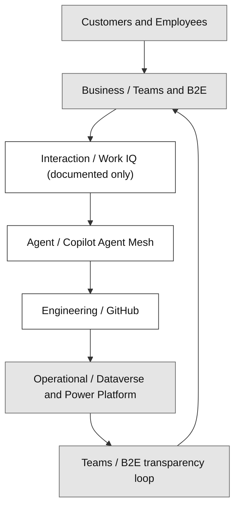
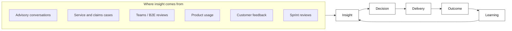
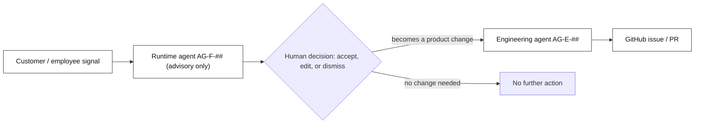
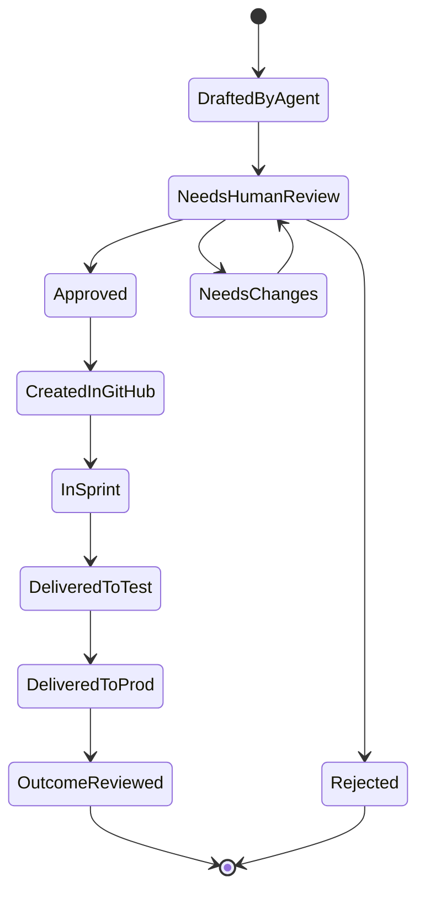

# Design Pattern 00 Expansion Implementation Plan

> **For agentic workers:** REQUIRED SUB-SKILL: Use superpowers:subagent-driven-development (recommended) or superpowers:executing-plans to implement this plan task-by-task. Steps use checkbox (`- [ ]`) syntax for tracking.

**Goal:** Expand `docs/design/00-frontier-firm-operating-model-for-insurance.md`
(Design Pattern 00) from a short 4-section method doc into a full 9-section
narrative — one condensed, insurance-reworded, diagram-illustrated subsection
per idea doc (`docs/ideas/frontier-operating-system/00`–`05`), plus the
existing method and worked-example sections — per the approved design spec
(`docs/superpowers/specs/2026-08-17-frontier-operating-model-pattern-00-expansion-design.md`),
with zero broken cross-references and zero content forked from
`docs/FRONTIER-OPERATING-MODEL.md`.

**Architecture:** Documentation-only change to one existing file, executed as
a sequence of anchored text replacements ordered so the document stays in a
valid, non-duplicate-heading state after every task (later sections are
renumbered before earlier sections are touched, working from the end of the
file backward, then new sections are inserted front-to-back). "Tests" are
structural checks — PowerShell `Select-String` for heading sequence and
cross-reference existence, plus manual Mermaid-render verification —
consistent with this repo's existing doc-change convention (see
`docs/superpowers/plans/2026-08-16-frontier-operating-model.md`).

**Tech Stack:** Markdown + Mermaid (`flowchart`, `stateDiagram-v2`) only.
Validation via PowerShell `Select-String` / `Test-Path` / `git diff` — no
npm/pip packages, no repo build system involved.

---

## Reference: full target heading sequence (after Task 6)

```text
# Design Pattern 00: Frontier Firm operating model for insurance
## 1. Why a Frontier Firm model for an insurer
## 2. Vision and the operating loop
## 3. What the operating model must deliver
## 4. The five control planes and how they connect
## 5. The agent roster behind the planes
## 6. HITL governance and data sensitivity
## 7. Roadmap, phased and status-tagged
## 8. A four-step establishment method
## 9. Contoso Insurance as the worked example
## Validate this live
## Decision
```

Every task below leaves the file with no duplicate heading numbers, even
though earlier tasks leave temporary gaps (e.g. after Task 3 the file has
headings 1, 4, 8, 9 — missing 2/3/5/6/7, but nothing duplicated). Do the
tasks in order.

---

### Task 1: Renumber the worked-example section (§4 → §9) and extend its bullets

**Files:**
- Modify: `docs/design/00-frontier-firm-operating-model-for-insurance.md`

- [ ] **Step 1: Replace the worked-example section**

Find this exact block (currently the last numbered section in the file):

````text
## 4. Contoso Insurance as the worked example

This repo is the worked example of the method above, applied to the Contoso Insurance Advisory Cockpit use case:

- Control-plane inventory: `docs/FRONTIER-OPERATING-MODEL.md` section 5.
- Role mapping onto this repo's named agents: `docs/FRONTIER-OPERATING-MODEL.md` section 6.
- HITL/governance guardrails: `docs/FRONTIER-OPERATING-MODEL.md` section 7.
- Work IQ <-> GitHub pattern (documented only): `docs/FRONTIER-OPERATING-MODEL.md` section 8.
- Roadmap phasing: `docs/FRONTIER-OPERATING-MODEL.md` section 9.
- The concrete artefacts this method produced: the 11 ADR-linked pattern docs in this same folder - see `docs/design/README.md` for the full index.
````

Replace it with:

````text
## 9. Contoso Insurance as the worked example

This repo is the worked example of the method above, applied to the Contoso Insurance Advisory Cockpit use case:

- Vision and operating loop: section 2 above.
- What the model must deliver: section 3 above.
- Control-plane inventory: section 4 above, and `docs/FRONTIER-OPERATING-MODEL.md` section 5 for full detail.
- Agent roster and role mapping: section 5 above, and `docs/FRONTIER-OPERATING-MODEL.md` section 6 for full detail.
- HITL/governance guardrails: section 6 above, and `docs/FRONTIER-OPERATING-MODEL.md` section 7 for full detail.
- Work IQ <-> GitHub pattern (documented only, not covered in this doc): `docs/FRONTIER-OPERATING-MODEL.md` section 8.
- Roadmap phasing: section 7 above, and `docs/FRONTIER-OPERATING-MODEL.md` section 9 for full detail.
- The concrete artefacts this method produced: the 11 ADR-linked pattern docs in this same folder - see `docs/design/README.md` for the full index.
````

- [ ] **Step 2: Verify**

Run:
```powershell
Select-String -Path "docs/design/00-frontier-firm-operating-model-for-insurance.md" -Pattern "^## "
```
Expected: headings in this order — `## 1. Why a Frontier Firm model for an insurer`, `## 2. The five control planes, generically stated`, `## 3. A four-step establishment method`, `## 9. Contoso Insurance as the worked example`, `## Validate this live`, `## Decision`.

- [ ] **Step 3: Commit**

```bash
git add docs/design/00-frontier-firm-operating-model-for-insurance.md
git commit -m "docs(design-pattern-00): renumber worked-example section to 9 and extend its bullets"
```

---

### Task 2: Renumber the establishment-method section (§3 → §8)

**Files:**
- Modify: `docs/design/00-frontier-firm-operating-model-for-insurance.md`

- [ ] **Step 1: Replace the heading**

Find:
```text
## 3. A four-step establishment method

Any insurer's EA/IT team can follow this method to stand up their own version:
```

Replace with:
```text
## 8. A four-step establishment method

Any insurer's EA/IT team can follow this method to stand up their own version:
```

Only the heading number changes — the four numbered items beneath it are unchanged.

- [ ] **Step 2: Verify**

```powershell
Select-String -Path "docs/design/00-frontier-firm-operating-model-for-insurance.md" -Pattern "^## "
```
Expected: `## 1. ...`, `## 2. The five control planes, generically stated`, `## 8. A four-step establishment method`, `## 9. Contoso Insurance as the worked example`, `## Validate this live`, `## Decision`.

- [ ] **Step 3: Commit**

```bash
git add docs/design/00-frontier-firm-operating-model-for-insurance.md
git commit -m "docs(design-pattern-00): renumber establishment-method section to 8"
```

---

### Task 3: Renumber the control-planes section (§2 → §4) and add its diagram

**Files:**
- Modify: `docs/design/00-frontier-firm-operating-model-for-insurance.md`

- [ ] **Step 1: Replace the control-planes section**

Find this exact block:

````text
## 2. The five control planes, generically stated

| Control plane | Generic insurance meaning |
| --- | --- |
| Business / Teams | The coordination layer between customer-facing staff and the customers, brokers, partners, and internal colleagues they serve through the insurer's everyday workplace surfaces. |
| Interaction / Work IQ | The human-agent interaction surface layered over collaboration tools, where people ask for help, inspect context, delegate tasks, and stay in control of agent work. |
| Agent / Copilot Agent Mesh | The named roster of task-focused runtime and engineering agents, each with a clear purpose, owner, maturity, and handoff boundary. |
| Engineering / GitHub | The delivery toolchain that versions the agent mesh itself: prompts, ADRs, issues, pull requests, CI evidence, and the engineering agents that keep the mesh reviewable and releasable. |
| Operational / Dataverse + Power Platform | The operational system-of-record layer where customer-relationship processes, governed actions, audit, events, security, and CRM workflow live. |

> **In this showcase:** Business/Teams, Agent/Copilot Agent Mesh, Engineering/GitHub, and Operational/Dataverse are **built**. Interaction/Work IQ is **documented only** - see `docs/FRONTIER-OPERATING-MODEL.md` section 8 for why, and how a real engagement would wire it up.

## 8. A four-step establishment method
````

Replace it with:

`````text
## 4. The five control planes and how they connect

| Control plane | Generic insurance meaning |
| --- | --- |
| Business / Teams | The coordination layer between customer-facing staff and the customers, brokers, partners, and internal colleagues they serve through the insurer's everyday workplace surfaces. |
| Interaction / Work IQ | The human-agent interaction surface layered over collaboration tools, where people ask for help, inspect context, delegate tasks, and stay in control of agent work. |
| Agent / Copilot Agent Mesh | The named roster of task-focused runtime and engineering agents, each with a clear purpose, owner, maturity, and handoff boundary. |
| Engineering / GitHub | The delivery toolchain that versions the agent mesh itself: prompts, ADRs, issues, pull requests, CI evidence, and the engineering agents that keep the mesh reviewable and releasable. |
| Operational / Dataverse + Power Platform | The operational system-of-record layer where customer-relationship processes, governed actions, audit, events, security, and CRM workflow live. |

> **In this showcase:** Business/Teams, Agent/Copilot Agent Mesh, Engineering/GitHub, and Operational/Dataverse are **built**. Interaction/Work IQ is **documented only** - see `docs/FRONTIER-OPERATING-MODEL.md` section 8 for why, and how a real engagement would wire it up.

These five planes are not independent — each Insight/Decision/Delivery/Outcome cycle crosses all five in sequence:



*Legend: white = Microsoft platform capability, red = a Contoso Insurance-owned system, grey = shared/jointly-owned — the same convention used in `docs/FRONTIER-OPERATING-MODEL.md`'s Solution Context diagrams.*

**Full detail:** `docs/FRONTIER-OPERATING-MODEL.md` section 5 (adapted table with Built/Documented-only status per plane) and its Solution Context section for the full Contoso-specific architecture.

## 8. A four-step establishment method
`````

- [ ] **Step 2: Verify**

```powershell
Select-String -Path "docs/design/00-frontier-firm-operating-model-for-insurance.md" -Pattern "^## "
Select-String -Path "docs/design/00-frontier-firm-operating-model-for-insurance.md" -Pattern '```mermaid'
```
Expected headings: `## 1. ...`, `## 4. The five control planes and how they connect`, `## 8. ...`, `## 9. ...`, `## Validate this live`, `## Decision`. Expected mermaid count: 1 match.

- [ ] **Step 3: Commit**

```bash
git add docs/design/00-frontier-firm-operating-model-for-insurance.md
git commit -m "docs(design-pattern-00): renumber control-planes section to 4 and add its diagram"
```

---

### Task 4: Tighten §1 and insert the new vision (§2) and requirements (§3) sections

**Files:**
- Modify: `docs/design/00-frontier-firm-operating-model-for-insurance.md`

- [ ] **Step 1: Replace section 1 through the start of section 4**

Find this exact block:

```text
## 1. Why a Frontier Firm model for an insurer

Microsoft's 2025/2026 Work Trend Index frames the Frontier Firm around agents, human agency, and the opportunity for every organization, which makes the first insurance question an operating-model question, not an integration question. Before choosing any single API, UI, or data pattern, an insurer has to decide how customer-facing employees, copilots, approval points, engineering delivery, and the system of record will work together, because that is how a Frontier Company actually builds and operates a solution with Microsoft's current agentic stack. If that division of labor is unclear, every downstream pattern - Work IQ, GitHub, Dataverse, Copilot Studio, or core-system integration - will be implemented without a shared accountability model.

## 4. The five control planes and how they connect
```

Replace it with:

`````text
## 1. Why a Frontier Firm model for an insurer

Microsoft's 2025/2026 Work Trend Index frames the Frontier Firm around agents, human agency, and the opportunity for every organization. That makes the first insurance question an operating-model question, not an integration question: before choosing any single API, UI, or data pattern, an insurer must decide how customer-facing employees, copilots, approval points, engineering delivery, and the system of record work together. That is how a Frontier Company actually builds and operates a solution with Microsoft's current agentic stack. Without that shared accountability model, every downstream pattern - Work IQ, GitHub, Dataverse, Copilot Studio, or core-system integration - gets implemented in isolation.

Sections 2-7 below set out that operating model end to end: vision, requirements, architecture, agent roster, governance, and roadmap. Sections 8-9 then show how to establish it yourself and how Contoso Insurance did.

## 2. Vision and the operating loop

Contoso Insurance's Frontier Firm vision, adapted from the source idea doc's north star:

> Every relevant interaction with a customer, employee, or system automatically strengthens Contoso Insurance's advice, product, and processes.

Stated technically:

> Contoso Insurance becomes a Human-led, Agent-operated advisory practice, in which the Business/Teams and B2E layer steers human-agent interaction, GitHub orchestrates the digital delivery, and Dataverse reflects the operational reality.

This vision runs as a loop, not a one-off project:



Six principles keep the loop honest:

| Principle | What it means for Contoso Insurance |
| --- | --- |
| Human-led | Advisors and named humans set direction, standards, priorities, and approvals ([ADR-0014](../adr/ADR-0014-agents-advisory-by-design.md)). |
| Agent-operated | Runtime and engineering agents handle analysis, structuring, proposals, drafts, and recurring operational work. |
| HITL-controlled | Critical steps stay under human control, with no exceptions ([ADR-0014](../adr/ADR-0014-agents-advisory-by-design.md)). |
| GitHub-driven | Every implementation-relevant requirement becomes traceable, versioned, and sprint-ready (`AGENTS.md` section 3). |
| Dataverse-backed | Operational truth and outcome measurement live in Dataverse and Power Platform ([ADR-0008](../adr/ADR-0008-thin-crm-over-systems-of-record.md)). |
| Teams/B2E-visible | Delivery status stays visible to employees through Teams and the B2E layer ([ADR-0033](../adr/ADR-0033-crm-ux-placement-in-b2e-landscape.md)). |

**Full detail:** `docs/FRONTIER-OPERATING-MODEL.md` section 4 maps each loop stage onto this repo's existing traceability chain, mechanism by mechanism.

## 3. What the operating model must deliver

Relevant insight about Contoso Insurance's customers, advisors, and processes is generated constantly - in Teams/B2E discussions, advisory notes, meeting transcripts, GitHub issues, sprint reviews, product usage, customer feedback, and operational Dataverse data. Without a standardized loop, that insight risks going uncaptured, unprioritized, never delivered, or never checked for impact after it ships.

**Who this model is for**, mapped to this repo's real personas (`docs/PERSONAS-JOURNEY.md`) rather than generic role labels:

| Audience | Personas | Role in the loop |
| --- | --- | --- |
| Primary - practitioners | P-01 Advisor (GA), P-02 General Agent lead, P-03 Assistance agent, P-04 Marketer, P-05 Broker manager | Generate Insight, consume Decision/Outcome status |
| Secondary - build and govern | P-06 IT/Architect, P-07 Business owner/Data steward, plus the engineering agents (`AG-E-01` Product Owner and peers) | Turn Insight into Decision and Delivery, own Outcome measurement |

**What this model is explicitly not**, for its first iteration:

- No fully autonomous prioritization without human sign-off.
- No autonomous PROD deployment without review.
- No unreviewed processing of sensitive customer data - health, financial exposure, or claims detail - by an arbitrary agent.
- No wholesale replacement of existing advisory or engineering processes.
- No autonomously issued binding recommendation, quote, or policy change - agents recommend, a named human decides, with no exception (`AGENTS.md`).

## 4. The five control planes and how they connect
`````

- [ ] **Step 2: Verify**

```powershell
Select-String -Path "docs/design/00-frontier-firm-operating-model-for-insurance.md" -Pattern "^## "
Select-String -Path "docs/design/00-frontier-firm-operating-model-for-insurance.md" -Pattern '```mermaid'
```
Expected headings: `## 1. ...`, `## 2. Vision and the operating loop`, `## 3. What the operating model must deliver`, `## 4. The five control planes and how they connect`, `## 8. ...`, `## 9. ...`, `## Validate this live`, `## Decision`. Expected mermaid count: 2.

- [ ] **Step 3: Commit**

```bash
git add docs/design/00-frontier-firm-operating-model-for-insurance.md
git commit -m "docs(design-pattern-00): tighten section 1 wording, add vision and requirements sections"
```

---

### Task 5: Insert the agent roster (§5) and HITL governance (§6) sections

**Files:**
- Modify: `docs/design/00-frontier-firm-operating-model-for-insurance.md`

- [ ] **Step 1: Replace the end of section 4 through the start of section 8**

Find this exact block:

```text
**Full detail:** `docs/FRONTIER-OPERATING-MODEL.md` section 5 (adapted table with Built/Documented-only status per plane) and its Solution Context section for the full Contoso-specific architecture.

## 8. A four-step establishment method
```

Replace it with:

`````text
**Full detail:** `docs/FRONTIER-OPERATING-MODEL.md` section 5 (adapted table with Built/Documented-only status per plane) and its Solution Context section for the full Contoso-specific architecture.

## 5. The agent roster behind the planes

Every plane above runs on named agents, and every agent is advisory: it recommends, a human decides, with no exception ([ADR-0014](../adr/ADR-0014-agents-advisory-by-design.md), `AGENTS.md`).

| Idea-doc role | Existing agent(s) | Notes |
| --- | --- | --- |
| Voice of Customer | `AG-E-01` Product Owner (accountable intake), informed by `AG-F-04` Conversation Intelligence & Transcript Agent | Runtime signal feeds engineering backlog framing |
| Product Discovery | `AG-E-01` Product Owner | - |
| Architecture | `AG-E-03` Enterprise Architect, with `AG-E-08` Dataverse Modeler and `AG-E-09` Integration Engineer as specialists | Matches `AGENTS.md`'s non-delegable "Architecture approval" authority |
| Delivery | `AG-E-02` Developer, with `AG-E-08` Dataverse Modeler and `AG-E-11` UX Designer | - |
| Release | `AG-E-04` SecDevOps | Owns pipelines/environments per ADR-0039 |
| Outcome | `AG-E-07` Data Engineer & Scientist (the Frontier Firm loop is explicit in their charter), fed by `AG-F-##` runtime telemetry | - |
| Governance | `AG-E-06` Responsible-AI & Compliance Officer | Matches `AGENTS.md`'s non-delegable "RAI/compliance review" authority; ties to Purview (ADR-0038) |
| Quality | Distributed - `AG-E-02` (tests), `AG-E-04` (pipeline gates), `AG-E-06` (RAI evals) | Shared by design, not force-fit to one owner |
| *(cross-cutting)* | `AG-E-12` Frontier Firm Guide | Owns and maintains this operating model documentation itself |

A signal only becomes a product change once a human has said so:



**Full detail:** `docs/FRONTIER-OPERATING-MODEL.md` section 6 for the complete role-mapping rationale, `AGENTS.md` for the full agent registry and its non-delegable-authority rules.

## 6. HITL governance and data sensitivity

Five principles govern every agent in the mesh:

1. Agents produce proposals, not final decisions, in critical processes.
2. Sensitive customer data is minimized or redacted before it reaches GitHub.
3. Every relevant publication or handoff has a named owner.
4. Every agent action is traceable.
5. Automation may increase transparency; it never replaces accountability.

Four data classes decide how a signal may be handled:

| Class | Examples | Processing rule |
| --- | --- | --- |
| Public / non-critical | General feature requests, technical release notes, non-personal process notes | Agentic processing allowed; GitHub intake after standard review |
| Internal business data | Internal priorities, roadmap topics, process issues, employee feedback | Authorized teams/GitHub areas only; no auto-publish without review |
| Personal customer data (PII) | Name, contact details, advisory notes with personal reference | Redaction before GitHub, purpose limitation, human review |
| Sensitive data | Health data (life/health lines), financial exposure, claims specifics | Highest protection class; no unreviewed GitHub handoff - only abstracted requirements or anonymized patterns |

**Redaction in practice** - a raw signal never reaches GitHub as-is:

- Raw: *"Customer Jane Doe mentioned during her claim follow-up that the online claim-status tracker is confusing."*
- GitHub-safe: *"A customer mentioned during a claim follow-up that the online claim-status tracker is confusing."*
- As a requirement: *"As a customer, I want to track my claim status with minimal steps, so that I don't need to call the service desk for updates."*

Every proposal moves through the same approval states, end to end:



**Full detail:** `docs/FRONTIER-OPERATING-MODEL.md` section 7, [ADR-0014](../adr/ADR-0014-agents-advisory-by-design.md) (agents advisory by design), [ADR-0038](../adr/ADR-0038-purview-power-platform-dynamics365-compliance.md) (Purview compliance).

## 8. A four-step establishment method
`````

- [ ] **Step 2: Verify**

```powershell
Select-String -Path "docs/design/00-frontier-firm-operating-model-for-insurance.md" -Pattern "^## "
Select-String -Path "docs/design/00-frontier-firm-operating-model-for-insurance.md" -Pattern '```mermaid|```stateDiagram-v2'
Select-String -Path "docs/design/00-frontier-firm-operating-model-for-insurance.md" -Pattern "\bEND\b"
```
Expected headings now include `## 5. The agent roster behind the planes` and `## 6. HITL governance and data sensitivity` between `## 4. ...` and `## 8. ...`. Expected diagram count: 4 (2 flowchart + 1 flowchart + 1 stateDiagram, cumulative with Tasks 3-4). Expected `\bEND\b` matches: none (the reserved Mermaid word `end` must not appear as a bare node id — this repo's diagram uses `DONE`, not `END`).

- [ ] **Step 3: Commit**

```bash
git add docs/design/00-frontier-firm-operating-model-for-insurance.md
git commit -m "docs(design-pattern-00): add agent roster and HITL governance sections"
```

---

### Task 6: Insert the roadmap section (§7)

**Files:**
- Modify: `docs/design/00-frontier-firm-operating-model-for-insurance.md`

- [ ] **Step 1: Replace the end of section 6 through the start of section 8**

Find this exact block:

```text
**Full detail:** `docs/FRONTIER-OPERATING-MODEL.md` section 7, [ADR-0014](../adr/ADR-0014-agents-advisory-by-design.md) (agents advisory by design), [ADR-0038](../adr/ADR-0038-purview-power-platform-dynamics365-compliance.md) (Purview compliance).

## 8. A four-step establishment method
```

Replace it with:

`````text
**Full detail:** `docs/FRONTIER-OPERATING-MODEL.md` section 7, [ADR-0014](../adr/ADR-0014-agents-advisory-by-design.md) (agents advisory by design), [ADR-0038](../adr/ADR-0038-purview-power-platform-dynamics365-compliance.md) (Purview compliance).

## 7. Roadmap, phased and status-tagged

The same six phases `docs/FRONTIER-OPERATING-MODEL.md` section 9 defines, tagged so nobody mistakes narrative for delivered capability:

```mermaid
flowchart LR
    classDef built fill:#d1fae5,stroke:#065f46,stroke-width:1px,color:#111111
    classDef demoed fill:#fef3c7,stroke:#92400e,stroke-width:1px,color:#111111
    classDef docOnly fill:#e5e5e5,stroke:#666666,stroke-width:1px,stroke-dasharray: 4 2,color:#111111

    P0["Phase 0: Foundation"]:::built --> P1["Phase 1: Teams/B2E to GitHub transparency"]:::demoed
    P1 --> P2["Phase 2: Work IQ agent intake"]:::docOnly
    P2 --> P3["Phase 3: Sprint review to GitHub"]:::built
    P3 --> P4["Phase 4: Release to outcome loop"]:::demoed
    P4 --> P5["Phase 5: Agent mesh scaling"]:::demoed
```



*Legend: green = Built, amber = Demoed via docs, grey dashed = Documented-only - a deliberately different palette from the ownership colours in section 4, because this diagram encodes delivery status, not who owns each plane.*

**Full detail:** `docs/FRONTIER-OPERATING-MODEL.md` section 9 for the full description of each phase's deliverables.

## 8. A four-step establishment method
`````

- [ ] **Step 2: Verify**

```powershell
Select-String -Path "docs/design/00-frontier-firm-operating-model-for-insurance.md" -Pattern "^## "
```
Expected: exactly `## 1.` through `## 9.` in sequence (1,2,3,4,5,6,7,8,9), then `## Validate this live`, then `## Decision` - matching the reference sequence at the top of this plan.

- [ ] **Step 3: Commit**

```bash
git add docs/design/00-frontier-firm-operating-model-for-insurance.md
git commit -m "docs(design-pattern-00): add roadmap section"
```

---

### Task 7: Update the "Validate this live" walk order

**Files:**
- Modify: `docs/design/00-frontier-firm-operating-model-for-insurance.md`

- [ ] **Step 1: Replace the closing walk-through paragraph**

Find:
```text
## Validate this live

During the demo, open `docs/FRONTIER-OPERATING-MODEL.md` and walk section by section (section 5 control planes -> section 6 role mapping -> section 7 governance -> section 8 Work IQ pattern -> section 9 roadmap) to show this is a real, repo-grounded method, not a slide-only framework. Then open `docs/superpowers/sprints/` to show the requirement -> ADR -> design-pattern -> deployed-evidence loop this repo actually runs.
```

Replace with:
```text
## Validate this live

During the demo, walk this document section by section first (section 2 vision -> section 3 requirements -> section 4 control planes -> section 5 agents -> section 6 governance -> section 7 roadmap -> section 8 method -> section 9 worked example) to deliver the full mental model in one pass. Then open `docs/FRONTIER-OPERATING-MODEL.md` for full depth on any section, walking it the same way (section 5 control planes -> section 6 role mapping -> section 7 governance -> section 8 Work IQ pattern -> section 9 roadmap) to show this is a real, repo-grounded method, not a slide-only framework. Then open `docs/superpowers/sprints/` to show the requirement -> ADR -> design-pattern -> deployed-evidence loop this repo actually runs.
```

`## Decision` immediately below is unchanged - do not touch it.

- [ ] **Step 2: Verify**

```powershell
Select-String -Path "docs/design/00-frontier-firm-operating-model-for-insurance.md" -Pattern "Validate this live|## Decision"
```
Expected: both headings present, in that order, each exactly once.

- [ ] **Step 3: Commit**

```bash
git add docs/design/00-frontier-firm-operating-model-for-insurance.md
git commit -m "docs(design-pattern-00): update validate-this-live walk order"
```

---

### Task 8: Final verification pass

**Files:**
- Read-only checks against: `docs/design/00-frontier-firm-operating-model-for-insurance.md`, `docs/design/README.md`, `docs/FRONTIER-OPERATING-MODEL.md`, `docs/adr/`, `AGENTS.md`, `docs/PERSONAS-JOURNEY.md`

- [ ] **Step 1: Confirm the final heading sequence is complete and sequential**

```powershell
Select-String -Path "docs/design/00-frontier-firm-operating-model-for-insurance.md" -Pattern "^## "
```
Expected: `## 1.` through `## 9.` with no gaps and no duplicates, followed by `## Validate this live` and `## Decision`.

- [ ] **Step 2: Confirm every Mermaid fence opens and closes (even backtick-fence count)**

```powershell
(Select-String -Path "docs/design/00-frontier-firm-operating-model-for-insurance.md" -Pattern '^```' -AllMatches).Matches.Count
```
Expected: an even number (one open + one close per diagram; 5 diagrams total across sections 2, 4, 5, 6, 7 → 10).

- [ ] **Step 3: Confirm the reserved Mermaid word `end` is never used as a bare node id**

```powershell
Select-String -Path "docs/design/00-frontier-firm-operating-model-for-insurance.md" -Pattern "\bEND\b|-->\s*end\b"
```
Expected: no matches.

- [ ] **Step 4: Confirm every ADR cross-reference resolves to a real file**

```powershell
$adrs = @("ADR-0008-thin-crm-over-systems-of-record.md","ADR-0014-agents-advisory-by-design.md","ADR-0033-crm-ux-placement-in-b2e-landscape.md","ADR-0038-purview-power-platform-dynamics365-compliance.md")
foreach ($a in $adrs) { Test-Path "docs/adr/$a" }
```
Expected: `True` for all four.

- [ ] **Step 5: Confirm `AGENTS.md` and `docs/PERSONAS-JOURNEY.md` exist**

```powershell
Test-Path "AGENTS.md"
Test-Path "docs/PERSONAS-JOURNEY.md"
```
Expected: `True`, `True`.

- [ ] **Step 6: Check `docs/design/README.md`'s index description still fits**

```powershell
Select-String -Path "docs/design/README.md" -Pattern "Frontier Firm operating model for insurance"
```
Expected: one match, row still reads `| 00 | [Frontier Firm operating model for insurance](./00-frontier-firm-operating-model-for-insurance.md) | \`docs/FRONTIER-OPERATING-MODEL.md\` |`. No edit needed — the one-line description still accurately describes the expanded doc's purpose (it is still "the Frontier Firm operating model for insurance," now told in full rather than in outline).

- [ ] **Step 7: Review the full diff for the whole change set**

```bash
git diff main -- docs/design/00-frontier-firm-operating-model-for-insurance.md | Out-String
```
Read it end to end. Confirm: no leftover old heading numbers, no duplicated section, no accidental deletion of the unchanged `## Decision` section, wording reads naturally across old/new section boundaries.

- [ ] **Step 8: Fix anything found, then do a final commit only if Steps 1-7 required changes**

```bash
git add docs/design/00-frontier-firm-operating-model-for-insurance.md
git commit -m "docs(design-pattern-00): fix issues found in final verification pass"
```

If Steps 1-7 found no issues, skip this commit — Task 6 and Task 7's commits are already the final state.
