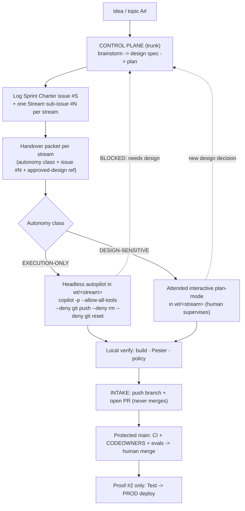

# Delegated Sprint Operating Model — Copilot CLI Control Plane

| Field | Value |
| --- | --- |
| **Status** | Approved design — ready for implementation planning |
| **Date** | 2026-08-11 |
| **Decision mode** | Reversible process hypothesis, proven by execution |
| **Working hypothesis** | A sprint is designed and planned on the trunk (control plane), decomposed into parallel worktree streams delegated to local GitHub Copilot CLI sessions, and re-integrated through the existing PR-to-protected-`main` gates — so the showcase gains parallel delivery speed without weakening any governance guardrail. |
| **Confidence** | High for the process and the Copilot CLI mechanics (verified against official docs); medium for headless-autopilot ergonomics until the first smoke stream runs |
| **Maturity** | Pattern approved; proven by proof #1 (the pattern building itself), then exercised by proof #2 (Insurance Foundation to Test/PROD) |
| **Licence** | Own build — process, PowerShell scripts, Markdown contracts. GitHub Copilot CLI entitlement required per operator. |
| **Upgrade impact** | Low for the platform; Medium for the way of working — adds a documented control-plane / delegated-plane split and an orchestration toolchain, all reversible and additive |
| **Related** | [ADR-0001](../../adr/ADR-0001-adopt-agent-driven-copilot-governance.md) · [ADR-0004](../../adr/ADR-0004-ci-plane-app-registrations-and-github-environments.md) · [ADR-0014](../../adr/ADR-0014-agents-advisory-by-design.md) · [ADR-0017](../../adr/ADR-0017-alm-everything-through-the-pipeline.md) · new **ADR-0023** (to be created during implementation) · [SUPERPOWERS_CONTRACT.md](../../../SUPERPOWERS_CONTRACT.md) · [COPILOT-BUILD-GUIDE.md](../../COPILOT-BUILD-GUIDE.md) · [Insurance Foundation spec](./2026-08-08-insurance-foundation-design.md) |
| **Frameworks** | CAF Govern, Secure, Manage · WAF Operational Excellence, Security, Reliability · Zero Trust (verify explicitly, least privilege, assume breach) · Responsible AI accountability & transparency |

---

## 1. Outcome

The CRM Showcase needs one **standard, repeatable sprint process** that is
itself part of the demonstration: *"here is how humans and agents run a sprint
as a team — brainstorm and design on the trunk, delegate parallel build streams
to local Copilot CLI sessions, and merge back through the same governance gates
every other change passes."*

The process must:

- keep **design decisions human-owned** — the Autopilot preview may accelerate
  *execution*, but a proposed design is **never** autopilot-approved; a human
  reviews options and the agent raises clarification questions in the chat;
- make **parallel work-streams safe** — each stream is isolated in its own git
  worktree and cannot self-integrate to `main`;
- keep **full traceability** — every sprint and every stream is a GitHub issue
  with a number, carried through the packet, branch, PR and status board;
- reuse, not replace, the existing ALM gates
  ([ADR-0017](../../adr/ADR-0017-alm-everything-through-the-pipeline.md),
  [ADR-0004](../../adr/ADR-0004-ci-plane-app-registrations-and-github-environments.md)).

## 2. The two proofs

This work is delivered as two sequenced proofs.

1. **Proof #1 — establish and build the delegation pattern (this sprint).**
   The deliverable is the Sprint Operating Model, the handover and intake
   contracts, and the Copilot CLI dispatch toolchain. Its end-to-end
   validation is the **mechanism running once**: a smoke stream is created in a
   worktree, dispatched through the real wrapper, produces a commit, opens a
   PR, is merged to `main`, and the worktree is retired — with evidence
   captured. Proof #1 ships documentation and scripts, so it has **no Power
   Platform Test/PROD deploy**.
2. **Proof #2 — exercise the pattern on a real feature (next sprint).**
   Carry the existing
   [Insurance Foundation design](./2026-08-08-insurance-foundation-design.md)
   through this pattern to real Power Platform **Test → PROD** validation using
   the existing GitHub Actions / Terraform pipeline.

## 3. Inherited non-negotiables

This process does not relitigate any guardrail. It inherits, unchanged:

- **Agents recommend; humans decide**
  ([ADR-0014](../../adr/ADR-0014-agents-advisory-by-design.md)) — extended here
  to the build-time plane: a delegated stream proposes and prepares; a human
  reviews design and merges.
- **ALM everything through the pipeline**
  ([ADR-0017](../../adr/ADR-0017-alm-everything-through-the-pipeline.md)) —
  intake is a PR to protected `main`; the wrapper never merges.
- **Traceability and evidence-in-PR**
  ([SUPERPOWERS_CONTRACT.md](../../../SUPERPOWERS_CONTRACT.md) §1).
- **No secrets, no real customer data, tenant isolation** — a worktree Copilot
  CLI session inherits these automatically because Copilot CLI loads
  `.github/copilot-instructions.md`, `.github/instructions/**`, `AGENTS.md`,
  and repo-level `.github/agents/*.agent.md`.

## 4. Two planes, one trunk



- **Control plane = the trunk workflow.** "On `main`" means the trunk line,
  realised through the existing short-lived-branch → PR → protected-`main`
  convention — **not** direct pushes to protected `main`. This Copilot session,
  or the operator at the keyboard, is the control plane.
- **Delegated plane = the worktree streams** under
  `C:\Users\urruegg\source\urruegg\wt\`, one git worktree per parallel stream,
  each on its own `feat/sprint-NNN-<stream>` branch, each driven by a local
  Copilot CLI session.

## 5. Repository layout (new artifacts)

```
docs/superpowers/
  SPRINT-OPERATING-MODEL.md              # the standard process (centrepiece)
  contracts/
    HANDOVER-CONTRACT.md                 # packet schema + autonomy classes
    INTAKE-CONTRACT.md                   # merge-back criteria & gates
    handover-packet.template.md          # fill-in template, one per stream
  sprints/
    sprint-001-delegated-pattern/
      sprint.md                          # charter (mirrors GitHub issue #S)
      streams/                           # one packet per stream
      STATUS.md                          # live status board with evidence links
scripts/orchestration/
  New-SprintWorktree.ps1                 # create wt/<sprint>-<stream> + scaffold packet from issue #
  Invoke-StreamDelegation.ps1            # dispatch wrapper (reads class -> launches copilot)
  Complete-StreamIntake.ps1              # verify + push branch + open PR (no merge)
  Get-SprintStatus.ps1                   # worktree + branch + PR status board
  Remove-SprintWorktree.ps1             # retire worktree (guards uncommitted work)
  tests/                                 # Pester tests (matches scripts/solution convention)
.github/ISSUE_TEMPLATE/
  sprint-charter.md                      # sprint-level issue
  stream-handover.md                     # per-stream issue
```

The stray placeholder folders `docs/sprints/` and `docs/plans/` are pointed at
`docs/superpowers/` so the workflow has a single home (the real specs and plans
already live under `docs/superpowers/`).

## 6. Handover contract (the packet)

A stream is dispatched **only** with a complete packet. The packet is the
executable form of "design is done, execution may begin".

| Field | Purpose |
| --- | --- |
| `Sprint ID` / `Stream ID` | e.g. `sprint-001 / stream-A` |
| `GitHub issue` | `#N` — mandatory, the traceability anchor |
| `Autonomy class` | `EXECUTION-ONLY` or `DESIGN-SENSITIVE` |
| `Approved design ref` | ADR + spec link; the design is already human-approved on the trunk — this is the autopilot gate |
| `Goal / Definition of Done` | a testable outcome |
| `Allowed scope (paths)` | the files the stream may touch |
| `Guardrails` | inherited SUPERPOWERS_CONTRACT §1 + explicit deny list |
| `Verification commands` | build / test / policy the stream must pass before intake |
| `Branch` | `feat/sprint-NNN-<stream>` |
| `Escalation rule` | "If a *new* design decision is needed → STOP, write `BLOCKED: needs design`, surface the question to the control-plane chat. Never self-approve." |

**Autonomy classes.**

- `EXECUTION-ONLY` — the design is fully settled; the stream only builds,
  tests and commits within `Allowed scope`. Eligible for headless autopilot.
- `DESIGN-SENSITIVE` — the work may surface design choices; it **may never** be
  launched headless. The wrapper refuses and prints an attended launch instead.

## 7. Intake contract (back to `main`)

A stream returns to the trunk only when:

1. the packet's `Verification commands` pass locally, with evidence appended to
   `STATUS.md`;
2. the branch is pushed and a PR is opened using the existing repo PR template
   (story + ADR + evidence checklist);
3. **the wrapper never merges and never pushes to `main`** — merge is a human
   act, gated by branch protection, `CODEOWNERS`, CI and evals (the current
   mechanism, unchanged);
4. after merge, the worktree is retired with `Remove-SprintWorktree.ps1`, which
   refuses to delete a worktree that still holds uncommitted or unpushed work.

## 8. Dispatch wrapper (concrete mechanics)

`Invoke-StreamDelegation.ps1` reads the packet's autonomy class and launches
the verified Copilot CLI surface:

- **`EXECUTION-ONLY` → headless autopilot:**

  ```text
  copilot -p "<packet contents>" --allow-all-tools `
    --deny-tool='shell(git push)' --deny-tool='shell(rm)' `
    --deny-tool='shell(git reset)' --add-dir <wt/stream>
  ```

  Autopilot builds, tests and commits, but `--deny-tool` (which takes
  precedence over `--allow-all-tools`) blocks `git push`, `rm` and
  `git reset`, so the stream **cannot integrate itself or destroy history**.
- **`DESIGN-SENSITIVE` → attended interactive:** the wrapper does not auto-run.
  It prints the packet and the interactive launch command (`copilot`,
  plan-mode first) for a supervised session, preserving the clarification loop.
- **Guardrail inheritance** is automatic (Copilot CLI loads the repo custom
  instructions, `AGENTS.md`, and `.github/agents/*`). A stream can target a
  builder agent with `--agent=<AG-E-##>`.
- **Optional hardening** (documented, not required for proof #1): run
  untrusted execution under `/sandbox enable` or `copilot --cloud`.

## 9. Autopilot guardrail — enforced, not promised

The rule "any proposed design is not autopilot-approved; a human always reviews
and the agent raises clarification questions in the chat" is enforced at four
points:

1. **Design happens on the trunk, human-reviewed,** before any packet exists —
   the packet requires an `Approved design ref`.
2. **`DESIGN-SENSITIVE` streams cannot be launched headless** — the wrapper
   refuses.
3. **The deny-list** (`git push`, `rm`, `git reset`) stops any stream from
   self-integrating or rewriting history.
4. **The escalation rule** obliges a stream that meets a new design decision to
   stop and ask in the chat — it never decides.

## 10. Traceability chain (extended)

```
topic A# -> use case -> ADR -> design spec (trunk)
  -> Sprint Charter issue #S -> Stream issue #N + handover packet
  -> wt/<stream> branch -> PR -> CI + evals -> human merge to main
  -> (proof #2) Test -> PROD
```

Every packet, branch, PR and `STATUS.md` row carries `#S` / `#N`, so a whole
delegated run is auditable end to end — the executable answer to the A8 / A9
governance questions.

## 11. Frameworks mapping

- **CAF** — *Govern* (traceability and required reviewers), *Secure* (deny-list
  and tenant-isolated inheritance), *Manage* (worktree lifecycle and status
  board).
- **WAF** — *Operational Excellence* (repeatable, scripted, evidence-based
  sprint), *Security* (no self-integration, least-privilege dispatch),
  *Reliability* (local verification gate before intake).
- **Zero Trust** — verify explicitly (packet + PR gates), least privilege
  (deny-list, scoped `Allowed paths`), assume breach (worktree isolation,
  optional sandboxing).
- **Responsible AI** — accountability (a named human merges every change) and
  transparency (autonomy class and design provenance recorded in the packet).

## 12. Proof #1 acceptance criteria

- [ ] `SPRINT-OPERATING-MODEL.md`, `HANDOVER-CONTRACT.md`,
      `INTAKE-CONTRACT.md` and the packet template committed via PR to `main`.
- [ ] All `scripts/orchestration/*` covered by green Pester tests.
- [ ] `ADR-0023-delegated-sprint-operating-model.md` recorded (this changes how
      the repo builds — it is governance-relevant).
- [ ] Sprint Charter issue `#S` and at least one Stream issue `#N` created.
- [ ] One **smoke stream** dispatched end to end through the real wrapper
      (worktree → dispatch → commit → PR → merge → retire), evidence in
      `STATUS.md`.
- [ ] Autopilot guardrail demonstrated: a `DESIGN-SENSITIVE` packet is refused
      a headless launch.

## 13. Proof #2 — plan-ahead (Insurance Foundation)

Once proof #1 is merged, the next sprint decomposes the Insurance Foundation
into streams (for example: schema authoring, security-role bootstrap, package
export, multilingual metadata), dispatches the `EXECUTION-ONLY` streams
headless and any `DESIGN-SENSITIVE` stream attended, and drives the merged
result through the existing pipeline to **Test** and then **PROD**, capturing
the deploy evidence in the sprint `STATUS.md`. Proof #2 gets its own spec and
plan; it is named here only to fix the direction.

## 14. Risks and mitigations

| Risk | Mitigation |
| --- | --- |
| Headless autopilot takes an unintended destructive action | Deny-list (`rm`, `git reset`, `git push`); worktree isolation; optional sandbox |
| A stream silently makes a design decision | `DESIGN-SENSITIVE` class + escalation rule + no self-merge |
| Parallel streams collide on shared files | `Allowed scope (paths)` per packet; small, bounded streams; PR-time conflict detection |
| Worktree sprawl under `wt/` | `Get-SprintStatus.ps1` inventory + `Remove-SprintWorktree.ps1` retirement with guards |
| Traceability drift | Mandatory `#N` on every packet/branch/PR; status board reconciliation |

## 15. Out of scope (YAGNI)

- Auto-merge to `main` — intentionally excluded; merge stays human.
- Cross-machine or CI-hosted dispatch — this proof is local-operator only.
- Any change to the Power Platform solution model — proof #1 is process + tooling.
- A bespoke UI — the "control plane" is the Copilot CLI / this session plus the
  scripts; no dashboard beyond `STATUS.md`.

## 16. Open follow-ups

- Confirm the exact Pester version and lint conventions already used in
  `scripts/solution/tests/` and match them.
- Decide whether `Complete-StreamIntake.ps1` opens the PR via `gh` CLI or the
  GitHub MCP server (both available; pick one in the plan).
