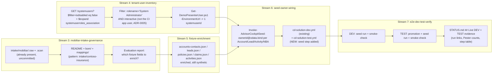

# Sprint-004 — Advisor Cockpit demo data realism

| Field | Value |
| --- | --- |
| **Status** | Draft — pending owner review |
| **Date** | 2026-08-17 |
| **Deciders** | Repo owner (brainstorming session, 2026-08-17) |
| **Related** | [ADR-0005](../../adr/ADR-0005-power-platform-application-users-for-ci.md) · [ADR-0013](../../adr/ADR-0013-ga-ownership-and-territory.md) · [ADR-0014](../../adr/ADR-0014-agents-advisory-by-design.md) · [ADR-0017](../../adr/ADR-0017-alm-everything-through-the-pipeline.md) · [ADR-0026](../../adr/ADR-0026-inbound-analytics-projection-pattern.md) · [ADR-0032](../../adr/ADR-0032-entra-power-platform-dynamics365-identity-access-management.md) · [SPRINT-OPERATING-MODEL](../SPRINT-OPERATING-MODEL.md) · [sprint-003 STATUS](../sprints/sprint-003-advisor-cockpit/STATUS.md) · [seed-advisor-cockpit.ps1](../../../scripts/solution/seed-advisor-cockpit.ps1) · [data/scenarios/advisor-cockpit/](../../../data/scenarios/advisor-cockpit/) · [intake/contoso-insurance/](../../../intake/contoso-insurance/) (governance pattern reused) |
| **Licence** | 🧩 configuration / own build |
| **Upgrade impact** | Low — extends an already-approved seed-script pattern (ADR-0026) with owner assignment; no data-model/schema change (`ownerid` is an out-of-box Dataverse column) |
| **Maturity** | Design. Demo-tooling only — no runtime AI/agent capability changes. |

## Purpose

Sprint-003 ("Advisor Cockpit") closed 2026-08-17 with a working synthetic
fixture set and seed pipeline, but left three carry-over blockers (#120, #121,
#124) and never delivered a personalized, presenter-ready demo experience. This
sprint makes the existing Advisor Cockpit demo data set genuinely
demo-realistic end to end:

1. Evaluate the Mobiliar reference environment intake (already partially
   scanned, ungoverned) to decide what makes the fixtures more realistic.
2. Inventory the CRM Showcase's own DEV/TEST tenant users so demo records can
   be owned by a real, loggable-in identity.
3. Enrich the existing Advisor Cockpit fixtures accordingly.
4. Wire owner assignment into the existing idempotent seed pipeline and ship
   it as a normal pipeline step on both DEV and TEST.
5. Produce full DEV + TEST live evidence, per the Sprint Operating Model's
   closing requirement, resolving the three inherited blockers first.

## Non-negotiable framing (confirmed with the owner during brainstorming)

- This becomes a full **Sprint-004** charter through the
  [Sprint Operating Model](../SPRINT-OPERATING-MODEL.md) — not a lighter
  design-only track — given the 7-stream scope below.
- Carry-over issues **#120**, **#121**, **#124** from sprint-003 are absorbed
  as prerequisite streams of this sprint (they directly block deployment/E2E,
  points 4–5 of the original ask).
- Tenant-user reading is scoped **only** to the CRM Showcase's own DEV/TEST
  Dataverse environments (e.g. `crmshowdev`/`crmshowtest`). The Mobiliar
  source environment is **never** connected to for user data — only its
  already-exported, evidence-only intake artefacts are read (same boundary
  `intake/contoso-insurance/README.md` already documents for that source).
- The user-to-record-owner mapping exists to support a **personalized live
  demo**: whoever is presenting, logged in as themselves, sees "their" seeded
  accounts/leads/activities — not merely security-role visibility testing.
- The presenter identity is resolved as the **System Administrator** role
  holder in the target environment (not a named advisor persona lookup) —
  resolved at runtime by role + enabled state, never as a personal
  identifier (UPN/e-mail) committed to the (public) repository.
- The existing idempotent Web-API upsert seed-script pattern
  (`seed-advisor-cockpit.ps1`, ADR-0026-aligned, already 22/22 Pester-green)
  is extended, not replaced. A native Dataverse Configuration-Data package
  was considered and rejected: it would require static, environment-specific
  GUIDs and cannot express "resolve the current System Administrator at seed
  time," which the personalization goal requires.

## Streams

Autonomy classes per the
[Handover Contract](../contracts/HANDOVER-CONTRACT.md).

| # | Stream | Covers (original ask #) | Autonomy | Depends on |
| --- | --- | --- | --- | --- |
| 1 | `prereq-fixes` — fix #120 (Lookup-attribute creation via the relationship-creation endpoint in `Publish-InsuranceFoundation.ps1`, not a plain Attributes POST) and #124 (intake-export the DEV-authored foundational/cockpit tables — `crmshow_leadcluster`, `crmshow_claimprojection`, `crmshow_nextbestaction`, `crmshow_nbaprovenance`, `crmshow_measuresnapshot` — back into `solution/core/datamodel` source) | prerequisite | EXECUTION-ONLY | none |
| 2 | `mcp-agent-decision` — resolve #121: decide and implement either (a) remove the Copilot/AI-assistant feature from the `crmshow_AdvisorCockpit` app module in DEV to drop the `crmshow_AdvisorCockpit_MCPServer`/`uxagentproject` dependency, or (b) deliberately promote the MCP Server + Agent-Builder project to TEST as well | prerequisite | DESIGN-SENSITIVE | Stream 1 |
| 3 | `mobiliar-intake-governance` — finish `intake/mobiliar/README.md` + `bom/` + `mappings/` mirroring the `intake/contoso-insurance/` pattern (regenerate via `Export-Solution.ps1` → `Unpack-Solution.ps1` → `Test-IntakeSnapshot.ps1` → `New-SolutionBom.ps1` if the existing `.raw`/`.scan` snapshot needs re-validating); produce a short evaluation report naming concrete Advisor Cockpit fixture enrichments | 1 | DESIGN-SENSITIVE | none |
| 4 | `tenant-user-inventory` — new `Get-DemoPresenterUser` function/script: queries `systemusers` (`$filter=isdisabled eq false`, `$expand=systemuserroles_association($select=name)`) filtered to the `System Administrator` role, excludes non-interactive/CI application users (ADR-0005), returns exactly one `systemuserid` per environment (deterministic tie-break + warning if >1; optional `-PresenterUserId` override, never a committed personal identifier) | 2 | DESIGN-SENSITIVE | none |
| 5 | `fixture-enrichment` — enrich `accounts-contacts.json` / `leads.json` / `policies.json` / `claims.json` / `activities.json` using stream 3's findings; stays synthetic and Contoso-Insurance-branded (SUPERPOWERS_CONTRACT §1 rule 3); scope stays within the 7 existing fixture files — no new entity types | 3 | DESIGN-SENSITIVE | Stream 3 |
| 6 | `seed-owner-wiring` — extend `Invoke-AdvisorCockpitSeed`/`ConvertTo-*UpsertBody` to set `ownerid@odata.bind` from stream 4's resolved presenter on account/lead/activity/NBA upserts; wire the enriched fixtures from stream 5; add the same "Seed Advisor Cockpit demo data" step (+ smoke-check) to `cd-solution-test.yml` that already exists in `cd-solution-dev.yml`; extend `SeedAdvisorCockpit.Tests.ps1` | 4 | EXECUTION-ONLY | Streams 4, 5 |
| 7 | `e2e-dev-test-verify` — live DEV seed run + smoke-check, TEST promotion (unblocked by streams 1–2) + seed run + smoke-check, `## Live DEV + TEST evidence` section in this sprint's `STATUS.md` (run links, offline + TEST-side Pester/smoke counts, step-by-step promotion table, mirroring sprint-002's format) | 5 | EXECUTION-ONLY | Streams 1, 2, 6 |

## Architecture / data flow

**Owner-resolution mechanics.** No schema change is required: `ownerid` is an
out-of-box column on every Dataverse table. When more than one enabled,
interactive System Administrator is found in an environment, resolution is
deterministic (sorted by `fullname`, first wins) with a logged warning naming
the count found, so whoever runs a live demo knows which identity got
assigned. When **none** is found, `Get-DemoPresenterUser` throws a clear error
rather than silently seeding records ownerless or falling back to the CI
application user — owner assignment is the whole point of this stream, so a
missing presenter must fail the seed step loudly, not degrade quietly. An
optional `-PresenterUserId` parameter allows an explicit per-dispatch override
(a GUID or role-pattern refinement passed at pipeline dispatch time) — never
a personally identifying value committed to the repository.

**Known gap being closed.** `cd-solution-test.yml` currently has no seed step
at all (only `cd-solution-dev.yml` does). Stream 6 adds the equivalent step so
TEST is not left without demo data after owner-wiring lands.

## Testing

- Extend `SeedAdvisorCockpit.Tests.ps1` (currently 22/22 green) with cases for
  `Get-DemoPresenterUser` (mocked `az rest` responses), including the
  multiple-admins-found and CI-application-user-excluded cases, and for
  owner-assignment on the upsert bodies.
- Enriched fixtures continue to validate against existing contracts (e.g.
  `api/advisor-cockpit/measure-snapshot.schema.json`).
- Mobiliar intake governance artefacts validate via the existing
  `Test-IntakeSnapshot.ps1` used for `intake/contoso-insurance/`.
- E2E: live `cd-solution-dev.yml` dispatch with a smoke-check verifying
  seeded records' `ownerid` resolves to the expected presenter; the same for
  the new `cd-solution-test.yml` seed step after TEST promotion.

## Evidence (sprint-closing requirement)

Per [SPRINT-OPERATING-MODEL.md § Sprint closing](../SPRINT-OPERATING-MODEL.md#sprint-closing--required-dev--test-evidence),
this sprint's `STATUS.md` Definition of Done must carry a
`## Live DEV + TEST evidence` section with: (1) the DEV authoring/seed run
link + offline test pass/fail counts, and (2) the TEST promotion run link +
step-by-step result table + TEST-side smoke/Pester counts — modeled on
[sprint-002's promotion evidence](../sprints/sprint-002-insurance-foundation-promotion/STATUS.md).
This is blocked until streams 1 and 2 (the inherited #120/#121 blockers) are
resolved, since #121 currently fails `crmshow_Sales` TEST import outright.

## Guardrails

- **No real customer data** — Mobiliar intake stays evidence-only (no
  Dataverse records exported, no branded/PII content committed — the
  existing `intake/contoso-insurance/README.md` boundary rules apply
  identically to `intake/mobiliar/`); enriched fixtures remain synthetic and
  Contoso-Insurance-branded (SUPERPOWERS_CONTRACT.md §1 rule 3).
- **No secrets** — owner resolution reuses the existing OIDC (`az rest`)
  authentication already used by `seed-advisor-cockpit.ps1`; no UPNs,
  e-mails, or other personal tenant identifiers are committed to the (public)
  repository — resolution is by role pattern at runtime only, as decided.
- **Tenant isolation** — only the CRM Showcase's own DEV/TEST environments are
  read for user data; the Mobiliar source tenant is never connected to for
  this purpose.
- **No new ADR required for owner-assignment itself** — `ownerid` is an
  out-of-box column; this is a seed-script behavior extension, not a data
  model change. Stream 2's #121 resolution (app-module Copilot/AI-assistant
  feature vs. promoting the MCP Server + Agent) records its own decision as
  an ADR amendment or design-doc addendum, sized to that stream's own
  materiality — decided within that stream, not pre-decided here.
- **Traceability** — Sprint-004 charter issue + one stream issue per stream
  above, each carrying its autonomy class per the Handover Contract.

## Open questions for the implementation plan

- Exact GitHub issue numbers for the Sprint-004 charter and its 7 streams
  (assigned when the charter issue and stream issues are filed, per the
  Sprint Operating Model's phase walkthrough).
- Whether stream 2's #121 decision is (a) remove the Copilot/AI-assistant
  toggle from the DEV app module, or (b) promote the MCP Server + Agent to
  TEST — left for that stream's own attended, DESIGN-SENSITIVE session, since
  it needs a live look at the DEV app module and a licensing/governance call.
- Concrete field-level fixture enrichments are deferred to stream 3's
  evaluation report (cannot be predicted before the Mobiliar intake governance
  pass is actually done).
