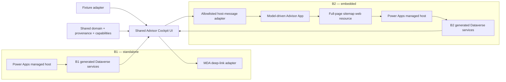

# Power Apps Code Apps Foundation and Advisor Cockpit B1/B2 Parity Proof

| Field | Value |
| --- | --- |
| **Status** | Approved design and written specification |
| **Date** | 2026-08-19 |
| **Story** | US-301 — AG-F-01 Next-Best-Action / Advisor Cockpit |
| **Use case** | UC-01 — Advisor Cockpit |
| **Deciders** | Repo owner · AG-E-03 Enterprise Architect · AG-E-02 Developer · AG-E-04 SecDevOps · AG-E-11 UX Designer |
| **Related ADRs** | [ADR-0014](../../adr/ADR-0014-agents-advisory-by-design.md) · [ADR-0017](../../adr/ADR-0017-alm-everything-through-the-pipeline.md) · [ADR-0027](../../adr/ADR-0027-page-level-pcf-and-local-first-polish-loop.md) · [ADR-0033](../../adr/ADR-0033-crm-ux-placement-in-b2e-landscape.md) |
| **Design pattern** | [CRM UX placement](../../design/ADR-0033-crm-ux-placement-options.md) |
| **Licence** | 🧩 pro-code on Power Apps managed hosting; Power Apps Premium and applicable Dynamics 365 / Copilot Studio rights require persona-level validation |
| **Maturity** | Power Apps Code Apps: generally available · B1/B2 Advisor Cockpit compositions: design/proof |
| **Upgrade impact** | Medium — two isolated Code App shells, shared source packages, one MDA host, and environment configuration |

## 1. Outcome

Establish Power Apps Code Apps as the repository's primary build path for
**bespoke full-page CRM user experiences**, then prove the foundation by
refactoring the existing Advisor Cockpit implementation into two independently
deployable host options:

- **B1 — standalone Code App:** a full-screen Power Apps managed-host
  experience with record-aware deep links to native model-driven CRM work.
- **B2 — embedded Code App:** a separate Code App identity hosted in a
  dedicated full-page sitemap web resource inside the model-driven Advisor App.

Both options reuse one domain model and one parity UI implementation. They are
tested independently in DEV and TEST so host-specific constraints are visible.
The proof ends with an evidence-backed recommendation; it does not automatically
select a winner or retire any component.

## 2. Governing Build Rule

Use the following order for CRM user experiences:

1. **Model-driven configuration** for native forms, views, timelines, commands,
   and standard record workflows.
2. **Power Apps Code Apps** for bespoke full-page CRM experiences.
3. **PCF controls** for embedded controls that require model-driven form,
   dataset, or field context.

An exception requires a documented reason and architecture review. A dedicated
ADR must record this rule before implementation starts and clarify that
ADR-0027 remains valid for PCF controls but no longer makes page-level PCF the
default for bespoke full-page experiences. ADR-0033 remains the comparative
record for selecting B1 or B2 after evidence exists.

## 3. Approved Decisions

| Area | Decision |
| --- | --- |
| Delivery approach | Parity-first dual-host experiment |
| Source structure | npm workspace with shared domain/UI packages and thin host shells |
| App identity | Separate B1 and B2 Code App identities and `power.config.json` files |
| UI divergence | Establish strict parity first; allow documented controlled divergence later |
| UX scope | Migrate the current cockpit experience in full; do not add new requirements in this sprint |
| Data model | Freeze the current Dataverse schema |
| Data access | Generated Dataverse models/services only; no raw Web API, flows, or custom APIs |
| Data fallback | No fixture fallback in `pa app run`, DEV, or TEST |
| Provenance | CRM normal; external/projected grey; unmapped yellow; accessible text legend always present |
| Interaction policy | Honest mixed mode: supported operations work; unsupported operations remain visible but disabled with a reason |
| Missing writes | Record every missing write contract in a write-capability matrix |
| Local workflow | Sequential Vite polish, `pa app run`, then live DEV host validation |
| B2 host | Dedicated full-page MDA sitemap web-resource iframe with `hideNavBar=true` |
| Environment binding | Solution environment variables resolve environment-specific B1/B2 play URLs |
| DEV publication | Attended maker/admin `pa app push` with evidence |
| TEST promotion | Existing OIDC pipeline imports the exact managed DEV artifact |
| Runtime persona | Least-privilege advisor; maker/admin is deployment-only |
| Observability | Power Platform Monitor, `getContext()` session IDs, browser/network timings, and test evidence |
| Azure | Entirely out of scope; the tenant has no Azure subscription and does not plan to obtain one |
| B2E | Entirely out of implementation/test scope; no shell, launcher, simulation, or integration contract |
| Comparison outcome | Evidence scorecard plus recommendation; human ADR approval selects a target |
| PCF status | Local harness is the approved visual baseline; deployed PCF is not user-visible runtime evidence or a fallback |
| Post-parity work | Carve out a broader host contract and add requirements only through a later design cycle |

## 4. Current-State Facts

- The Advisor Cockpit is a tested React 18 + Fluent UI v9 implementation with
  typed fixtures, selectors, provenance tokens, and a Vite harness under
  `solution/apps/sales/Controls/AdvisorCockpit/`.
- The PCF wrapper currently renders fixture data; it does not complete the
  planned live `context.webAPI` binding.
- The PCF artifact is deployed in DEV but is not attached to a running,
  user-visible surface. It cannot be cited as live UX evidence.
- The reviewed visual baseline is the local fixture-backed PCF harness and its
  captured screenshots.
- The existing `DATA-BOM.md` already distinguishes CRM, external/projected,
  agent-produced, runtime, and static values and lists unmapped fields and
  incomplete writes.
- The current cockpit contains five tabs, three lead views, filters, dialogs,
  provenance, and visible actions. The parity sprint preserves that experience
  rather than closing its pre-existing feature gaps.

## 5. Scope

### 5.1 In scope

- Repository-level Code Apps workspace foundation.
- Shared Advisor Cockpit domain and UI packages extracted from the reviewed
  local harness implementation.
- Separate B1 and B2 Code App projects initialized from the current Microsoft
  `PowerAppsCodeApps` Vite template.
- Separate generated Dataverse models and services for each app.
- Fixture-backed local visual harness.
- Generated-service live adapters for authenticated runtime.
- Minimal typed host-capability boundary for parity only.
- Standalone B1 player and record-aware native MDA links.
- B2 full-page MDA sitemap web-resource host, CSP, and host navigation bridge.
- Environment-variable URL binding for DEV and TEST.
- Write-capability matrix covering every visible action.
- Limitations register and B1/B2 comparison scorecard.
- Automated CI checks and attended least-privilege DEV/TEST journeys.
- Managed DEV-to-TEST promotion and rollback evidence.

### 5.2 Out of scope

- Any B2E Angular implementation, simulator, launcher, SSO contract, or test.
- Dataverse tables, columns, choices, relationships, or action-layer extensions.
- Azure resources or services, including Application Insights, Functions, Key
  Vault, or Azure-hosted APIs.
- New connectors beyond Dataverse.
- Raw Dataverse Web API calls, FetchXML, custom APIs, or aggregation flows.
- Silent fixture fallback in authenticated or deployed environments.
- New cockpit requirements or host-optimized layouts before parity is proven.
- Generalizing the minimal host boundary into a reusable application framework.
- Selecting B1/B2, retiring PCF source, or claiming the PCF is a live fallback.
- PROD deployment.

## 6. Architecture

### 6.1 Repository shape

```text
solution/apps/sales/
  package.json                         # npm workspace root
  packages/
    advisor-cockpit-domain/            # types, selectors, provenance, capabilities
    advisor-cockpit-ui/                # reviewed full cockpit UI
  code-apps/
    advisor-cockpit-b1/
      power.config.json                # standalone app identity
      src/generated/                   # B1-generated Dataverse code
      src/host/                        # standalone context/navigation adapter
    advisor-cockpit-b2/
      power.config.json                # embedded app identity
      src/generated/                   # B2-generated Dataverse code
      src/host/                        # embedded context/navigation adapter
  Controls/AdvisorCockpit/
    harness/                           # retained local visual baseline
    pcf/                               # retained deployed artifact, not runtime baseline
```

Generated code remains app-local because each Code App owns its Power Platform
identity and data-source configuration. Shared packages do not import PCF,
generated services, or Power Apps host APIs.

### 6.2 Runtime topology



### 6.3 Minimal host-capability boundary

The parity UI receives typed capabilities rather than importing host globals:

- `runtimeContext`: user, environment, app, session, locale, and optional
  query context.
- `loadCockpitData`: returns the shared `CockpitData` result with explicit
  loading, empty, denied, failed, and unmapped states.
- `writeCapabilities`: identifies supported, partial, blocked, and unverified
  commands with user-facing reasons.
- `executeCommand`: accepts closed typed commands only.
- `navigateToRecord`: opens an allowlisted table/record destination.
- `layoutContext`: identifies standalone versus embedded viewport constraints.

The boundary is intentionally small. Broader reuse is a later design problem.

## 7. Data Flow and Provenance

### 7.1 Runtime modes

| Mode | Adapter | Data policy |
| --- | --- | --- |
| Local Vite polish | Typed synthetic fixtures | Visual and interaction refinement only |
| `pa app run` | Generated Dataverse services | Live authenticated data; no fixture fallback |
| DEV | Generated Dataverse services | Live least-privilege advisor data; no fixture fallback |
| TEST | Generated Dataverse services | Managed promoted app; no fixture fallback |

### 7.2 Generated-service policy

Each app adds existing Dataverse tables with `pa app add data-source --connector
dataverse --table <logical-name>`. Adapters use narrow `select`, `filter`,
`orderBy`, `top`, and paging options and join records by primary GUID in the
shared domain mapping layer.

Do not introduce FetchXML, alternate-key access, polymorphic-lookup dependence,
schema CRUD, raw Web API calls, custom APIs, or Power Automate aggregation flows
to hide SDK limitations.

### 7.3 Provenance contract

Provenance represents authoritative origin, not only current storage location:

| Presentation | Meaning |
| --- | --- |
| Normal background | CRM-native/mastered Dataverse value |
| Grey | External-origin or analytical value, including a Dataverse materialized projection |
| Yellow | UX field with no implemented source mapping |
| Untinted | Static presentation copy or client runtime value |

Mixed cards classify individual fields or regions. Every classification has an
accessible name and a persistent localized legend; color is never the only cue.

The UI must distinguish:

- **Unmapped:** no implemented source mapping; yellow.
- **Empty:** mapped source returned no value; neutral empty state.
- **Permission denied:** advisor lacks access; explicit denied state.
- **Load failure:** authenticated request failed; explicit error and retry.
- **Unsupported query:** generated-service limitation; explicit limitation.

Only genuinely unmapped content is yellow.

## 8. Interaction and Write Safety

### 8.1 Write-capability matrix

Every visible command has a versioned matrix entry containing:

| Field | Purpose |
| --- | --- |
| Action | UI command label and stable identifier |
| Intended effect | Local, read, navigate, or write |
| Target | Table, field, relationship, or destination |
| B1 support | Supported, partial, blocked, or unverified |
| B2 support | Supported, partial, blocked, or unverified |
| Limitation | Missing field, lookup, permission, or SDK constraint |
| Runtime treatment | Enabled, partially enabled, or disabled with reason |
| Evidence | Test or live run proving the outcome |
| Future remediation | Deferred requirement outside this sprint |

### 8.2 Initial capability expectations

| Action | Expected parity-sprint treatment |
| --- | --- |
| Tabs, filters, views, dialogs | Supported local UI behavior |
| Open Account, Lead, Case, timeline | Enable after GUID mapping and host navigation are proven |
| NBA `Accepted`, `Planned`, `Dismissed` | Existing schema supports status; enable only after generated-service update and reread pass |
| Update existing NBA fields | Allowlist only fields already present and approved |
| Call | `tel:` navigation may work; phone-call activity logging remains blocked by activity relationship complexity |
| Snooze | Partial: map to `Planned`; no `snoozeUntil` field exists |
| Dismiss with reason | Partial: persist `Dismissed`; no dismissal-reason field exists |
| Edit proposal | Partial: existing fields only; timing/scope remain unsupported |
| Assign lead | Blocked pending polymorphic owner-lookup support |
| Bundle/split leads | Unverified until lookup association/disassociation works through generated services |
| Create task/appointment | Blocked by polymorphic regarding relationships |
| Save personal view | Blocked; no governed persistence contract exists |

Unsupported actions remain visible but disabled with a concise explanation.
They never simulate success.

### 8.3 Command and navigation safety

- Writes use closed typed commands and explicit human confirmation.
- Free-text or model output never writes directly to Dataverse.
- Success appears only after the generated service completes and a reread
  confirms the result.
- B1 opens allowlisted native MDA record links.
- B2 posts a schema-validated navigation message to its web-resource parent.
- The B2 parent validates the exact child origin, table allowlist, GUID shape,
  and command type before invoking native navigation.
- Unknown origins, destinations, or commands are rejected and logged without
  customer data.
- Accept/edit/dismiss remains a named human decision per ADR-0014.

## 9. Local-First Polish Loop

The proven PCF process becomes a sequential Code Apps parity loop.

### Gate 1 — fixture-backed Vite polish

1. Start `npm run dev` in a new VS Code integrated terminal.
2. Open the local page inside VS Code and share it with Copilot.
3. Compare it with captured screenshots of the approved local PCF harness.
4. Refine via the Copilot chat window with the user reviewing each visual
   choice.
5. Record screenshots and parity findings at fixed desktop and mobile
   viewports.
6. Stop the server before moving to Gate 2.

### Gate 2 — authenticated local host

1. Start B1 with `pa app run` in a fresh integrated terminal.
2. Open the Local Play URL inside VS Code using the tenant browser profile.
3. Validate generated services, identity, permission states, and navigation.
4. Stop B1, then repeat for B2.
5. Never run a second Vite or Code Apps local server concurrently.

Local Network Access permission may be required. For an embedded local probe,
the iframe must declare only the documented local-network permission. A local
pass is not deployed-host evidence.

### Gate 3 — live DEV hosts

1. Publish B1/B2 through the attended maker step.
2. Validate B1 in the standalone Power Apps player.
3. Validate B2 inside the actual MDA sitemap host.
4. Only this gate proves B2 iframe, CSP, MDA viewport, nested loading, and host
   navigation behavior.

### Refinement ownership

- Shared defects are fixed in `advisor-cockpit-ui` or the domain package.
- Host defects are fixed only in the relevant shell/adapter.
- Host-specific divergence is recorded before implementation.
- Visual decisions remain attended; autopilot executes approved changes only.
- Accessibility, component, and visual-regression checks rerun after each
  accepted refinement batch.

## 10. Limitations and Constraints

| Constraint | Impact | Design response |
| --- | --- | --- |
| No FetchXML, alternate keys, polymorphic lookups, or schema CRUD in generated services | Some reads/writes cannot be implemented faithfully | Use GUIDs and supported queries; expose limitations |
| Lookup ergonomics remain limited | Relationship actions may fail or require unsupported patterns | Prove each lookup operation before enabling it |
| App sharing, Dataverse roles, and MDA access are separate | Admin testing can hide real access failures | Test all layers as a least-privilege advisor |
| B2 framing is same-tenant only | No guest/cross-tenant embed proof | Keep cross-tenant access out of scope |
| B2 requires environment-admin CSP changes | Misconfiguration blocks the entire frame | Allow exact Dynamics origin; capture propagation and rollback evidence |
| Code App play URLs may differ by environment | Hard-coded DEV URL can leak into TEST | Resolve URLs through solution environment variables and convergence checks |
| Hosted assets do not support IP restrictions | Sensitive bundle content would be public before authentication | Store no sensitive/user data in assets; rely on Entra, Conditional Access, DLP, and Dataverse |
| Runtime environment-variable support is limited | Arbitrary app configuration cannot be assumed | Use supported host/solution configuration; fail visibly when absent |
| Power Platform Git source integration is unsupported | Platform state is not the source repository | GitHub remains source of truth; reconcile reviewed assets and solution membership |
| Noninteractive `pa app push` requires secret-based SP auth and prior sharing | Conflicts with repository OIDC/no-secret position | Attended DEV publication; OIDC pipeline promotion only |
| `pa app run` needs tenant profile and local-network permission | Local setup can be mistaken for app failure | Add preflight and classify setup failures separately |
| B2 cannot be proved locally | Vite/player pass misses iframe/CSP/MDA behavior | Require real DEV and TEST MDA-host evidence |
| No Azure subscription | Azure observability/backend patterns are impossible | Use Power Platform capabilities only |
| Dataverse schema freeze | Several UX fields/actions remain incomplete | Keep unmapped fields yellow and actions disabled/documented |
| Two app identities can drift | Comparison validity degrades | Shared packages, parity tests, adapter contract tests, scorecard |
| Fixture fallback could hide failures | Demo could appear healthy with broken integration | Prohibit fixture imports in authenticated/deployed bundles |
| PCF is deployed but not user-visible | It cannot be a live comparator or fallback | Use its local harness screenshots only as visual baseline |
| Licensing is persona-dependent | Technical success may not be deployable | Validate Power Apps Premium and Dynamics/Copilot rights before rollout |

A blocker prevents an end-to-end pass claim. A limitation may remain only when
it is visible in the UI where applicable, the capability/limitations registers,
and the final scorecard.

## 11. ALM and Environment Promotion

### 11.1 Solution placement

- B1 and B2 belong to `crmshow_Sales` as separate Code App components.
- The B2 web-resource host and sitemap entry also belong to `crmshow_Sales`.
- Environment-variable definitions belong to the solution; DEV/TEST values do
  not enter source.
- Each first publish targets the explicit solution GUID with `pa app push
  --solution-id <guid>`.

### 11.2 DEV authoring

1. CI builds/tests the reviewed Git commit.
2. A maker/admin runs attended `pa app push` for B1 and B2.
3. Evidence records CLI version, commit SHA, app IDs, play URLs, solution IDs,
   operator, timestamp, and result.
4. The maker shares play access with the advisor persona.
5. DEV environment-variable values are set for B1/B2 URLs.
6. The B2 host and exact Dynamics-origin `frame-ancestors` CSP are configured.
7. The existing OIDC workflow exports the complete solution as the only TEST
   promotion artifact.

This is a narrow, human-approved authoring exception to ADR-0017 because current
Code Apps noninteractive publication requires secret-based service-principal
authentication. The implementation ADR must record the exception. It never
permits direct TEST authoring or a stored client secret.

### 11.3 TEST promotion

- Import the exact managed `crmshow_Sales` package exported from DEV.
- Apply TEST environment-variable values through deployment configuration.
- Apply the exact TEST Dynamics origin to CSP.
- Share B1/B2 and assign required MDA/Dataverse roles to the advisor persona.
- Prove no DEV URL, unmanaged component, or fixture mode remains.
- Run the same authenticated B1/B2 journey used in DEV.

### 11.4 Rollback

Rollback reinstalls the previous managed solution version and restores the
previous sitemap/environment configuration. The user-visible proof entries are
removed or reverted. The deployed PCF artifact is not described as a runtime
fallback because it is not attached to a user-visible experience.

## 12. Testing and Evidence

### 12.1 Automated CI

- Domain selectors, mappings, provenance classification, and capability matrix.
- Fixture and generated-service adapter contract tests.
- React interaction tests across every tab and lead view.
- Axe checks, keyboard journeys, focus handling, and 320px/400% reflow.
- PCF, B1, and B2 builds from the workspace.
- Visual regression against captured local-harness screenshots at fixed
  fixtures/viewports.
- Guard against fixture imports and DEV URLs in production bundles.
- B2 origin, command allowlist, malformed message, and record-ID tests.
- Bundle-size thresholds for both apps.
- Localization smoke for EN/DE/FR/IT and locale-aware formatting.

### 12.2 Authenticated DEV and TEST journey

Use the same synthetic records, least-privilege advisor, browser profile, and
journey in both environments:

1. Open the complete cockpit.
2. Verify identity, environment, session, and live Dataverse reads.
3. Inspect normal, grey, and yellow provenance plus accessible labels.
4. Exercise all tabs, filters, views, dialogs, responsive breakpoints, and
   keyboard paths.
5. Execute supported writes, reread the record, and verify audit behavior.
6. Confirm every unsupported write is disabled and documented.
7. Navigate to native Account, Lead, Case, and timeline surfaces.
8. Capture session ID, timings, screenshots, Monitor evidence, and errors.
9. Reset synthetic test state with the existing idempotent seed process.

B2 additionally proves sitemap navigation, iframe loading, CSP, viewport,
message validation, and return navigation to native MDA pages.

### 12.3 Comparative scorecard

Record evidence-backed `Pass`, `Concern`, `Blocker`, or `Not applicable` for:

- Visual and functional parity.
- Advisor workflow and navigation.
- Responsive behavior and accessibility.
- Load and interaction performance.
- Identity, sharing, and least privilege.
- CSP and embedding complexity.
- ALM, configuration, and rollback.
- Failure visibility and resilience.
- Power Platform Monitor supportability.
- Developer workflow and polish speed.
- Maintenance and controlled divergence.
- Licensing and platform constraints.

Do not compute an automatic winner. The final report recommends B1 or B2, and a
human-approved ADR update selects the target.

## 13. Autopilot and Human Gates

- Brainstorming, architecture, host-specific UX divergence, visual refinement,
  and live publication are attended.
- The user reviews one decision/option set at a time; no approval is inferred.
- Visual work runs in a new VS Code integrated terminal and opens inside VS
  Code for shared Copilot review.
- Autopilot receives only approved implementation packets with fixed scope,
  acceptance criteria, and deny-list controls.
- A new design decision causes `BLOCKED: needs design` and returns to attended
  control-plane review.
- No agent selects B1/B2, changes the data model, adds Azure, or retires the PCF
  artifact without explicit human approval and the required ADR review.

## 14. Definition of Done

The parity sprint is complete only when all of the following are true:

- A dedicated ADR establishes Code Apps as primary for bespoke full-page CRM
  experiences and records the attended DEV publication exception.
- Shared domain/UI packages and separate B1/B2 shells build from reviewed
  source.
- The local fixture-backed PCF harness is captured as the approved visual
  baseline; no live PCF claim is made.
- B1/B2 reach documented visual and functional parity before divergence.
- Provenance remains normal/grey/yellow with non-color accessible cues.
- Every visible action appears in the write-capability matrix.
- No Dataverse schema, Azure, B2E, raw Web API, custom API, aggregation flow,
  silent fixture fallback, or new cockpit requirement is introduced.
- B1 runs standalone with live data in DEV and TEST.
- B2 runs in the MDA sitemap host with live data in DEV and TEST.
- Least-privilege advisor journeys pass with linked screenshots, timings,
  session IDs, Monitor evidence, writes/rereads, and limitations.
- Managed DEV-to-TEST promotion and previous-version rollback are demonstrated.
- The comparison scorecard produces a recommendation without selecting a
  winner automatically.
- The sprint `STATUS.md` contains the required live DEV and TEST evidence,
  pipeline links, test counts, step results, and defects fixed.
- A later host-contract/requirements increment is explicitly separate from
  this parity sprint.

## 15. Authoritative References

- [Power Apps Code Apps documentation](https://learn.microsoft.com/power-apps/developer/code-apps/)
- [Code Apps architecture](https://learn.microsoft.com/power-apps/developer/code-apps/architecture)
- [Power Apps CLI reference](https://learn.microsoft.com/power-apps/developer/code-apps/reference/cli)
- [Connect Code Apps to Dataverse](https://learn.microsoft.com/power-apps/developer/code-apps/how-to/connect-to-dataverse)
- [Code Apps ALM](https://learn.microsoft.com/power-apps/developer/code-apps/how-to/alm)
- [Embed a Code App in an iframe](https://learn.microsoft.com/power-apps/developer/code-apps/how-to/embed-iframe)
- [Get Code App context](https://learn.microsoft.com/power-apps/developer/code-apps/how-to/retrieve-context)
- [PCF Local-First Polish Loop](../patterns/pcf-local-first-polish-loop.md)
- [PCF Review and UX Standardization](../patterns/pcf-review-and-ux-standardization.md)
